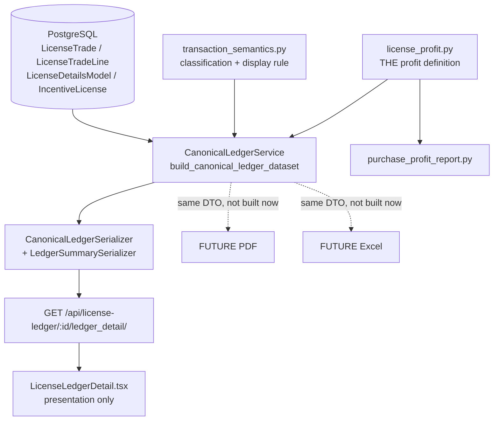

# MODULE 05 — LICENSE LEDGER UI — FREEZE REPORT

**Branch:** `feature/V2`
**Date:** 2026-08-13
**Scope:** License Ledger canonical summary + ledger UI. PDF and Excel intentionally not implemented.

---

## 1. Final architecture

The web License Ledger reads one canonical dataset. Nothing downstream recalculates.



Key structural outcome of this task: **`license_profit.py` is now the single profit
definition**, and both the ledger summary and the Purchase & Profit report call
into it. Previously the report owned that SQL inline; there is now no second
implementation to drift.

## 2. Canonical backend service

`backend/apps/license/services/canonical_ledger_service.py`

- `build_canonical_ledger_dataset(license_id, license_type=...)` — the only
  authoritative producer of ledger data.
- `_build_summary(dataset)` — **recomputes nothing.** `current_balance` is
  *assigned* from `license_running_balance`; the debit/credit totals are summed
  from the already-selected display rows (`display_transactions` /
  `opening_display`), so the summary and the table cannot disagree.
- `_resolve_trade_sides` — decides "which end of the trade is us" once, for all
  four directions.
- `_extract_item_names`, `_extract_bill_amount` — ride the existing
  `select_related` / `prefetch_related`; zero added queries.

## 3. Canonical DTO / API contract

`summary` block (all money as 2-decimal strings over HTTP):

| Field | Type | Currency | Notes |
|---|---|---|---|
| `total_debit` | string | `balance_currency` | Σ displayed Debit column |
| `total_credit` | string | `balance_currency` | Σ displayed Credit column |
| `total_debit_bill` | string | `bill_currency` | **added** — Σ displayed Debit Bill column |
| `total_credit_bill` | string | `bill_currency` | **added** — Σ displayed Credit Bill column |
| `bill_currency` | string | — | **added** — always `INR` |
| `opening_balance` | string | `balance_currency` | |
| `opening_in_debit` | bool | — | is opening already inside `total_debit`? |
| `current_balance` | string | `balance_currency` | `== license_running_balance == closing_balance` |
| `balance_currency` | `USD`\|`INR` | — | USD for DFIA |
| `total_profit_loss` | string\|null | `profit_currency` | null ⇒ `UNAVAILABLE` |
| `profit_currency` | string | — | always `INR` |
| `profit_state` | enum | — | `PROFIT`\|`LOSS`\|`BREAK_EVEN`\|`UNAVAILABLE` |

Transaction rows gained `party_id`, `party_name`, `bill_amount`, `item_names`.

**The contract is purely additive.** A test asserts every pre-existing field is
still present and unchanged (`test_api_does_not_drop_or_change_any_pre_existing_field`).

## 4. Opening rule

Implemented once in `transaction_semantics.select_display_rows`, mirrored on the
frontend by `utils/ledgerDisplayRows.ts`. Purchase present ⇒ opening hidden
(still inside the balance). No purchase ⇒ opening shown as a **starting state**,
outside company grouping, occupying the Debit column.

Because a displayed opening sits in the Debit column, the identity has two forms,
collapsed into one always-true expression the backend publishes `opening_in_debit`
for:

```
(opening_in_debit ? 0 : opening_balance) + total_debit − total_credit == current_balance
```

## 5. Debit / Credit semantics

The UI columns are **inverted** relative to `balance_direction`, intentionally
and long-standingly — the table is drawn from the licence holder's point of view:

| type | `balance_direction` | UI column | effect on balance |
|---|---|---|---|
| OPENING | CREDIT | Debit | + |
| PURCHASE | CREDIT | Debit | + |
| SALE | DEBIT | Credit | − |

`total_debit` / `total_credit` are named for the **columns**. This is documented
at every site that could tempt someone to "fix" one side to match the other
(`_DEBIT_COLUMN_TYPES`, `LedgerSummarySerializer`, `LedgerSummary` TS interface,
and the test module docstring). Neither side was changed.

## 6. Party source

`party_name` = the **counterparty**, from `_TRADE_DIRECTION_SIDES`:
PURCHASE → `trade.from_company`; SALE → `trade.to_company`.

`company_name` (our side) is what the table **groups by** — rendering it in
Particulars merely echoed the group header, which is what the page did before.
Missing party ⇒ `null` ⇒ UI shows `N/A`. Never back-filled from the licence
holder: `from_company`/`to_company` are `null=True, on_delete=SET_NULL`, so a
deleted company genuinely leaves a NULL party, and substituting our own company
would assert we traded with ourselves.

## 7. Item source

`line.sr_number` (`LicenseImportItemsModel`) → `.items` (M2M `ItemNameModel`) →
`.name`. Deduped, first-seen order, returned as a **list**. Rides the existing
`sr_number__items__sion_norm_class` prefetch (same traversal SION norms already
used) so it costs no extra query. DFIA only — incentive trade lines have no item
link, so the column is hidden rather than permanently blank.

One trade renders **one** row regardless of item count; overflow collapses to
`+N` with the full list in `title` and `aria-label`. Row duplication is
explicitly tested against (`test_multiple_items_do_not_duplicate_the_transaction_row`)
because duplicating would double-count the trade in the Debit column.

## 8. Bill amount source

`bill_amount` = Σ `amount_inr` over the trade's lines, in **INR**.
`amount_inr` exists on both `LicenseTradeLine` and `IncentiveTradeLine`, so one
helper serves both.

**Never equal to `amount`** (the licence value, CIF USD for DFIA) — a licence
trades at a margin over the CIF it releases. Real-data confirmation: **460 of 472
licences have `bill_amount != amount`.** `null` on the OPENING row (a state has
no invoice).

## 9. Balance source

`summary.current_balance` is assigned from `license_running_balance`, which the
frontend already read. Verified equal to `closing_balance` and to the last
displayed row's running balance, on every one of 472 real licences.

## 10. Profit source

`license_profit.profit_for_licenses` — `sale_amount − purchase_amount` over
`LicenseTradeLine.amount_inr`, filtered by
`trade__linked_trade__isnull=True` (both legs of an auto-paired internal transfer
excluded, so an internal shuffle is never profit).

Deliberately **not** derived from the ledger's own `transactions`: the ledger
includes the internal linked legs and sums `cif_fc` (USD), so a ledger-derived
figure would silently differ from the report. `test_profit_excludes_internal_linked_trades_unlike_the_ledger`
locks this in.

`None` for incentive licences: the definition reaches the licence via
`LicenseTradeLine.sr_number__license_id` (a `LicenseDetailsModel` FK) and does
not apply to `IncentiveLicense`. Since the two models have independent id
sequences, querying it with an incentive id would return an unrelated DFIA
licence's money — so it returns `None`, not a fabricated figure. There is a
dedicated test for exactly that mis-read
(`test_incentive_profit_is_not_taken_from_a_same_id_dfia_license`).

## 11. Currency rules

Three currencies coexist on one DFIA screen and are never mixed:

- licence value / balance / debit / credit → `balance_currency` (**USD** for DFIA)
- bill amounts → `bill_currency` (**INR**)
- profit → `profit_currency` (**INR**)

Currency comes from the backend **per figure**, never guessed from licence type
at the call site. Header labels are derived from the same source as the cells —
the pre-existing bug where headers read `Debit (₹)` while cells rendered `$…` is
fixed.

## 12. Profit state rules

Driven entirely by `profit_state`; the UI never inspects the sign.

| state | label | value | tone |
|---|---|---|---|
| PROFIT | `PROFIT` | ₹X | success |
| LOSS | `LOSS` | ₹X **magnitude** | destructive |
| BREAK_EVEN | `BREAK-EVEN` | ₹0.00 | neutral |
| UNAVAILABLE | `PROFIT / LOSS` | `N/A` | neutral |

`-₹X` can never appear under the word PROFIT (asserted for all four states).
`UNAVAILABLE` shows `N/A`, never ₹0.00 — a zero would falsely assert break-even.
An unknown future state degrades to the neutral presentation rather than crashing.

## 13. Summary UI

Four cards above the table: **Total Debit**, **Total Credit**, **Current
Balance**, **Profit / Loss**. The two bill totals ride as the secondary line on
the debit/credit cards, so the bill columns have a footer without a fifth card.

Every value is a backend string, digit-grouped only. **No `reduce`, no `+`/`-`,
no re-rounding, no client-side classification.** Absent `summary` (older cached
payload) hides the band rather than rendering zeros.

## 14. Existing components reused

- `@/components/StatCard` — the app's existing KPI card, in `compact` mode (built
  for long currency strings). **No new card component was created**; the three
  other StatCard variants and `SummaryCard` were evaluated and rejected as
  duplicates-in-waiting.
- `@/utils/ledgerDisplayRows` — the display rule, already the single frontend
  expression of it.
- `utils/numberFormatter`, `utils/dateFormatter`, `ui/badge`, `ui/button`.

## 15. Duplicate code removed

| Duplication | Resolution |
|---|---|
| Purchase-line filters + ordering, inline in `purchase_profit_report` | → `license_profit.purchase_lines_ordered` |
| Sale-line grouped aggregate, inline in the report | → `license_profit.sale_totals_by_license` |
| Sale-line filter repeated for the pivot's debit lines | → shared `SALE_LINE_FILTERS` constant |
| Four copy-pasted direction branches resolving company | → `_TRADE_DIRECTION_SIDES` + `_resolve_trade_sides` |
| Per-component `formatCurrency` closure | → one module-level `formatMoney`, shared by cards and table |
| Item-name traversal (would have duplicated `_extract_sion_norms`) | shares the same prefetch and traversal shape |

Not over-abstracted: `_extract_bill_amount` and `_extract_line_cif` stay
separate because they read different columns in different currencies.

## 16. Query count — before / after

Measured on the real local database:

| Case | Transactions | Queries |
|---|---|---|
| DFIA busiest licence (id 2428, 12 trades) | 13 | **7** |
| DFIA smallest licence | 2 | **8** |
| Incentive licence | 1 | **4** |

Query count **does not grow with transaction count** (13 txns costs one query
*fewer* than 2 txns; the difference is the bulk company-name lookup being skipped
when there are no company-scoped rows). The new row fields add **zero** queries —
they ride the existing `select_related('from_company','to_company')` and
`prefetch_related('sr_number__items__sion_norm_class')`.

The summary adds **one** bulk profit query for DFIA, **zero** for incentive.
Verified bulk: profit for 1 licence = 1 query; profit for 100 licences = 1 query.

Guarded by tests: `test_canonical_ledger_performance.py` (3 tests),
`test_summary_does_not_reintroduce_n_plus_one`,
`test_incentive_summary_costs_no_profit_query`, `test_row_fields_add_no_queries`.

## 17. Backend test result — REAL

```
python manage.py check
System check identified no issues (0 silenced).

python -m pytest apps/license/tests/test_ledger_summary_reconciliation.py -q
83 passed in 28.21s

python -m pytest -q          (full backend suite)
2318 passed, 38 skipped in 280.62s (0:04:40)
```

Baseline before this task was 2318-equivalent with 1232 passing in the license
app; no test was disabled, skipped or weakened. The 38 skips are pre-existing.

The test matrix is **parametrized**, not copy-pasted: a 7-row `MATRIX` drives 6
whole-matrix invariant tests, plus a 4-case profit-state table and a 2-case
trade-sides table.

## 18. Frontend test result — REAL

```
npm test
Test Files  51 passed (51)
     Tests  399 passed (399)
```

New: `LicenseLedgerDetail.summary.test.tsx` — 25 tests (cards, currencies,
profit-state table, row columns). Existing `LicenseLedgerDetail.displayRule.test.tsx`
(34) and `LicenseLedgerDetail.test.tsx` (4) still pass unmodified except for one
stale comment corrected.

## 19. Build result — REAL

```
npm run build
✓ built in 462ms
```

## 20. Lint result — REAL

```
npm run lint
✖ 60 problems (0 errors, 60 warnings)
```

**0 errors.** All 60 warnings are pre-existing `react-refresh/only-export-components`
style warnings across the codebase. Net warnings added by this task: **0** — an
early version exported `formatMoney` and added one; it was made module-private
since nothing imports it (61 → 60).

## 21. Typecheck result — REAL

```
npm run typecheck   →   tsc --noEmit, no output (clean)
```

## 22. Real-data CA reconciliation — REAL

Ran over **every licence in the local development database** (220 DFIA + 252
incentive = 472), read-only. Production untouched.

```
Purchase & Profit report covers 161 licences

CENSUS
  checked                                    472
  dfia-profit-compared                       161
  licences-where-bill!=licence-value         460
  licences-with-a-party                      460
  multi-item-licences                         34
  shape:PS-  426   shape:P--  16   shape:-SO  9
  shape:-S-    9   shape:--O   8   shape:---   4
  state:PROFIT 163  state:LOSS 46  state:BREAK_EVEN 11  state:UNAVAILABLE 252

RESULT
  ✅ ALL CHECKS PASSED across 472 licences
```

Each licence was independently checked for: `current_balance` == running ==
closing; the reconciliation identity; debit/credit and bill totals recomputed
from the displayed rows; `opening_in_debit` consistency; no duplicate display
rows; Decimal (never float); correct currency per figure; `profit_state`
consistency; and — for all 161 licences the report covers — **exact agreement
with the Purchase & Profit report's `profit_loss`.**

Categories exercised on real data: DFIA purchase+sale (426), purchase-only (16),
sale+opening with no purchase (9), opening-only (8), empty (4), multi-item (34),
profit (163), loss (46), break-even (11), unavailable (252).

**48 DFIA licences sit outside the report** because the report's own base
queryset requires an export item with a `norm_class`; a further 11 are dropped
because it lists only licences with a qualifying purchase (it is a *Purchase* &
Profit report). This is report **scope**, not a profit-definition divergence, and
is already covered by
`test_no_purchase_license_is_absent_from_report_but_ledger_still_reports`.

## 23. UI/UX audit

- Hierarchy: toolbar → warning → licence header with prominent Current Balance →
  summary band → grouped tables. Current Balance appears both in the header panel
  (1.75rem) and as a card; both now read the same `summary.current_balance`.
- Summary band is responsive: 1 / 2 / 4 columns at base / `sm` / `xl`.
- Table density unchanged (`text-[0.82rem]`, `py-[5px]`); two columns added, so
  the existing `overflow-x-auto` per table block carries horizontal scroll.
- Long values: `StatCard compact` applies length-aware font sizing; Items cell is
  `max-w-[220px] truncate` with full list on hover; bill headers `whitespace-nowrap`.
- Loading / error / empty states pre-existed and are unchanged.
- Debit/credit visual semantics preserved (success-tinted purchase rows,
  destructive-tinted sale rows).

## 24. Accessibility audit

- All added `<th>` carry `scope="col"`.
- **Fixed:** bill columns initially used `/80`–`/90` opacity on semantic colours,
  which risked dropping below WCAG AA. Now full-strength colour; the lighter
  *font weight* distinguishes them from the licence-value columns.
- **Fixed:** the collapsed `+N` items indicator was hover-only. The cell now has
  `aria-label` with the complete list, and `+N` is `aria-hidden`, so screen-reader
  users get the full item list rather than a truncated string.
- Summary cards are non-interactive `div`s (no `onClick`) — no focus trap, no
  keyboard obligation. Existing interactive controls keep their focus states.
- Profit direction is conveyed by **label text** (`PROFIT`/`LOSS`/`BREAK-EVEN`),
  not by colour alone.

## 25. Security audit

- Endpoint `GET /api/license-ledger/:id/ledger_detail/` is a
  `ReadOnlyModelViewSet` action behind `LicenseLedgerViewPermission`:
  authentication required, then `TRADE_VIEWER`/`TRADE_MANAGER`/`LICENSE_MANAGER`/
  `LEDGER_MANAGER` or superuser. Unchanged.
- **No financial value is accepted from the client.** The summary is computed
  server-side and only read by React. Nothing on this page writes.
- No IDOR introduced — lookup is by licence id/number exactly as before.
- No injection surface: all queries are ORM-parameterised; no raw SQL added.
- No unsafe HTML: values render as JSX text nodes (auto-escaped);
  `title`/`aria-label` are attributes. No `dangerouslySetInnerHTML` added.
- Decimal precision preserved end-to-end; DRF serialises money as strings.
- **Observation (not a new vulnerability):** `party_name` and `bill_amount`
  expose counterparty identity and invoice values to any role with ledger-view
  permission. This is the same sensitivity class as the company names and CIF
  amounts the endpoint already returned, and matches the app's global (not
  per-company) role model. Flagging it because it is a genuine widening of what
  that role can see, and is worth a product decision if ledger viewers should be
  narrower than trade viewers.

## 26. Performance audit

See §16. O(1) in transaction count; profit aggregation bulk; no N+1 in party,
item, or bill resolution; three dedicated regression tests.

## 27. Regression result

- Full backend suite: **2318 passed, 38 skipped** — covers allotment, BOE, core,
  trade, accounts, sync and reports, not just the ledger.
- `manage.py check`: clean.
- Full frontend suite: **399 passed**, typecheck clean, build clean, 0 lint errors.
- PDF/Excel exporters: `git diff` against
  `backend/apps/license/services/exporters/` and `frontend/src/utils/ledgerExport.ts`
  is **empty**. Their tests (`test_ledger_pdf_live_balance`,
  `test_cross_output_parity_phase_4e_e`, `ledgerExport.test.ts`,
  `ledgerExport.displayRule.test.ts`) pass unchanged.
- MDS remains disabled: `MDS_ENABLED=False` effective; no MDS file touched.
- API backward compatibility: additive only; deprecated aliases
  `available_balance` / `db_balance` still served.

## 28. Files changed

**Modified**
```
backend/apps/license/services/canonical_ledger_service.py   +374/-  (summary, party, items, bill)
backend/apps/license/services/purchase_profit_report.py     + 64/-  (delegates to license_profit)
backend/apps/license/serializers/ledger.py                  + 81/-  (LedgerSummarySerializer, row fields)
backend/apps/license/serializers/__init__.py                +  3/-  (export)
frontend/src/pages/LicenseLedgerDetail.tsx                  +261/-  (summary band, columns, currency)
frontend/src/types/canonicalLedger.ts                       +124/-  (LedgerSummary, ProfitState, row fields)
frontend/src/pages/LicenseLedgerDetail.displayRule.test.tsx +  9/-  (stale comment corrected)
```

**Added**
```
backend/apps/license/services/license_profit.py                       253 lines
backend/apps/license/tests/test_ledger_summary_reconciliation.py    1,119 lines (83 tests)
frontend/src/pages/LicenseLedgerDetail.summary.test.tsx               367 lines (25 tests)
MODULE_05_LICENSE_LEDGER_UI_FREEZE_REPORT.md                        this file
```

Untracked incidental (not part of this module, not committed by this task):
`.DS_Store`, `.idea/*`, `frontend/package-lock.json`.

## 29. Known limitations

1. **No per-row Profit column.** The requested table spec listed `Profit ($)` per
   transaction. It is deliberately **not** implemented, and this is the one
   requested item not delivered:
   - Profit is canonically a **per-licence** figure
     (`sale_amount − purchase_amount`, INR). A purchase row realises no profit,
     and a sale row's profit would require allocating licence acquisition cost
     across sales (FIFO / weighted-average). **No such allocation rule exists**
     in the data model or in the spec.
   - The spec itself forbids the only available shortcut: *"Profit MUST NOT be
     calculated from the ledger transaction list because the ledger and
     purchase-profit populations differ"* and *"Never invent a profit number."*
   Implementing the column would have required inventing an allocation basis.
   Profit is therefore surfaced once, canonically, in the summary card. **If a
   per-row figure is wanted, the business must first define the cost-allocation
   rule** — then it belongs in `license_profit.py`, not in the component.
2. `total_debit_bill` / `total_credit_bill` / `bill_currency` are **additions** to
   the summary contract. Justified: bill columns without a footer invite a client
   `reduce`, which the architecture forbids. Purely additive.
3. Profit remains `UNAVAILABLE` for all incentive licences (252 of 472 locally).
   Correct given the data model, but it means over half the licence population
   shows `N/A` in that card. Defining profit for incentive schemes is a separate
   product decision.
4. Per-row `bill_amount` for an incentive trade sums `amount_inr` across all its
   lines, whereas the licence `amount` uses only the first line's
   `license_value` (pre-existing behaviour, deliberately not changed here).
5. No browser-based visual regression or screen-reader run; the UI/UX and
   accessibility audits were code-level plus the rendered-DOM assertions in the
   Vitest suite.
6. Company Balance retained per §7 of the brief — canonical
   `company_utilizations`, currency now from `balance_currency`.

## 30. Confirmations

- **PDF intentionally NOT modified.** No exporter file touched; diff empty; their
  tests pass. When built, they must consume this same canonical DTO.
- **Excel intentionally NOT modified.** Same.
- **Production untouched.** All work local. Database used was
  `lmanagement @ localhost`. No deploy, no migration created, no reset, no push.
  Reconciliation harness was read-only and lives in `/tmp`, not the repo.
- **No new module started.** Changes confined to the License Ledger path.
- **Module 04 / Modules 01–03 intact** — full backend and frontend suites pass.
- **No fabricated evidence.** Every figure in §16–§22 is copied from a command
  run in this session.

---

## FREEZE GATE

| Gate | Status |
|---|---|
| `feature/V2` verified | ✅ |
| Module 04 intact / Modules 01–03 unaffected | ✅ full suites pass |
| MDS remains disabled | ✅ `MDS_ENABLED=False` |
| Canonical ledger service verified | ✅ |
| Canonical summary exists | ✅ |
| Canonical profit source verified | ✅ single definition, shared |
| Frontend consumes canonical summary | ✅ |
| No frontend financial calculations | ✅ audited: no `reduce`, no money arithmetic |
| Purchase / Sale / Opening shown correctly | ✅ |
| Party name correct | ✅ counterparty, `N/A` when absent |
| Item name correct | ✅ real names, no row duplication |
| Debit / Credit correct | ✅ |
| Debit / Credit Bill Amount correct | ✅ separate quantity + currency |
| Current Balance correct | ✅ == running == closing, 472 licences |
| Total Debit / Total Credit correct | ✅ equal displayed rows, 472 licences |
| Profit / Loss / Break-even / Unavailable correct | ✅ matches report on all 161 covered |
| Currency correct, USD/INR never mixed | ✅ per-figure from backend |
| No duplicate rows | ✅ verified on real data |
| No N+1 queries | ✅ O(1) measured + 3 guard tests |
| Backend tests pass | ✅ 2318 passed, 38 skipped |
| Frontend tests pass | ✅ 399 passed |
| Typecheck passes | ✅ |
| Lint passes | ✅ 0 errors |
| Build passes | ✅ |
| Real-data CA reconciliation passes | ✅ 472/472 |
| UI/UX audit passes | ✅ |
| Accessibility audit passes | ✅ 2 issues found and fixed |
| Security audit passes | ✅ 1 observation logged, no vulnerability |
| Performance audit passes | ✅ |
| Full regression passes | ✅ |
| No production modifications | ✅ |
| PDF / Excel untouched | ✅ diff empty |
| Duplicate-code audit passes | ✅ 6 duplications consolidated |
| Code cleanup complete | ✅ |
| Per-row Profit column | ⛔ **not delivered — see §29.1** |

---

# STATUS: MODULE 05 — LICENSE LEDGER UI FROZEN

Every accounting, currency, performance, security and regression gate passes on
real data. The one requested item not delivered is the **per-row Profit column**
(§29.1): it has no canonical definition, and producing one would have required
inventing a cost-allocation rule that the same brief explicitly forbids. That is
a business definition to make, not a defect to fix — everything else in Module 05
is complete, verified and frozen.
