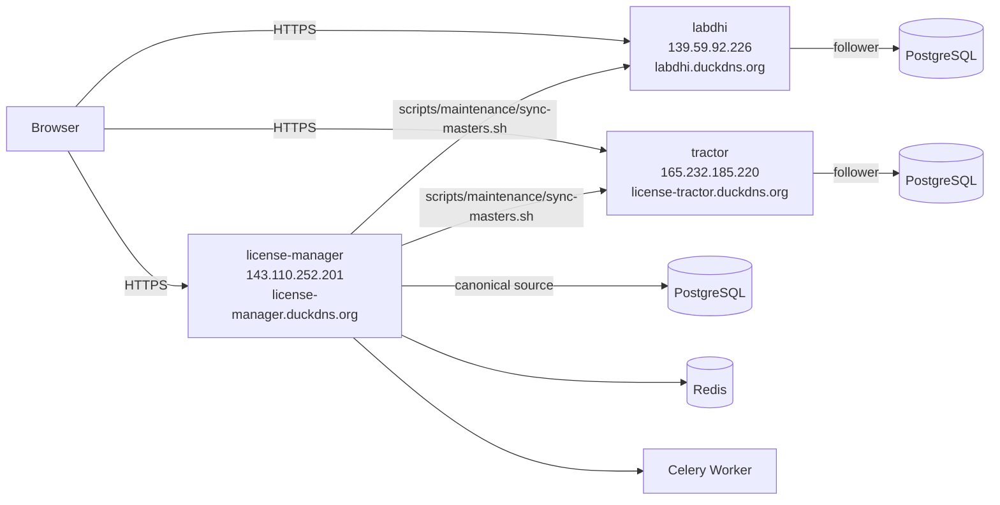

# 01 — Project Overview

## What Is This Application?

**License Manager** is a web-based trade-compliance management system used by Indian exporters to track and administer import entitlements under the Directorate General of Foreign Trade (DGFT) schemes — primarily DFIA (Duty Free Import Authorisation) and incentive licenses (RODTEP, ROSTL, MEIS).

The application sits at the intersection of customs compliance, logistics, and finance. It tracks the lifecycle of each license from issuance through partial utilisation across multiple importers, producing audit-ready ledgers and transfer documentation.

---

## Business Domain

Indian exporters earn **duty-free import licenses** against their export performance. Each license grants a specific CIF (Cost, Insurance, Freight) entitlement in USD (DFIA) or INR (incentive). That entitlement is consumed over time through:

1. **Bill of Entry (BOE)** — an actual customs clearance that debits the license.
2. **Allotment** — a pre-authorisation that reserves a portion of the license balance for a specific importer before clearance.
3. **Transfer** — the license (or part of it) may change hands; transfers must be documented with formal transfer letters.
4. **Trade Invoicing** — sale/purchase transactions generate invoices which must reconcile against BOEs and allotments.

The application gives all parties (license owners, importers, logistics teams, accounts) a single source of truth for these transactions.

---

## Core Capabilities

| Capability | Description |
|---|---|
| License Ledger | Live balance per license, per importer company |
| BOE Management | Upload, parse, and link customs clearance records |
| Allotment Tracking | Pre-authorise and monitor allocations per company |
| Trade Invoicing | DFIA purchase/sale and incentive license invoicing |
| Transfer Letters | Generate formal DGFT transfer documentation |
| PDF / OCR Parsing | Auto-extract data from scanned license copies |
| Excel Exports | Multi-sheet balance reports, bulk download |
| Multi-Server Sync | Replicate master data across multiple server instances |
| Task Management | Internal workflow tasks with assignments, priority, remarks |
| Role-Based Access | Granular 15-role permission system |
| Activity Audit Log | Comprehensive HTTP-level audit trail |
| Dashboard | KPI summary with trend charts for quick situational awareness |

---

## Who Uses It?

| User Type | Primary Tasks |
|---|---|
| License Manager | Create/update licenses, monitor balances, generate PDFs |
| Allotment Manager | Create allotments, generate transfer letters |
| BOE Manager | Upload and process bills of entry |
| Trade Manager | Create trade invoices, match with licenses |
| Report Viewer | View reports, ledgers, export Excel |
| Accounts (ACCOUNT_ACCESS) | Finance-focused read access |
| User Manager | Create/manage system users and role assignments |
| Superuser/Admin | Full access, system configuration |

---

## Technology Stack (Summary)

| Layer | Technology |
|---|---|
| Frontend | React 19, TypeScript, Tailwind CSS v4, shadcn/ui, Framer Motion |
| Backend API | Django 6 + Django REST Framework 3.17 |
| Auth | JWT (SimpleJWT) with refresh rotation and token blacklisting |
| Database | PostgreSQL (psycopg 3) |
| Async Tasks | Celery + Redis |
| PDF Processing | ReportLab, PyPDF, pdf2image, Pytesseract OCR |
| Excel | OpenPyXL, ExcelJS (frontend) |
| Deployment | 3 Linux servers (license-manager, labdhi, tractor) |

---

## Deployment Topology

`license-manager` is the **canonical server**. Master data (companies, ports, HS codes, SION norms, etc.) is periodically synced one-way from license-manager → labdhi and tractor via the `scripts/maintenance/sync-masters.sh` shell script which calls `audit_masters` and `auto_import_masters` management commands.
