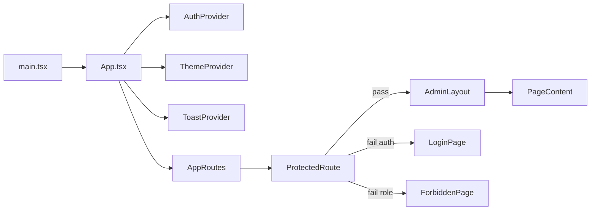
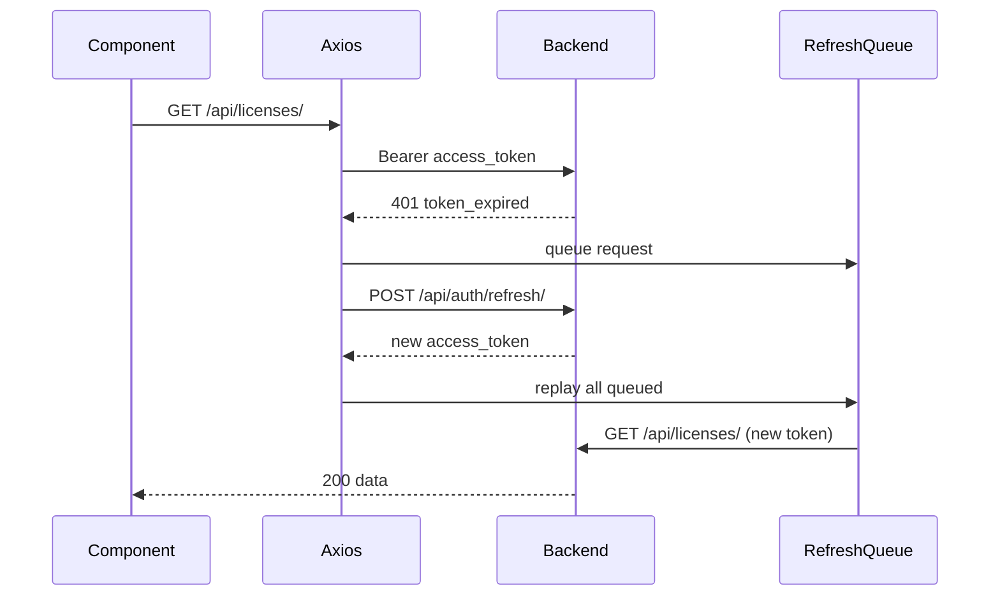
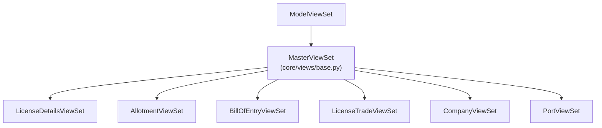
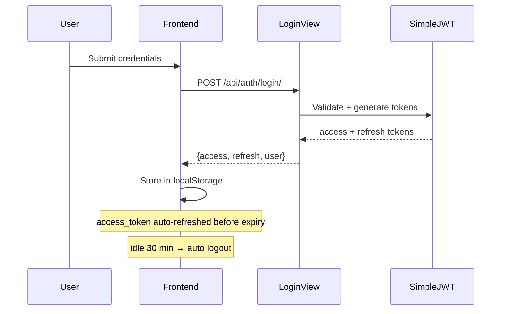
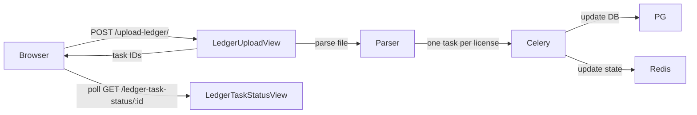

# 02 — Architecture

## System Architecture

```mermaid
graph TB
    subgraph Browser
        React["React 19 SPA\nTypeScript + Tailwind v4"]
    end

    subgraph Django["Django 6 Backend (Python)"]
        DRF[Django REST Framework]
        JWT[SimpleJWT Auth]
        MW[Middleware Stack]
        Apps[Django Apps]
    end

    subgraph Apps
        direction LR
        Accounts[accounts]
        Core[core]
        License[license]
        BOE[bill_of_entry]
        Allotment[allotment]
        Trade[trade]
        Tasks[tasks]
    end

    subgraph Infra
        PG[(PostgreSQL)]
        Redis[(Redis)]
        Celery[Celery Workers]
        Media[/media/ files]
    end

    Browser <-->|"HTTPS /api/*"| DRF
    Browser <-->|JWT tokens| JWT
    DRF --> Apps
    Apps --> PG
    Apps --> Redis
    Apps --> Media
    Celery --> PG
    Celery --> Redis
    Django -->|"Serve /assets/*\n/media/*"| Browser
    Django -->|"React index.html\n(catch-all)"| Browser
```

---

## Frontend Architecture

### Routing

- **Single Page Application** — React Router v7 handles all client-side routing.
- **Code splitting** — all pages are lazy-loaded via `lazyLoadWithRetry()` wrapper (retry on chunk-load failure).
- **Protected routes** — `ProtectedRoute` component gates access; unauthenticated users → `/login`; unauthorised users → `/403`.



### State Management

No global state library (no Redux/Zustand). Each page manages its own state via `useState` / `useCallback` / `useRef`. Shared state comes through:
- **AuthContext** — authenticated user, role helpers
- **ThemeContext** — light/dark preference
- **ToastContext** — legacy toast notifications (newer code uses `react-toastify` / `sonner`)

### API Layer (`src/api/`)

All API calls go through a single configured Axios instance (`api/axios.ts`):
- Base URL: resolved at runtime (same origin in production, `localhost:8000` in dev)
- Bearer token attached on every request via request interceptor
- **GET deduplication**: concurrent identical GET requests collapse to one in-flight call
- **401 handling**: queues all in-flight requests while silently refreshing the JWT; if refresh fails → logout
- **403**: navigate to `/403`
- **5xx**: generic error toast with retry suggestion



---

## Backend Architecture

### Django App Structure

| App | Responsibility |
|---|---|
| `accounts` | Custom User model, JWT auth, user management |
| `core` | Master data (companies, ports, HS codes, SION norms, exchange rates), activity logging, celery task tracking |
| `license` | DFIA + incentive license CRUD, ledger, PDF reports, Excel export, OCR parsing |
| `bill_of_entry` | BOE CRUD, ledger upload processing |
| `allotment` | Allotment CRUD, transfer letter generation |
| `trade` | Trade invoice CRUD (DFIA + incentive) |
| `tasks` | Internal workflow task management |

### Middleware Stack (top → bottom)

1. `SecurityMiddleware` — HTTPS enforcement
2. `WhiteNoiseMiddleware` — static file serving
3. `CorsMiddleware` — CORS headers
4. `SessionMiddleware`
5. `CommonMiddleware`
6. `DisableCSRFForAPIMiddleware` — disables CSRF for `/api/` paths
7. `CsrfViewMiddleware`
8. `AuthenticationMiddleware`
9. `MessagesMiddleware`
10. `XFrameOptionsMiddleware`
11. `ActivityLogMiddleware` — logs every HTTP request to `ActivityLog` table

### ViewSet Hierarchy



`MasterViewSet` adds:
- Enhanced filtering / searching / ordering
- Inline edit support (PATCH on individual fields)
- Bulk export actions (CSV/Excel)
- Structured paginated responses
- `AuditModel` auto-population (created_by / modified_by from thread-local user)

### Authentication Flow



### Async Processing (Celery)

Ledger file uploads (CSV/HTM) are heavy-weight. Each file may contain hundreds of license rows; each row requires multiple DB reads/writes and balance recalculations. Processing is offloaded to Celery:



---

## Database Architecture

### PostgreSQL Schema

Django ORM with `psycopg` (v3) native async driver. Key design choices:
- All models inherit from abstract `AuditModel` (created_on, modified_on, created_by, modified_by)
- One-to-one sub-tables pattern for extensible metadata (LicenseNotes, LicenseBalance, LicenseFlags, LicenseOwnership) — avoids wide tables while grouping related concerns
- Balance fields are **materialised** (updated by signals, not computed on read) for performance
- `frozen` boolean on BOE rows locks them from editing after ledger upload

### Core Entity Relationships

```mermaid
erDiagram
    LicenseDetailsModel ||--o{ LicenseImportItemsModel : "import items"
    LicenseDetailsModel ||--o{ LicenseExportItemModel : "export items"
    LicenseDetailsModel ||--|| LicenseBalance : "balance subtable"
    LicenseDetailsModel ||--|| LicenseFlags : "flags subtable"
    LicenseDetailsModel ||--|| LicenseOwnership : "ownership subtable"
    LicenseDetailsModel ||--|| LicenseNotes : "notes subtable"
    LicenseDetailsModel ||--o{ LicenseDocumentModel : "documents"
    LicenseDetailsModel ||--o{ LicenseTransferModel : "transfers"

    LicenseImportItemsModel ||--o{ RowDetails : "BOE debits"
    LicenseImportItemsModel ||--o{ AllotmentItems : "allotment debits"

    AllotmentModel ||--o{ AllotmentItems : "line items"
    AllotmentModel }o--|| CompanyModel : "company"
    AllotmentModel }o--|| PortModel : "port"

    BillOfEntryModel ||--o{ RowDetails : "item rows"
    BillOfEntryModel }o--|| CompanyModel : "company"
    BillOfEntryModel }o--|| PortModel : "port"

    LicenseTrade ||--o{ LicenseTradeLine : "DFIA lines"
    LicenseTrade ||--o{ IncentiveTradeLine : "incentive lines"
    LicenseTrade ||--o{ LicenseTradePayment : "payments"

    IncentiveLicense ||--o{ IncentiveTradeLine : "trades"
```



---

## Build & Deployment

### Frontend Build
```
npm run build   →  Vite (rolldown) bundles → frontend/dist/
```
Django's WhiteNoise serves `frontend/dist/assets/` at `/assets/*` and the catch-all serves `index.html`.

### Backend
```
python manage.py migrate
python manage.py collectstatic
gunicorn lmanagement.wsgi
celery -A lmanagement worker -Q celery,ledger -l info
```
> The worker **must** bind both queues. Ledger uploads are dispatched to the
> `ledger` queue (`apply_async(..., queue='ledger')`); omitting `-Q celery,ledger`
> leaves those tasks unconsumed.

### Environment Variables
- `DJANGO_SECRET_KEY`
- `DEBUG`
- `ALLOWED_HOSTS`
- `DATABASE_URL` (PostgreSQL connection)
- `REDIS_URL`
- `SECURE_SSL_REDIRECT`
