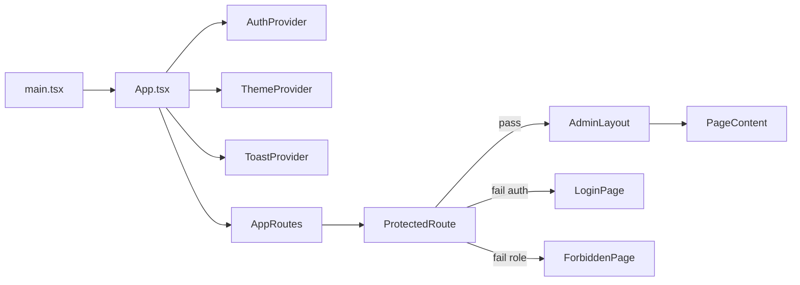
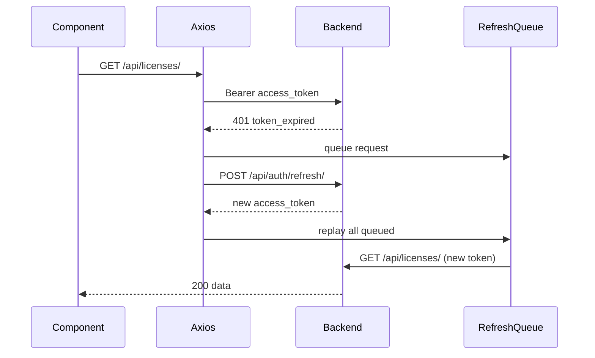
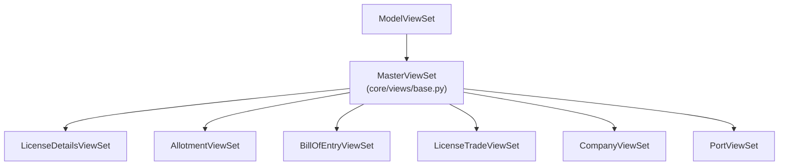
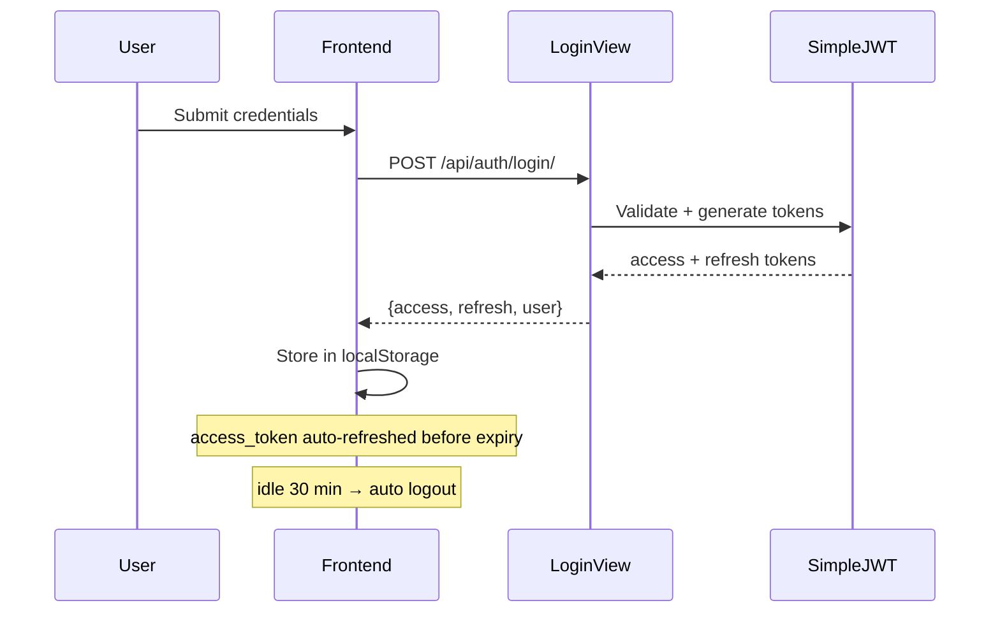
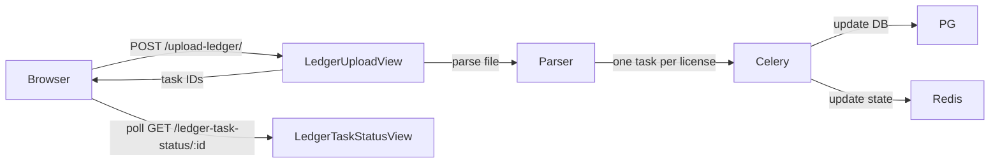

# 02 — Architecture

## System Architecture

```mermaid
graph TB
    subgraph Browser
        React["React 19 SPA\nTypeScript + Tailwind v4"]
    end

    subgraph Django["Django 6 Backend (Python)"]
        DRF[Django REST Framework]
        JWT[SimpleJWT Auth]
        MW[Middleware Stack]
        Apps[Django Apps]
    end

    subgraph Apps
        direction LR
        Accounts[accounts]
        Core[core]
        License[license]
        BOE[bill_of_entry]
        Allotment[allotment]
        Trade[trade]
        Tasks[tasks]
    end

    subgraph Infra
        PG[(PostgreSQL)]
        Redis[(Redis)]
        Celery[Celery Workers]
        Media[/media/ files]
    end

    Browser <-->|"HTTPS /api/*"| DRF
    Browser <-->|JWT tokens| JWT
    DRF --> Apps
    Apps --> PG
    Apps --> Redis
    Apps --> Media
    Celery --> PG
    Celery --> Redis
    Django -->|"Serve /assets/*\n/media/*"| Browser
    Django -->|"React index.html\n(catch-all)"| Browser
```

---

## Frontend Architecture

### Routing

- **Single Page Application** — React Router v7 handles all client-side routing.
- **Code splitting** — all pages are lazy-loaded via `lazyLoadWithRetry()` wrapper (retry on chunk-load failure).
- **Protected routes** — `ProtectedRoute` component gates access; unauthenticated users → `/login`; unauthorised users → `/403`.


```mermaid
graph LR
    Entry[main.tsx] --> App[App.tsx]
    App --> AuthProvider
    App --> ThemeProvider
    App --> ToastProvider
    App --> AppRoutes
    AppRoutes --> ProtectedRoute
    ProtectedRoute -->|pass| AdminLayout
    ProtectedRoute -->|fail auth| LoginPage
    ProtectedRoute -->|fail role| ForbiddenPage
    AdminLayout --> PageContent
```

### State Management

No global state library (no Redux/Zustand). Each page manages its own state via `useState` / `useCallback` / `useRef`. Shared state comes through:
- **AuthContext** — authenticated user, role helpers
- **ThemeContext** — light/dark preference
- **ToastContext** — legacy toast notifications (newer code uses `react-toastify` / `sonner`)

### API Layer (`src/api/`)

All API calls go through a single configured Axios instance (`api/axios.ts`):
- Base URL: resolved at runtime (same origin in production, `localhost:8000` in dev)
- Bearer token attached on every request via request interceptor
- **GET deduplication**: concurrent identical GET requests collapse to one in-flight call
- **401 handling**: queues all in-flight requests while silently refreshing the JWT; if refresh fails → logout
- **403**: navigate to `/403`
- **5xx**: generic error toast with retry suggestion


```mermaid
sequenceDiagram
    participant Component
    participant Axios
    participant Backend
    participant RefreshQueue

    Component->>Axios: GET /api/licenses/
    Axios->>Backend: Bearer access_token
    Backend-->>Axios: 401 token_expired
    Axios->>RefreshQueue: queue request
    Axios->>Backend: POST /api/auth/refresh/
    Backend-->>Axios: new access_token
    Axios->>RefreshQueue: replay all queued
    RefreshQueue->>Backend: GET /api/licenses/ (new token)
    Backend-->>Component: 200 data
```

---

## Backend Architecture

### Django App Structure

| App | Responsibility |
|---|---|
| `accounts` | Custom User model, JWT auth, user management |
| `core` | Master data (companies, ports, HS codes, SION norms, exchange rates), activity logging, celery task tracking |
| `license` | DFIA + incentive license CRUD, ledger, PDF reports, Excel export, OCR parsing |
| `bill_of_entry` | BOE CRUD, ledger upload processing |
| `allotment` | Allotment CRUD, transfer letter generation |
| `trade` | Trade invoice CRUD (DFIA + incentive) |
| `tasks` | Internal workflow task management |

### Middleware Stack (top → bottom)

1. `SecurityMiddleware` — HTTPS enforcement
2. `WhiteNoiseMiddleware` — static file serving
3. `CorsMiddleware` — CORS headers
4. `SessionMiddleware`
5. `CommonMiddleware`
6. `DisableCSRFForAPIMiddleware` — disables CSRF for `/api/` paths
7. `CsrfViewMiddleware`
8. `AuthenticationMiddleware`
9. `MessagesMiddleware`
10. `XFrameOptionsMiddleware`
11. `ActivityLogMiddleware` — logs every HTTP request to `ActivityLog` table

### ViewSet Hierarchy


```mermaid
graph TB
    DRF[ModelViewSet] --> MasterViewSet["MasterViewSet\n(core/views/base.py)"]
    MasterViewSet --> LicenseDetailsViewSet
    MasterViewSet --> AllotmentViewSet
    MasterViewSet --> BOEViewSet["BillOfEntryViewSet"]
    MasterViewSet --> TradeViewSet["LicenseTradeViewSet"]
    MasterViewSet --> CompanyViewSet
    MasterViewSet --> PortViewSet
```

`MasterViewSet` adds:
- Enhanced filtering / searching / ordering
- Inline edit support (PATCH on individual fields)
- Bulk export actions (CSV/Excel)
- Structured paginated responses
- `AuditModel` auto-population (created_by / modified_by from thread-local user)

### Authentication Flow


```mermaid
sequenceDiagram
    participant User
    participant Frontend
    participant LoginView
    participant SimpleJWT

    User->>Frontend: Submit credentials
    Frontend->>LoginView: POST /api/auth/login/
    LoginView->>SimpleJWT: Validate + generate tokens
    SimpleJWT-->>LoginView: access + refresh tokens
    LoginView-->>Frontend: {access, refresh, user}
    Frontend->>Frontend: Store in localStorage
    Note over Frontend: access_token auto-refreshed before expiry
    Note over Frontend: idle 30 min → auto logout
```

### Async Processing (Celery)

Ledger file uploads (CSV/HTM) are heavy-weight. Each file may contain hundreds of license rows; each row requires multiple DB reads/writes and balance recalculations. Processing is offloaded to Celery:


```mermaid
graph LR
    Browser -->|POST /upload-ledger/| LedgerUploadView
    LedgerUploadView -->|parse file| Parser
    Parser -->|one task per license| Celery
    LedgerUploadView -->|task IDs| Browser
    Browser -->|poll GET /ledger-task-status/:id| LedgerTaskStatusView
    Celery -->|update DB| PG
    Celery -->|update state| Redis
```

---

## Report & Export Architecture

### Display Dataset Rule

**Every report has exactly one authoritative Display Dataset. The UI, API,
PDF, Excel, Print, CSV, and any future export format must consume that
dataset directly. Exporters may format data — write cells, set fonts, pick
page sizes — but must never calculate business values.**

This rule exists because it was violated repeatedly before being made
explicit: three reports independently computed "Balance CIF" via three
different formulas, a report view's own JSON, Excel, and PDF paths
diverged on a hidden-rows filter, and a client-side summary calculation in
Item Pivot Report had no server-side equivalent at all. An export-
consistency audit found these (plus a since-fixed bug where three reports'
Excel exports 404'd outright), and an ongoing phased initiative
(tracked as "Phase 2A" et seq. in commit history, not the unrelated
`PHASE_1_REVIEW.md`/`PHASE_2_DESIGN.md`/`PHASE_3_MIGRATION_PLAN.md` docs in
this directory, which cover a separate modularization effort) is bringing
each report into line with it, one report at a time, starting with the
ones already closest to compliant.

In practice, a report's Display Dataset is a plain dict returned by one
builder function (or classmethod), consumed identically by:
- the JSON view action,
- the Excel exporter (formats the dict's rows/summary into cells, never
  recomputes a total or a balance),
- the PDF exporter (same, into ReportLab flowables), and
- the React page (renders server-supplied values; any client-side math
  beyond display formatting — sorting, `toFixed`, locale formatting — is a
  violation to flag and fix).

Reference implementations, in order of how closely they follow the rule:
`apps.license.services.license_balance_ledger_builder.LicenseBalanceLedgerBuilder`
(the original, most complete example — one `build()` composing independently
callable section builders) and `apps.license.services.purchase_profit_report.
build_purchase_profit_report` (simpler, single flat envelope). New reports
should follow one of these, not the older per-report ad hoc pattern still
present in some views, and not the unused `apps.core.exporters.*` class
hierarchy (an earlier, abandoned attempt at a shared framework — do not
revive it; see `apps/core/reports/` for the current lightweight convention
instead: `envelope.py`, `export_naming.py`, `renderers.py`).

A number that differs between the screen, PDF, Excel, print preview, or API
response for the same report and the same filters is a defect, not a
cosmetic inconsistency — treat it with the same severity as an incorrect
calculation, because in this system it usually *is* one.

---

## Database Architecture

### PostgreSQL Schema

Django ORM with `psycopg` (v3) native async driver. Key design choices:
- All models inherit from abstract `AuditModel` (created_on, modified_on, created_by, modified_by)
- One-to-one sub-tables pattern for extensible metadata (LicenseNotes, LicenseBalance, LicenseFlags, LicenseOwnership) — avoids wide tables while grouping related concerns
- Balance fields are **materialised** (updated by signals, not computed on read) for performance
- `frozen` boolean on BOE rows locks them from editing after ledger upload

### Core Entity Relationships


```mermaid
erDiagram
    LicenseDetailsModel ||--o{ LicenseImportItemsModel : "import items"
    LicenseDetailsModel ||--o{ LicenseExportItemModel : "export items"
    LicenseDetailsModel ||--|| LicenseBalance : "balance subtable"
    LicenseDetailsModel ||--|| LicenseFlags : "flags subtable"
    LicenseDetailsModel ||--|| LicenseOwnership : "ownership subtable"
    LicenseDetailsModel ||--|| LicenseNotes : "notes subtable"
    LicenseDetailsModel ||--o{ LicenseDocumentModel : "documents"
    LicenseDetailsModel ||--o{ LicenseTransferModel : "transfers"

    LicenseImportItemsModel ||--o{ RowDetails : "BOE debits"
    LicenseImportItemsModel ||--o{ AllotmentItems : "allotment debits"

    AllotmentModel ||--o{ AllotmentItems : "line items"
    AllotmentModel }o--|| CompanyModel : "company"
    AllotmentModel }o--|| PortModel : "port"

    BillOfEntryModel ||--o{ RowDetails : "item rows"
    BillOfEntryModel }o--|| CompanyModel : "company"
    BillOfEntryModel }o--|| PortModel : "port"

    LicenseTrade ||--o{ LicenseTradeLine : "DFIA lines"
    LicenseTrade ||--o{ IncentiveTradeLine : "incentive lines"
    LicenseTrade ||--o{ LicenseTradePayment : "payments"

    IncentiveLicense ||--o{ IncentiveTradeLine : "trades"
```

---

## Build & Deployment

### Frontend Build
```
npm run build   →  Vite (rolldown) bundles → frontend/dist/
```
Django's WhiteNoise serves `frontend/dist/assets/` at `/assets/*` and the catch-all serves `index.html`.

### Backend
```
python manage.py migrate
python manage.py collectstatic
gunicorn lmanagement.wsgi
celery -A lmanagement worker -l info
```

### Environment Variables
- `DJANGO_SECRET_KEY`
- `DEBUG`
- `ALLOWED_HOSTS`
- `DATABASE_URL` (PostgreSQL connection)
- `REDIS_URL`
- `SECURE_SSL_REDIRECT`
