# Database Documentation

> Source of truth: `legacy/backend/apps/*/models.py`.
> Single PostgreSQL instance shared by `legacy/backend/` (owner) and `backendv1/` (additive-only during migration).

---

## Abstract Base Models

### AuditModel

Defined at `legacy/backend/apps/core/models.py:97`.

Every transactional table inherits `AuditModel`. It adds four columns and auto-fills them from a thread-local current user injected by middleware.

| Column | Type | Behaviour |
|---|---|---|
| `created_on` | DateTimeField | `auto_now_add=True` — never changes after insert |
| `created_by` | FK → User | Set on first save from `get_current_user()`; `on_delete=SET_NULL` |
| `modified_on` | DateTimeField | `auto_now=True` — updated on every save |
| `modified_by` | FK → User | Updated on every save from `get_current_user()`; `on_delete=SET_NULL` |

The `save()` override at line 124 reads `get_current_user()` and short-circuits if the user is unauthenticated, so management commands and signals do not accidentally write a user FK.

### SyncTimestampModel

Defined at `legacy/backend/apps/core/models.py:142`.

Lightweight alternative for bulk-imported master data where per-user auditing is not needed but delta-sync (`updated_since`) must work.

| Column | Type | Behaviour |
|---|---|---|
| `created_on` | DateTimeField | `default=timezone.now`, not editable |
| `modified_on` | DateTimeField | `auto_now=True`, nullable for backfill safety |

### SyntheticUidMixin

Defined at `legacy/backend/apps/core/models.py:159`.

Adds a deterministic `uid` (UUID5) to keyless master tables so MDS mirror-sync can upsert rows across servers by natural key without creating duplicates (ADR-001 Decision 6).

| Column | Type | Behaviour |
|---|---|---|
| `uid` | UUIDField | Nullable, unique, indexed; computed by `compute_uid()` on first save |

Subclasses implement `compute_uid()` using canonical recipes from `mds_client.keys` (or the inline fallback). The mixin's `save()` catches any exception from `compute_uid()` and leaves `uid=None` rather than blocking the save.

---

## Section 1 — Table Inventory

Tables are grouped by Django app. All `AuditModel` descendants carry `created_on`, `created_by_id`, `modified_on`, `modified_by_id` columns in addition to the fields listed.

---

### App: accounts

#### accounts_user

Model: `User` (`legacy/backend/apps/accounts/models.py:42`)
Base: `AbstractBaseUser`, `PermissionsMixin`

| Column | Type | Constraints |
|---|---|---|
| `id` | BigAutoField PK | — |
| `username` | VARCHAR(150) | UNIQUE, NOT NULL |
| `email` | VARCHAR(255) | UNIQUE, nullable |
| `first_name` | VARCHAR(30) | blank |
| `last_name` | VARCHAR(150) | blank |
| `is_staff` | BOOLEAN | default False |
| `is_active` | BOOLEAN | default True |
| `date_joined` | TIMESTAMPTZ | default now |
| `avatar` | VARCHAR (file path) | nullable; allowed extensions: png/jpg/jpeg |
| `password` | VARCHAR | Django hashed password (from AbstractBaseUser) |
| `last_login` | TIMESTAMPTZ | nullable (from AbstractBaseUser) |
| `is_superuser` | BOOLEAN | from PermissionsMixin |

Indexes: implicit on `username` (UNIQUE), `email` (UNIQUE).
M2M through tables: `accounts_user_groups`, `accounts_user_user_permissions` (Django-managed with custom `related_name` to avoid clash with `auth.User`).

Role management uses Django's built-in `auth_group` — helper methods `has_role()`, `has_any_role()`, `get_role_codes()` check group membership.

---

### App: core

#### core_companymodel

Model: `CompanyModel` (`legacy/backend/apps/core/models.py:227`)
Base: `AuditModel`

| Column | Type | Constraints |
|---|---|---|
| `id` | BigAutoField PK | — |
| `iec` | VARCHAR(10) | UNIQUE |
| `pan` | VARCHAR(50) | nullable; regex `^[A-Z]{5}[0-9]{4}[A-Z]$` |
| `gst_number` | VARCHAR(50) | nullable; regex GST format |
| `name` | VARCHAR(255) | blank OK, default '' |
| `contact_person` | VARCHAR(255) | nullable |
| `phone_number` | VARCHAR(255) | nullable |
| `email` | EmailField | nullable |
| `address_line_1` | TEXT | blank |
| `address_line_2` | TEXT | blank |
| `logo` | ImageField | nullable; path `companies/<id>/` |
| `signature` | ImageField | nullable |
| `stamp` | ImageField | nullable |
| `bill_colour` | VARCHAR(20) | default "#333" |
| `bank_account_number` | VARCHAR(30) | nullable |
| `bank_name` | VARCHAR(255) | nullable |
| `ifsc_code` | VARCHAR(11) | nullable; regex `^[A-Z]{4}0[A-Z0-9]{6}$` |
| `account_type` | VARCHAR(20) | choices: SAVINGS/CURRENT/OD; nullable |

Ordering: `['name']`.

#### core_portmodel

Model: `PortModel` (`legacy/backend/apps/core/models.py:290`)
Base: `AuditModel`

| Column | Type | Constraints |
|---|---|---|
| `id` | BigAutoField PK | — |
| `code` | VARCHAR(10) | UNIQUE |
| `name` | VARCHAR(255) | blank OK |

Unique together: `(name, code)`. Ordering: `(code, name)`.

#### core_itemheadmodel

Model: `ItemHeadModel` (`legacy/backend/apps/core/models.py:302`)
Base: `AuditModel`
Status: **Deprecated** — use `ItemGroupModel` instead.

| Column | Type | Constraints |
|---|---|---|
| `id` | BigAutoField PK | — |
| `name` | VARCHAR(255) | UNIQUE |
| `unit_rate` | DECIMAL(15,2) | default 0, min 0 |
| `is_restricted` | BOOLEAN | default False |
| `restriction_norm_id` | FK → `core_sionnormclassmodel` | SET_NULL, nullable |
| `restriction_percentage` | DECIMAL(5,2) | default 0 |
| `dict_key` | VARCHAR(255) | nullable |

#### core_itemgroupmodel

Model: `ItemGroupModel` (`legacy/backend/apps/core/models.py:337`)
Base: `AuditModel`

| Column | Type | Constraints |
|---|---|---|
| `id` | BigAutoField PK | — |
| `name` | VARCHAR(255) | UNIQUE |

Ordering: `['name']`.

#### core_itemnamemodel

Model: `ItemNameModel` (`legacy/backend/apps/core/models.py:348`)
Base: `AuditModel`

| Column | Type | Constraints |
|---|---|---|
| `id` | BigAutoField PK | — |
| `group_id` | FK → `core_itemgroupmodel` | CASCADE, nullable |
| `name` | VARCHAR(255) | UNIQUE |
| `is_active` | BOOLEAN | default True |
| `sion_norm_class_id` | FK → `core_sionnormclassmodel` | SET_NULL, nullable |
| `restriction_percentage` | DECIMAL(5,2) | default 0 |
| `display_order` | INTEGER | default 1, min 1 |

Ordering: `['display_order', 'group__name', 'name']`.

#### core_hscodemodel

Model: `HSCodeModel` (`legacy/backend/apps/core/models.py:384`)
Base: `AuditModel`

| Column | Type | Constraints |
|---|---|---|
| `id` | BigAutoField PK | — |
| `hs_code` | VARCHAR(8) | UNIQUE |
| `product_description` | TEXT | nullable |
| `unit_price` | DECIMAL(15,2) | default 0, min 0 |
| `basic_duty` | VARCHAR(225) | nullable |
| `unit` | VARCHAR(255) | nullable |
| `policy` | VARCHAR(255) | nullable |
| `note` | TEXT | nullable |

Ordering: `('hs_code',)`.

#### core_headsiononormsmodel

Model: `HeadSIONNormsModel` (`legacy/backend/apps/core/models.py:406`)
Base: `SyntheticUidMixin`, `SyncTimestampModel`

| Column | Type | Constraints |
|---|---|---|
| `id` | BigAutoField PK | — |
| `name` | VARCHAR(255) | — |
| `uid` | UUID | UNIQUE, nullable, indexed |
| `created_on` | TIMESTAMPTZ | default now |
| `modified_on` | TIMESTAMPTZ | auto_now, nullable |

#### core_sionnormclassmodel

Model: `SionNormClassModel` (`legacy/backend/apps/core/models.py:416`)
Base: `AuditModel`

| Column | Type | Constraints |
|---|---|---|
| `id` | BigAutoField PK | — |
| `head_norm_id` | FK → `core_headsiononormsmodel` | CASCADE |
| `description` | VARCHAR(255) | nullable |
| `norm_class` | VARCHAR(10) | UNIQUE |
| `is_active` | BOOLEAN | default False |

#### core_sionexportmodel

Model: `SIONExportModel` (`legacy/backend/apps/core/models.py:429`)
Base: `SyntheticUidMixin`, `SyncTimestampModel`

| Column | Type | Constraints |
|---|---|---|
| `id` | BigAutoField PK | — |
| `norm_class_id` | FK → `core_sionnormclassmodel` | CASCADE |
| `description` | VARCHAR(255) | nullable |
| `quantity` | DECIMAL(15,2) | default 0, min 0 |
| `unit` | VARCHAR(255) | nullable |
| `uid` | UUID | UNIQUE, nullable, indexed |

#### core_sionimportmodel

Model: `SIONImportModel` (`legacy/backend/apps/core/models.py:451`)
Base: `SyntheticUidMixin`, `SyncTimestampModel`

| Column | Type | Constraints |
|---|---|---|
| `id` | BigAutoField PK | — |
| `serial_number` | INTEGER | default 0 |
| `norm_class_id` | FK → `core_sionnormclassmodel` | CASCADE |
| `hsn_code_id` | FK → `core_hscodemodel` | SET_NULL, nullable; `db_column='hsn_code_id'` |
| `description` | VARCHAR(255) | nullable |
| `quantity` | DECIMAL(15,2) | default 0 |
| `unit` | VARCHAR(255) | nullable |
| `condition` | VARCHAR(255) | nullable |
| `uid` | UUID | UNIQUE, nullable, indexed |

Ordering: `['serial_number']`.

#### core_sionnormnote

Model: `SionNormNote` (`legacy/backend/apps/core/models.py:484`)
Base: `SyntheticUidMixin`, `AuditModel`

| Column | Type | Constraints |
|---|---|---|
| `id` | BigAutoField PK | — |
| `sion_norm_id` | FK → `core_sionnormclassmodel` | CASCADE |
| `note_text` | TEXT | — |
| `display_order` | INTEGER | default 0 |
| `uid` | UUID | UNIQUE, nullable, indexed |

Ordering: `['display_order', 'id']`.

#### core_sionnormcondition

Model: `SionNormCondition` (`legacy/backend/apps/core/models.py:506`)
Base: `SyntheticUidMixin`, `AuditModel`

| Column | Type | Constraints |
|---|---|---|
| `id` | BigAutoField PK | — |
| `sion_norm_id` | FK → `core_sionnormclassmodel` | CASCADE |
| `condition_text` | TEXT | — |
| `display_order` | INTEGER | default 0 |
| `uid` | UUID | UNIQUE, nullable, indexed |

Ordering: `['display_order', 'id']`.

#### core_productdescriptionmodel

Model: `ProductDescriptionModel` (`legacy/backend/apps/core/models.py:528`)
Base: `SyntheticUidMixin`, `AuditModel`

| Column | Type | Constraints |
|---|---|---|
| `id` | BigAutoField PK | — |
| `hs_code_id` | FK → `core_hscodemodel` | PROTECT |
| `product_description` | TEXT | — |
| `uid` | UUID | UNIQUE, nullable, indexed |

#### core_transferlettermodel

Model: `TransferLetterModel` (`legacy/backend/apps/core/models.py:543`)
Base: `AuditModel`

| Column | Type | Constraints |
|---|---|---|
| `id` | BigAutoField PK | — |
| `name` | VARCHAR(255) | — |
| `tl` | FileField | upload_to='tl' |

Ordering: `['name', 'id']`.

#### core_unitpricemodel

Model: `UnitPriceModel` (`legacy/backend/apps/core/models.py:554`)
Base: `SyntheticUidMixin`, `AuditModel`

| Column | Type | Constraints |
|---|---|---|
| `id` | BigAutoField PK | — |
| `name` | VARCHAR(255) | — |
| `unit_price` | DECIMAL(15,2) | default 0, min 0 |
| `label` | VARCHAR(255) | default '' |
| `uid` | UUID | UNIQUE, nullable, indexed |

#### core_invoiceentity

Model: `InvoiceEntity` (`legacy/backend/apps/core/models.py:580`)
Base: plain `models.Model`

| Column | Type | Constraints |
|---|---|---|
| `id` | BigAutoField PK | — |
| `name` | VARCHAR(255) | — |
| `address_line_1` | TEXT | — |
| `address_line_2` | TEXT | blank |
| `pan_number` | VARCHAR(10) | regex validation |
| `gst_number` | VARCHAR(15) | regex validation |
| `logo` | ImageField | nullable |
| `bank_account_number` | VARCHAR(30) | — |
| `bank_name` | VARCHAR(100) | — |
| `ifsc_code` | VARCHAR(11) | regex validation |
| `account_type` | VARCHAR(10) | choices: current/saving |
| `bill_colour` | VARCHAR(10) | nullable |
| `signature` | ImageField | nullable |
| `stamp` | ImageField | nullable |

#### core_schemecode

Model: `SchemeCode` (`legacy/backend/apps/core/models.py:610`)
Base: plain `models.Model`

| Column | Type | Constraints |
|---|---|---|
| `id` | BigAutoField PK | — |
| `code` | VARCHAR(10) | UNIQUE |
| `label` | VARCHAR(100) | — |

#### core_notificationnumber

Model: `NotificationNumber` (`legacy/backend/apps/core/models.py:618`)
Base: plain `models.Model`

| Column | Type | Constraints |
|---|---|---|
| `id` | BigAutoField PK | — |
| `code` | VARCHAR(10) | UNIQUE |
| `label` | VARCHAR(100) | — |

#### core_purchasestatus

Model: `PurchaseStatus` (`legacy/backend/apps/core/models.py:626`)
Base: plain `models.Model`

| Column | Type | Constraints |
|---|---|---|
| `id` | BigAutoField PK | — |
| `code` | VARCHAR(2) | UNIQUE |
| `label` | VARCHAR(100) | — |
| `is_active` | BOOLEAN | default True |
| `display_order` | INTEGER | default 0 |

Ordering: `['display_order', 'label']`.

#### core_exchangeratemodel

Model: `ExchangeRateModel` (`legacy/backend/apps/core/models.py:641`)
Base: `AuditModel`

| Column | Type | Constraints |
|---|---|---|
| `id` | BigAutoField PK | — |
| `date` | DATE | UNIQUE |
| `usd` | DECIMAL(10,4) | min 0 |
| `euro` | DECIMAL(10,4) | min 0 |
| `pound_sterling` | DECIMAL(10,4) | min 0 |
| `chinese_yuan` | DECIMAL(10,4) | min 0 |

Indexes: `[-date]` (for `get_active_rate()` performance). Ordering: `['-date']`.

#### core_celerytasktracker

Model: `CeleryTaskTracker` (`legacy/backend/apps/core/models.py:704`)
Base: plain `models.Model`

| Column | Type | Constraints |
|---|---|---|
| `id` | BigAutoField PK | — |
| `task_id` | VARCHAR(255) | UNIQUE, indexed |
| `task_name` | VARCHAR(255) | indexed |
| `status` | VARCHAR(50) | choices: PENDING/STARTED/SUCCESS/FAILURE/RETRY/REVOKED; indexed |
| `args` | JSONB | default [] |
| `kwargs` | JSONB | default {} |
| `result` | JSONB | nullable |
| `traceback` | TEXT | nullable |
| `created_at` | TIMESTAMPTZ | auto_now_add, indexed |
| `started_at` | TIMESTAMPTZ | nullable |
| `completed_at` | TIMESTAMPTZ | nullable |
| `current` | INTEGER | default 0 |
| `total` | INTEGER | default 100 |
| `progress_message` | TEXT | blank |

Indexes: `(status, completed_at)`, `(task_name, status)`. Ordering: `['-created_at']`.

#### core_activitylog

Model: `ActivityLog` (`legacy/backend/apps/core/models.py:761`)
Base: plain `models.Model`

| Column | Type | Constraints |
|---|---|---|
| `id` | BigAutoField PK | — |
| `user_id` | FK → accounts_user | SET_NULL, nullable |
| `username` | VARCHAR(150) | indexed |
| `action` | VARCHAR(20) | choices: LOGIN/LOGOUT/VIEW/CREATE/UPDATE/DELETE/DOWNLOAD/UPLOAD/EXPORT/SEARCH; indexed |
| `module` | VARCHAR(60) | indexed |
| `resource_id` | VARCHAR(60) | blank |
| `description` | VARCHAR(500) | blank |
| `endpoint` | VARCHAR(500) | blank |
| `method` | VARCHAR(10) | blank |
| `ip_address` | GenericIPAddressField | nullable |
| `user_agent` | VARCHAR(400) | blank |
| `status_code` | SMALLINT | nullable |
| `extra` | JSONB | default {} |
| `timestamp` | TIMESTAMPTZ | auto_now_add, indexed |

Indexes: `(user, timestamp)`, `(action, timestamp)`, `(module, timestamp)`, `(username, timestamp)`. Ordering: `['-timestamp']`.

#### core_masterchange

Model: `MasterChange` (`legacy/backend/apps/core/models.py:193`)
Base: plain `models.Model`

Append-only change feed powering delta-sync webhooks and delete propagation.

| Column | Type | Constraints |
|---|---|---|
| `id` | BigAutoField PK | — |
| `model_label` | VARCHAR(100) | indexed |
| `natural_key` | VARCHAR(255) | indexed |
| `op` | VARCHAR(10) | choices: create/update/delete |
| `at` | TIMESTAMPTZ | default now, indexed |

Indexes: `(model_label, at)`. Ordering: `['at']`.

---

### App: license

#### license_licensedetailsmodel

Model: `LicenseDetailsModel` (`legacy/backend/apps/license/models/core.py:89`)
Base: `AuditModel`

The central license header. Fields for balance, flags, notes, and ownership are split into four OneToOne sub-tables (see below) created via a `post_save` signal.

| Column | Type | Constraints |
|---|---|---|
| `id` | BigAutoField PK | — |
| `license_number` | VARCHAR(50) | UNIQUE |
| `license_date` | DATE | nullable |
| `license_expiry_date` | DATE | nullable |
| `file_number` | VARCHAR(30) | nullable |
| `purchase_status_id` | FK → `core_purchasestatus` | PROTECT, nullable |
| `scheme_code_id` | FK → `core_schemecode` | PROTECT, nullable |
| `notification_number_id` | FK → `core_notificationnumber` | PROTECT, nullable |
| `exporter_id` | FK → `core_companymodel` | SET_NULL, nullable |
| `archived_exporter_name` | VARCHAR(255) | blank, default '' |
| `port_id` | FK → `core_portmodel` | CASCADE, nullable |
| `registration_number` | VARCHAR(10) | nullable |
| `registration_date` | DATE | nullable |
| `ge_file_number` | INTEGER | default 0 |

Indexes: `(license_number)`, `(file_number)`, `(exporter, license_date)`, `(port, license_date)`, `(license_date)`, `(license_expiry_date)`. Ordering: `('license_expiry_date', 'license_date')`.

#### license_licensenotes

Model: `LicenseNotes` (`legacy/backend/apps/license/models/core.py:1713`)
Base: plain `models.Model`. OneToOne extension of `LicenseDetailsModel`.

| Column | Type | Constraints |
|---|---|---|
| `license_id` | PK, OneToOne → `license_licensedetailsmodel` | CASCADE |
| `user_comment` | TEXT | nullable |
| `condition_sheet` | TEXT | nullable |
| `user_restrictions` | TEXT | nullable |
| `balance_report_notes` | TEXT | nullable |

#### license_licensebalance

Model: `LicenseBalance` (`legacy/backend/apps/license/models/core.py:1734`)
Base: plain `models.Model`. Materialized balance cache.

| Column | Type | Constraints |
|---|---|---|
| `license_id` | PK, OneToOne → `license_licensedetailsmodel` | CASCADE |
| `balance_cif` | DECIMAL(15,2) | default 0, min 0 |
| `ledger_date` | DATE | nullable |

Indexes: `(balance_cif)`.

#### license_licenseflags

Model: `LicenseFlags` (`legacy/backend/apps/license/models/core.py:1758`)
Base: plain `models.Model`. Boolean workflow state.

| Column | Type | Constraints |
|---|---|---|
| `license_id` | PK, OneToOne → `license_licensedetailsmodel` | CASCADE |
| `is_active` | BOOLEAN | default True |
| `is_audit` | BOOLEAN | default False |
| `is_mnm` | BOOLEAN | default False |
| `is_not_registered` | BOOLEAN | default False |
| `is_null` | BOOLEAN | default False |
| `is_au` | BOOLEAN | default False |
| `is_incomplete` | BOOLEAN | default False |
| `is_expired` | BOOLEAN | default False |
| `is_individual` | BOOLEAN | default False |

Indexes: `(is_active, is_expired)`.
Business rule: `is_null = True` when `balance_cif < $500`; `is_expired = True` when `license_expiry_date < today`. Both are written by `update_license_flags()` on every balance-affecting event.

#### license_licenseownership

Model: `LicenseOwnership` (`legacy/backend/apps/license/models/core.py:1784`)
Base: plain `models.Model`. DGFT ownership pointer.

| Column | Type | Constraints |
|---|---|---|
| `license_id` | PK, OneToOne → `license_licensedetailsmodel` | CASCADE |
| `current_owner_id` | FK → `core_companymodel` | PROTECT, nullable |
| `file_transfer_status` | TEXT | nullable |
| `last_ownership_fetch` | TIMESTAMPTZ | nullable |

Indexes: `(current_owner_id)`.

#### license_licenseexportitemmodel

Model: `LicenseExportItemModel` (`legacy/backend/apps/license/models/core.py:838`)
Base: plain `models.Model`

| Column | Type | Constraints |
|---|---|---|
| `id` | BigAutoField PK | — |
| `license_id` | FK → `license_licensedetailsmodel` | CASCADE |
| `description` | VARCHAR(2000) | nullable, indexed |
| `item_id` | FK → `core_itemnamemodel` | CASCADE, nullable |
| `norm_class_id` | FK → `core_sionnormclassmodel` | CASCADE, nullable |
| `duty_type` | VARCHAR(255) | default "Basic" |
| `net_quantity` | DECIMAL(15,2) | default 0, min 0 |
| `old_quantity` | DECIMAL(15,2) | default 0 |
| `unit` | VARCHAR(10) | choices from UNIT_CHOICES; default KG |
| `fob_fc` | DECIMAL(15,2) | default 0 |
| `fob_inr` | DECIMAL(15,2) | default 0 |
| `fob_exchange_rate` | DECIMAL(15,6) | default 0 |
| `currency` | VARCHAR(5) | choices from CURRENCY_CHOICES; default USD |
| `value_addition` | DECIMAL(15,2) | default 0 |
| `cif_fc` | DECIMAL(15,2) | default 0 |
| `cif_inr` | DECIMAL(15,2) | default 0 |

#### license_licenseimportitemsmodel

Model: `LicenseImportItemsModel` (`legacy/backend/apps/license/models/core.py:880`)
Base: plain `models.Model`

This is the central row for tracking import entitlements and consumed balances.

| Column | Type | Constraints |
|---|---|---|
| `id` | BigAutoField PK | — |
| `serial_number` | INTEGER | default 0 |
| `license_id` | FK → `license_licensedetailsmodel` | CASCADE, indexed |
| `hs_code_id` | FK → `core_hscodemodel` | CASCADE, nullable, indexed |
| `description` | VARCHAR(2000) | nullable, indexed |
| `quantity` | DECIMAL(15,3) | default 0 |
| `old_quantity` | DECIMAL(15,3) | default 0 |
| `unit` | VARCHAR(10) | choices from UNIT_CHOICES |
| `cif_fc` | DECIMAL(15,2) | default 0 |
| `cif_inr` | DECIMAL(15,2) | default 0 |
| `available_quantity` | DECIMAL(15,3) | default 0, indexed |
| `available_value` | DECIMAL(15,2) | default 0, indexed |
| `debited_quantity` | DECIMAL(15,3) | default 0 |
| `debited_value` | DECIMAL(15,2) | default 0 |
| `allotted_quantity` | DECIMAL(15,3) | default 0 |
| `allotted_value` | DECIMAL(15,2) | default 0 |
| `is_restricted` | BOOLEAN | derived: `True` iff `condition_type` is non-blank |
| `condition_type` | VARCHAR(8) | blank; values: 'AU', '2%', '3%', '5%', '10%', etc. |
| `comment` | TEXT | nullable |

Unique together: `(license, serial_number)`. M2M to `core_itemnamemodel` via `license_licenseimportitemsmodel_items`. Indexes: `(license)`, `(hs_code)`, `(available_quantity)`, `(available_value)`. Ordering: `['license__license_expiry_date', 'serial_number']`.

#### license_licenseitemplan

Model: `LicenseItemPlan` (`legacy/backend/apps/license/models/core.py:1161`)
Base: `AuditModel`

User-authored utilization plan lines. The sum of plan lines acts as a cap for allotments.

| Column | Type | Constraints |
|---|---|---|
| `id` | BigAutoField PK | — |
| `import_item_id` | FK → `license_licenseimportitemsmodel` | CASCADE, indexed |
| `item_name_id` | FK → `core_itemnamemodel` | SET_NULL, nullable |
| `license_id` | FK → `license_licensedetailsmodel` | CASCADE, nullable, indexed (denormalized) |
| `planned_quantity` | DECIMAL(15,3) | default 0, min 0 |
| `unit_price` | DECIMAL(15,2) | default 0, min 0 |
| `planned_cif_fc` | DECIMAL(15,2) | default 0, min 0 |
| `planned_cif_inr` | DECIMAL(15,2) | nullable |
| `note` | VARCHAR(500) | nullable |

#### license_licensedocumentmodel

Model: `LicenseDocumentModel` (`legacy/backend/apps/license/models/core.py:1233`)
Base: plain `models.Model`

| Column | Type | Constraints |
|---|---|---|
| `id` | BigAutoField PK | — |
| `license_id` | FK → `license_licensedetailsmodel` | CASCADE |
| `type` | VARCHAR(255) | choices: LICENSE COPY / TRANSFER LETTER / OTHER |
| `file` | FileField | upload path from `license_path()` |

#### license_statusmodel

Model: `StatusModel` (`legacy/backend/apps/license/models/core.py:1252`)

| Column | Type | Constraints |
|---|---|---|
| `id` | BigAutoField PK | — |
| `name` | VARCHAR(255) | — |

#### license_officemodel

Model: `OfficeModel` (`legacy/backend/apps/license/models/core.py:1259`)

| Column | Type | Constraints |
|---|---|---|
| `id` | BigAutoField PK | — |
| `name` | VARCHAR(255) | — |

#### license_alongwithmodel

Model: `AlongWithModel` (`legacy/backend/apps/license/models/core.py:1266`)

| Column | Type | Constraints |
|---|---|---|
| `id` | BigAutoField PK | — |
| `name` | VARCHAR(255) | — |

#### license_datemodel

Model: `DateModel` (`legacy/backend/apps/license/models/core.py:1273`)

| Column | Type | Constraints |
|---|---|---|
| `id` | BigAutoField PK | — |
| `date` | DATE | — |

#### license_licenseinwardoutwardmodel

Model: `LicenseInwardOutwardModel` (`legacy/backend/apps/license/models/core.py:1280`)

Physical inward/outward movement tracking.

| Column | Type | Constraints |
|---|---|---|
| `id` | BigAutoField PK | — |
| `date_id` | FK → `license_datemodel` | CASCADE |
| `license_id` | FK → `license_licensedetailsmodel` | CASCADE, nullable |
| `status_id` | FK → `license_statusmodel` | CASCADE |
| `office_id` | FK → `license_officemodel` | CASCADE |
| `along_with_id` | FK → `license_alongwithmodel` | CASCADE, nullable |
| `description` | TEXT | nullable |
| `amd_sheets_number` | VARCHAR(100) | nullable |
| `copy` | BOOLEAN | default False |
| `annexure` | BOOLEAN | default False |
| `tl` | BOOLEAN | default False |
| `aro` | BOOLEAN | default False |

#### license_licensetransfermodel

Model: `LicenseTransferModel` (`legacy/backend/apps/license/models/core.py:1393`)

Full transfer history; current ownership pointer is in `LicenseOwnership`.

| Column | Type | Constraints |
|---|---|---|
| `id` | BigAutoField PK | — |
| `license_id` | FK → `license_licensedetailsmodel` | CASCADE |
| `transfer_date` | DATE | nullable |
| `from_company_id` | FK → `core_companymodel` | SET_NULL, nullable |
| `to_company_id` | FK → `core_companymodel` | SET_NULL, nullable |
| `transfer_status` | VARCHAR(50) | — |
| `transfer_initiation_date` | TIMESTAMPTZ | nullable |
| `transfer_acceptance_date` | TIMESTAMPTZ | nullable |
| `cbic_status` | VARCHAR(100) | nullable |
| `cbic_response_date` | TIMESTAMPTZ | nullable |
| `user_id_transfer_initiation` | VARCHAR(100) | nullable (legacy char copy) |
| `user_id_acceptance` | VARCHAR(100) | nullable (legacy char copy) |
| `transfer_initiation_user_id` | FK → `accounts_user` | SET_NULL, nullable |
| `acceptance_user_id` | FK → `accounts_user` | SET_NULL, nullable |

#### license_incentivelicense

Model: `IncentiveLicense` (`legacy/backend/apps/license/models/core.py:1453`)
Base: `AuditModel`

Tracks RODTEP / ROSTL / MEIS incentive licenses separately from DFIA.

| Column | Type | Constraints |
|---|---|---|
| `id` | BigAutoField PK | — |
| `license_type` | VARCHAR(10) | choices: RODTEP/ROSTL/MEIS; indexed |
| `license_number` | VARCHAR(50) | UNIQUE, indexed |
| `license_date` | DATE | — |
| `license_expiry_date` | DATE | auto = license_date + 2 years |
| `exporter_id` | FK → `core_companymodel` | CASCADE |
| `port_code_id` | FK → `core_portmodel` | CASCADE |
| `license_value` | DECIMAL(15,2) | default 0, min 0 |
| `sold_value` | DECIMAL(15,2) | default 0, auto-calculated |
| `balance_value` | DECIMAL(15,2) | default 0, auto-calculated |
| `sold_status` | VARCHAR(10) | choices: NO/PARTIAL/YES; indexed |
| `is_active` | BOOLEAN | default True; indexed |
| `notes` | TEXT | nullable |

Indexes: `(license_number)`, `(license_type)`, `(exporter, license_date)`, `(license_date)`, `(license_expiry_date)`, `(is_active)`, `(sold_status)`. Ordering: `('-license_date', 'license_number')`.

#### license_licensepurchase

Model: `LicensePurchase` (`legacy/backend/apps/license/models/core.py:1589`)
Base: `AuditModel`

Records a purchase transaction against a license — either amount-based (% of FOB/CIF) or quantity-based.

| Column | Type | Constraints |
|---|---|---|
| `id` | BigAutoField PK | — |
| `license_id` | FK → `license_licensedetailsmodel` | CASCADE |
| `purchasing_entity_id` | FK → `core_companymodel` | SET_NULL, nullable |
| `supplier_id` | FK → `core_companymodel` | SET_NULL, nullable |
| `supplier_pan` | VARCHAR(32) | nullable |
| `supplier_gst` | VARCHAR(32) | nullable |
| `invoice_number` | VARCHAR(128) | nullable |
| `invoice_date` | DATE | nullable |
| `invoice_copy` | FileField | nullable |
| `mode` | VARCHAR(10) | choices: AMOUNT/QTY |
| `amount_source` | VARCHAR(10) | choices: FOB_INR/CIF_INR/CIF_USD |
| `fob_inr` | DECIMAL(15,2) | default 0 |
| `cif_inr` | DECIMAL(15,2) | default 0 |
| `cif_usd` | DECIMAL(15,2) | default 0 |
| `exchange_rate` | DECIMAL(15,6) | default 0 |
| `markup_pct` | DECIMAL(15,6) | default 0 |
| `product_name` | VARCHAR(255) | nullable |
| `quantity_kg` | DECIMAL(15,3) | default 0 |
| `rate_inr` | DECIMAL(15,2) | default 0 |
| `amount_inr` | DECIMAL(15,2) | auto-computed on save |

Ordering: `['-created_on']`.

#### license_invoice

Model: `Invoice` (`legacy/backend/apps/license/models/invoice.py:14`)
Base: plain `models.Model`

Legacy invoice model (separate from `LicenseTrade` invoice flow).

| Column | Type | Constraints |
|---|---|---|
| `id` | BigAutoField PK | — |
| `bills_of_entry_id` | FK → `bill_of_entry_billofentrymodel` | CASCADE, nullable |
| `from_entity_id` | FK → `core_invoiceentity` | CASCADE |
| `to_company_name` | VARCHAR(255) | — |
| `to_company_pan` | VARCHAR(15) | nullable |
| `to_company_gst_number` | VARCHAR(15) | nullable |
| `to_company_address_line_1` | TEXT | — |
| `to_company_address_line_2` | TEXT | blank |
| `invoice_number` | VARCHAR(50) | UNIQUE |
| `invoice_date` | DATE | default today |
| `billing_mode` | VARCHAR(10) | choices: kg/cif/fob |
| `total_qty` | DECIMAL(12,3) | default 0 |
| `total_cif_fc` | DECIMAL(15,2) | default 0 |
| `total_cif_inr` | DECIMAL(15,2) | default 0 |
| `total_fob_inr` | DECIMAL(15,2) | default 0 |
| `total_amount` | DECIMAL(15,2) | default 0 |
| `total_amount_in_words` | TEXT | nullable |
| `sale_type` | VARCHAR(10) | choices: item/full; default item |

#### license_invoiceitem

Model: `InvoiceItem` (`legacy/backend/apps/license/models/invoice.py:42`)
Base: plain `models.Model`

| Column | Type | Constraints |
|---|---|---|
| `id` | BigAutoField PK | — |
| `invoice_id` | FK → `license_invoice` | CASCADE |
| `sr_number_id` | FK → `license_licenseimportitemsmodel` | CASCADE |
| `license_no` | VARCHAR(50) | denormalized from SR |
| `hs_code` | VARCHAR(10) | default "490700" |
| `qty` | DECIMAL(12,3) | nullable |
| `cif_fc` | DECIMAL(15,2) | nullable |
| `cif_inr` | DECIMAL(15,2) | nullable |
| `fob_inr` | DECIMAL(15,2) | nullable |
| `rate` | DECIMAL(12,2) | — |
| `amount` | DECIMAL(15,2) | — |

---

### App: allotment

#### allotment_allotmentmodel

Model: `AllotmentModel` (`legacy/backend/apps/allotment/models.py:46`)
Base: `AuditModel`

An allotment is a reservation of license import capacity for a future shipment, before a BOE is filed.

| Column | Type | Constraints |
|---|---|---|
| `id` | BigAutoField PK | — |
| `company_id` | FK → `core_companymodel` | CASCADE |
| `type` | VARCHAR(2) | choices from ROW_TYPE_CHOICES |
| `required_quantity` | DECIMAL(15,2) | default 0, min 0 |
| `unit_value_per_unit` | DECIMAL(15,3) | default 0, min 0 |
| `cif_fc` | DECIMAL(15,2) | nullable; auto-computed if unit_value×qty provided |
| `cif_inr` | DECIMAL(15,2) | nullable; auto-computed if cif_fc×exchange_rate provided |
| `exchange_rate` | DECIMAL(15,6) | nullable |
| `item_name` | VARCHAR(255) | — |
| `contact_person` | VARCHAR(255) | nullable |
| `contact_number` | VARCHAR(255) | nullable |
| `invoice` | VARCHAR(255) | nullable |
| `estimated_arrival_date` | DATE | nullable |
| `bl_detail` | VARCHAR(255) | nullable |
| `port_id` | FK → `core_portmodel` | CASCADE, nullable |
| `related_company_id` | FK → `core_companymodel` | CASCADE, nullable |
| `is_boe` | BOOLEAN | default False |
| `is_allotted` | BOOLEAN | default False |
| `is_approved` | BOOLEAN | default False |

Indexes: `(company, estimated_arrival_date)`, `(port, estimated_arrival_date)`, `(related_company)`, `(estimated_arrival_date)`, `(is_boe, is_allotted)`, `(type)`, `(invoice)`. Ordering: `['estimated_arrival_date']`. M2M reverse from `bill_of_entry_billofentrymodel` via `allotment` field.

#### allotment_allotmentitems

Model: `AllotmentItems` (`legacy/backend/apps/allotment/models.py:209`)
Base: `AuditModel`

Junction table linking an allotment to a specific license import line.

| Column | Type | Constraints |
|---|---|---|
| `id` | BigAutoField PK | — |
| `item_id` | FK → `license_licenseimportitemsmodel` | CASCADE, nullable |
| `allotment_id` | FK → `allotment_allotmentmodel` | CASCADE, nullable |
| `cif_inr` | DECIMAL(15,2) | default 0 |
| `cif_fc` | DECIMAL(15,2) | default 0 |
| `qty` | DECIMAL(15,3) | default 0 |
| `is_boe` | BOOLEAN | default False |

Unique together: `(item, allotment)`. Ordering: `['qty']`.

---

### App: bill_of_entry

#### bill_of_entry_billofentrymodel

Model: `BillOfEntryModel` (`legacy/backend/apps/bill_of_entry/models.py:45`)
Base: `AuditModel`

A Bill of Entry is the customs declaration for an import shipment. It groups one or more RowDetails (debit lines against licenses).

| Column | Type | Constraints |
|---|---|---|
| `id` | BigAutoField PK | — |
| `company_id` | FK → `core_companymodel` | CASCADE, nullable |
| `bill_of_entry_number` | VARCHAR(25) | — |
| `bill_of_entry_date` | DATE | nullable |
| `port_id` | FK → `core_portmodel` | CASCADE, nullable |
| `exchange_rate` | DECIMAL(12,4) | default 0; auto-recalculated from row totals |
| `product_name` | VARCHAR(255) | default '' |
| `invoice_no` | VARCHAR(255) | nullable |
| `invoice_date` | DATE | nullable |
| `is_fetch` | BOOLEAN | default False |
| `boe_pdf_copy` | FileField | nullable; path `boe_copies/` |
| `failed` | INTEGER | default 0 |
| `appraisement` | VARCHAR(255) | nullable |
| `ooc_date` | VARCHAR(255) | nullable |
| `cha` | VARCHAR(255) | nullable |
| `comments` | TEXT | nullable |

Unique together: `(bill_of_entry_number, bill_of_entry_date)`. M2M to `allotment_allotmentmodel` via Django through-table. Indexes: `(bill_of_entry_number)`, `(company, bill_of_entry_date)`, `(port, bill_of_entry_date)`, `(bill_of_entry_date)`, `(invoice_no, invoice_date)`, `(is_fetch)`, `(product_name)`. Ordering: `('-bill_of_entry_date',)`.

#### bill_of_entry_rowdetails

Model: `RowDetails` (`legacy/backend/apps/bill_of_entry/models.py:237`)
Base: `AuditModel`

One debit line linking a BOE to a specific license import item (SR number). Frozen rows (from ledger upload) cannot be edited via the API.

| Column | Type | Constraints |
|---|---|---|
| `id` | BigAutoField PK | — |
| `bill_of_entry_id` | FK → `bill_of_entry_billofentrymodel` | CASCADE, nullable |
| `row_type` | VARCHAR(2) | choices from ROW_TYPE_CHOICES |
| `sr_number_id` | FK → `license_licenseimportitemsmodel` | CASCADE |
| `transaction_type` | VARCHAR(2) | choices from TYPE_CHOICES |
| `cif_inr` | DECIMAL(15,3) | default 0 |
| `cif_fc` | DECIMAL(15,3) | default 0 |
| `qty` | DECIMAL(15,3) | default 0 |
| `is_frozen` | BOOLEAN | default False |
| `is_dispute` | BOOLEAN | default False |

Unique together: `(bill_of_entry, sr_number, transaction_type)`. Ordering: `['transaction_type', 'bill_of_entry__bill_of_entry_date']`.

---

### App: trade

#### trade_licensetrade

Model: `LicenseTrade` (`legacy/backend/apps/trade/models.py:136`)
Base: `AuditModel`

Trade invoice header — either DFIA or Incentive license type.

| Column | Type | Constraints |
|---|---|---|
| `id` | BigAutoField PK | — |
| `direction` | VARCHAR(20) | choices: PURCHASE/SALE/COMMISSION_PURCHASE/COMMISSION_SALE; indexed |
| `license_type` | VARCHAR(20) | choices: DFIA/INCENTIVE; default DFIA; indexed |
| `incentive_license_id` | FK → `license_incentivelicense` | SET_NULL, nullable |
| `boe_id` | FK → `bill_of_entry_billofentrymodel` | SET_NULL, nullable |
| `from_company_id` | FK → `core_companymodel` | SET_NULL, nullable |
| `to_company_id` | FK → `core_companymodel` | SET_NULL, nullable |
| `from_pan` | VARCHAR(32) | nullable (snapshot) |
| `from_gst` | VARCHAR(32) | nullable (snapshot) |
| `from_addr_line_1` | TEXT | nullable (snapshot) |
| `from_addr_line_2` | TEXT | nullable (snapshot) |
| `to_pan` | VARCHAR(32) | nullable (snapshot) |
| `to_gst` | VARCHAR(32) | nullable (snapshot) |
| `to_addr_line_1` | TEXT | nullable (snapshot) |
| `to_addr_line_2` | TEXT | nullable (snapshot) |
| `invoice_number` | VARCHAR(128) | blank, indexed |
| `invoice_date` | DATE | nullable |
| `remarks` | TEXT | nullable |
| `subtotal_amount` | DECIMAL(20,2) | default 0 |
| `roundoff` | DECIMAL(20,2) | default 0 |
| `total_amount` | DECIMAL(20,2) | default 0 |
| `purchase_invoice_copy` | FileField | nullable |
| `created_on` | TIMESTAMPTZ | auto_now_add, indexed (overrides AuditModel) |
| `linked_trade_id` | Self-FK → `trade_licensetrade` | SET_NULL, nullable |

Indexes: `(invoice_date)`, `(direction, invoice_date)`, `(direction, from_company)`, `(direction, to_company)`.
Constraints: `chk_from_to_companies_different` (from ≠ to), `uniq_purchase_supplier_invoice`, `uniq_sale_buyer_invoice_nonblank`. Ordering: `['-invoice_date', '-invoice_number', '-created_on']`.

#### trade_licensetradelline

Model: `LicenseTradeLine` (`legacy/backend/apps/trade/models.py:404`)
Base: plain `models.Model`

One billed line on a DFIA trade. Amount is computed by mode (QTY / CIF_INR / FOB_INR).

| Column | Type | Constraints |
|---|---|---|
| `id` | BigAutoField PK | — |
| `trade_id` | FK → `trade_licensetrade` | CASCADE, indexed |
| `sr_number_id` | FK → `license_licenseimportitemsmodel` | PROTECT |
| `description` | TEXT | blank |
| `hsn_code` | VARCHAR(10) | default "49070000" |
| `mode` | VARCHAR(10) | choices: QTY/CIF_INR/FOB_INR; indexed |
| `qty_kg` | DECIMAL(20,4) | default 0 |
| `rate_inr_per_kg` | DECIMAL(20,2) | default 0 |
| `cif_fc` | DECIMAL(20,2) | default 0 |
| `exc_rate` | DECIMAL(12,4) | default 0 |
| `cif_inr` | DECIMAL(20,2) | default 0 |
| `fob_inr` | DECIMAL(20,2) | default 0 |
| `pct` | DECIMAL(9,3) | default 0 |
| `amount_inr` | DECIMAL(20,2) | auto-computed unless manually set |
| `created_on` | TIMESTAMPTZ | auto_now_add, indexed |
| `modified_on` | TIMESTAMPTZ | auto_now |

Ordering: `['id']`.

#### trade_incentivetradeline

Model: `IncentiveTradeLine` (`legacy/backend/apps/trade/models.py:482`)
Base: plain `models.Model`

Trade line for Incentive Licenses. Simpler than `LicenseTradeLine`: license_value × rate_pct / 100.

| Column | Type | Constraints |
|---|---|---|
| `id` | BigAutoField PK | — |
| `trade_id` | FK → `trade_licensetrade` | CASCADE, indexed |
| `incentive_license_id` | FK → `license_incentivelicense` | PROTECT |
| `license_value` | DECIMAL(20,2) | default 0 |
| `rate_pct` | DECIMAL(9,3) | default 0 |
| `amount_inr` | DECIMAL(20,2) | auto-computed unless manually set |
| `created_on` | TIMESTAMPTZ | auto_now_add, indexed |
| `modified_on` | TIMESTAMPTZ | auto_now |

Ordering: `['id']`.

#### trade_licensetradeepayment

Model: `LicenseTradePayment` (`legacy/backend/apps/trade/models.py:551`)
Base: plain `models.Model`

Payment/receipt settlement entries against a trade.

| Column | Type | Constraints |
|---|---|---|
| `id` | BigAutoField PK | — |
| `trade_id` | FK → `trade_licensetrade` | CASCADE |
| `date` | DATE | default today |
| `amount` | DECIMAL(20,2) | default 0 |
| `note` | VARCHAR(255) | blank |

Ordering: `['-date', '-id']`.

---

### App: tasks

#### tasks_task

Model: `Task` (`legacy/backend/apps/tasks/models.py:8`)
Base: `AuditModel`

| Column | Type | Constraints |
|---|---|---|
| `id` | BigAutoField PK | — |
| `title` | VARCHAR(255) | — |
| `description` | TEXT | blank |
| `status` | VARCHAR(20) | choices: pending/in_progress/completed/rejected |
| `priority` | VARCHAR(10) | choices: low/normal/high; default normal |
| `assigned_to_id` | FK → `accounts_user` | SET_NULL, nullable |
| `assigned_on` | TIMESTAMPTZ | nullable |
| `due_date` | DATE | nullable |
| `completed_on` | TIMESTAMPTZ | nullable |
| `rejected_by_id` | FK → `accounts_user` | SET_NULL, nullable |
| `rejection_reason` | TEXT | blank |

Indexes: `(status, -created_on)`, `(assigned_to, status)`, `(created_by, status)`. Ordering: `['-created_on']`.

#### tasks_taskremark

Model: `TaskRemark` (`legacy/backend/apps/tasks/models.py:80`)
Base: plain `models.Model`

Append-only comment thread on a task.

| Column | Type | Constraints |
|---|---|---|
| `id` | BigAutoField PK | — |
| `task_id` | FK → `tasks_task` | CASCADE |
| `text` | TEXT | — |
| `created_by_id` | FK → `accounts_user` | SET_NULL, nullable |
| `created_on` | TIMESTAMPTZ | auto_now_add |

Ordering: `['-created_on']`.

---

## Section 2 — Mermaid ER Diagrams

### Diagram A: Transaction Domain (license, allotment, bill_of_entry, trade)

```mermaid
erDiagram
    LicenseDetailsModel {
        bigint id PK
        varchar license_number UK
        date license_date
        date license_expiry_date
        varchar file_number
        int purchase_status_id FK
        int scheme_code_id FK
        int notification_number_id FK
        int exporter_id FK
        int port_id FK
        int ge_file_number
    }

    LicenseNotes {
        bigint license_id PK_FK
        text user_comment
        text condition_sheet
        text user_restrictions
        text balance_report_notes
    }

    LicenseBalance {
        bigint license_id PK_FK
        decimal balance_cif
        date ledger_date
    }

    LicenseFlags {
        bigint license_id PK_FK
        bool is_active
        bool is_null
        bool is_expired
        bool is_audit
    }

    LicenseOwnership {
        bigint license_id PK_FK
        int current_owner_id FK
    }

    LicenseExportItemModel {
        bigint id PK
        int license_id FK
        int item_id FK
        int norm_class_id FK
        decimal cif_fc
        decimal fob_inr
    }

    LicenseImportItemsModel {
        bigint id PK
        int license_id FK
        int hs_code_id FK
        decimal quantity
        decimal available_quantity
        decimal available_value
        decimal debited_quantity
        decimal allotted_quantity
        varchar condition_type
    }

    LicensePurchase {
        bigint id PK
        int license_id FK
        int purchasing_entity_id FK
        int supplier_id FK
        decimal amount_inr
    }

    IncentiveLicense {
        bigint id PK
        varchar license_number UK
        varchar license_type
        int exporter_id FK
        int port_code_id FK
        decimal license_value
        decimal sold_value
        decimal balance_value
        varchar sold_status
    }

    LicenseItemPlan {
        bigint id PK
        int import_item_id FK
        int license_id FK
        decimal planned_quantity
        decimal planned_cif_fc
    }

    AllotmentModel {
        bigint id PK
        int company_id FK
        int port_id FK
        int related_company_id FK
        decimal required_quantity
        decimal cif_fc
        bool is_allotted
        bool is_approved
    }

    AllotmentItems {
        bigint id PK
        int item_id FK
        int allotment_id FK
        decimal qty
        decimal cif_fc
    }

    BillOfEntryModel {
        bigint id PK
        int company_id FK
        int port_id FK
        varchar bill_of_entry_number
        date bill_of_entry_date
        decimal exchange_rate
    }

    RowDetails {
        bigint id PK
        int bill_of_entry_id FK
        int sr_number_id FK
        varchar transaction_type
        decimal qty
        decimal cif_fc
        bool is_frozen
        bool is_dispute
    }

    LicenseTrade {
        bigint id PK
        varchar direction
        varchar license_type
        int incentive_license_id FK
        int boe_id FK
        int from_company_id FK
        int to_company_id FK
        varchar invoice_number
        decimal total_amount
    }

    LicenseTradeLine {
        bigint id PK
        int trade_id FK
        int sr_number_id FK
        varchar mode
        decimal amount_inr
    }

    IncentiveTradeLine {
        bigint id PK
        int trade_id FK
        int incentive_license_id FK
        decimal license_value
        decimal rate_pct
        decimal amount_inr
    }

    LicenseTradePayment {
        bigint id PK
        int trade_id FK
        date date
        decimal amount
    }

    LicenseDetailsModel ||--o{ LicenseExportItemModel : "export_license"
    LicenseDetailsModel ||--o{ LicenseImportItemsModel : "import_license"
    LicenseDetailsModel ||--o{ LicensePurchase : "purchases"
    LicenseDetailsModel ||--o{ LicenseItemPlan : "item_plans"
    LicenseDetailsModel ||--|| LicenseNotes : "notes"
    LicenseDetailsModel ||--|| LicenseBalance : "balance"
    LicenseDetailsModel ||--|| LicenseFlags : "flags"
    LicenseDetailsModel ||--|| LicenseOwnership : "ownership"

    LicenseImportItemsModel ||--o{ AllotmentItems : "allotment_details"
    LicenseImportItemsModel ||--o{ RowDetails : "item_details"
    LicenseImportItemsModel ||--o{ LicenseTradeLine : "trade_lines"
    LicenseImportItemsModel ||--o{ LicenseItemPlan : "utilization_plans"

    AllotmentModel ||--o{ AllotmentItems : "allotment_details"
    BillOfEntryModel ||--o{ RowDetails : "item_details"
    BillOfEntryModel }o--o{ AllotmentModel : "allotment (M2M)"

    LicenseTrade ||--o{ LicenseTradeLine : "lines"
    LicenseTrade ||--o{ IncentiveTradeLine : "incentive_lines"
    LicenseTrade ||--o{ LicenseTradePayment : "payments"
    LicenseTrade }o--|| BillOfEntryModel : "boe"
    LicenseTrade }o--|| IncentiveLicense : "incentive_license"

    IncentiveLicense ||--o{ IncentiveTradeLine : "trade_lines"
```

### Diagram B: Master / Reference Data (core, accounts, tasks)

```mermaid
erDiagram
    User {
        bigint id PK
        varchar username UK
        varchar email UK
        bool is_staff
        bool is_active
        bool is_superuser
    }

    CompanyModel {
        bigint id PK
        varchar iec UK
        varchar pan
        varchar gst_number
        varchar name
        varchar ifsc_code
    }

    PortModel {
        bigint id PK
        varchar code UK
        varchar name
    }

    HSCodeModel {
        bigint id PK
        varchar hs_code UK
        text product_description
        decimal unit_price
    }

    HeadSIONNormsModel {
        bigint id PK
        varchar name
        uuid uid UK
    }

    SionNormClassModel {
        bigint id PK
        int head_norm_id FK
        varchar norm_class UK
        bool is_active
    }

    SIONExportModel {
        bigint id PK
        int norm_class_id FK
        decimal quantity
        varchar unit
    }

    SIONImportModel {
        bigint id PK
        int norm_class_id FK
        int hsn_code_id FK
        decimal quantity
        varchar condition
    }

    SionNormNote {
        bigint id PK
        int sion_norm_id FK
        text note_text
        int display_order
    }

    SionNormCondition {
        bigint id PK
        int sion_norm_id FK
        text condition_text
        int display_order
    }

    ItemGroupModel {
        bigint id PK
        varchar name UK
    }

    ItemNameModel {
        bigint id PK
        int group_id FK
        varchar name UK
        int sion_norm_class_id FK
        decimal restriction_percentage
    }

    ProductDescriptionModel {
        bigint id PK
        int hs_code_id FK
        text product_description
    }

    InvoiceEntity {
        bigint id PK
        varchar name
        varchar pan_number
        varchar gst_number
    }

    ExchangeRateModel {
        bigint id PK
        date date UK
        decimal usd
        decimal euro
        decimal pound_sterling
        decimal chinese_yuan
    }

    SchemeCode {
        bigint id PK
        varchar code UK
        varchar label
    }

    NotificationNumber {
        bigint id PK
        varchar code UK
        varchar label
    }

    PurchaseStatus {
        bigint id PK
        varchar code UK
        varchar label
    }

    ActivityLog {
        bigint id PK
        int user_id FK
        varchar action
        varchar module
        timestamptz timestamp
    }

    CeleryTaskTracker {
        bigint id PK
        varchar task_id UK
        varchar status
        jsonb result
    }

    MasterChange {
        bigint id PK
        varchar model_label
        varchar natural_key
        varchar op
        timestamptz at
    }

    Task {
        bigint id PK
        varchar title
        varchar status
        varchar priority
        int assigned_to_id FK
    }

    TaskRemark {
        bigint id PK
        int task_id FK
        int created_by_id FK
        text text
    }

    HeadSIONNormsModel ||--o{ SionNormClassModel : "sion_head"
    SionNormClassModel ||--o{ SIONExportModel : "export_norm"
    SionNormClassModel ||--o{ SIONImportModel : "import_norm"
    SionNormClassModel ||--o{ SionNormNote : "notes"
    SionNormClassModel ||--o{ SionNormCondition : "conditions"

    ItemGroupModel ||--o{ ItemNameModel : "items"
    ItemNameModel }o--|| SionNormClassModel : "sion_norm_class"

    HSCodeModel ||--o{ ProductDescriptionModel : "product_descriptions"
    HSCodeModel ||--o{ SIONImportModel : "sion_imports"

    User ||--o{ ActivityLog : "activity_logs"
    User ||--o{ Task : "tasks_assigned"
    Task ||--o{ TaskRemark : "remarks"
```



---

## Section 3 — Signal-to-Table Map

This section documents every Django signal and which tables each receiver reads or writes.

### accounts signals (`legacy/backend/apps/accounts/signals.py`)

| Signal | Sender | Receiver | Tables Touched |
|---|---|---|---|
| `post_delete` | `User` | `delete_avatar_on_user_delete` | Filesystem only (avatar file deletion). No DB write. |
| `pre_save` | `User` | `delete_old_avatar_on_change` | Filesystem only (old avatar file deletion). No DB write. |

### allotment signals (`legacy/backend/apps/allotment/models.py` and `signals.py`)

| Signal | Sender | Receiver | Tables Touched |
|---|---|---|---|
| `post_save` | `AllotmentItems` | `update_stock` (models.py:340) | Calls `update_balance_values(item)` → writes `license_licenseimportitemsmodel` (available_quantity, debited_quantity, allotted_quantity, available_value, debited_value, allotted_value) via `on_commit`. |
| `post_delete` | `AllotmentItems` | `delete_stock` (models.py:358) | Same as above. |
| `post_save` | `AllotmentItems` | `update_is_allotted_on_save` (signals.py:22) | Writes `allotment_allotmentmodel.is_allotted = True`. Also calls `update_balance_values` → writes `license_licenseimportitemsmodel`. |
| `pre_delete` | `AllotmentItems` | `update_is_allotted_on_delete` (signals.py:41) | Conditionally clears `allotment_allotmentmodel.is_allotted`. Calls `update_balance_values`. |

### bill_of_entry signals (`legacy/backend/apps/bill_of_entry/models.py`)

| Signal | Sender | Receiver | Tables Touched |
|---|---|---|---|
| `post_save` | `RowDetails` | `update_stock` (models.py:322) | Calls `update_balance_values` → writes `license_licenseimportitemsmodel`. Via `on_commit`. |
| `post_delete` | `RowDetails` | `delete_stock` (models.py:340) | Same as above. |
| `post_save` | `RowDetails` | `recalc_exchange_rate_on_row_save` (models.py:386) | Writes `bill_of_entry_billofentrymodel.exchange_rate` via `.update()` (not `.save()`). Via `on_commit`. |
| `post_delete` | `RowDetails` | `recalc_exchange_rate_on_row_delete` (models.py:403) | Same as above. |

### license signals (`legacy/backend/apps/license/models/core.py` and `signals.py`)

| Signal | Sender | Receiver | Tables Touched |
|---|---|---|---|
| `post_save` | `LicenseImportItemsModel` | `update_balance` (core.py:1326) | Calls `update_balance_values` → writes `license_licenseimportitemsmodel` balance columns. Guards against recursion and bulk-suspend flag. |
| `post_save` | `LicenseDetailsModel` | `_ensure_license_subrows` (core.py:1810) | `get_or_create` on `license_licensenotes`, `license_licensebalance`, `license_licenseflags`, `license_licenseownership`. |
| `post_save` | `LicenseDetailsModel` | `auto_fetch_import_items` (signals.py:170) | Reads `license_licenseexportitemmodel` (norm classes). Writes M2M `license_licenseimportitemsmodel_items`. Calls `update_license_flags` → writes `license_licenseflags` and `license_licensebalance`. |
| `post_save` | `LicenseExportItemModel` | `update_license_on_export_item_change` (signals.py:220) | Calls `update_license_flags` → writes `license_licenseflags`, `license_licensebalance`, `license_licenseimportitemsmodel.available_value`. |
| `post_delete` | `LicenseExportItemModel` | `update_license_on_export_item_delete` (signals.py:235) | Same as above. |
| `post_save` | `LicenseImportItemsModel` | `update_license_on_import_item_change` (signals.py:250) | Calls `update_license_flags` + auto-links `ItemNameModel` via M2M. Skipped when bulk-suspend active or only balance fields changed. |
| `post_delete` | `LicenseImportItemsModel` | `update_license_on_import_item_delete` (signals.py:326) | Calls `update_license_flags`. |
| `post_save` / `post_delete` | `AllotmentItems` | `update_license_on_allotment_item_change` (signals.py:341) | Calls `update_license_flags` → writes `license_licenseflags`, `license_licensebalance`, `license_licenseimportitemsmodel.available_value`. |
| `post_save` / `post_delete` | `RowDetails` | `update_license_on_boe_item_change` (signals.py:358) | Calls `update_license_flags`. |
| `post_save` / `post_delete` | `LicenseTradeLine` | `update_license_on_trade_line_change` (signals.py:374) | Calls `update_license_flags`. |
| `pre_delete` | `CompanyModel` | `snapshot_exporter_name_on_company_delete` (signals.py:394) | Writes `license_licensedetailsmodel.archived_exporter_name` via `.update()`. |

### trade signals (`legacy/backend/apps/trade/models.py`)

| Signal | Sender | Receiver | Tables Touched |
|---|---|---|---|
| `pre_delete` | `LicenseTrade` | `clear_boe_invoice_on_trade_delete` (models.py:572) | Writes `bill_of_entry_billofentrymodel.invoice_no`, `invoice_date` (clears them). |
| `post_save` | `IncentiveTradeLine` | `update_incentive_license_on_trade_line_save` (models.py:586) | Calls `incentive_license.update_sold_status()` → writes `license_incentivelicense.sold_value`, `balance_value`, `sold_status` via `.update()`. |
| `pre_delete` | `IncentiveTradeLine` | `update_incentive_license_on_trade_line_delete` (models.py:596) | Same as above. |

---

## Section 4 — Cascade Risk Register

`on_delete=CASCADE` means deleting a parent silently deletes all child rows. The following table registers all CASCADE relationships on high-value tables and assigns risk.

| Parent Table | Child Table | Column | Risk | Reason |
|---|---|---|---|---|
| `core_companymodel` | `allotment_allotmentmodel` | `company_id` | HIGH | All allotments for a company deleted; balance recalculation cascade follows. |
| `core_companymodel` | `allotment_allotmentmodel` | `related_company_id` | HIGH | Same — related company allotments silently removed. |
| `core_companymodel` | `bill_of_entry_billofentrymodel` | `company_id` | HIGH | All BOEs for a company deleted, triggering ROW-level balance updates across all affected licenses. |
| `core_companymodel` | `license_incentivelicense` | `exporter_id` | HIGH | All incentive licenses for that exporter deleted, along with their trade lines. |
| `core_portmodel` | `allotment_allotmentmodel` | `port_id` | MEDIUM | Port-tagged allotments deleted; moderate volume expected. |
| `core_portmodel` | `bill_of_entry_billofentrymodel` | `port_id` | HIGH | Same cascade risk as company — BOEs link many RowDetails. |
| `core_portmodel` | `license_incentivelicense` | `port_code_id` | HIGH | Incentive licenses for this port deleted. |
| `license_licensedetailsmodel` | `license_licensenotes` | `license_id` PK/OneToOne | HIGH | Deleting a license silently drops its notes. Cascade is by design (1:1 sub-table). |
| `license_licensedetailsmodel` | `license_licensebalance` | `license_id` PK/OneToOne | HIGH | Balance record lost. |
| `license_licensedetailsmodel` | `license_licenseflags` | `license_id` PK/OneToOne | HIGH | Flags record lost. |
| `license_licensedetailsmodel` | `license_licenseownership` | `license_id` PK/OneToOne | HIGH | Ownership record lost. |
| `license_licensedetailsmodel` | `license_licenseexportitemmodel` | `license_id` | HIGH | All export items deleted; license credit vanishes from all balance calculations. |
| `license_licensedetailsmodel` | `license_licenseimportitemsmodel` | `license_id` | HIGH | All import items deleted; triggers AllotmentItems and RowDetails cascade below. |
| `license_licensedetailsmodel` | `license_licensepurchase` | `license_id` | MEDIUM | Purchase records deleted; accounting history lost. |
| `license_licensedetailsmodel` | `license_licensedocumentmodel` | `license_id` | MEDIUM | Documents deleted. Files remain on disk (no file-deletion signal on this model). |
| `license_licensedetailsmodel` | `license_licensetransfermodel` | `license_id` | MEDIUM | Full transfer audit trail deleted. |
| `license_licensedetailsmodel` | `license_licenseinwardoutwardmodel` | `license_id` | LOW | Inward/outward log entries deleted. |
| `license_licensedetailsmodel` | `license_licenseitemplan` | `license_id` | MEDIUM | Utilization plans deleted. |
| `license_licenseimportitemsmodel` | `allotment_allotmentitems` | `item_id` | HIGH | All allotments for this SR number silently removed; parent AllotmentModel becomes orphaned (is_allotted flag stale). |
| `license_licenseimportitemsmodel` | `bill_of_entry_rowdetails` | `sr_number_id` | HIGH | All BOE debit rows for this SR number deleted; BOE exchange rate recalculation fires but the source is gone. |
| `license_licenseimportitemsmodel` | `license_invoiceitem` | `sr_number_id` | MEDIUM | Invoice items referencing this SR lost. |
| `license_licenseimportitemsmodel` | `license_licenseitemplan` | `import_item_id` | MEDIUM | Utilization plans for this item deleted. |
| `allotment_allotmentmodel` | `allotment_allotmentitems` | `allotment_id` | HIGH | All AllotmentItems for this allotment deleted; `pre_delete` signal fires first but may fail in bulk cascades. |
| `bill_of_entry_billofentrymodel` | `bill_of_entry_rowdetails` | `bill_of_entry_id` | HIGH | All debit rows deleted; license balances become stale unless recalculated. |
| `bill_of_entry_billofentrymodel` | `license_invoice` | `bills_of_entry_id` | LOW | Legacy invoice records deleted. |
| `trade_licensetrade` | `trade_licensetradelline` | `trade_id` | HIGH | All trade lines deleted; trade totals become stale (no line-based recalculation after cascade). |
| `trade_licensetrade` | `trade_incentivetradeline` | `trade_id` | HIGH | Incentive trade lines deleted; IncentiveLicense sold_status not automatically corrected by `pre_delete` when the parent trade is cascade-deleted (signal only fires on the line model's own `pre_delete`). |
| `trade_licensetrade` | `trade_licensetradeepayment` | `trade_id` | MEDIUM | Payment records deleted; settlement history lost. |
| `core_hscodemodel` | `license_licenseimportitemsmodel` | `hs_code_id` | HIGH | CASCADE here means deleting an HS code removes all import items referencing it. |
| `core_sionnormclassmodel` | `license_licenseexportitemmodel` | `norm_class_id` | HIGH | Deleting a norm class removes all export items that reference it, destroying license credits. |
| `core_sionnormclassmodel` | `core_sionexportmodel` | `norm_class_id` | HIGH | SION export norms deleted. |
| `core_sionnormclassmodel` | `core_sionimportmodel` | `norm_class_id` | HIGH | SION import norms deleted. |
| `core_sionnormclassmodel` | `core_sionnormnote` | `sion_norm_id` | LOW | Notes deleted. |
| `core_sionnormclassmodel` | `core_sionnormcondition` | `sion_norm_id` | LOW | Conditions deleted. |
| `core_headsiononormsmodel` | `core_sionnormclassmodel` | `head_norm_id` | HIGH | Deletes entire norm hierarchy below it. |
| `tasks_task` | `tasks_taskremark` | `task_id` | LOW | Remark thread deleted with task; expected and intended. |
