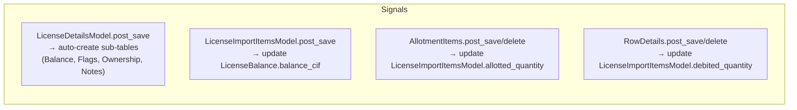

# 05 — Database

## Database: PostgreSQL

Driver: `psycopg` (v3, native async). All models inherit from abstract `AuditModel`.

---

## Abstract Base Model

All concrete models (except User) inherit:

```python
class AuditModel(models.Model):
    created_on   = models.DateTimeField(auto_now_add=True)
    modified_on  = models.DateTimeField(auto_now=True)
    created_by   = models.ForeignKey(User, null=True, on_delete=SET_NULL, related_name=...)
    modified_by  = models.ForeignKey(User, null=True, on_delete=SET_NULL, related_name=...)
```

`created_by` / `modified_by` are auto-populated from a thread-local context set in middleware — no explicit passing needed.

---

## Schema: `accounts` app

### `accounts_user`
| Column | Type | Notes |
|---|---|---|
| id | int PK | |
| username | varchar(150) UNIQUE | Login identifier |
| email | varchar(255) UNIQUE nullable | |
| password | varchar | Hashed (PBKDF2) |
| first_name | varchar(30) | |
| last_name | varchar(150) | |
| is_staff | bool | Django admin access |
| is_active | bool | Account enabled |
| is_superuser | bool | Bypass all permissions |
| date_joined | datetime | |
| avatar | image path | optional |

Roles are Django **Groups** — stored in `auth_group` + `accounts_user_groups` M2M.

---

## Schema: `core` app

### `core_companymodel`
| Column | Type | Notes |
|---|---|---|
| id | int PK | |
| name | varchar | Company display name |
| iec | varchar | IEC number |
| pan | varchar | PAN |
| gst | varchar | GST number |
| address_line_1/2 | varchar | Postal address |
| email | varchar | |
| phone | varchar | |
| bank_name / account_number / ifsc | varchar | Banking details |
| logo / signature / stamp | image | For transfer letters |
| *audit fields* | | |

### `core_portmodel`
| Column | Type | Notes |
|---|---|---|
| code | varchar UNIQUE | e.g. `INNSA1` |
| name | varchar | e.g. `NHAVA SHEVA SEA` |

### `core_hscodemodel`
| Column | Type | Notes |
|---|---|---|
| hs_code | varchar UNIQUE | 8-digit HS code |
| description | text | Product description |
| duty_rate | decimal | |
| unit | varchar | e.g. kg, MT |

### `core_sionnormclassmodel`
| Column | Type | Notes |
|---|---|---|
| norm_class | varchar UNIQUE | e.g. `E1`, `E126`, `E132` |
| description | text | |
| is_active | bool | |

### `core_sionexportmodel` / `core_sionimportmodel`
Export and import sub-items linked to a SionNormClass.

### `core_exchangeratemodel`
| Column | Type | Notes |
|---|---|---|
| currency | varchar | `USD`, `EUR`, `GBP`, `CNY` |
| rate | decimal | INR per 1 foreign unit |
| date | date | Effective date |

### `core_activitylog`
| Column | Type | Notes |
|---|---|---|
| user | FK User nullable | |
| timestamp | datetime | |
| method | varchar | GET, POST, etc. |
| path | varchar | |
| status_code | int | |
| ip_address | varchar | |
| user_agent | text | |
| response_time_ms | int | |
| request_body | text | Truncated |

### `core_celerytasktracker`
Tracks running Celery task IDs with status and result metadata.

---

## Schema: `license` app

### `license_licensedetailsmodel` (main table)
| Column | Type | Notes |
|---|---|---|
| id | int PK | |
| license_number | varchar UNIQUE | e.g. `16/LIC/000001/AM24` |
| license_type | varchar | `DFIA`, `INCENTIVE` |
| license_date | date | Issue date |
| license_expiry_date | date | Typically license_date + 1 year |
| registration_number | varchar | DGFT file number |
| registration_date | date | |
| file_number | varchar | Internal file ref |
| notification_number | FK | |
| scheme_code | FK | |
| exporter | FK Company | License holder |
| port | FK Port | Import port |
| product_name | varchar | Export product description |
| sion_norm | FK SionNormClass | |
| purchase_status | FK PurchaseStatus | |
| condition_type | varchar | Restriction type |
| *audit fields* | | |

### `license_licenseimportitemsmodel` (balance-tracked items)
| Column | Type | Notes |
|---|---|---|
| license | FK LicenseDetailsModel | |
| sr_number | varchar | Serial number |
| product_description | varchar | |
| hs_code | FK HSCode | |
| cif_value | decimal | Authorised CIF in USD |
| available_quantity | decimal | Remaining balance |
| debited_quantity | decimal | Used in BOEs |
| allotted_quantity | decimal | Reserved in allotments |
| condition_type | varchar | Restriction |

### `license_licenseexportitemsmodel`
Export entitlement items per license (product, quantity, FOB value).

### `license_licensebalance` (OneToOne)
| Column | Type | Notes |
|---|---|---|
| license | OneToOne | |
| balance_cif | decimal | Materialised total CIF balance |
| ledger_date | date | Last ledger upload date |

### `license_licenseflags` (OneToOne)
| Column | Type | Notes |
|---|---|---|
| license | OneToOne | |
| is_active | bool | Manually set |
| is_expired | bool | Computed from expiry date |
| is_null | bool | No import entitlement |
| is_mnm | bool | Min/max variant |
| is_audit | bool | Under audit |
| is_fetch | bool | Ownership fetch done |

### `license_licenseownership` (OneToOne)
| Column | Type | Notes |
|---|---|---|
| license | OneToOne | |
| current_owner | FK Company | Current holder |
| file_transfer_status | varchar | |
| last_ownership_fetch | datetime | |

### `license_licensenotes` (OneToOne)
| Column | Type | Notes |
|---|---|---|
| license | OneToOne | |
| user_comment | text | Free-form notes |
| condition_sheet | text | Condition/restriction text |
| balance_report_notes | text | Notes shown on balance PDF |

### `license_licensedocumentmodel`
Attached files (license copy, transfer letter PDFs) per license.

### `license_licensetransfermodel`
Transfer history with from_company, to_company, transfer_date, document reference.

### `license_incentivelicense`
| Column | Type | Notes |
|---|---|---|
| license_number | varchar UNIQUE | |
| license_type | varchar | RODTEP/ROSTL/MEIS |
| license_date | date | |
| license_expiry_date | date | license_date + 2 years |
| value_inr | decimal | Face value |
| available_balance | decimal | Remaining |
| *plus standard fields* | | |

---

## Schema: `bill_of_entry` app

### `bill_of_entry_billofentrymodel`
| Column | Type | Notes |
|---|---|---|
| bill_of_entry_number | varchar | BOE number |
| bill_of_entry_date | date | |
| company | FK Company | Importer |
| port | FK Port | |
| exchange_rate | decimal | USD/INR on clearance date |
| product_name | varchar | |
| invoice_no | varchar | Commercial invoice |
| invoice_date | date | |
| allotment | FK Allotment nullable | Linked allotment |

### `bill_of_entry_rowdetails`
| Column | Type | Notes |
|---|---|---|
| boe | FK BillOfEntryModel | |
| import_item | FK LicenseImportItemsModel | |
| sr_number | varchar | |
| transaction_type | varchar | BOE / LEDGER_UPLOAD |
| cif_inr | decimal | CIF in INR |
| cif_fc | decimal | CIF in foreign currency |
| qty | decimal | Quantity |
| frozen | bool | True = from ledger upload; cannot edit |
| is_dispute | bool | True = no matching license item found |

---

## Schema: `allotment` app

### `allotment_allotmentmodel`
| Column | Type | Notes |
|---|---|---|
| type | varchar | `AT` (allotment) / `TR` (transfer) |
| company | FK Company | |
| port | FK Port | |
| item_name | varchar | |
| required_quantity | decimal | |
| unit_value_per_unit | decimal | |
| cif_fc | decimal | CIF in foreign currency |
| cif_inr | decimal | CIF in INR |
| exchange_rate | decimal | |
| invoice | varchar | |
| bl_detail | varchar | BL reference |
| is_boe | bool | BOE created flag |
| is_approved | bool | Approval flag |
| estimated_arrival_date | date | |

### `allotment_allotmentitems`
| Column | Type | Notes |
|---|---|---|
| allotment | FK AllotmentModel | |
| import_item | FK LicenseImportItemsModel | |
| required_quantity | decimal | Amount reserved |

---

## Schema: `trade` app

### `trade_licensetrade`
| Column | Type | Notes |
|---|---|---|
| direction | varchar | `PURCHASE` / `SALE` |
| license_type | varchar | `DFIA` / incentive type |
| from_company | FK Company nullable | |
| to_company | FK Company nullable | |
| boe | FK BillOfEntryModel nullable | |
| incentive_license | FK IncentiveLicense nullable | |
| invoice_number | varchar AUTO | Auto-generated per FY |
| invoice_date | date | |
| remarks | text | |
| linked_trade | FK self nullable | Paired purchase/sale |
| total_amount_inr | decimal | Computed |
| purchase_invoice_copy | file | |

### `trade_licensetradelineitem`
| Column | Type | Notes |
|---|---|---|
| trade | FK LicenseTrade | |
| sr_number | FK LicenseImportItemsModel nullable | |
| description | varchar | |
| hsn_code | varchar | |
| mode | varchar | `QTY` / `CIF_INR` / `FOB_INR` |
| qty_kg | decimal | |
| rate_inr_per_kg | decimal | |
| cif_fc | decimal | |
| cif_inr | decimal | |
| fob_inr | decimal | |
| pct | decimal | % for CIF/FOB modes |
| exc_rate | decimal | Exchange rate |
| amount_inr | decimal | Computed line total |

### `trade_incentivetradelineitem`
| Column | Type | Notes |
|---|---|---|
| trade | FK LicenseTrade | |
| incentive_license | FK IncentiveLicense | |
| license_value | decimal | Face value used |
| rate_pct | decimal | Discount rate % |
| amount_inr | decimal | license_value × rate_pct / 100 |

### `trade_licensetradepaymment`
Payment records with date, amount, reference.

---

## Schema: `tasks` app

### `tasks_task`
| Column | Type | Notes |
|---|---|---|
| title | varchar | |
| description | text | |
| status | varchar | pending/in_progress/completed/rejected |
| priority | varchar | low/normal/high |
| assigned_to | FK User nullable | |
| created_by | FK User | |
| due_date | date nullable | |
| completed_by | FK User nullable | |
| completed_at | datetime nullable | |
| rejected_by | FK User nullable | |
| rejected_at | datetime nullable | |
| rejection_reason | text | |

### `tasks_taskremark`
| Column | Type | Notes |
|---|---|---|
| task | FK Task | |
| author | FK User | |
| content | text | |
| created_at | datetime | |

---

## Key Database Signals



All balance fields are materialised — maintained by signals, not computed on read. This makes listing endpoints fast but requires signal integrity.

---

## Indexes and Performance Notes

- `license_number` unique index on `LicenseDetailsModel`
- `bill_of_entry_number` on `BillOfEntryModel`
- `hs_code` on `HSCodeModel`
- `norm_class` on `SionNormClassModel`
- Composite indexes on high-volume filter columns (company + date ranges) added in 2026 DB optimisation pass
- Nullable FK columns use `SET_NULL` on delete
