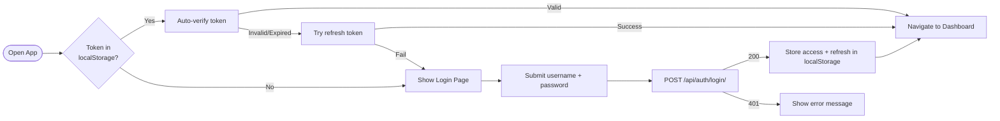
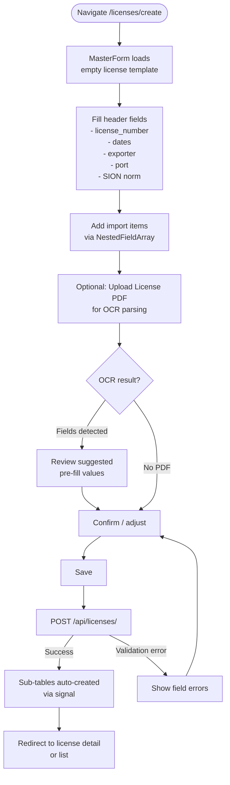
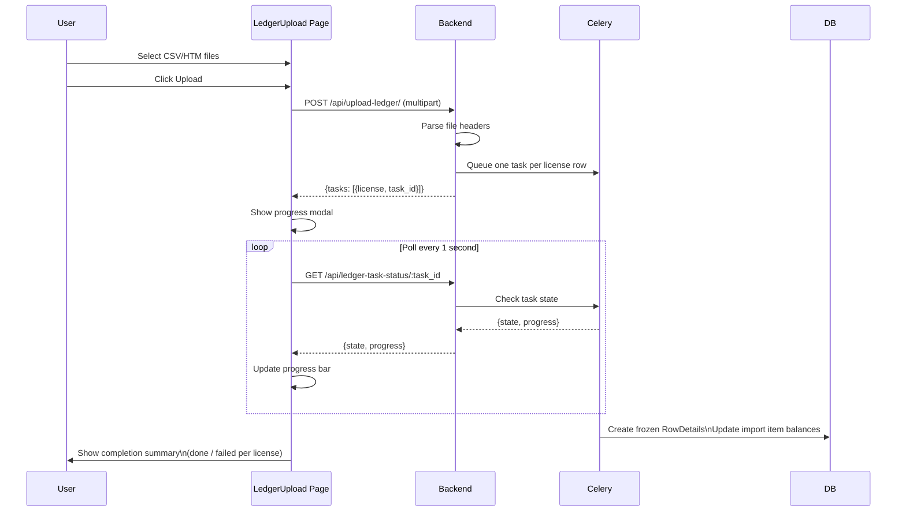
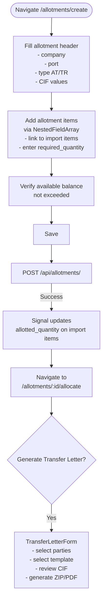
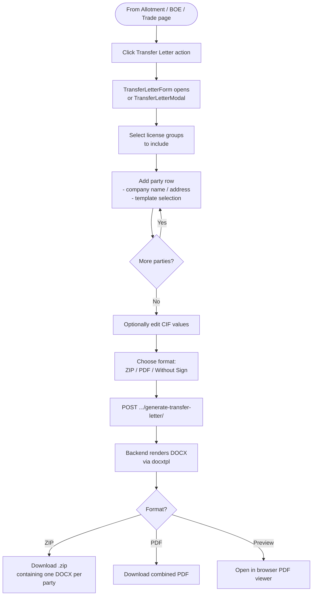
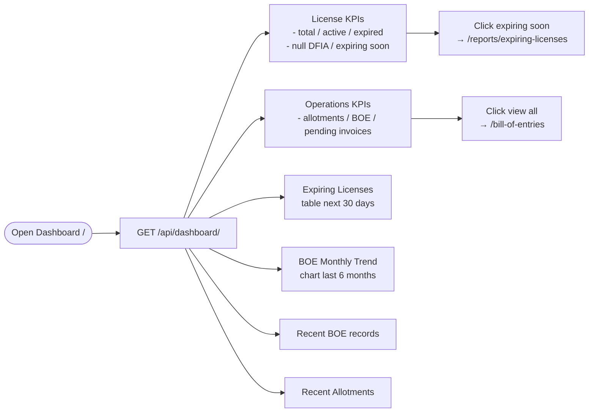
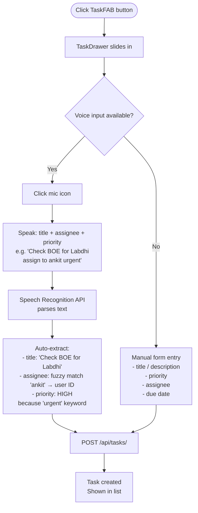
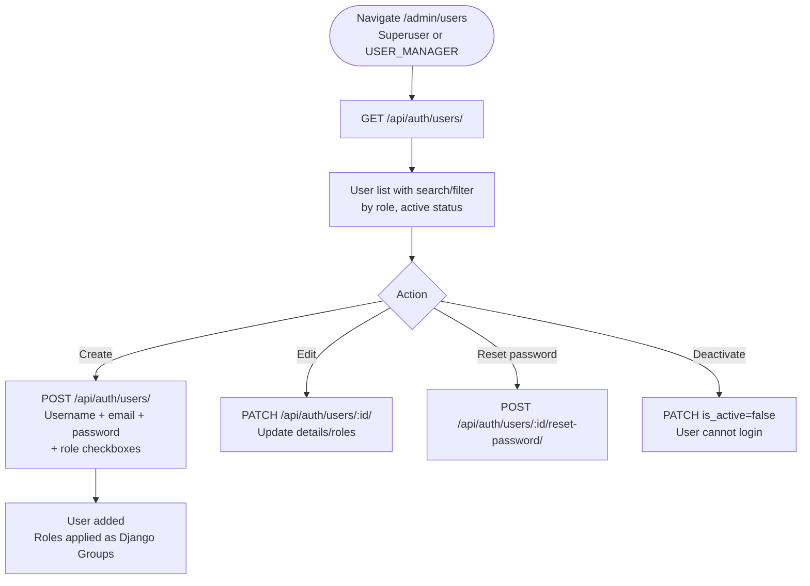
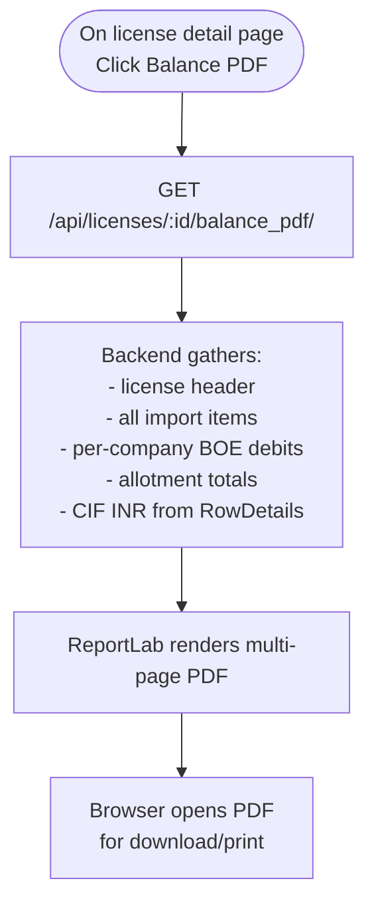
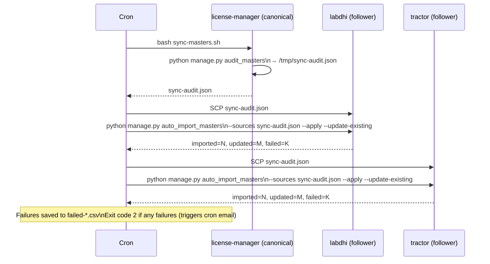

# 07 — User Flows

---

## UF-01: Login



**Session Management**:
- Access token refreshed proactively 5 min before expiry
- After 30 min idle → auto-logout to `/login?reason=idle`
- After session expiry → `/login?reason=session_expired`

---

## UF-02: Create a New DFIA License



---

## UF-03: Upload Government Ledger File (Async)



---

## UF-04: Create an Allotment



---

## UF-05: Generate a Transfer Letter



---

## UF-06: License Ledger Review

```mermaid
graph TD
    A([Navigate /license-ledger]) --> B[Select company\nfrom async dropdown]
    B --> C[Optionally filter:\n- license type\n- date range\n- ordering]
    C --> D[GET /api/license-ledger/\n?company=ID&purchase_date_from=...&...]
    D --> E[Display ledger grouped\nby license]
    E --> F{Drill down?}
    F -->|Click license| G[Navigate to\n/license-ledger/:id\n?license_type=DFIA]
    G --> H[LicenseLedgerDetail\nshows transaction-by-transaction\nwith running balance]
    H --> I{Export?}
    I -->|PDF| J[generatePDF()]
    I -->|Excel| K[generateExcel()]
    F -->|No| L[View summary table]
```

---

## UF-07: Dashboard Situational Awareness



---

## UF-08: Task Management via Voice



---

## UF-09: User & Role Management



---

## UF-10: BOE Balance PDF Generation



---

## UF-11: Master Data Sync Between Servers


