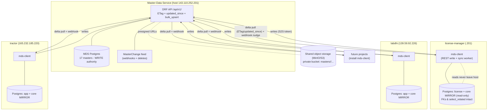

# ADR-001: Central Master-Data Service

**Status:** Proposed
**Date:** 2026-07-03
**Deciders:** (human owner) + solutions-architect
**Supersedes:** the one-way additive `scripts/maintenance/sync-masters.sh` script (license-manager -> labdhi + tractor)
**Owner-agents referenced:** `data-engineer`, `backend-engineer`, `devops-sre`, `frontend-engineer`, `qa-test-engineer`, `code-reviewer`, `security-auditor`

> Direction is already decided: **central service**, not multi-master. This ADR designs the central-service option well; it does not re-litigate the choice.

---

## 1. Context

The 17 master/reference models live in `backend/apps/core/models.py`:

`CompanyModel` (85), `PortModel` (148), `ItemHeadModel` (160), `ItemGroupModel` (195), `ItemNameModel` (206), `HSCodeModel` (242), `HeadSIONNormsModel` (264), `SionNormClassModel` (271), `SIONExportModel` (284), `SIONImportModel` (299), `SionNormNote` (321), `SionNormCondition` (336), `ProductDescriptionModel` (351), `UnitPriceModel` (370), `SchemeCode` (420), `NotificationNumber` (428), `ExchangeRateModel` (451).

Key facts established from the code index and source (not assumed):

- **Natural keys already exist** for almost every master (confirmed at the line numbers above): `CompanyModel.iec` (unique), `PortModel.code` (unique) + `unique_together('name','code')`, `ItemHeadModel/ItemGroupModel/ItemNameModel.name` (unique), `HSCodeModel.hs_code` (unique), `SionNormClassModel.norm_class` (unique), `SchemeCode.code` (unique), `NotificationNumber.code` (unique), `ExchangeRateModel.date` (unique). `MASTER_MODELS` in `backend/apps/core/management/commands/audit_masters.py:41` already codifies model->business-key mapping and already exports `<fk>__<business_key>` for FK resolution across servers. **This is the single most important asset for this migration** — a natural-key contract already exists and is battle-tested by the current sync.
- **Some masters have no natural key and no timestamps:** `HeadSIONNormsModel`, `SIONExportModel`, `SIONImportModel` do not extend `AuditModel` (no `created_on`/`modified_on`); `SionNormNote`, `SionNormCondition`, `ProductDescriptionModel`, `TransferLetterModel`, `UnitPriceModel` are marked `None`/composite in `MASTER_MODELS`. These need synthetic stable keys before they can participate in a keyed sync.
- **PKs are integer BigAutoField** (`DEFAULT_AUTO_FIELD=BigAutoField`) and **have diverged across the 3 servers** under additive one-way sync — the same company has different `id` on license-manager vs labdhi vs tractor. So **cross-server FK-by-id is already meaningless**; only natural keys are portable. This kills FK-by-id designs and hard-favors the mirror approach.
- **Cross-DB relations from `apps/license` into masters (the crux)** — confirmed in `backend/apps/license/models.py`:

  | # | Field | Target master | Line | `on_delete` |
  |---|-------|---------------|------|-------------|
  | 1 | `LicenseDetailsModel.scheme_code` | SchemeCode | 98 | PROTECT |
  | 2 | `LicenseDetailsModel.notification_number` | NotificationNumber | 105 | PROTECT |
  | 3 | `LicenseDetailsModel.exporter` | CompanyModel | 118 | SET_NULL |
  | 4 | `LicenseDetailsModel.port` | PortModel | 127 | CASCADE |
  | 5 | `LicenseExportItemModel.item` | ItemNameModel | 842 | CASCADE |
  | 6 | `LicenseExportItemModel.norm_class` | SionNormClassModel | 844 | CASCADE |
  | 7 | `LicenseImportItemsModel.hs_code` | HSCodeModel | 885 | CASCADE |
  | 8 | `LicenseImportItemsModel.items` (**M2M**) | ItemNameModel | 887 | — (through-table `license_import_item`) |
  | 9 | `LicenseTransferModel.from_company` / `to_company` | CompanyModel | 1398 / 1400 | SET_NULL |
  | 10 | `IncentiveLicense.exporter` / `port_code` | CompanyModel / PortModel | 1475 / 1476 | CASCADE |
  | 11 | `ItemUtilizationPlan.item_name` / `Invoice.purchasing_entity` / `Invoice.supplier` | ItemNameModel / CompanyModel | 1184 / 1609 / 1611 | SET_NULL |

- **`select_related`/`prefetch_related` on masters is pervasive and hot** — `views/item_pivot_report.py`, `views/active_licenses_report.py:84` (`'exporter','port'`), `views/expiring_licenses_report.py:75`, `views_incentive.py:39` (`'exporter','port_code'`), `views/license_items.py:29` (`'license','hs_code'`), `views/item_report.py`, `ledger_pdf.py`, `views_actions.py:471/503`. **Any design that turns these joins into per-row REST calls will regress the heaviest reports into N+1 network calls.** This alone dictates the FK strategy.
- **Media fields** (local filesystem today — `lmanagement/settings.py:168-169` `MEDIA_URL=/media/`, `MEDIA_ROOT=BASE_DIR/media`, no `django-storages`): `CompanyModel.logo/signature/stamp` (111-113), `UnitPriceModel.logo/signature/stamp` (403/413/414), `TransferLetterModel.tl` FileField (361). Media is greenfield for object storage — no existing storages config to unwind.
- Stack: Django 6.0.4, DRF 3.17, Python 3.14, Postgres 16, django-redis, Celery. CI at `.github/workflows/ci.yml`.
- Existing sync: `scripts/maintenance/sync-masters.sh` runs `audit_masters` on the source (`143.110.252.201`) and additively imports new rows into followers labdhi (`139.59.92.226`) and tractor (`165.232.185.220`). Additive-only, so followers have diverged and drift is one-way.

---

## 2. Decision (summary)

Build a **standalone Django/DRF Master-Data Service (MDS)** with its own repo and Postgres DB, hosted on the current source host (`143.110.252.201`). It is the **sole write authority** for all 17 masters. Each consuming project keeps a **local, read-only synced mirror** of the master tables in its *own* Postgres DB (decision 2, option **c**), so **existing Django FKs, `select_related`, joins, and hot reports keep working unchanged**. The mirror is kept fresh by a thin pip-installable client that pulls deltas over an **ETag/`updated_since` REST API** (webhook-nudged, polling-backstopped). Media moves to **shared S3-compatible object storage** referenced identically by all projects. Existing diverged data is **reconciled into one authoritative dataset by `data-engineer` before any cutover**.

This is the lowest-blast-radius design: the license app's models and queries do not change shape; only *where masters are written* and *how the local copy is refreshed* change.

---

## 3. Numbered decisions

### Decision 1 — Service shape & topology: **standalone Django/DRF service, own repo + own DB**

**Chosen:** A separate `master-data-service` repo/project with its own Postgres database, DRF API, and admin. Not a bounded app inside the monolith.

**Why standalone over bounded-app-in-monolith:**
- Multiple projects and future projects must depend on it without depending on the whole license-manager monolith. A bounded app in the monolith cannot be a dependency for *other* codebases without dragging license/allotment/trade along.
- Independent deploy cadence: masters change on a different rhythm than license logic; coupling their release trains is exactly what we're trying to end.
- Clear ownership boundary and blast radius. Today `apps/core/models.py` is a load-bearing wall imported by license, allotment, bill_of_entry, trade. Extracting it into a service with a contract shrinks that wall's blast radius over time (Principle: make load-bearing files smaller in blast radius, not bigger).

**Trade-off:** a new deployable to run, monitor, back up, and secure (owned by `devops-sre`). Accepted — it's the cost of a real service boundary. The mitigation is that the *consuming* side barely changes (mirror keeps FKs local), so the risk concentrates in one new, well-scoped component.

**Topology:**
- MDS runs on the current canonical source host `143.110.252.201` (already the source of truth for `scripts/maintenance/sync-masters.sh`), behind nginx + TLS, reachable at `https://masters.<internal-domain>`.
- The 3 existing servers (license-manager @ .201, labdhi @ 139.59.92.226, tractor @ 165.232.185.220) and future projects reach MDS over HTTPS with **service-to-service tokens**.
- Each consuming project keeps its **local mirror** in its own DB; MDS is reached only for **writes** and **delta pulls**, never on the hot read path.

### Decision 2 — The 11 cross-DB FKs: **option (c), local synced read-mirror** (reject 2a and 2b)

**Chosen:** Each consuming project keeps a **read-only local mirror** of the master tables inside its own Postgres DB. The existing `core` models stay as Django models in the consumer (managed as mirror tables), so `ForeignKey`, `select_related`, M2M through-tables, and joins **continue to work with zero query rewrites**. The mirror is a materialized copy refreshed from MDS; the consumer never writes to it.

**Why (c) over (a) `db_constraint=False` + app-level integrity:** (a) requires a *physically separate DB* for masters on the consumer side, which is exactly what makes `select_related('exporter','port')` in `active_licenses_report.py:84`, `item_pivot_report.py`, `ledger_pdf.py`, etc. **impossible** — Postgres cannot join across databases and Django cannot `select_related` across a router boundary. Every one of those hot reports would degrade to N+1 REST fetches. Rejected on performance grounds.

**Why (c) over (b) denormalize to natural keys/codes:** (b) means dropping the FK objects and storing `exporter_iec`, `port_code`, `hs_code` strings on license rows, then resolving them via the client. This is a **massive, irreversible schema change across 11 relations + an M2M**, breaks every `select_related`/admin/serializer/report that traverses these FKs, and loses referential display (e.g. `exporter.name`, `exporter.logo`) without extra joins. Highest blast radius, least reversible. Rejected.

**Why (c) wins:** the mirror keeps masters *in the same physical database as the license data*, so **integer FKs, joins, and `select_related` are untouched**. The consumer's `apps/core` models become mirror tables; writes are redirected to MDS; reads stay local and fast. The change is *operational* (how the table is populated) not *structural* (the schema and queries stay identical). Lowest blast radius, reversible (flip the mirror back to writable to roll back).

**Consequence / the one hard constraint:** mirror rows must carry a **stable, cross-server-consistent PK** so that license FK ids remain valid after cutover. Because the 3 servers' integer PKs have diverged, we **cannot** simply copy ids. Two sub-options for the mirror PK, decided in rollout Phase 0:
- **Preferred:** MDS assigns a canonical id per master row during consolidation; the consolidation step (Decision 6) **remaps each consumer's local FK ids** to the canonical ids in one transactional migration. After that, every server shares one id-space and the mirror is a straight copy.
- Keep the local integer PK but add a `remote_uid` (UUID/natural-key) column on each mirror table and sync by `remote_uid`; FKs stay on local id. Slightly more moving parts; kept as fallback.

Either way the **natural keys in `audit_masters.MASTER_MODELS` are the join contract** for the mirror upsert. The masters without natural keys (`HeadSIONNormsModel`, `SIONExportModel`, `SIONImportModel`, `SionNormNote`, `SionNormCondition`, `ProductDescriptionModel`, `UnitPriceModel`) get a synthetic stable key (a deterministic hash of their content + parent business key, or a UUID assigned at consolidation) — a prerequisite task for `data-engineer` in Phase 0.

**Impact on the hot reports:** none, by design. `select_related('exporter','port')`, the pivot report's nested `prefetch_related`, `ledger_pdf` joins, and `views_incentive.select_related('exporter','port_code')` all keep running as local SQL joins against mirror tables. This is the explicit reason (c) was chosen.

### Decision 3 — Consuming-project client: **thin pip-installable Django app = REST client + mirror sync + graceful degradation**

**Chosen:** publish an internal pip package `mds-client` (a small Django app) that every project installs. It provides:
- **Write path:** a thin REST client (`create/update/delete` master -> MDS). Master writes in the consumer are routed here (admin/API save hooks call the client instead of writing the mirror directly). On MDS unreachable: **writes fail loudly** with a clear, user-facing error ("Master data is read-only right now — the central service is unreachable"); optionally enqueue to a Celery outbox for retry where eventual consistency is acceptable (e.g. exchange-rate ingestion). Never silently drop a write.
- **Read path:** reads hit the **local mirror** — so reads always work, even when MDS is down (graceful degradation is automatic because reads never touch MDS).
- **Sync worker:** a Celery beat task that pulls deltas via `GET /api/v1/<master>/?updated_since=<cursor>` with `If-None-Match`/ETag; **webhook-nudged** (MDS posts a lightweight "masters changed" ping to each subscriber to trigger an immediate pull) with **polling as the backstop** (e.g. every 5 min) so a missed webhook self-heals. Upserts into the mirror by natural key (or `remote_uid`), inside a transaction, advancing a per-model sync cursor.

**Why a shared Django app over ad-hoc REST calls per project:** one implementation of auth, retry/backoff, ETag handling, cursor management, and mirror-upsert logic — versioned and tested once. Prevents each project reinventing (and mis-implementing) the degradation semantics. Reuses the existing natural-key export logic already proven in `audit_masters.py`.

**Trade-off:** a shared library is itself a dependency to version and roll out across projects. Mitigated by semantic versioning and by the mirror being tolerant of the client being slightly behind (stale-but-serving reads are acceptable for reference data).

**Degradation contract (explicit):** reads = always available (local mirror, possibly stale). Writes = require MDS; fail clearly or queue. Staleness bound = polling interval (default 5 min) worst case; webhook = seconds typical.

### Decision 4 — API design

- **Versioning:** URL-path versioned, `/api/v1/`. Additive changes within v1; breaking changes -> `/api/v2/` with an overlap window.
- **Auth:** service-to-service **bearer tokens** (per-consumer token, scoped read vs read-write), rotated by `devops-sre`. No end-user auth on MDS — it's a backend peer, not user-facing. `security-auditor` reviews token scoping and transport (TLS-only, no tokens in query strings).
- **Pagination:** cursor pagination (keyed on `modified_on`,`id`) — stable under concurrent writes, unlike offset pagination, and aligns with the `updated_since` delta cursor.
- **Filtering:** `?updated_since=<iso8601>` (the delta driver), plus natural-key lookups (`?iec=`, `?code=`, `?hs_code=`) and `is_active` where present (`ItemNameModel.is_active` is used in `item_pivot_report.py:161`).
- **Conditional GET / ETags:** each collection endpoint returns an `ETag` derived from `max(modified_on)` + row count for that model; clients send `If-None-Match` and get `304 Not Modified` when nothing changed — cheap refresh polling. Per-model "high-water mark" endpoint `GET /api/v1/<master>/_meta` returns `{max_modified, count, etag}` so the sync worker can skip untouched models in one tiny request.
- **Bulk endpoints:** `POST /api/v1/<master>/bulk_upsert` (natural-key keyed) for consolidation and for the initial mirror hydration — avoids row-by-row hydration of large tables (HSCode, ItemName can be large).
- **Timestamps gap:** the timestamp-less masters must gain `modified_on` (or be served via a change-log table) before they can support `updated_since`. Prerequisite for `data-engineer`/`backend-engineer` in Phase 1.
- **Change feed (recommended):** an append-only `MasterChange` log (model, natural_key, op, at) that powers both webhooks and exact deletes — deletes are otherwise invisible to an `updated_since` pull. **Deletes are the classic sync gap; the change feed is how we close it.**

### Decision 5 — Media: **shared S3-compatible object storage via django-storages**

- **Storage:** MinIO (self-hosted, S3-API) or AWS S3 — a single bucket reachable by all servers/projects. Recommend **MinIO** first (no new vendor, runs on existing infra, S3-compatible so a later swap to S3 is config-only). New dependency `django-storages[s3]` + `boto3` — justified: it's the standard, boring choice and the only way multiple hosts can reference the same files.
- **Bucket layout:** `masters/company/<iec>/{logo,signature,stamp}.<ext>`, `masters/unit-price/<key>/{logo,signature,stamp}.<ext>`, `masters/transfer-letter/<key>/tl.<ext>`. Keyed by **natural key**, not integer id, so keys are stable across the id remap in Decision 2.
- **Reference model:** MDS stores objects and serves either the object key or a short-lived pre-signed URL via the API. Consumers store the same key on their mirror rows; the `ImageField/FileField` `upload_to` targets are re-pointed at the shared storage. All hosts read the identical object.
- **Migration of existing files:** `devops-sre` + `data-engineer` copy current `MEDIA_ROOT/media` trees from all 3 servers into the bucket, de-duplicating by content hash (the same logo exists 3x), and rewrite the DB field values to the canonical keys as part of consolidation (Decision 6). Keep the old local files read-only until verified.
- **Trade-off:** pre-signed URLs add latency/complexity vs a plain path; acceptable and cache-friendly. Public-read bucket is simpler but leaks company signatures/stamps — **must be private** (`security-auditor` gate).

### Decision 6 — Data consolidation FIRST (blocking prerequisite; owner: `data-engineer`)

The 3 servers diverged under additive-only sync (records added on followers were never pulled back; the same entity has different ids). Before any cutover we must produce **one authoritative dataset**. Reuse the existing tooling as the backbone: `audit_masters` already snapshots every master with business keys and content hashes (`_hash_record`, `audit_masters.py:106`).

`data-engineer` deliverables (specify, don't implement here):
1. **Three-way audit diff:** run `audit_masters` on .201, labdhi, tractor; build a reconciliation report per model: rows unique to each server, natural-key collisions with conflicting content (same `iec`/`code` but different fields), and rows with no natural key.
2. **Dedup & conflict rules:** for natural-key duplicates, define the winner (newest `modified_on` where available; manual review where content conflicts and no timestamp exists — the timestamp-less models). Produce a signed-off "golden" set.
3. **Synthetic keys** for the keyless models (`HeadSIONNormsModel`, `SIONExportModel`, `SIONImportModel`, `SionNormNote`, `SionNormCondition`, `ProductDescriptionModel`, `UnitPriceModel`) so they can sync and get stable object-storage keys.
4. **Canonical id assignment + FK remap plan:** assign canonical ids in MDS; produce, per consumer, an id-remap map and a transactional migration that rewrites the 11 FK columns + the `items` M2M through-table (`license_import_item`) to canonical ids. This is the riskiest data step — needs full backup + dry-run + row-count reconciliation.
5. **Media consolidation:** content-hash dedup of the media trees, mapping to canonical natural-key object keys (feeds Decision 5).

Gate: consolidation is **not** cutover. It produces the golden dataset and the remap; MDS is loaded from the golden set; only then do mirrors get hydrated.

### Decision 7 — Rollout: smallest safe, independently shippable, lowest-risk-first, each behind CI

See the staged plan in section 5. Principle: nothing user-facing changes until the mirror is proven to serve reads identically to today, and the cutover is a **config flip** (writes: local -> MDS) that can be reversed by flipping back.

---

## 4. Target topology (Mermaid)

---

## 5. Staged rollout plan

Each phase is independently shippable and CI-gated (`.github/workflows/ci.yml`). Lowest risk first; user-facing behavior unchanged until Phase 6.

| Phase | Goal | Files / areas | Owner-agent | Blast radius | Gate | Risk |
|------|------|---------------|-------------|--------------|------|------|
| **0. Consolidate** | One golden master dataset + FK-remap map + synthetic keys + media dedup map. No prod change. | `audit_masters.py` (reuse), new reconciliation scripts, DB backups of all 3 servers | **data-engineer** | Read-only analysis; write only to a staging copy | Signed-off golden set; row-count + hash reconciliation report; full backups verified | Low (no prod writes); high *importance* — everything downstream depends on it |
| **1. Add change-tracking to masters** | Give the timestamp-less masters `modified_on`; add `MasterChange` feed. Ships to monolith harmlessly. | `apps/core/models.py` (add fields/log), migrations | **backend-engineer** | Additive migration on `core` (load-bearing — verify allotment/bill_of_entry/trade unaffected via `dependents.tsv`) | Migrations reversible; existing tests green; `select_related` unaffected | Low-med (touches the load-bearing `core` models — additive only) |
| **2. Stand up MDS (empty)** | New repo, DRF API (v1, ETag, `updated_since`, bulk_upsert, tokens), MDS Postgres, admin. Load golden set from Phase 0. | new `master-data-service` repo | **backend-engineer** + **devops-sre** | Isolated new service; zero consumer impact | MDS CI green; API contract tests; loaded row counts == golden set | Low (nothing consumes it yet) |
| **3. Media to object storage** | Stand up MinIO/S3; migrate + dedup media; MDS serves keys/presigned URLs. | `django-storages` config in MDS; media migration scripts | **devops-sre** + **data-engineer** | New infra; consumers still use local media | Private-bucket verified (**security-auditor**); every existing file resolves; checksum match | Med (data movement) — old files kept read-only as fallback |
| **4. `mds-client` package + shadow sync** | Publish client; run **read-only mirror sync in shadow mode** on all consumers — populate a *parallel* mirror, diff against live `core` tables. No writes redirected yet. | new `mds-client` pkg; Celery beat task in consumers | **backend-engineer** | Additive; live `core` still authoritative | Shadow mirror matches live `core` (zero diff) for N days; hot reports (`item_pivot_report`, `active_licenses_report`, `ledger_pdf`) byte-identical against mirror vs live | Med — this is where drift/sync bugs surface *before* they matter |
| **5. FK remap + mirror becomes read source** | Apply canonical-id remap (Phase 0 map) in one transaction per consumer; point `core` tables at the mirror; reads served from mirror. | consumer migration rewriting 11 FKs + `license_import_item` M2M | **data-engineer** (remap) + **backend-engineer** | **High** — rewrites FK ids across license tables; the crux migration | Dry-run on staging clone; per-table row + FK-integrity reconciliation; instant rollback = restore backup | **Highest** — full backup, maintenance window, staged one server at a time (labdhi first, .201 last) |
| **6. Cutover writes to MDS** | Flip a feature flag: master writes go through `mds-client` -> MDS; local mirror read-only. Retire `scripts/maintenance/sync-masters.sh`. | consumer admin/API save hooks; flag; cron removal | **backend-engineer** + **devops-sre** | Med — changes *where* masters are written | Write flows E2E; degradation test (MDS down -> clear error, reads still work); **reverse = flip flag back** | Med — reversible by flag; do labdhi -> tractor -> .201 |
| **7. Decommission & harden** | Remove dual-write scaffolding, finalize monitoring/alerts on sync lag + MDS health, docs. | ops dashboards, `docs/` | **devops-sre** + **technical-writer** | Low | Sync-lag alerting live; runbook exists | Low |

**Reversible cutover / fallback:** Phase 5 is protected by full backups and staged rollout (one server at a time). Phase 6 is a **feature flag** — writes revert to local + `scripts/maintenance/sync-masters.sh` can be re-enabled if MDS misbehaves. The mirror serving reads is safe to keep even if writes roll back (it's just a fresher copy of what sync produced).

---

## 6. Risks & mitigations

| Risk | Severity | Mitigation |
|------|----------|-----------|
| **FK-id remap corrupts license data** (Phase 5) | Critical | Full backup; dry-run on staging clone; transactional per-server; row + FK-integrity reconciliation before commit; one server at a time; restore = rollback |
| **Deletes don't propagate** (`updated_since` can't see deletes) | High | `MasterChange` feed carries deletes; mirror applies tombstones; periodic full-audit reconciliation via `audit_masters` as backstop |
| **Sync drift** (mirror silently diverges) | High | Shadow mode (Phase 4) proves zero-diff before cutover; ETag/high-water-mark reconciliation each sync; scheduled full audit + alert on mismatch |
| **MDS is a new SPOF** | Med | Reads never depend on MDS (local mirror); only writes do; MDS health alerting; short RTO backups |
| **Timestamp-less masters can't do delta sync** | Med | Phase 1 adds `modified_on` + change feed before they're synced |
| **Hot reports regress** | Med | Design explicitly keeps them as local joins (Decision 2c); Phase 4 gate requires byte-identical report output mirror-vs-live |
| **Company signatures/stamps leak via public bucket** | High | Private bucket + presigned URLs; `security-auditor` gate in Phase 3 |
| **New deps (django-storages, boto3, mds-client)** | Low | All boring/standard; justified; pinned + CI-tested |

---

## 7. Open questions (need the human's input)

1. **Object storage:** self-hosted **MinIO** on the .201 host, or managed **AWS S3**? (Recommend MinIO first — no new vendor, S3-compatible for later swap.)
2. **Write ownership per master:** are *all* masters centrally written, or do some stay project-local (e.g. does `ExchangeRateModel` ingestion run centrally, or does each project fetch rates)? This changes whether the write path needs the Celery outbox.
3. **Conflict winner for keyless, timestamp-less models** (`HeadSIONNormsModel`, `SIONExportModel`, `SIONImportModel`, notes/conditions, `ProductDescriptionModel`, `UnitPriceModel`): who signs off the golden values in Phase 0 where content conflicts across servers?
4. **Maintenance window** for the Phase 5 FK remap — acceptable downtime per server?
5. **Canonical-id strategy:** remap all consumers to MDS-assigned ids (cleaner, one id-space) vs keep local ids + `remote_uid` column (less migration risk)? Recommend the remap; confirm appetite.
6. **Do future projects need per-project write scoping** (e.g. tractor may write Companies but only read SION norms)? Determines token scope granularity in Decision 4.
7. **Staleness tolerance:** is a 5-minute worst-case mirror lag acceptable for all masters, or does anything (e.g. exchange rates near cutoff) need tighter/sync-on-read?

---

*This ADR is design-only. Implementation is delegated to the named owner-agents; the architect does not commit or merge.*
