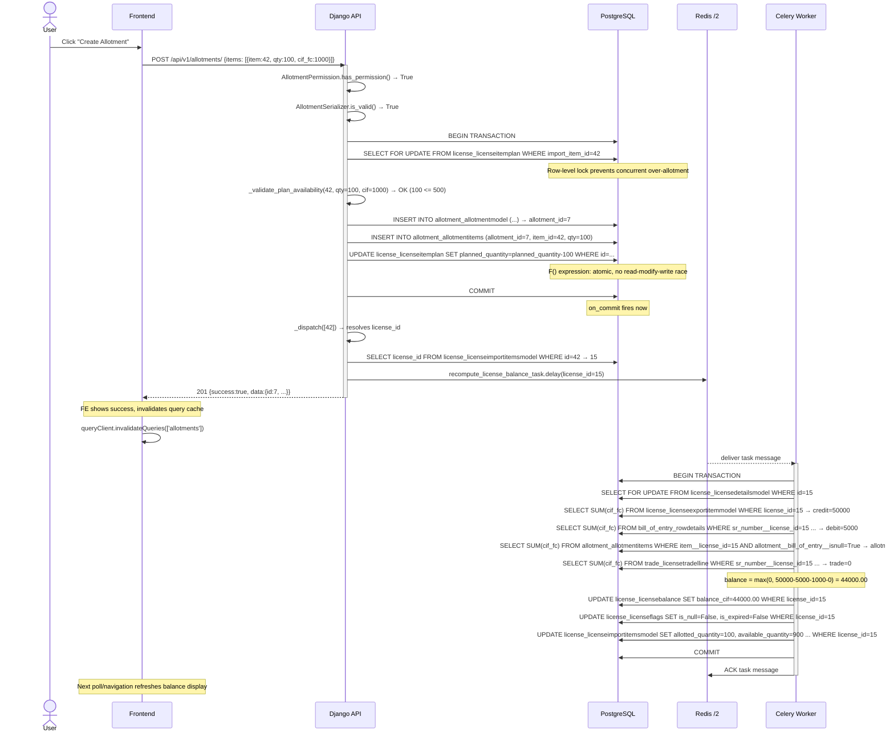
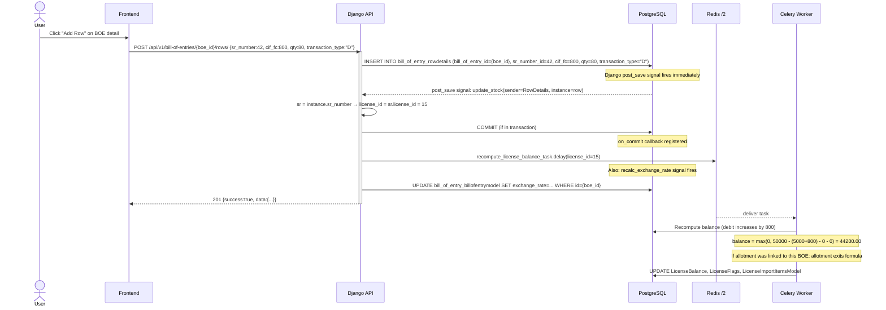
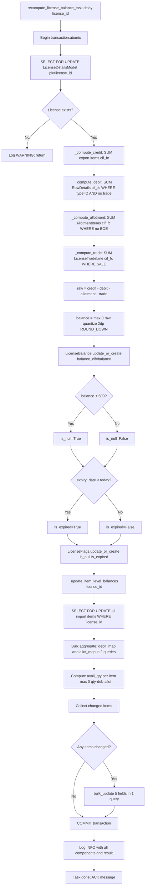
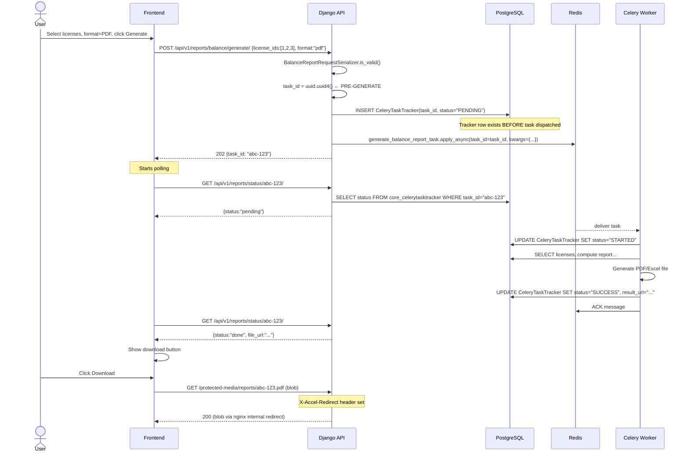

# Balance Recompute — Data Flow

> **Complete data flow from trigger to database write.**

---

## Flow 1: After Allotment Create

---

## Flow 2: After BOE Row Creation

---

## Flow 3: Balance Recompute Detail

---

## Flow 4: Report Generation

