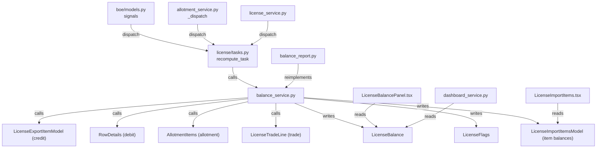
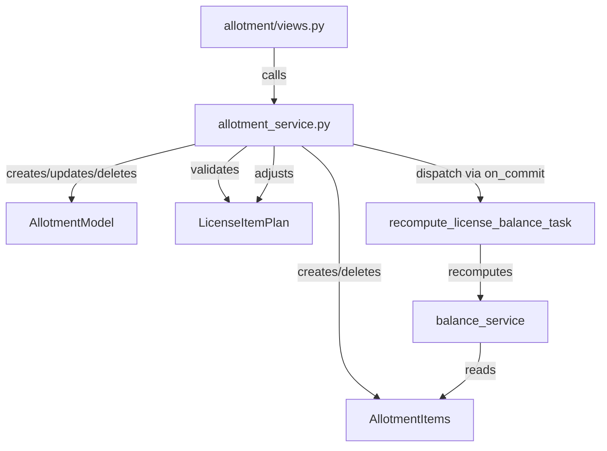
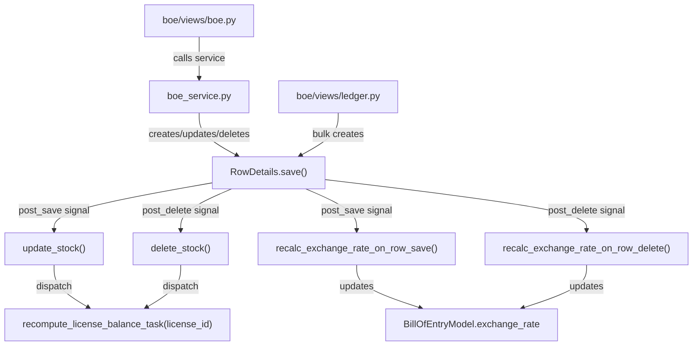

# Module Dependency Maps

> **Change impact maps for every critical module.**  
> "If file X changes, what else might break?"

---

## License Balance Service

**File**: `backend/apps/license/services/balance_service.py`



**If `balance_service.py` changes**:
- Test: `tests/balance/test_balance_system.py` (21 tests)
- Test: `tests/integration/test_license_workflows.py` (autouse fixture patches `_update_item_level_balances`)
- Frontend: `LicenseBalancePanel` may need type updates if breakdown fields change
- Reports: `balance_report.py` divergence may widen

---

## Allotment Service

**File**: `backend/apps/allotment/services/allotment_service.py`



**If `allotment_service.py` changes**:
- Test: `tests/allotment/test_allotment.py`
- Test: `tests/balance/test_balance_system.py` (tests 6-9 mock allotment service helpers)
- Views: `allotment/views.py` (only consumer)

---

## BOE Models (Signals)

**File**: `backend/apps/bill_of_entry/models.py`



**If `boe/models.py` signals change**:
- Balance recompute may stop firing → balances become stale
- Test: `tests/bill_of_entry/test_boe.py` (test_create_boe_dispatches_balance_task)
- Test: `tests/balance/test_balance_system.py` (tests 3-4)

---

## Accounts Permissions

**File**: `backend/apps/accounts/permissions.py`

**Impact if changed**:
- Every view that uses a permission class will be affected
- Test: `tests/integration/test_permissions.py` (covers all 12 role scenarios)
- Frontend: `hasAnyRole` in `AuthContext.tsx` mirrors these classes

**Permission class → used by**:

| Permission Class | Used by |
|---|---|
| `LicensePermission` | `LicenseViewSet`, `ImportItemViewSet`, `LicenseItemPlanViewSet` |
| `AllotmentPermission` | `AllotmentViewSet` |
| `BillOfEntryPermission` | `BillOfEntryViewSet`, `LedgerUploadView` |
| `TradePermission` | `LicenseTradeViewSet` |
| `ReportPermission` | `ReportDispatchPermission` (subclass), all report views |
| `UserManagementPermission` | `UsersView` |
| `LedgerUploadPermission` | `LedgerUploadView` |
| `LicenseLedgerViewPermission` | `LedgerReadView` |
| `AccountAccessPermission` | `BillOfEntryViewSet` (for account_access action) |
| `TransferLetterPermission` | Transfer letter generation actions |

---

## UserSerializer (accounts)

**File**: `backend/apps/accounts/serializers.py` → `UserSerializer`

**Critical field**: `is_superuser`

**Impact if `is_superuser` is removed**:
1. Frontend `AuthContext.hasAnyRole()` → all role checks return False for superusers
2. Sidebar shows only 3 items (Dashboard, Masters, Tasks) for ALL superusers
3. "New License" / "Create Allotment" etc. buttons disappear for superusers
4. All role-gated API calls continue to work (server checks RBAC independently)
5. Test: none — this was a silent regression before (no test covers it)

**Consumers of UserSerializer**:
- `LoginView.post()` → login response
- `MeView.get()` → /me endpoint
- Both read from `validate()` → `User.objects.get()`

---

## Frontend client.ts

**File**: `frontend/src/shared/api/client.ts`

**Impact if changed**:
- Every feature module uses `apiClient` — 9 features + shared auth
- The envelope unwrap interceptor affects ALL response parsing
- The blob guard protects PDF downloads — removing it breaks PDFs
- API_HOST export is used in `AuthContext.tsx` for proactive refresh

**Consumers**:
```
features/licenses/api.ts, mutations.ts, queries.ts
features/allotments/api.ts, queries.ts
features/bill-of-entry/mutations.ts, queries.ts
features/trade/mutations.ts, queries.ts
features/reports/mutations.ts, queries.ts
features/tasks/mutations.ts, queries.ts
features/masters/api.ts, queries.ts
features/dashboard/queries.ts
shared/auth/AuthContext.tsx (imports API_HOST)
```

---

## globals.css

**File**: `frontend/src/app/globals.css`

**Critical**: The `@theme inline` block maps shadcn CSS vars to Tailwind v4 `--color-*` namespace.

**Impact if `@theme inline` block is removed**:
- `bg-primary` → no background color (buttons invisible)
- `text-foreground` → no color (text invisible)
- `border-border` → no border
- `bg-destructive` → error states invisible
- Affects every UI component (30+ classes used throughout)

---

## AllotmentModel ↔ BillOfEntryModel M2M

**Critical relationship for balance correctness**:

```
BillOfEntryModel.allotment (ManyToManyField → AllotmentModel, related_name="bill_of_entry")
```

- When `boe.allotment.set([allotment_obj])`: allotment exits `_compute_allotment()` filter
- When `boe.allotment.clear()` or `boe.allotment.remove(allotment_obj)`: allotment re-enters filter
- This mechanism enables Scenario B (BOE from allotment without double-counting)
- Set in `BillOfEntrySerializer.create()` at line ~178 and `update()` at line ~200

**If this M2M is not set when creating a BOE from allotment**:
- BOTH the allotment AND the debit are counted → balance falsely double-reduced
- This would be invisible (no error) but financially incorrect
