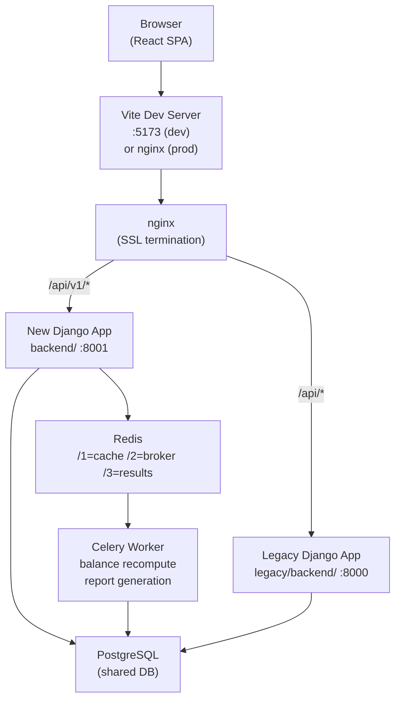
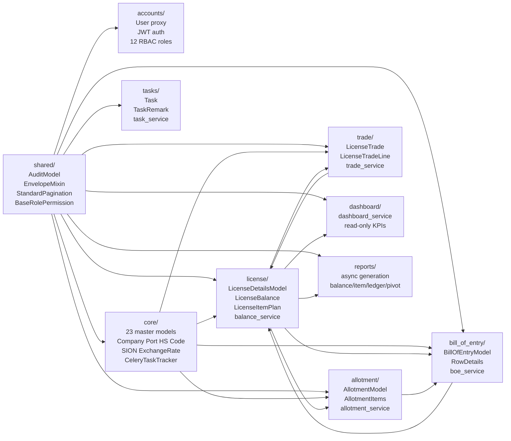
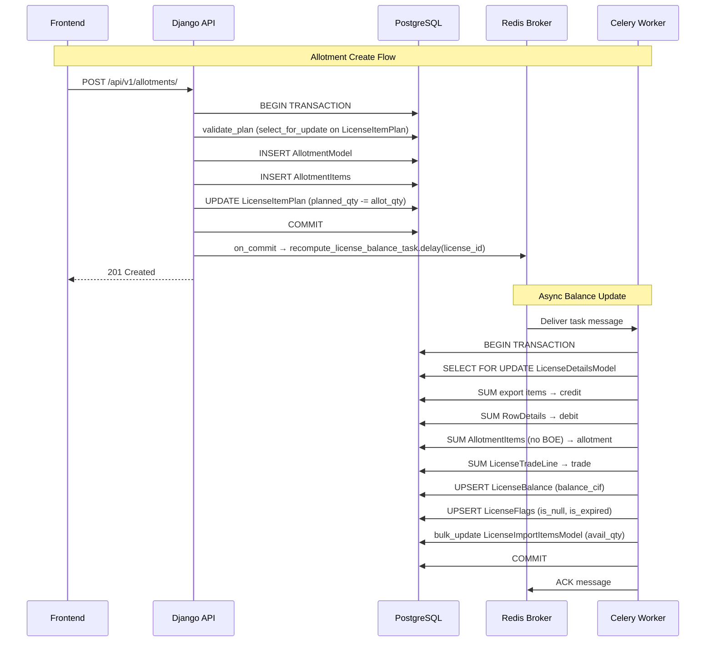
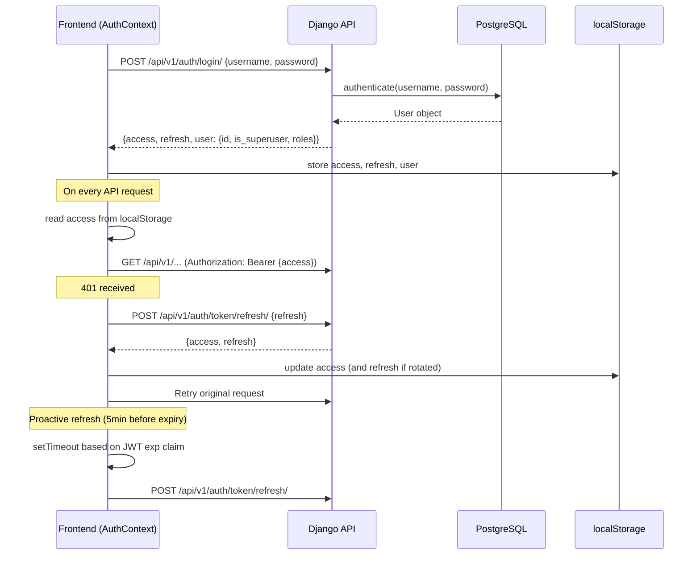
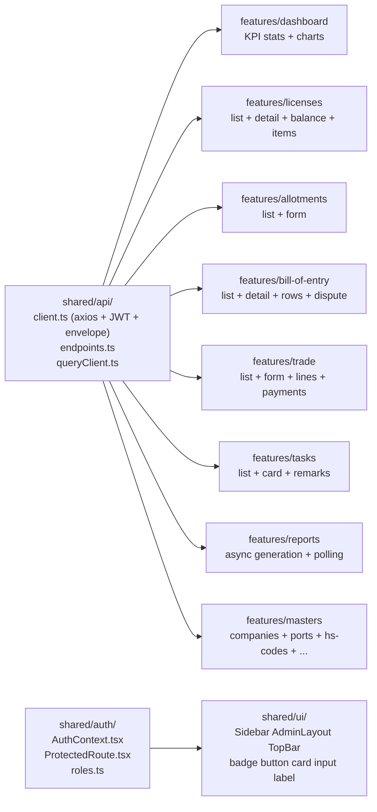

# System Architecture — Knowledge Graph

> **Purpose**: Quick-reference architecture map. Use before starting any development task.  
> Last updated: 2026-07-15 (feature/V1).

---

## 1. System Overview

---

## 2. Backend Module Dependency Graph

---

## 3. Balance Recompute Data Flow

---

## 4. Authentication Flow

---

## 5. Module Cross-Reference Table

| Module | Reads From | Writes To | Dispatches |
|---|---|---|---|
| license | core, accounts | LicenseDetailsModel, LicenseBalance, LicenseFlags, LicenseItemPlan | recompute_license_balance_task |
| allotment | license (LicenseImportItemsModel), core | AllotmentModel, AllotmentItems, LicenseItemPlan | recompute_license_balance_task |
| bill_of_entry | license (LicenseImportItemsModel), allotment | BillOfEntryModel, RowDetails | recompute_license_balance_task (via signal) |
| trade | license (LicenseImportItemsModel), core | LicenseTrade, LicenseTradeLine, LicenseTradePayment | (none currently) |
| dashboard | license, allotment, bill_of_entry | None (read-only) | None |
| reports | license, allotment, bill_of_entry, trade, core | None (generates files) | generate_*_report_task |
| tasks | accounts | Task, TaskRemark | None |

---

## 6. Frontend Feature Map

---

## 7. Key Design Decisions (→ ADRs)

| Decision | ADR | Impact |
|---|---|---|
| Hybrid parallel-run strategy | ADR-001 | legacy/ read-only; new code in backend/ + frontend/ |
| Single shared PostgreSQL | ADR-002 | All managed=False models; no migrations for business tables |
| Django 6.x + Python 3.13 | ADR-003 | Latest LTS stack |
| React 19 + Vite + TanStack Query v5 | ADR-004 | Modern frontend stack |
| /api/v1/ prefix for new API | ADR-005 | nginx routes by prefix; no version conflicts |
| JWT HS256 shared SECRET_KEY | ADR-006 | Tokens work on both backends during transition |
| Views → Services → ORM (never views → ORM) | ADR-007 | All business logic in service layer |
| Celery replaces cross-app signals | ADR-008 | No synchronous cross-module calls |
| 6-criteria production cutover gate | ADR-009 | UAT required before cutover |
| legacy/ is read-only | ADR-010 | All work happens in backend/ and frontend/ |

---

## 8. Test Coverage Map

| Test File | Business Rules Covered |
|---|---|
| `tests/balance/test_balance_system.py` | 21 tests: balance formula, item formula, Scenarios A+B, planning, dispatch, flags |
| `tests/integration/test_license_workflows.py` | ~54 tests: BR-01 to BR-08, E2E workflow, permissions, BOE rules |
| `tests/integration/test_permissions.py` | RBAC: all 12 roles × 4 permission classes |
| `tests/accounts/test_auth.py` | Login, logout, refresh, RBAC, inactive users |
| `tests/allotment/test_allotment.py` | Create/delete dispatch, allotment type choices |
| `tests/bill_of_entry/test_boe.py` | Frozen rows, dispute resolution, signal, ledger upload |
| `tests/trade/test_trade.py` | 3dp precision for all billing modes |
| `tests/license/test_license.py` | License CRUD, balance task dispatch, permissions |
| `tests/reports/test_reports.py` | Task dispatch, tracker pre-creation, status polling |
| `tests/tasks/test_tasks.py` | State machine, remarks, transitions |
| `tests/core/test_masters.py` | Master CRUD, auth, pagination, search |
| `tests/dashboard/test_dashboard.py` | Stats, charts, expiring, auth |

---

## 9. Production Cutover Checklist (ADR-009)

Before switching nginx to point the new frontend at the new backend:

- [ ] All 9 modules built (backend + frontend) ✅
- [ ] 161/161 tests pass ✅
- [ ] Zero CRITICAL/HIGH security findings open ✅
- [ ] nginx parallel-run config on all 3 servers ✅
- [ ] Security audit report committed ✅
- [ ] UAT with 3 business users ⏳ (post-merge)

**PR**: https://github.com/sottanyhardik/license-manager/compare/develop...feature/V1
