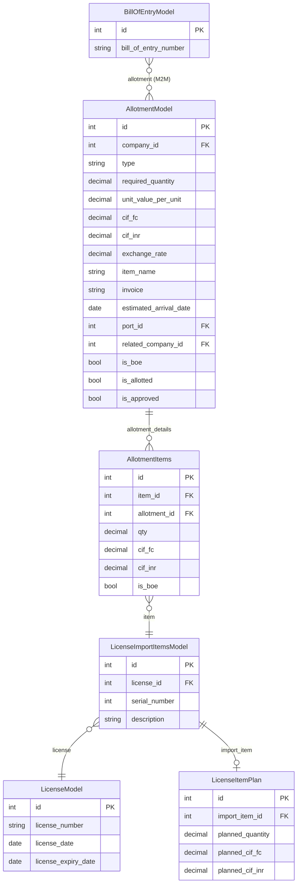
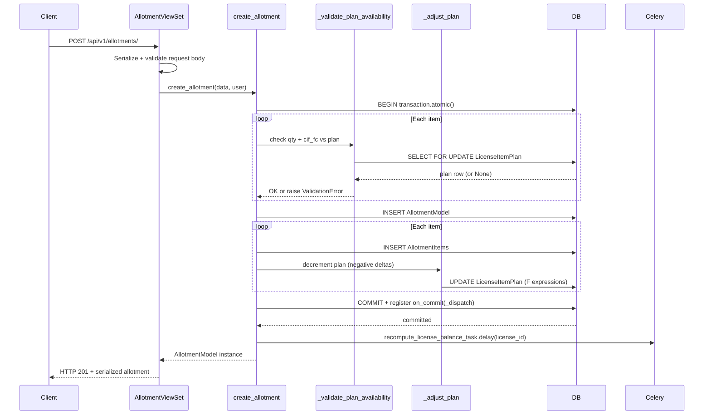
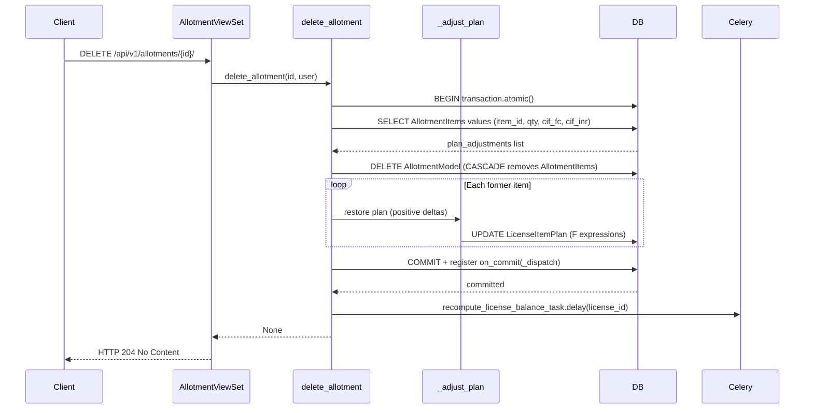

# Allotment Module

## Purpose

The Allotment module manages pre-authorization reservations against DGFT import licenses. Before goods can arrive and be cleared through ICEGATE (via a Bill of Entry), the importer must "allot" quantity and value from an existing license plan to a specific shipment. This process is the DGFT-prescribed step that links an advance-licensing entitlement to a concrete import transaction.

Two sub-types exist:

- **AT (Allotment)**: A direct reservation by the license holder against their own advance authorization.
- **TR (Transfer)**: A reservation where the entitlement is being transferred to a related party (a sister company or trading partner recorded in `related_company`).

The module also acts as a bridge: after an allotment is created, a Bill of Entry can be linked to it, converting the pre-authorization into an actual import record.

---

## Business Terminology

| Term | Meaning |
|---|---|
| Allotment (AT) | Pre-authorization reservation of quantity and value from a license plan |
| Transfer (TR) | Same as AT but the beneficiary is a different company |
| Transfer Letter | The physical/digital document accompanying a TR-type allotment |
| DFIA | Duty-Free Import Authorization — the license type whose numbers are surfaced in `dfia_list` |
| Required Quantity | Total quantity the importer expects to import under this allotment |
| Allotted Quantity | Sum of all line-item quantities already recorded against this allotment header |
| Balanced Quantity | `required_quantity - allotted_quantity`; the open, unfilled portion |
| LicenseItemPlan | A planning record per `LicenseImportItemsModel` that caps how much can be allotted |
| is_boe | Flag indicating at least one Bill of Entry exists for this allotment |
| is_allotted | Flag indicating the allotment has been formally committed |
| is_approved | Flag indicating managerial approval has been granted |

---

## Models

### AllotmentModel (`allotment_allotmentmodel`)

Header record. `managed=False` — the legacy database owns DDL; Django is a read/write proxy.

| Field | Type | Business Meaning |
|---|---|---|
| `company` | FK → `core.CompanyModel` | The importing company making the reservation |
| `type` | CharField(2) choices AT/TR | Allotment or Transfer; determines document type |
| `required_quantity` | Decimal(15,2) ≥ 0 | Total quantity expected to arrive under this allotment |
| `unit_value_per_unit` | Decimal(15,3) ≥ 0 | Per-unit CIF value for quick estimation; not stored in line items |
| `cif_fc` | Decimal(15,2) nullable | Total CIF in foreign currency at header level (optional; line items are authoritative) |
| `cif_inr` | Decimal(15,2) nullable | Total CIF in INR at header level |
| `exchange_rate` | Decimal(15,6) nullable | Exchange rate at time of allotment creation |
| `item_name` | CharField(255) | Description of the goods being allotted |
| `contact_person` | CharField(255) nullable | Supplier or freight agent contact name |
| `contact_number` | CharField(255) nullable | Supplier or freight agent phone/email |
| `invoice` | CharField(255) nullable | Pro-forma or commercial invoice number |
| `estimated_arrival_date` | DateField nullable | Expected date of arrival at port; used for ordering |
| `bl_detail` | CharField(255) nullable | Bill of Lading reference |
| `port` | FK → `core.PortModel` nullable | Port of import |
| `related_company` | FK → `core.CompanyModel` nullable | Beneficiary company for TR-type transfers |
| `is_boe` | BooleanField default False | True when at least one BOE is linked (computed via serializer) |
| `is_allotted` | BooleanField default False | Manually set flag indicating formal commitment |
| `is_approved` | BooleanField default False | Manually set flag for management approval |

Default ordering: `estimated_arrival_date` ascending.

#### Computed Properties

These properties do not write to the database. They perform aggregate queries on `allotment_details` each time they are accessed.

| Property | Calculation | Business Meaning |
|---|---|---|
| `required_value` | `required_quantity × unit_value_per_unit`, rounded to 2 dp | Estimated total value of the allotment |
| `alloted_quantity` | `SUM(allotment_details.qty)` with Coalesce(0) | Total quantity across all line items |
| `allotted_value` | `SUM(allotment_details.cif_fc)` with Coalesce(0) | Total foreign-currency CIF across all line items |
| `balanced_quantity` | `max(required_quantity - alloted_quantity, 0)` | Remaining open quantity; never negative |
| `dfia_list` | Comma-joined `license_number` values from line items | Human-readable list of linked license numbers for the allotment letter |

---

### AllotmentItems (`allotment_allotmentitems`)

Line item linking one `LicenseImportItemsModel` entry to an `AllotmentModel` header. `managed=False`.

| Field | Type | Business Meaning |
|---|---|---|
| `item` | FK → `license.LicenseImportItemsModel` nullable | The specific license line item being reserved |
| `allotment` | FK → `AllotmentModel` nullable | Parent allotment header |
| `cif_inr` | Decimal(15,2) ≥ 0 | CIF in INR for this line item allocation |
| `cif_fc` | Decimal(15,2) ≥ 0 | CIF in foreign currency for this line item allocation |
| `qty` | Decimal(15,3) ≥ 0 | Quantity being allotted from this license line item |
| `is_boe` | BooleanField default False | Whether a Bill of Entry covers this line item |

Constraint: `unique_together = [("item", "allotment")]` — the same license line item cannot appear twice in one allotment.

Default ordering: `qty` ascending.

#### Cached Properties (read-only traversals via `item` FK)

These are `@cached_property` on the model, surfaced as `ReadOnlyField` in the serializer. They walk the chain `AllotmentItems.item → LicenseImportItemsModel → LicenseModel` safely, returning `None` when any FK is missing.

| Property | Source | Description |
|---|---|---|
| `serial_number` | `item.serial_number` | Serial number of the license line item |
| `product_description` | `item.description` | Product description from the license |
| `license_number` | `item.license.license_number` | DGFT license number |
| `license_date` | `item.license.license_date` | License issue date |
| `license_expiry` | `item.license.license_expiry_date` | License expiry date |
| `hs_code` | `item.hs_code` | Harmonized System code for customs |
| `exporter` | `item.license.exporter` | Exporter entity linked to the license |
| `registration_number` | `item.license.registration_number` | DGFT registration number |
| `notification_number` | `item.license.notification_number` | Customs notification reference |
| `file_number` | `item.license.file_number` | DGFT file number |
| `port_code` | `item.license.port` | Port code from the license |

---

## Service Layer

File: `backend/apps/allotment/services/allotment_service.py`

All mutations run inside `transaction.atomic()`. Balance recompute tasks are dispatched via `transaction.on_commit()` so the Celery task is never enqueued unless the database transaction commits successfully.

### `create_allotment(data, user) -> AllotmentModel`

Creates an `AllotmentModel` header and its `AllotmentItems` in one atomic transaction.

Step-by-step:

1. Pop `items` list from `data`.
2. Open `transaction.atomic()`.
3. For each item dict in `items`: call `_validate_plan_availability(import_item_id, qty, cif_fc)`. This raises `ValidationError` immediately if any item exceeds its plan, so no partial writes occur.
4. Construct and save `AllotmentModel` from the remaining `data`; set `created_by` and `modified_by` to `user`.
5. For each item dict: construct and save an `AllotmentItems` row; call `_adjust_plan` with negative deltas (qty, cif_fc, cif_inr) to decrement the plan.
6. Register `_dispatch(item_ids)` as an `on_commit` callback.
7. After commit: Celery fires `recompute_license_balance_task.delay(license_id)` for each unique license derived from the allotted item IDs.

**Validation**: Any item that exceeds its `LicenseItemPlan` raises `ValidationError` before the `AllotmentModel` row is created.

### `update_allotment(allotment_id, data, user) -> AllotmentModel`

Partial-updates header fields only. Item lines are managed through their own endpoints.

Step-by-step:

1. Pop `items` from `data` if accidentally passed.
2. Open `transaction.atomic()` with `select_for_update()` on the header row.
3. Apply each field in `data` to the instance via `setattr`.
4. Save; set `modified_by`.
5. Collect current `item_ids` from `AllotmentItems` for the dispatch.
6. Register `_dispatch(item_ids)` on commit.

**When to use**: To update header metadata (dates, contact info, invoice number, flags) without touching line items.

### `delete_allotment(allotment_id, user) -> None`

Deletes the header. Django cascade deletes `AllotmentItems`. The plan is restored before the delete.

Step-by-step:

1. Open `transaction.atomic()`.
2. Collect `(item_id, qty, cif_fc, cif_inr)` values from `AllotmentItems` before deletion.
3. Extract `item_ids` for the dispatch.
4. Delete `AllotmentModel` (cascade removes `AllotmentItems`).
5. For each collected item: call `_adjust_plan` with positive deltas (undo the original decrement).
6. Register `_dispatch(item_ids)` on commit.

### `_dispatch(item_ids) -> callable`

Returns a closure for use with `transaction.on_commit()`.

When the closure runs after commit:

1. Import `LicenseImportItemsModel` and `recompute_license_balance_task` lazily (avoids circular imports).
2. Query `LicenseImportItemsModel.objects.filter(pk__in=item_ids).values_list("license_id", flat=True)` to resolve item IDs to license IDs. This is intentionally done at on_commit time — the `LicenseImportItemsModel` rows survive allotment deletes, so the lookup is always safe.
3. De-duplicate license IDs with `set()`.
4. Dispatch `recompute_license_balance_task.delay(lid)` for each unique license ID.

`ImportError` is logged at WARNING (task module absent). All other exceptions are logged at ERROR so broker failures are never silently swallowed.

### `_validate_plan_availability(import_item_id, qty_requested, cif_fc_requested)`

Must be called inside `transaction.atomic()`.

1. Fetch `LicenseItemPlan` with `select_for_update()` for `import_item_id`.
2. If no plan exists: return immediately (planning is optional — backward compatible with legacy data).
3. If `qty_requested > plan.planned_quantity`: raise `ValidationError`.
4. If `cif_fc_requested > plan.planned_cif_fc`: raise `ValidationError`.

The `select_for_update()` lock prevents two concurrent requests from both reading the same available balance and both passing validation, which would cause over-allotment.

### `_adjust_plan(import_item_id, qty_delta, cif_fc_delta, cif_inr_delta)`

Must be called inside `transaction.atomic()`.

1. Fetch `LicenseItemPlan` with `select_for_update()` for `import_item_id`.
2. If no plan exists: return (no-op).
3. Apply: `planned_quantity += qty_delta`, `planned_cif_fc += cif_fc_delta`, `planned_cif_inr += cif_inr_delta` using `models.F()` expressions for atomic update.

Pass **negative deltas** when allotting (creation path). Pass **positive deltas** when undoing (deletion path).

---

## API Endpoints

Base URL prefix: `/api/v1/allotments/`

The router generates standard ModelViewSet routes. Mutations bypass the default `perform_create/perform_update/perform_destroy` and call the service layer directly.

| Method | URL | Auth | Description |
|---|---|---|---|
| GET | `/api/v1/allotments/` | JWT + AllotmentPermission | List allotments; supports filters, search, ordering |
| POST | `/api/v1/allotments/` | JWT + AllotmentPermission | Create allotment + line items atomically |
| GET | `/api/v1/allotments/{id}/` | JWT + AllotmentPermission | Retrieve single allotment with nested items |
| PUT | `/api/v1/allotments/{id}/` | JWT + AllotmentPermission | Full update of header fields |
| PATCH | `/api/v1/allotments/{id}/` | JWT + AllotmentPermission | Partial update of header fields |
| DELETE | `/api/v1/allotments/{id}/` | JWT + AllotmentPermission | Delete header + cascade items; restores plan |
| POST | `/api/v1/allotments/{id}/generate-pdf/` | JWT + AllotmentPermission | Async PDF generation; returns `{"task_id": "..."}` with HTTP 202 |

### Filtering

Filter class: `AllotmentFilter`

| Parameter | Field | Lookup |
|---|---|---|
| `company` | `company_id` | exact |
| `port` | `port_id` | exact |
| `type` | `type` | exact (AT or TR) |
| `license_number` | `allotment_details__item__license__license_number` | icontains |
| `is_boe` | `is_boe` | boolean |
| `is_allotted` | `is_allotted` | boolean |
| `is_approved` | `is_approved` | boolean |
| `estimated_arrival_date_after` | `estimated_arrival_date` | gte |
| `estimated_arrival_date_before` | `estimated_arrival_date` | lte |

### Search fields

`item_name`, `company__name`, `invoice`, `bl_detail`

### Ordering fields

`estimated_arrival_date`, `modified_on`, `company__name`, `item_name`. Default: `-estimated_arrival_date`.

### Request body (POST/PUT/PATCH)

```json
{
  "company": 1,
  "type": "AT",
  "required_quantity": "100.00",
  "unit_value_per_unit": "15.000",
  "cif_fc": "1500.00",
  "cif_inr": "124500.00",
  "exchange_rate": "83.000000",
  "item_name": "Polyester Yarn",
  "contact_person": "John Doe",
  "contact_number": "+91-9876543210",
  "invoice": "INV-2024-001",
  "estimated_arrival_date": "2024-03-15",
  "bl_detail": "BL-ABC123",
  "port": 5,
  "related_company": null,
  "is_allotted": false,
  "is_approved": false,
  "items": [
    {
      "item": 42,
      "qty": "100.000",
      "cif_fc": "1500.00",
      "cif_inr": "124500.00",
      "is_boe": false
    }
  ]
}
```

### Response body (GET / 201)

All `AllotmentSerializer` fields plus nested `allotment_details`:

```json
{
  "id": 1,
  "company": 1,
  "company_name": "Acme Textiles Ltd",
  "type": "AT",
  "required_quantity": "100.00",
  "unit_value_per_unit": "15.000",
  "cif_fc": "1500.00",
  "cif_inr": "124500.00",
  "exchange_rate": "83.000000",
  "item_name": "Polyester Yarn",
  "contact_person": "John Doe",
  "contact_number": "+91-9876543210",
  "invoice": "INV-2024-001",
  "estimated_arrival_date": "2024-03-15",
  "bl_detail": "BL-ABC123",
  "port": 5,
  "port_name": "JNPT",
  "related_company": null,
  "related_company_name": null,
  "is_boe": false,
  "is_allotted": false,
  "is_approved": false,
  "required_value": "1500.00",
  "alloted_quantity": "100.000",
  "allotted_value": "1500.00",
  "balanced_quantity": "0.00",
  "dfia_list": "DFIA-2024-00123",
  "allotment_details": [
    {
      "id": 1,
      "item": 42,
      "allotment": 1,
      "cif_inr": "124500.00",
      "cif_fc": "1500.00",
      "qty": "100.000",
      "is_boe": false,
      "serial_number": 1,
      "product_description": "Polyester Filament Yarn",
      "license_number": "DFIA-2024-00123",
      "license_date": "01-01-2024",
      "license_expiry": "31-12-2026",
      "hs_code": "54024700",
      "exporter": "Global Yarns Co",
      "registration_number": "REG-001",
      "notification_number": "NOTIF-12/2012",
      "file_number": "FILE-2024-001",
      "port_code": "INJNP"
    }
  ],
  "created_on": "01-01-2024",
  "modified_on": "01-01-2024",
  "display_label": "Acme Textiles Ltd | Inv: INV-2024-001 | Qty: 100.00"
}
```

### generate-pdf Response

```json
{"task_id": "celery-task-uuid-here"}
```

HTTP 202 Accepted. If the task module is unavailable: `{"task_id": null, "detail": "PDF task not available"}`, still HTTP 202.

---

## Business Rules

1. **Type constraint**: `type` must be `"AT"` (Allotment) or `"TR"` (Transfer). Default is `"AT"`.
2. **Over-allotment prevention**: Before creating line items, `_validate_plan_availability` checks that `qty_requested` does not exceed `LicenseItemPlan.planned_quantity` and `cif_fc_requested` does not exceed `LicenseItemPlan.planned_cif_fc`. If no `LicenseItemPlan` exists for an item, the check is skipped (backward compatible with legacy data).
3. **Atomic creation**: The header and all line items are created in a single `transaction.atomic()`. Any plan validation failure aborts the entire creation — no partial writes.
4. **Plan decrement on create**: Each line item decreases `LicenseItemPlan.planned_quantity`, `planned_cif_fc`, and `planned_cif_inr` by the allotted values.
5. **Plan restoration on delete**: Before deleting, the service reads current line item values and restores each `LicenseItemPlan` with equal and opposite deltas.
6. **Cascade delete**: Deleting an `AllotmentModel` cascades to `AllotmentItems` via the database FK.
7. **is_boe flag**: The serializer computes `is_boe` by checking `obj.bill_of_entry.all().exists()` via the reverse M2M relation from `BillOfEntryModel`. The database column `is_boe` on `AllotmentModel` is written directly when a BOE is created or updated to include this allotment.
8. **Unique item-allotment pair**: `unique_together = [("item", "allotment")]` on `AllotmentItems` prevents the same license item from appearing twice in one allotment.
9. **Items not updated by `update_allotment`**: Header PATCH/PUT does not alter line items; items must be managed via their own sub-resource.
10. **Transfer type**: For `TR` type, `related_company` should be set to identify the transfer beneficiary.

---

## Side Effects

| Trigger | Side Effect |
|---|---|
| `create_allotment` commits | `recompute_license_balance_task.delay(license_id)` for each affected license |
| `update_allotment` commits | `recompute_license_balance_task.delay(license_id)` for all linked items |
| `delete_allotment` commits | `LicenseItemPlan` restored; `recompute_license_balance_task.delay(license_id)` for each affected license |
| BOE linked to allotment | `AllotmentModel.is_boe = True` (set by `BillOfEntrySerializer`) |
| BOE unlinked from allotment | `AllotmentModel.is_boe = False` if no other BOEs remain |

---

## Concurrency

- `_validate_plan_availability` and `_adjust_plan` both use `LicenseItemPlan.objects.select_for_update()` inside `transaction.atomic()`.
- This row-level lock prevents two concurrent requests from reading the same available balance, both validating successfully, and both decrementing the plan — which would result in an over-allotment.
- `update_allotment` uses `select_for_update()` on the `AllotmentModel` header row to prevent lost-update races during concurrent header edits.

---

## Queryset Strategy

`get_queryset()` in `AllotmentViewSet` pre-fetches all related data needed for the serializer in one database round-trip:

```
AllotmentModel
  .select_related("company", "port", "related_company")
  .prefetch_related(
    "allotment_details",
    "allotment_details__item",
    "allotment_details__item__license",
    "allotment_details__item__license__exporter",
    "allotment_details__item__license__port",
    "allotment_details__item__hs_code",
    "bill_of_entry",
  )
```

This avoids N+1 queries when rendering nested `allotment_details` and the `is_boe` check.

---

## Mermaid Diagrams

### Entity Relationships



### Create Allotment Flow



### Delete Allotment Flow


