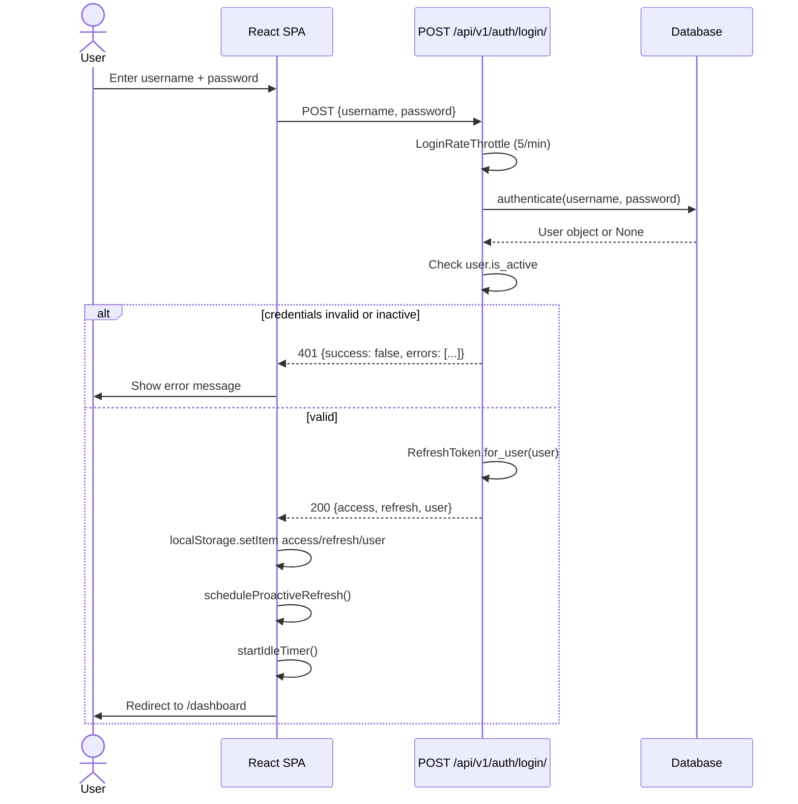
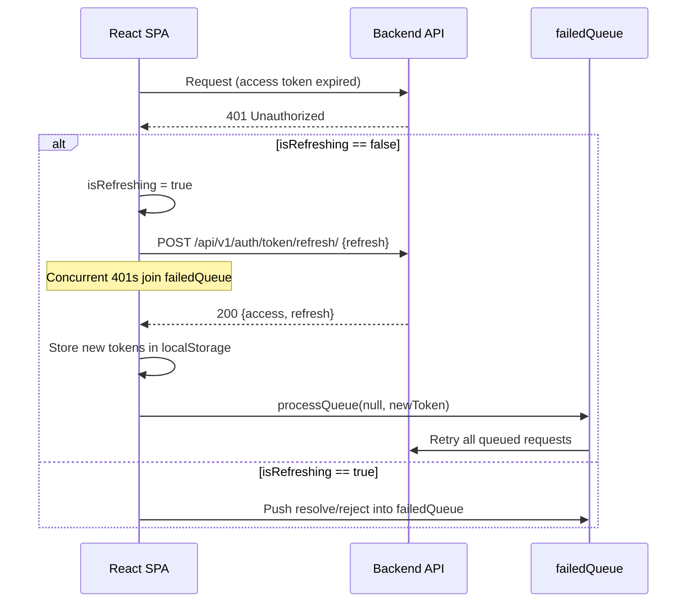

# Authentication

## Purpose

The authentication module handles identity verification and role-based access
control (RBAC) for every request entering the License Manager API. It is
implemented in `backend/apps/accounts/` and consumed by the React SPA at
`frontend/src/shared/auth/`.

---

## Entry Points

| Layer    | File                                             | Role                        |
|----------|--------------------------------------------------|-----------------------------|
| Backend  | `backend/apps/accounts/views.py`                 | HTTP request handlers       |
| Backend  | `backend/apps/accounts/serializers.py`           | Input validation            |
| Backend  | `backend/apps/accounts/permissions.py`           | RBAC enforcement            |
| Backend  | `backend/apps/accounts/models.py`                | User model                  |
| Backend  | `backend/apps/accounts/urls.py`                  | Route declarations          |
| Frontend | `frontend/src/shared/auth/AuthContext.tsx`       | Session state, timers       |
| Frontend | `frontend/src/shared/api/client.ts`              | Axios interceptors          |
| Frontend | `frontend/src/shared/api/endpoints.ts`           | URL constants               |

---

## Files

```
backend/apps/accounts/
  models.py        — User proxy (managed=False, points at accounts_user table)
  serializers.py   — LoginSerializer, UserSerializer, UsersListSerializer
  views.py         — LoginView, LogoutView, TokenRefreshView, MeView, UsersView
  permissions.py   — BaseRolePermission and 12 concrete subclasses
  urls.py          — 5 URL patterns
frontend/src/shared/auth/
  AuthContext.tsx  — AuthProvider, useAuth hook, idle + proactive-refresh timers
frontend/src/shared/api/
  client.ts        — axios instance, 401 refresh queue, envelope unwrap
  endpoints.ts     — ENDPOINTS.AUTH constants
```

---

## Database Tables

| Table           | Django Model | Managed | Notes                                      |
|-----------------|--------------|---------|--------------------------------------------|
| `accounts_user` | `User`       | False   | Owned by legacy backend; proxy only        |
| `auth_group`    | `Group`      | True    | Group name = role code                     |

`managed=False` means Django never creates, alters, or drops `accounts_user`.
Field names must exactly match the legacy schema.

Role membership uses Django's built-in `Group` model. A user belongs to one or
more groups whose `name` field is the role code string (e.g. `LICENSE_MANAGER`).

---

## User Model

`backend/apps/accounts/models.py:44`

Key fields:

| Field         | Type           | Notes                                            |
|---------------|----------------|--------------------------------------------------|
| `username`    | CharField(150) | Unique; the `USERNAME_FIELD`                     |
| `email`       | EmailField     | Unique; nullable                                 |
| `first_name`  | CharField(30)  |                                                  |
| `last_name`   | CharField(150) |                                                  |
| `is_active`   | BooleanField   | Inactive users are denied before superuser check |
| `is_staff`    | BooleanField   | Django admin access                              |
| `is_superuser`| BooleanField   | Bypasses all RBAC; only active users can use it  |
| `avatar`      | ImageField     | Allowed: png, jpg, jpeg                          |
| `groups`      | M2M → Group    | Role codes stored as group names                 |

Role helper methods (all on `User`):

```python
user.has_role("LICENSE_MANAGER")   # True if in exactly that group
user.has_any_role(["A", "B"])      # True if in any listed group
user.get_role_codes()              # ["LICENSE_MANAGER", ...]
user.is_admin()                    # shorthand for is_superuser
```

---

## Auth Endpoints

All five endpoints live under `/api/v1/auth/` (wired in
`backend/config/api_urls.py:4`).

### POST /api/v1/auth/login/

`backend/apps/accounts/views.py:33` — `LoginView`

- Permission: `AllowAny`
- Throttle: `LoginRateThrottle` — 5 requests/minute per IP
- No authentication class attached (anonymous endpoint)

Request body:
```json
{"username": "alice", "password": "secret123"}
```

Success response (HTTP 200):
```json
{
  "success": true,
  "data": {
    "access":  "<JWT access token>",
    "refresh": "<JWT refresh token>",
    "user": {
      "id": 1, "username": "alice", "email": "alice@example.com",
      "first_name": "Alice", "last_name": "Smith",
      "is_active": true, "is_staff": false, "is_superuser": false,
      "roles": ["LICENSE_MANAGER"], "date_joined": "2024-01-01T00:00:00Z"
    }
  },
  "errors": [], "message": null
}
```

Failure (HTTP 401):
```json
{"success": false, "data": null, "errors": [...], "message": "Invalid credentials."}
```

Validation sequence inside `LoginSerializer.validate()`:
1. Require both `username` and `password` fields.
2. Call `django.contrib.auth.authenticate()`.
3. If `user` is None or `user.is_active` is False, raise `ValidationError("Invalid credentials.")`. This deliberately gives the same error for both wrong password and inactive account to prevent user enumeration.

### POST /api/v1/auth/logout/

`backend/apps/accounts/views.py:73` — `LogoutView`

- Permission: `IsAuthenticated`

Request body:
```json
{"refresh": "<refresh token>"}
```

Behavior: calls `RefreshToken(token_str).blacklist()`. This invalidates the
refresh token server-side via `rest_framework_simplejwt.token_blacklist`. After
blacklisting, any attempt to use the same refresh token returns HTTP 401.

### POST /api/v1/auth/token/refresh/

`backend/apps/accounts/views.py:103` — `TokenRefreshView`

- Permission: `AllowAny` (unauthenticated; uses the refresh token as the credential)

Request body:
```json
{"refresh": "<refresh token>"}
```

Success response (HTTP 200):
```json
{"success": true, "data": {"access": "<new access token>", "refresh": "<new refresh token>"}, ...}
```

Because `ROTATE_REFRESH_TOKENS = True` and `BLACKLIST_AFTER_ROTATION = True`
(set in `backend/config/settings/base.py:213`), the old refresh token is
blacklisted on every successful rotation. Using the old refresh token a second
time returns HTTP 401.

### GET /api/v1/auth/me/

`backend/apps/accounts/views.py:127` — `MeView`

- Permission: `IsAuthenticated`

Returns the authenticated user's profile and role list. `MeView.get()` calls
`User.objects.prefetch_related("groups")` to avoid an extra query when
serializing roles.

### GET /api/v1/auth/users/

`backend/apps/accounts/views.py:145` — `UsersView`

- Permission: `IsAdminUser` (must be `is_active` AND `is_staff`)
- Pagination: `StandardPagination` (25 items/page)
- Search fields: `username`, `email`, `first_name`, `last_name`

Returns a paginated list of all users with their role codes.

---

## JWT Configuration

`backend/config/settings/base.py:209`

| Setting                    | Value                              |
|----------------------------|------------------------------------|
| Algorithm                  | HS256 (shared secret)              |
| Access token lifetime      | 30 minutes                         |
| Refresh token lifetime     | 7 days                             |
| `ROTATE_REFRESH_TOKENS`    | True                               |
| `BLACKLIST_AFTER_ROTATION` | True                               |
| Auth header type           | `Bearer`                           |

HS256 with a shared secret key is the current setting. See `docs/adr/` (ADR-006)
for the architectural decision that chose HS256 during the legacy transition
period.

---

## Token Storage (Frontend)

`frontend/src/shared/auth/AuthContext.tsx:76`

Tokens are stored in `localStorage`:

| Key       | Value                         |
|-----------|-------------------------------|
| `access`  | JWT access token string       |
| `refresh` | JWT refresh token string      |
| `user`    | JSON-serialized `AuthUser`    |

Known tradeoff: `localStorage` is accessible to JavaScript running in the page
origin, making it vulnerable to XSS. The choice is documented — the app
currently has no CSP middleware in base settings. The benefit is that tokens
survive page reloads without a server round-trip.

---

## Proactive Refresh (Frontend)

`frontend/src/shared/auth/AuthContext.tsx:123` — `scheduleProactiveRefresh`

When a user logs in or when `AuthContext` mounts, a `setTimeout` is scheduled:

1. Parse the `exp` claim from the access token payload.
2. Compute `delay = expiry - now - 5 minutes`. Minimum 10 seconds.
3. After `delay`, silently POST to `/api/v1/auth/token/refresh/` using the raw
   `axios` instance (not `apiClient`) to avoid circular interceptor invocation.
4. Store the new `access` (and `refresh` if returned).
5. Re-schedule `scheduleProactiveRefresh` recursively.
6. On failure: call `logout('session_expired')`.

The 5-minute buffer (`TOKEN_REFRESH_BUFFER_MS`) ensures the access token is
still valid when the refresh fires.

---

## Reactive 401 Refresh (Frontend)

`frontend/src/shared/api/client.ts:68`

A queue pattern prevents concurrent refresh races:

```
Request A → 401 → sets isRefreshing=true, starts POST /refresh
Request B → 401 → isRefreshing=true, queued in failedQueue
Request C → 401 → isRefreshing=true, queued in failedQueue

/refresh responds with new access token
  → processQueue(null, newToken) retries A, B, C with new token
  → isRefreshing=false
```

If the refresh itself fails (expired or blacklisted refresh token),
`processQueue(error)` rejects all queued requests and
`clearSessionAndRedirect('session_expired')` wipes `localStorage` and redirects
to `/login?reason=session_expired`.

Only one actual HTTP refresh request fires regardless of how many concurrent
401s arrive.

---

## Idle Timeout (Frontend)

`frontend/src/shared/auth/AuthContext.tsx:46`

| Constant                   | Value      |
|----------------------------|------------|
| `IDLE_TIMEOUT_MS`          | 30 minutes |
| `IDLE_CHECK_INTERVAL_MS`   | 1 minute   |

Activity events tracked: `mousemove`, `keydown`, `click`, `scroll`, `touchstart`.

A `setInterval` fires every minute. If `Date.now() - lastActivity >= 30 minutes`,
`logout('idle')` is called. The user is redirected to
`/login?reason=idle&redirect=<currentPath>`.

---

## RBAC Roles

`backend/apps/accounts/permissions.py:8`

The application uses exactly 15 role codes. Each code is the `name` of a Django
`Group`. A user can hold multiple roles simultaneously.

| Role Code                   | Domain                    | Read | Write |
|-----------------------------|---------------------------|------|-------|
| `LICENSE_MANAGER`           | Licenses                  | Yes  | Yes   |
| `LICENSE_VIEWER`            | Licenses                  | Yes  | No    |
| `TRADE_MANAGER`             | Trades                    | Yes  | Yes   |
| `TRADE_VIEWER`              | Trades                    | Yes  | No    |
| `ALLOTMENT_MANAGER`         | Allotments                | Yes  | Yes   |
| `ALLOTMENT_VIEWER`          | Allotments                | Yes  | No    |
| `BOE_MANAGER`               | Bill of Entry             | Yes  | Yes   |
| `BOE_VIEWER`                | Bill of Entry             | Yes  | No    |
| `INCENTIVE_LICENSE_MANAGER` | Incentive licenses        | Yes  | Yes   |
| `INCENTIVE_LICENSE_VIEWER`  | Incentive licenses        | Yes  | No    |
| `USER_MANAGER`              | User management           | Yes  | Yes   |
| `REPORT_VIEWER`             | Reports (read-only)       | Yes  | No    |
| `ACCOUNT_ACCESS`            | BOE list + invoice update | Yes  | —     |
| `TL_GENERATE`               | Transfer letters          | Yes  | —     |
| `LEDGER_MANAGER`            | License ledger            | Yes  | —     |

`ACCOUNT_ACCESS`, `TL_GENERATE`, and `LEDGER_MANAGER` are supplemental roles
that grant access to specific sub-actions rather than full module write.

---

## Permission Classes

### BaseRolePermission

`backend/apps/accounts/permissions.py:25`

All standard RBAC classes extend this base. Decision logic:

```
1. if not user or not user.is_authenticated or not user.is_active → False
2. if user.is_superuser → True
3. if method in SAFE_METHODS (GET/HEAD/OPTIONS):
     if required_roles_for_read is empty → True (open read)
     else → user.has_any_role(required_roles_for_read)
4. else (unsafe method):
     if required_roles_for_write is empty → False (write always denied)
     else → user.has_any_role(required_roles_for_write)
```

The `is_active` check runs before the `is_superuser` check. This is intentional:
a deactivated superuser is treated as an ordinary unauthorized user. Checking
`is_active` first prevents a deactivated account from retaining elevated access.

### Concrete Subclasses

`backend/apps/accounts/permissions.py:52`

| Class                       | Read roles                                             | Write roles               |
|-----------------------------|--------------------------------------------------------|---------------------------|
| `LicensePermission`         | LICENSE_MANAGER, LICENSE_VIEWER, TRADE_VIEWER, TRADE_MANAGER | LICENSE_MANAGER      |
| `LicenseReadOnlyPermission` | Same as LicensePermission, applied to ALL methods      | (always treated as read)  |
| `AllotmentPermission`       | ALLOTMENT_MANAGER, ALLOTMENT_VIEWER                    | ALLOTMENT_MANAGER         |
| `BillOfEntryPermission`     | BOE_MANAGER, BOE_VIEWER, ACCOUNT_ACCESS, TL_GENERATE   | BOE_MANAGER               |
| `TradePermission`           | TRADE_MANAGER, TRADE_VIEWER                            | TRADE_MANAGER             |
| `IncentiveLicensePermission`| INCENTIVE_LICENSE_MANAGER, INCENTIVE_LICENSE_VIEWER    | INCENTIVE_LICENSE_MANAGER |
| `UserManagementPermission`  | USER_MANAGER                                           | USER_MANAGER              |
| `ReportPermission`          | REPORT_VIEWER + all manager roles                      | (empty — always denied)   |
| `LedgerUploadPermission`    | LICENSE_MANAGER, LEDGER_MANAGER (any method)           | same                      |
| `LicenseLedgerViewPermission` | TRADE_VIEWER, TRADE_MANAGER, LICENSE_MANAGER, LEDGER_MANAGER | same            |
| `AccountAccessPermission`   | ACCOUNT_ACCESS, BOE_MANAGER, BOE_VIEWER                | same                      |
| `TransferLetterPermission`  | TL_GENERATE + all entity manager/viewer roles          | same                      |

`LicenseReadOnlyPermission` overrides `has_permission` to skip the
`SAFE_METHODS` branch entirely: every method is checked against
`required_roles_for_read`. This is used on POST endpoints that accept large
payloads for read-only operations (e.g. bulk balance Excel export).

`ReportPermission` has `required_roles_for_write = []`. With an empty write list,
`BaseRolePermission` always returns `False` for unsafe methods — reports are
read-only by design.

### Shared Permissions

`backend/shared/permissions.py`

| Class                    | Logic                                     |
|--------------------------|-------------------------------------------|
| `IsAuthenticatedAndActive` | `is_authenticated AND is_active`        |
| `IsAdminUser`            | `IsAuthenticatedAndActive AND is_staff`   |

`IsAdminUser` is used by `UsersView` and by the system/ops viewsets
(`MasterChangeViewSet`, `CeleryTaskTrackerViewSet`, `ActivityLogViewSet`).

---

## Business Rules

1. An inactive user (`is_active=False`) is always denied, even if `is_superuser=True`.
2. `is_superuser` grants access to all endpoints without role membership.
3. Viewer roles (e.g. `LICENSE_VIEWER`) are read-only. Writing via a viewer role
   returns HTTP 403.
4. A user with no group membership is denied on all module endpoints.
5. Cross-module viewer roles are not transferable: `ALLOTMENT_VIEWER` cannot
   read license endpoints because `LicensePermission.required_roles_for_read`
   does not include it.
6. Token blacklisting is server-side. A logout invalidates the refresh token
   immediately; the access token remains valid until its 30-minute lifetime
   expires. The frontend discards both tokens on logout.
7. Login throttle is 5 requests/minute per unauthenticated IP.
8. Global throttle rates: anonymous 60/min, authenticated user 300/min.

---

## Login Flow



---

## Token Refresh Flow



---

## User Flow

1. User navigates to any protected route. React Router checks `AuthContext.user`.
2. If `user` is null and `loading` is false, redirect to `/login`.
3. `AuthContext` mounts and reads `access` from `localStorage`. If present, it
   calls `GET /api/v1/auth/me/` to validate the token and reload the user object.
4. User submits login form. SPA POSTs to `/api/v1/auth/login/`.
5. On success, `loginSuccess(data)` stores tokens and user, and sets timers.
6. Access token expires after 30 minutes. `scheduleProactiveRefresh` silently
   obtains a new token 5 minutes before expiry.
7. If the user is idle for 30 minutes, `logout('idle')` redirects to
   `/login?reason=idle`.
8. User clicks Logout. SPA POSTs to `/api/v1/auth/logout/` with the refresh
   token, then calls `localStorage.clear()` and redirects to `/login`.

---

## Validation Rules

| Rule                         | Where enforced                                          |
|------------------------------|---------------------------------------------------------|
| Username and password required | `LoginSerializer.validate()` — line 25               |
| Invalid credentials (same message for both wrong password and inactive user) | `LoginSerializer.validate()` — line 34 |
| Refresh token required for logout | `LogoutView.post()` — line 84                  |
| Refresh token must be valid  | `RefreshToken(token_str).blacklist()` raises `TokenError` |
| Password min length 8 chars  | `passwordSchema` in `Settings.tsx` (frontend Zod)      |
| Password must have uppercase | `passwordSchema` — regex `/[A-Z]/`                     |
| Password must have a digit   | `passwordSchema` — regex `/[0-9]/`                     |
| Confirm password must match  | `passwordSchema.refine()` in `Settings.tsx`            |

---

## Permissions Summary

| Endpoint                        | Permission          |
|---------------------------------|---------------------|
| POST /api/v1/auth/login/        | AllowAny            |
| POST /api/v1/auth/logout/       | IsAuthenticated     |
| POST /api/v1/auth/token/refresh/| AllowAny            |
| GET /api/v1/auth/me/            | IsAuthenticated     |
| PATCH /api/v1/auth/me/          | IsAuthenticated (profile update) |
| POST /api/v1/auth/change-password/ | IsAuthenticated  |
| GET /api/v1/auth/users/         | IsAdminUser (is_staff) |

---

## Edge Cases

1. Malformed `user` JSON in `localStorage`: `AuthContext` catches the parse
   error, clears storage, and returns `null` user (forces re-login).
2. Concurrent 401 responses: only one refresh fires; all other requests queue
   and retry with the new token when refresh completes.
3. Refresh token already blacklisted (e.g. used twice): `RefreshToken.blacklist()`
   raises `TokenError`; `LogoutView` returns HTTP 400. On the frontend,
   `clearSessionAndRedirect('session_expired')` fires.
4. Missing refresh token on logout: `LogoutView` returns HTTP 400 with
   `"refresh token required."`.
5. Inactive user with correct password: `LoginSerializer` returns the same
   `"Invalid credentials."` error as wrong password.
6. Superuser with `is_active=False`: denied at the first check in
   `BaseRolePermission.has_permission()`.
7. Login throttle exceeded: DRF returns HTTP 429 (Too Many Requests).

---

## Acceptance Criteria (from tests)

`backend/tests/accounts/test_auth.py`
`backend/tests/integration/test_permissions.py`

- Successful login returns HTTP 200 with `access`, `refresh`, and `user`.
- Wrong password returns HTTP 401.
- Inactive user returns HTTP 401.
- Missing fields returns HTTP 401.
- Logout blacklists the refresh token; reuse returns HTTP 401.
- Logout without a token returns HTTP 400.
- Unauthenticated logout returns HTTP 401.
- `/me` returns user with roles for authenticated user.
- `/me` unauthenticated returns HTTP 401.
- Token refresh returns new `access` and `refresh`.
- Old refresh token after rotation returns HTTP 401.
- Superuser always passes all permission checks.
- Viewer roles are denied on POST/PUT/PATCH/DELETE.
- Manager roles are allowed on POST/PUT/PATCH/DELETE.
- Unauthenticated users are denied on all permission classes.
- Users with no group are denied on all module endpoints.
- Cross-module viewer roles do not grant write access.
- `LicenseReadOnlyPermission` allows `LICENSE_VIEWER` to POST.
- `ReportPermission` denies all write methods regardless of role.
