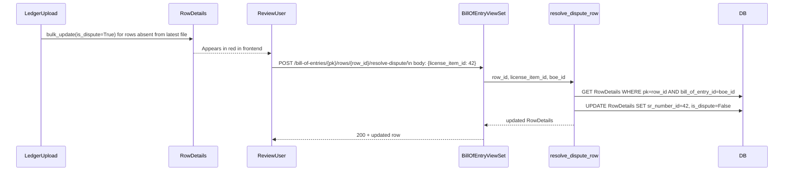
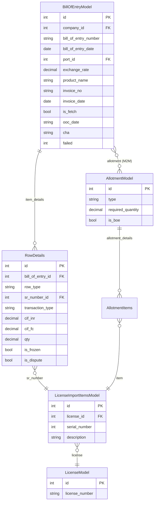
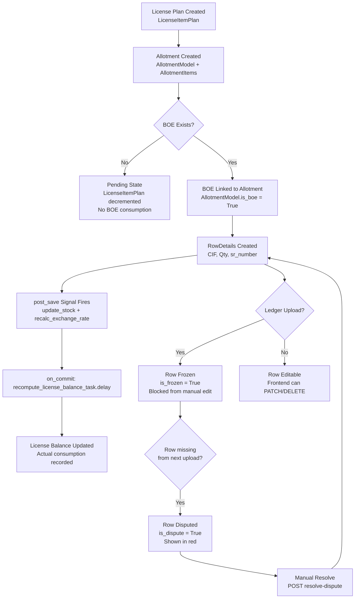
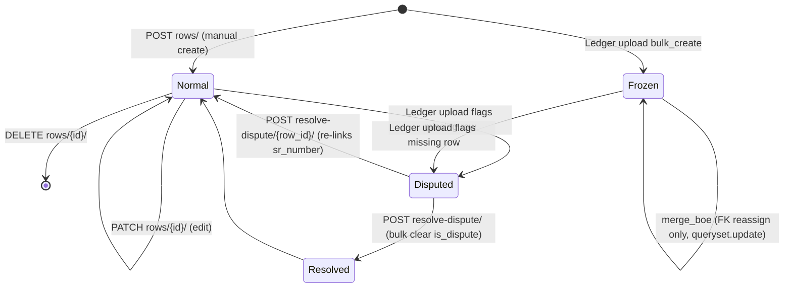
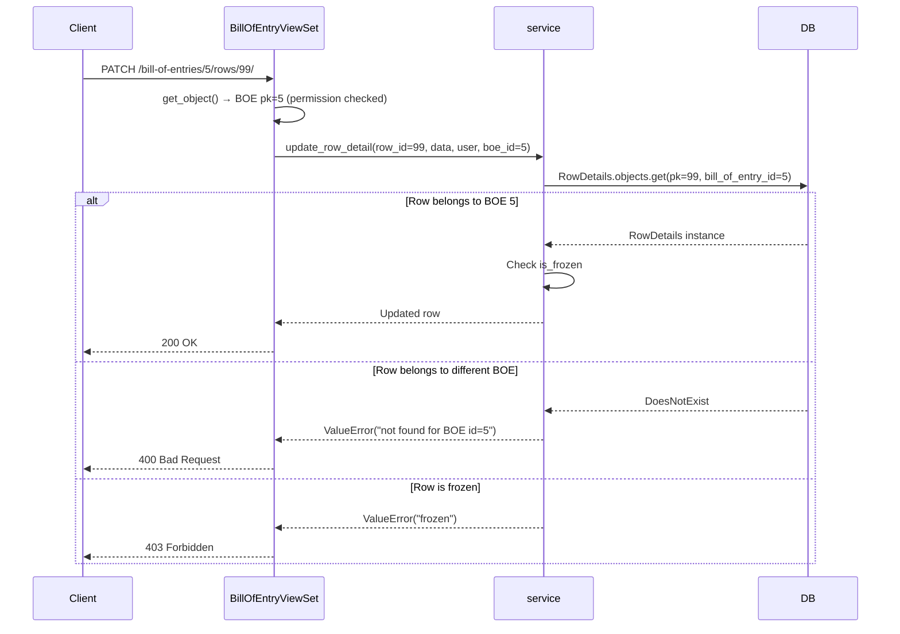

# Bill of Entry Module

## Purpose

The Bill of Entry (BOE) module records the ICEGATE customs clearance events for goods imported against DGFT advance authorizations. After goods arrive at a port, ICEGATE generates a Bill of Entry document. The License Manager ingests these records — manually or via a ledger file upload — and links them back to the allotments and licenses they discharge.

The BOE is the final step in the import lifecycle: License Plan → Allotment → Bill of Entry. Its row-level financial figures (CIF in INR and FC, quantity) feed the balance recompute pipeline that determines how much of each license has been consumed.

---

## Business Terminology

| Term | Meaning |
|---|---|
| BOE | Bill of Entry — the customs document issued by ICEGATE on import clearance |
| OOC Date | Out of Charge date — the date ICEGATE releases the goods; stored as `CharField` because ICEGATE returns it in non-standard formats |
| RowDetails | A single line within a BOE, linking one `LicenseImportItemsModel` item to a BOE with quantity and value figures |
| Frozen Row | A `RowDetails` row imported from an authoritative ledger upload; blocked from manual frontend edits |
| Dispute Row | A `RowDetails` row flagged `is_dispute=True` when it was present in a prior ledger but absent from the latest upload — shown in red for manual review |
| Transaction Type | `"C"` (Credit) or `"D"` (Debit) on a `RowDetails` row; defaults to Debit |
| Row Type | `"AT"` (Allotment) or `"AR"` (ARO) — classifies the license instrument backing the row |
| CHA | Custom House Agent name |
| Appraisement | Customs appraisement reference |
| is_fetch | True when the BOE record was fetched from ICEGATE rather than entered manually |

---

## Models

### BillOfEntryModel (`bill_of_entry_billofentrymodel`)

`managed=False` — the legacy database owns DDL.

| Field | Type | Business Meaning |
|---|---|---|
| `company` | FK → `core.CompanyModel` nullable | Importing company |
| `bill_of_entry_number` | CharField(25) | ICEGATE BOE number |
| `bill_of_entry_date` | DateField nullable | Date on the ICEGATE BOE document |
| `port` | FK → `core.PortModel` nullable | Port of import |
| `exchange_rate` | Decimal(12,4) ≥ 0 | Exchange rate at time of import; recomputed from row totals when rows change |
| `product_name` | CharField(255) default "" | Human-readable product description; auto-generated from linked license items |
| `allotment` | M2M → `allotment.AllotmentModel` | The allotment(s) discharged by this BOE |
| `invoice_no` | CharField(255) nullable | Commercial invoice number from the supplier |
| `invoice_date` | DateField nullable | Date on the commercial invoice |
| `is_fetch` | BooleanField default False | True when the BOE was fetched from ICEGATE |
| `boe_pdf_copy` | FileField (`boe_copies/`) nullable | Original ICEGATE PDF uploaded during fetch |
| `failed` | IntegerField default 0 | Count of failed fetch/processing attempts |
| `appraisement` | CharField(255) nullable | Customs appraisement reference |
| `ooc_date` | CharField(255) nullable | Out of Charge date; intentionally `CharField` not `DateField` due to ICEGATE format variations |
| `cha` | CharField(255) nullable | Custom House Agent name |
| `comments` | TextField nullable | Free-text comments |

Constraints and indexes:

- `unique_together = ("bill_of_entry_number", "bill_of_entry_date")` — prevents duplicate BOE registrations.
- Database indexes on: `bill_of_entry_number`; `(company, bill_of_entry_date)`; `(port, bill_of_entry_date)`; `bill_of_entry_date`; `(invoice_no, invoice_date)`; `is_fetch`; `product_name`.

Default ordering: `"-bill_of_entry_date"`.

#### Computed Properties (`@cached_property`)

These aggregate over `item_details` (the `RowDetails` reverse relation). Results are cached on the instance for the lifetime of the request.

| Property | Calculation | Business Meaning |
|---|---|---|
| `get_total_inr` | `SUM(item_details.cif_inr)` Coalesce(0), 2 dp | Total CIF value in INR across all rows |
| `get_total_fc` | `SUM(item_details.cif_fc)` Coalesce(0), 2 dp | Total CIF value in foreign currency |
| `get_total_quantity` | `SUM(item_details.qty)` Coalesce(0), 3 dp | Total quantity imported |
| `get_licenses` | Comma-joined `item.sr_number.license.license_number` | License numbers consumed by this BOE |
| `get_unit_price` | `get_total_fc / get_total_quantity`, 3 dp | Average per-unit price in FC |
| `get_exchange_rate` | `get_total_inr / get_total_fc`, 3 dp | Computed exchange rate from row data |
| `item_details_cached` | `self.item_details.all()` | Cached queryset accessor used by the above properties |

#### `save()` Behavior

When `pk` already exists (existing BOE), `save()` recomputes `exchange_rate` from the ratio of `get_total_inr / get_total_fc`. It only writes the new rate when it differs from the stored value by more than 1, preventing spurious writes and any infinite-loop risk. For new BOEs (no `pk`), it sets `exchange_rate = 0.0000` if not provided.

#### `generate_product_name_from_items()`

Walks `item_details → sr_number → items` to build a `" or "`-joined unique list of product names. If an item's name is `"Unknown Product"` (case-insensitive), it falls back to `sr_number.description`. Truncates the result to 255 characters if needed.

---

### RowDetails (`bill_of_entry_rowdetails`)

A single line within a BOE. `managed=False`.

| Field | Type | Business Meaning |
|---|---|---|
| `bill_of_entry` | FK → `BillOfEntryModel` nullable | Parent BOE |
| `row_type` | CharField(2) choices AR/AT | ARO or Allotment; classifies the license instrument |
| `sr_number` | FK → `license.LicenseImportItemsModel` | The specific license line item being discharged |
| `transaction_type` | CharField(2) choices C/D | Credit or Debit; defaults to Debit |
| `cif_inr` | Decimal(15,3) ≥ 0 | CIF value in INR for this row |
| `cif_fc` | Decimal(15,3) ≥ 0 | CIF value in foreign currency for this row |
| `qty` | Decimal(15,3) ≥ 0 | Quantity imported on this row |
| `is_frozen` | BooleanField default False | Rows created/updated by ledger upload; blocks manual edits |
| `is_dispute` | BooleanField default False | Row absent from latest ledger upload; flagged for review |

Constraint: `unique_together = ("bill_of_entry", "sr_number", "transaction_type")` — the same license item cannot appear twice with the same transaction type on one BOE.

Default ordering: `["transaction_type", "bill_of_entry__bill_of_entry_date"]`.

#### `is_frozen` Behavior

`RowDetails.save()` checks whether the existing row (by `pk`) has `is_frozen=True` before executing `super().save()`. If the row is frozen, `save()` returns silently without writing any changes. This acts as a database-level guard: even if code directly calls `.save()` on a frozen row, nothing is written.

The ledger upload path bypasses this guard by using `bulk_create` / `bulk_update` or `queryset.update()` — which do not call `save()`.

The merge operation also bypasses this guard intentionally (it uses `queryset.update()` to reassign the BOE FK, not to edit financial fields).

#### `is_dispute` Behavior

`is_dispute` is set `True` when the ledger upload detects a row that exists in the database but was not present in the uploaded file. The row is shown in red in the frontend for manual review. Disputes are cleared via:

- `resolve_dispute(boe)`: clears all dispute rows on one BOE.
- `resolve_dispute_row(row_id, license_item_id, user, boe_id)`: re-links one specific row to the correct `LicenseImportItemsModel` and clears `is_dispute`.

---

## Signal Handlers

All four signal handlers are defined in `backend/apps/bill_of_entry/models.py`.

### `update_stock` (post_save on RowDetails)

dispatch_uid: `"boe_update_stock_on_save"`

Fires after any `RowDetails` instance is saved. Reads `sr_number.license_id` from the instance and calls `_dispatch_balance_recompute(license_id)`.

### `delete_stock` (post_delete on RowDetails)

dispatch_uid: `"boe_delete_stock_on_delete"`

Fires after any `RowDetails` instance is deleted. Same logic: reads `license_id` from the (still-accessible) instance and dispatches the balance recompute.

### `recalc_exchange_rate_on_row_save` (post_save on RowDetails)

dispatch_uid: `"boe_recalc_exchange_rate_on_save"`

After a row is saved, registers `_recalculate_boe_exchange_rate(boe_id)` as an `on_commit` callback. This recomputes `exchange_rate` on the parent BOE from its row totals and writes it with `.update()` (not `.save()`) to avoid re-triggering signals.

The rate is only updated when `abs(new_rate - current_rate) > 1` (unless `force=True`).

### `recalc_exchange_rate_on_row_delete` (post_delete on RowDetails)

dispatch_uid: `"boe_recalc_exchange_rate_on_delete"`

Same as above but fires on row deletion. Also uses `on_commit`.

### `_dispatch_balance_recompute(license_id)`

Internal helper. Registers `recompute_license_balance_task.delay(license_id)` as an `on_commit` callback. Falls back to immediate dispatch if called outside a transaction (e.g., in tests). `ImportError` from the task module is logged at WARNING; other exceptions at ERROR.

---

## Service Layer

File: `backend/apps/bill_of_entry/services/boe_service.py`

No DRF `Request` objects enter this module. Functions accept model instances, dicts, and primitives. Domain errors raise `ValueError`.

### `update_product_name_for_boe(boe)`

Updates `product_name` on one BOE from its `item_details`. Skips the BOE if `product_name` already has a non-empty value. Returns a dict: `{success, product_name, message}`.

### `bulk_update_product_names()`

Batch-updates `product_name` for all BOEs where `product_name` is empty/None AND `invoice_no` is null. Uses `BillOfEntryModel.objects.bulk_update()` for efficiency. Returns: `{success, total, updated, skipped, message}`.

### `fetch_allotment_item_details(allotment_id, boe_id=None)`

Fetches allotment line items formatted for use in the BOE create/edit form. Excludes items already linked to the current BOE (identified by `boe_id`) to prevent duplicates when pulling from multiple allotments.

Returns: `{exchange_rate, product_name, port, port_name, company, company_name, item_details[]}`.

Each `item_detail` has: `sr_number`, `license_number`, `item_description`, `hs_code`, `qty`, `cif_fc`, `cif_inr`. Quantities and values fall back to the license item's own `quantity` and `unit_price` when the allotment has no figures.

### `resolve_dispute(boe)`

Clears `is_dispute=True` on all `RowDetails` for a given BOE using a single `queryset.update()`. Returns: `{success: True, cleared: int, message: str}`.

### `resolve_dispute_row(row_id, license_item_id, user, boe_id)`

Re-links one dispute row to the correct `LicenseImportItemsModel` and clears `is_dispute`.

Security: `boe_id` is required for the lookup (`RowDetails.objects.get(pk=row_id, bill_of_entry_id=boe_id)`). This scoping prevents IDOR — a caller cannot resolve a row belonging to a different BOE by supplying an arbitrary `row_id`.

Uses `queryset.update()` (not `row.save()`) to bypass the frozen-row guard in `RowDetails.save()`, because resolving a dispute on a frozen row is a legitimate administrative action that should not be blocked by the financial-edit guard.

Raises `ValueError` when: row not found for this BOE; row is not flagged as a dispute; `license_item_id` does not exist.

### `merge_boe(target_boe, source_boe_id)`

Merges a source BOE into a target BOE in `transaction.atomic()`:

1. Loads source BOE.
2. Validates that source != target.
3. Identifies existing `(sr_number_id, transaction_type)` combinations on the target.
4. Moves non-duplicate `RowDetails` from source to target using `queryset.update(bill_of_entry=target_boe)` — bypasses the frozen-row guard because only the FK is being reassigned, not financial data.
5. Copies all allotments from source to target with `target_boe.allotment.add(allotment)`.
6. Saves source port to target if target has no port.
7. Deletes the source BOE.
8. Returns `{success, message, boe: BillOfEntrySerializer.data}`.

Raises `ValueError` when: `source_boe_id` is missing; source == target; source not found.

### `update_invoice_no(boe, invoice_no)`

Updates only `invoice_no` on the BOE using `save(update_fields=["invoice_no"])`. Returns: `{id, invoice_no, message}`.

### `create_boe(data, user)`

Creates a BOE with nested row details in `transaction.atomic()` by delegating to `BillOfEntrySerializer`. Returns the created `BillOfEntryModel`.

### `update_row_detail(row_id, data, user, boe_id)`

Partial-updates one row. Security: scoped by `boe_id`. Raises `ValueError` if row not found for this BOE or if row `is_frozen`. Uses `RowDetailsSerializer` for validation.

### `delete_row_detail(row_id, user, boe_id)`

Deletes one row. Security: scoped by `boe_id`. Raises `ValueError` if row not found for this BOE or if row `is_frozen`.

---

## Security: IDOR Prevention

All row-level mutations (`update_row_detail`, `delete_row_detail`, `resolve_dispute_row`) require `boe_id` and scope the `RowDetails` lookup with:

```python
RowDetails.objects.get(pk=row_id, bill_of_entry_id=boe_id)
```

This means a user who knows a `row_id` from a different BOE cannot mutate it by supplying that `row_id` to an endpoint for a BOE they do have access to. The BOE is fetched by `get_object()` in the viewset, which applies `BillOfEntryPermission`, so the `boe_id` passed to the service is always authenticated.

---

## BOE M2M Allotment Relationship

`BillOfEntryModel.allotment` is a `ManyToManyField` to `AllotmentModel`. One BOE can discharge multiple allotments; one allotment can appear on multiple BOEs (e.g., split shipments).

**When the M2M is set (`BillOfEntrySerializer.create`):**

1. `boe.allotment.set(allotment_data)` replaces the M2M.
2. For each allotment in the new set: `allotment.is_boe = True; allotment.save()`.

**When the M2M is updated (`BillOfEntrySerializer.update`):**

1. Compute `old_allotment_ids = set(instance.allotment.values_list("id", flat=True))`.
2. `instance.allotment.set(allotment_data)`.
3. For newly-added allotments: set `is_boe = True`.
4. For removed allotments: check whether any other BOE still links them; if not, set `is_boe = False`.

**Balance formula impact (Scenario A vs Scenario B):**

- **Scenario A — BOE linked to allotment**: `RowDetails` rows attached to the BOE are counted as actual consumption against the license. The balance recompute pipeline sees these rows and subtracts their values from the license's allotted quantities.
- **Scenario B — BOE not yet linked / allotment not yet created**: The license plan shows remaining planned quantity. No BOE consumption has been recorded.

The distinction matters for dual-reporting purposes: `dfia_list` on the allotment, and `get_licenses` on the BOE, are the human-readable cross-references auditors use to verify both sides.

---

## Frozen Rows: Detail

| Aspect | Behavior |
|---|---|
| How set | Ledger upload marks rows `is_frozen=True` via `bulk_create`/`bulk_update` |
| Edit guard | `RowDetails.save()` silently returns if the row's `is_frozen=True` in the DB |
| Delete guard | `delete_row_detail` raises `ValueError("frozen")` before calling `row.delete()` |
| Update guard | `update_row_detail` raises `ValueError("frozen")` before running the serializer |
| HTTP response | View maps `"frozen"` in the error string to HTTP 403 |
| Bypass scenarios | `merge_boe` (uses `queryset.update()` for FK-only reassignment); `resolve_dispute_row` (uses `queryset.update()` for dispute resolution) |
| Sweep protection | `BillOfEntrySerializer.update()` pre-seeds `updated_item_ids` with all frozen row IDs so they are never included in the non-frozen delete sweep at end of update |

---

## Dispute Resolution Workflow



To clear all disputes on one BOE at once:

```
POST /api/v1/bill-of-entries/{pk}/resolve-dispute/
```

Returns: `{success: true, cleared: <int>, message: "..."}`.

---

## Serializers

### RowDetailsSerializer

`is_frozen` and `is_dispute` are `read_only_fields` — the frontend can never set them directly.

Read-only annotated fields sourced from the `sr_number` FK:

| Serializer Field | Source |
|---|---|
| `license_number` | `sr_number.license.license_number` |
| `item_description` | `sr_number.description` |
| `hs_code` | `sr_number.hs_code.hs_code` |
| `item_serial_number` | `sr_number.serial_number` |
| `condition_type` | `sr_number.condition_type` |
| `purchase_status` | `sr_number.license.purchase_status.code` |

### BillOfEntrySerializer

Handles nested `item_details` on create and update. Also accepts `multipart/form-data` with `item_details` as a JSON string or with indexed keys like `item_details[0].sr_number`.

**Create**: Uses `update_or_create` on `(bill_of_entry_number, bill_of_entry_date)` so re-submitting the same BOE number + date updates the existing record rather than erroring.

**Update**: Frozen rows are never swept — they are pre-seeded into `updated_item_ids` before the non-frozen delete sweep at the end of `update()`.

**`to_representation`**: Auto-calculates `exchange_rate` from row totals when the stored value is 0 or null. Also appends an `allotments` array with summary data for linked allotments.

---

## All API Endpoints

Base URL prefix (BOE): `/api/v1/bill-of-entries/`

| Method | URL | Auth | Description |
|---|---|---|---|
| POST | `/api/v1/bill-of-entries/upload-ledger/` | JWT + LedgerUploadPermission | Async ledger file upload (xlsx/xls/csv ≤ 10 MB); returns `{task_id, status: "pending"}` HTTP 202 |
| GET | `/api/v1/bill-of-entries/` | JWT + BillOfEntryPermission | List BOEs; supports filters, search, ordering |
| POST | `/api/v1/bill-of-entries/` | JWT + BillOfEntryPermission | Create BOE with nested rows |
| GET | `/api/v1/bill-of-entries/{pk}/` | JWT + BillOfEntryPermission | Retrieve single BOE with nested rows |
| PUT | `/api/v1/bill-of-entries/{pk}/` | JWT + BillOfEntryPermission | Full update of BOE and rows |
| PATCH | `/api/v1/bill-of-entries/{pk}/` | JWT + BillOfEntryPermission | Partial update |
| DELETE | `/api/v1/bill-of-entries/{pk}/` | JWT + BillOfEntryPermission | Delete BOE (cascades rows) |
| GET | `/api/v1/bill-of-entries/{pk}/rows/` | JWT + BillOfEntryPermission | List all RowDetails for one BOE |
| POST | `/api/v1/bill-of-entries/{pk}/rows/` | JWT + BillOfEntryPermission | Add a new row; returns 409 on duplicate (sr_number + transaction_type) |
| PATCH | `/api/v1/bill-of-entries/{pk}/rows/{row_id}/` | JWT + BillOfEntryPermission | Update a row; returns 403 if frozen |
| DELETE | `/api/v1/bill-of-entries/{pk}/rows/{row_id}/` | JWT + BillOfEntryPermission | Delete a row; returns 403 if frozen |
| POST | `/api/v1/bill-of-entries/{pk}/rows/{row_id}/resolve-dispute/` | JWT + BillOfEntryPermission | Re-link one dispute row to a license item; clears `is_dispute`; body: `{license_item_id: int}` |
| POST | `/api/v1/bill-of-entries/{pk}/resolve-dispute/` | JWT + BillOfEntryPermission | Clear `is_dispute` on ALL rows of one BOE |

### Filtering

Filter class: `BillOfEntryFilter`

| Parameter | Field | Lookup |
|---|---|---|
| `bill_of_entry_number` | `bill_of_entry_number` | icontains |
| `company` | `company` | exact |
| `port` | `port` | exact |
| `bill_of_entry_date_after` | `bill_of_entry_date` | gte |
| `bill_of_entry_date_before` | `bill_of_entry_date` | lte |
| `is_fetch` | `is_fetch` | boolean |

### Search fields

`bill_of_entry_number`, `invoice_no`, `product_name`, `company__name`, `port__name`

### Ordering fields

`bill_of_entry_date`, `bill_of_entry_number`, `company__name`. Default: `-bill_of_entry_date`.

### Ledger Upload

```
POST /api/v1/bill-of-entries/upload-ledger/
Content-Type: multipart/form-data

file: <xlsx/xls/csv, max 10 MB>
```

Validates: file present; extension in `{.xlsx, .xls, .csv}`; size ≤ 10 MB.

Returns on success:
```json
{"task_id": "ledger-upload-stub-<uuid>", "status": "pending"}
```
HTTP 202. The `task_id` is a generated stub — the actual Celery processing is deferred and tracked separately.

The endpoint never echoes the client filename in the `task_id`, preventing log injection.

### BOE Create/Update Request Body

```json
{
  "company": 1,
  "bill_of_entry_number": "BOE-2024-00001",
  "bill_of_entry_date": "2024-03-20",
  "port": 5,
  "exchange_rate": "83.2500",
  "product_name": "Polyester Filament Yarn",
  "allotment": [1, 2],
  "invoice_no": "INV-2024-001",
  "invoice_date": "2024-03-10",
  "is_fetch": false,
  "ooc_date": "20/03/2024",
  "cha": "ABC Customs",
  "appraisement": "APP-001",
  "comments": "Cleared without issues",
  "item_details": [
    {
      "sr_number": 42,
      "transaction_type": "D",
      "row_type": "AT",
      "qty": "100.000",
      "cif_fc": "1500.00",
      "cif_inr": "124500.000"
    }
  ]
}
```

### BOE Response Body

```json
{
  "id": 1,
  "company": 1,
  "company_name": "Acme Textiles Ltd",
  "bill_of_entry_number": "BOE-2024-00001",
  "bill_of_entry_date": "2024-03-20",
  "port": 5,
  "port_name": "JNPT",
  "allotment": [1, 2],
  "allotments": [
    {
      "id": 1,
      "item_name": "Polyester Yarn",
      "invoice": "INV-2024-001",
      "required_quantity": "100.00",
      "estimated_arrival_date": "2024-03-15",
      "company": "Acme Textiles Ltd"
    }
  ],
  "exchange_rate": "83.0000",
  "product_name": "Polyester Filament Yarn",
  "invoice_no": "INV-2024-001",
  "invoice_date": "2024-03-10",
  "is_fetch": false,
  "boe_pdf_copy": null,
  "failed": 0,
  "appraisement": "APP-001",
  "ooc_date": "20/03/2024",
  "cha": "ABC Customs",
  "comments": "Cleared without issues",
  "item_details": [
    {
      "id": 1,
      "sr_number": 42,
      "cif_inr": "124500.000",
      "cif_fc": "1500.000",
      "qty": "100.000",
      "is_frozen": false,
      "is_dispute": false,
      "license_number": "DFIA-2024-00123",
      "item_description": "Polyester Filament Yarn",
      "hs_code": "54024700",
      "item_serial_number": 1,
      "condition_type": "NEW",
      "purchase_status": "ACTIVE"
    }
  ],
  "total_inr": "124500.00",
  "total_fc": "1500.00",
  "total_quantity": "100.000",
  "licenses": "DFIA-2024-00123",
  "unit_price": "15.000",
  "created_on": "2024-01-01",
  "modified_on": "2024-01-01",
  "created_by": 1,
  "modified_by": 1
}
```

---

## Scenario A vs Scenario B: Balance Calculation Impact

### Scenario A: BOE fully linked to allotment and license items

```
License Plan (planned_quantity=1000)
  └── LicenseItemPlan (planned_quantity=100)
        └── AllotmentItems (qty=100, item_id=42)
              └── AllotmentModel (id=1)
                    └── BillOfEntryModel.allotment M2M
                          └── RowDetails (sr_number_id=42, qty=100, cif_fc=1500)
```

The `recompute_license_balance_task` sees `RowDetails.qty=100` against `sr_number_id=42` and deducts it from the license's consumed balance. The allotment's `balanced_quantity = max(required_quantity - alloted_quantity, 0) = 0`.

### Scenario B: Allotment created but no BOE yet

```
License Plan (planned_quantity=1000)
  └── LicenseItemPlan (planned_quantity=900)  ← decremented by allotment creation
        └── AllotmentItems (qty=100, item_id=42)
              └── AllotmentModel (id=1, is_boe=False)
```

No `RowDetails` exist. The license balance recompute finds no BOE consumption for this license item. The license plan still shows 900 remaining (100 reserved but not yet cleared by ICEGATE).

This dual-state is by design: the `LicenseItemPlan` tracks forward-looking reservation; the `RowDetails`-driven recompute tracks actual consumption. The difference between them is the "pending clearance" figure.

---

## Mermaid Diagrams

### Entity Relationships



### BOE Lifecycle Flow



### Frozen vs Dispute Row State Machine



### Row Mutation Security (IDOR Prevention)


