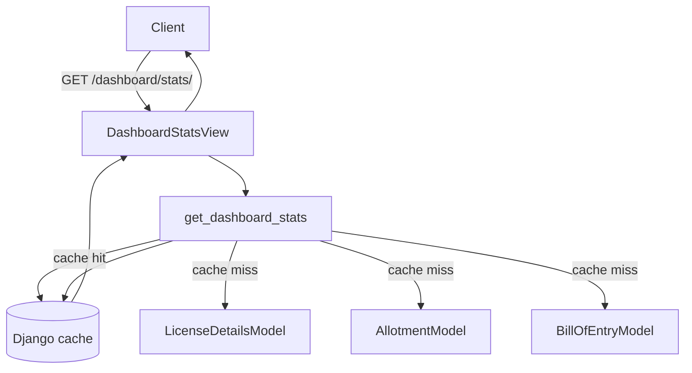

# Dashboard Module

## Purpose

The Dashboard module provides a read-only, aggregated KPI view of the license portfolio. It exposes four endpoints — headline stats, a utilisation chart, a monthly activity chart, and an expiring-license alert list — each backed by a cached aggregation query. No data is mutated; this module is intentionally read-only.

---

## Entry Points

| Layer | File |
|---|---|
| Service | `backend/apps/dashboard/services/dashboard_service.py` |
| Views | `backend/apps/dashboard/views.py` |
| Serializers | `backend/apps/dashboard/serializers.py` |
| URLs | `backend/apps/dashboard/urls.py` |

---

## Architecture



All four service functions follow the same pattern:
1. Check `cache.get(cache_key)`. Return cached result immediately if present.
2. Execute the aggregation query.
3. Store result in cache via `cache.set(cache_key, result, CACHE_TTL)`.
4. Return result.

---

## 5-Minute Cache

`CACHE_TTL = 60 * 5` (300 seconds) is a module-level constant in `dashboard_service.py:27`.

All four functions are cached with global keys (not per-user). Dashboard data is identical for all authenticated users; per-user caching would waste memory without benefit.

| Function | Cache key |
|---|---|
| `get_dashboard_stats` | `dashboard:stats:global` |
| `get_license_utilisation_chart` | `dashboard:utilisation:global` |
| `get_monthly_activity` | `dashboard:activity:global` |
| `get_expiring_licenses` | `dashboard:expiring:global` |

The cache backend is whatever Django's `CACHES` setting configures (typically Redis in production, local-memory in development).

---

## `get_dashboard_stats(user)`

Returns nine KPI counters. The `user` parameter is accepted for future per-user filtering but is not currently used in queries.

### The N+1 Fix

The original implementation ran six separate `COUNT` queries against `LicenseDetailsModel`. The current implementation collapses all six into one `aggregate()` call with conditional filters:

```python
stats = LicenseDetailsModel.objects.aggregate(
    total=Count("pk"),
    active_licenses=Count("pk", filter=Q(flags__is_expired=False, flags__is_null=False)),
    expired_licenses=Count("pk", filter=Q(flags__is_expired=True, flags__is_null=False)),
    null_licenses=Count("pk", filter=Q(flags__is_null=True)),
    expiring_soon=Count(
        "pk",
        filter=Q(
            flags__is_active=True,
            license_expiry_date__gte=today,
            license_expiry_date__lte=thirty_days_ahead,
            balance__balance_cif__gte=Decimal("100.00"),
        ),
    ),
    total_balance_cif_sum=Sum("balance__balance_cif"),
    low_balance_licenses=Count("pk", filter=Q(flags__is_active=True, balance__balance_cif__lt=Decimal("100.00"))),
)
```

`AllotmentModel` and `BillOfEntryModel` require separate queries because they are on different tables with no FK to `LicenseDetailsModel` at the aggregation level.

### Metrics Returned

| Key | Type | How computed |
|---|---|---|
| `total_licenses` | `int` | `Count("pk")` — all licenses |
| `active_licenses` | `int` | `Count` where `flags.is_expired=False` AND `flags.is_null=False` |
| `expired_licenses` | `int` | `Count` where `flags.is_expired=True` AND `flags.is_null=False` |
| `null_licenses` | `int` | `Count` where `flags.is_null=True` |
| `expiring_soon` | `int` | `Count` where `flags.is_active=True` AND `license_expiry_date` within 30 days AND `balance.balance_cif >= 100.00` |
| `total_balance_cif` | `str` | `Sum("balance__balance_cif")` — serialized as string to preserve decimal precision |
| `low_balance_licenses` | `int` | `Count` where `flags.is_active=True` AND `balance.balance_cif < 100.00` |
| `recent_boes` | `int` | Separate `COUNT` on `BillOfEntryModel` where `created_on >= 30 days ago`. Returns 0 if `BillOfEntryModel` is not installed (guarded by `try/except ImportError`) |
| `recent_allotments` | `int` | Separate `COUNT` on `AllotmentModel` where `modified_on >= 30 days ago` |

Date anchors (computed once at function start):
- `today = date.today()`
- `thirty_days_ago = today - timedelta(days=30)`
- `thirty_days_ahead = today + timedelta(days=30)`

### BillOfEntryModel Graceful Degradation

The module attempts to import `BillOfEntryModel` at module load time:

```python
try:
    from apps.bill_of_entry.models import BillOfEntryModel as _BillOfEntryModel
except ImportError:
    _BillOfEntryModel = None
```

Every code path that calls `_boe_model()` checks for `None` before executing a query. This allows the dashboard to function (with `recent_boes = 0`) even when the `bill_of_entry` app is not installed.

---

## `get_license_utilisation_chart(user)`

Returns the top 10 licenses ordered by `balance_cif` descending.

```python
qs = (
    LicenseDetailsModel.objects
    .select_related("balance")
    .filter(balance__balance_cif__isnull=False)
    .order_by("-balance__balance_cif")[:10]
)
```

Returns a list of dicts:
```json
[
  {"license_number": "DFIA/2025/00123", "balance_cif": "450000.00"},
  ...
]
```

`balance_cif` is returned as a string (via `str(lic.balance.balance_cif)`) to preserve decimal precision in JSON.

---

## `get_monthly_activity(user)`

Returns BOE and allotment counts per calendar month for the last 12 months. The result is a complete 12-month grid — months with zero activity still appear so the frontend chart always has a full year.

### Query

```python
allotment_qs = (
    AllotmentModel.objects
    .filter(modified_on__gte=twelve_months_ago)
    .annotate(month=TruncMonth("modified_on"))
    .values("month")
    .annotate(count=Count("pk"))
    .order_by("month")
)
```

BOE uses the same pattern on `created_on`, wrapped in `try/except` for graceful degradation.

### Grid Construction

The function generates 12 month boundaries by stepping backward from today's first-of-month, then reverses to oldest-first order. Each month is looked up in the `allotment_by_month` and `boe_by_month` dicts; missing months default to `0`.

Returns:
```json
[
  {"month": "Jul 2025", "boe_count": 12, "allotment_count": 8},
  {"month": "Aug 2025", "boe_count": 0, "allotment_count": 3},
  ...
]
```

---

## `get_expiring_licenses(user)`

Returns up to 20 active licenses expiring within the next 30 days with a non-trivial balance.

```python
qs = (
    LicenseDetailsModel.objects
    .select_related("balance", "flags")
    .filter(
        license_expiry_date__gte=today,
        license_expiry_date__lte=thirty_days_ahead,
        flags__is_active=True,
        balance__balance_cif__gte=Decimal("100.00"),
    )
    .order_by("license_expiry_date")[:20]
)
```

The `Decimal("100.00")` threshold filters out licenses with negligible remaining value to reduce alert noise.

Returns:
```json
[
  {
    "license_number": "DFIA/2025/00042",
    "license_expiry_date": "2025-08-10",
    "balance_cif": "12500.00",
    "days_to_expiry": 26
  },
  ...
]
```

`days_to_expiry` is computed in Python: `(lic.license_expiry_date - today).days`.

---

## Views (`backend/apps/dashboard/views.py`)

Four thin `APIView` subclasses. Each delegates entirely to the service layer and returns the result unchanged. All share the same pattern:

1. Call service function with `request.user`.
2. Return `Response(data)` on success.
3. Return `Response({"detail": "An unexpected error occurred."}, status=500)` on any unhandled exception (logged via `logger.exception`).

| View class | URL name | Service function |
|---|---|---|
| `DashboardStatsView` | `stats` | `get_dashboard_stats` |
| `UtilisationChartView` | `utilisation-chart` | `get_license_utilisation_chart` |
| `ActivityChartView` | `activity-chart` | `get_monthly_activity` |
| `ExpiringLicensesView` | `expiring-licenses` | `get_expiring_licenses` |

---

## Serializers (`backend/apps/dashboard/serializers.py`)

Serializers are defined but the views bypass them (returning the service dict directly via `Response(data)`). They serve as schema documentation.

`DashboardStatsSerializer` — nine fields matching the service return dict.
`ExpiringLicenseSerializer` — four fields: `license_number`, `license_expiry_date`, `balance_cif`, `days_to_expiry`.

---

## API Endpoints

Base prefix: `/api/v1/dashboard/`

| Method | Path | Description | Cache key |
|---|---|---|---|
| `GET` | `stats/` | Nine headline KPI counters | `dashboard:stats:global` |
| `GET` | `charts/utilisation/` | Top-10 licenses by `balance_cif` | `dashboard:utilisation:global` |
| `GET` | `charts/activity/` | Monthly BOE + allotment counts (12 months) | `dashboard:activity:global` |
| `GET` | `expiring-licenses/` | Licenses expiring within 30 days | `dashboard:expiring:global` |

Permission: `IsAuthenticated` on all four endpoints. No special role required.

Response format: plain JSON (no envelope wrapper). The `data` key is the list or dict returned by the service function directly.

---

## Database Tables

| Model | Table | Used by |
|---|---|---|
| `LicenseDetailsModel` | `license_licensedetailsmodel` | All four service functions |
| `AllotmentModel` | `allotment_allotmentmodel` | `get_dashboard_stats`, `get_monthly_activity` |
| `BillOfEntryModel` | `bill_of_entry_billofentrymodel` | `get_dashboard_stats`, `get_monthly_activity` (graceful fallback) |
| `LicenseBalance` | Joined via `balance__` lookups | `get_dashboard_stats`, `get_license_utilisation_chart`, `get_expiring_licenses` |
| `LicenseFlags` | Joined via `flags__` lookups | `get_dashboard_stats`, `get_expiring_licenses` |

---

## Edge Cases

- **Cache invalidation**: Dashboard cache is never actively invalidated on license or allotment changes. Data may be up to 5 minutes stale. This is an accepted trade-off; the dashboard is for trend visibility, not real-time accuracy.
- **`total_balance_cif` as string**: `Sum` of Decimal columns returns a `Decimal` or `None`. The service converts to `str(value or Decimal("0.00"))`. The serializer field is `CharField` to avoid DRF rounding.
- **`BillOfEntryModel` not installed**: `_boe_model()` returns `None`; all BOE stats default to 0. No exception is raised.
- **`expiring_soon` vs `get_expiring_licenses`**: The stats counter and the detail list both filter by 30-day window and `balance_cif >= 100`, so their counts should match. However, the stats query uses conditional aggregation across all columns (one SQL pass) while the detail query is a separate SELECT, so there is a small window for divergence if data changes between the two calls (cache mitigates this in practice).
- **Licenses with no `balance` related object**: Filtered out by `balance__balance_cif__isnull=False` in the utilisation chart query and by the `>= 100` threshold in expiring licenses.
