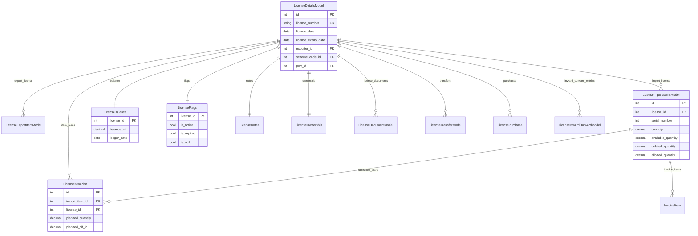

# License Module

## Purpose and Business Objective

The License module is the core of the DGFT (Directorate General of Foreign Trade) License Manager. It models Advance Authorisation Licenses issued by the Indian government under the Foreign Trade Policy. These licenses permit duty-free import of raw materials needed to manufacture and export finished goods.

The module tracks every lifecycle stage: creation, item planning, allotment to an importer, Bill of Entry debit, and eventual expiry or trade. It also handles three incentive license types — RODTEP, ROSTL, and MEIS — which are separate scrip-based instruments earned on exports.

## Business Terminology

| Term | Definition |
|------|-----------|
| Advance Authorisation (AA) | A DGFT license that permits duty-free import of inputs used to manufacture export products. Also called Advance Licence (ADL). |
| DFIA | Duty-Free Import Authorisation — a transferable variant of AA. |
| RODTEP | Remission of Duties and Taxes on Exported Products — an export incentive scrip. |
| ROSTL | Rebate of State and Central Taxes and Levies — a predecessor incentive scheme. |
| MEIS | Merchandise Exports from India Scheme — an older export reward scrip. |
| CIF | Cost, Insurance, and Freight — the standard import valuation basis used throughout balance calculations. |
| FOB | Free On Board — the export valuation basis used on export items. |
| Credit | The authorised CIF import entitlement recorded on export items. |
| Debit | The CIF value actually consumed by Bills of Entry (RowDetails with transaction_type=DEBIT). |
| Allotment | A forward reservation of license CIF value for an importer, before a Bill of Entry is raised. |
| Trade | A license sale, recorded as LicenseTradeLine with direction=SALE. |
| Balance | `max(0, credit − debit − allotment − trade)` — the CIF value remaining available. |
| Plan | A LicenseItemPlan row capturing planned import quantity and value per import item. Allotment creation is gated against the plan when one exists. |
| BOE | Bill of Entry — the customs declaration raised when goods physically arrive. |
| is_null | Flag set when balance_cif < 500 FC units — indicates a nearly-exhausted license. |
| is_expired | Flag set when license_expiry_date is in the past. |
| Ledger Date | The date when LicenseBalance was last recomputed. |
| Serial Number | The position of an import item within its parent license (unique per license). |
| Transfer Letter | A document transferring ownership of a license from one company to another. |

## Database Models

All models use `managed = False` — the tables were created by the legacy Django application and Django's migrations system will never create, alter, or drop them.

### LicenseDetailsModel

**Table:** `license_licensedetailsmodel`

Central record. One row per Advance Authorisation license. All financial and administrative sub-data hangs off this via OneToOne or FK relations.

| Field | Type | Constraints | Business Meaning |
|-------|------|-------------|-----------------|
| id | AutoField (PK) | unique | System identifier |
| license_number | CharField(255) | unique, not null | DGFT-issued license number (e.g. `0510234567890`) — globally unique |
| license_date | DateField | nullable | Date the license was issued |
| license_expiry_date | DateField | nullable | Date the license expires — drives is_expired flag |
| file_number | CharField(255) | blank, default="" | Internal file reference number |
| registration_number | CharField(255) | blank, default="" | Customs registration number |
| registration_date | DateField | nullable | Date of customs registration |
| ge_file_number | IntegerField | nullable | GE (Government Entity) file number |
| archived_exporter_name | CharField(255) | blank, default="" | Historical exporter name when exporter record was deleted |
| purchase_status | FK → core.PurchaseStatus | nullable, SET_NULL | Tracks whether the license was purchased on the secondary market |
| scheme_code | FK → core.SchemeCode | nullable, SET_NULL | Scheme under which the license was granted (e.g. DFIA, ADL) — displayed as `license_type` in the UI |
| notification_number | FK → core.NotificationNumber | nullable, SET_NULL | DGFT policy notification number governing this license |
| exporter | FK → core.CompanyModel | nullable, SET_NULL | Company that holds the license |
| port | FK → core.PortModel | nullable, SET_NULL | Port of registration |
| created_by, modified_by | FK → User | from AuditModel | Audit trail |
| created_on, modified_on | DateTimeField | from AuditModel | Timestamps |

**Ordering:** `(license_expiry_date, license_date)` — soonest-to-expire first in all list views.

---

### LicenseExportItemModel

**Table:** `license_licenseexportitemmodel`

Export items attached to a license. These define the credit side of the balance. Summing `cif_fc` across all export items for a license gives the total authorised CIF value.

| Field | Type | Business Meaning |
|-------|------|-----------------|
| license | FK → LicenseDetailsModel (CASCADE) | Parent license |
| item | FK → core.ItemNameModel (nullable) | Export item name |
| norm_class | FK → core.SionNormClassModel (nullable) | SION norm classification |
| description | CharField(2000) | Free-text product description |
| duty_type | CharField(50) | Type of duty waiver |
| net_quantity | DecimalField(15,2) | Authorised export quantity |
| old_quantity | DecimalField(15,2) | Quantity before last amendment |
| unit | CharField(10) | Unit of measure (KGS, MTS, NOS, PCS, LTR, MTR, SQM, SET, DZN, PAR, OTH) |
| fob_fc | DecimalField(15,2) | FOB value in foreign currency |
| fob_inr | DecimalField(15,2) | FOB value in INR |
| fob_exchange_rate | DecimalField(15,6) | Exchange rate used for FOB conversion |
| currency | CharField(10) | Foreign currency (USD, EUR, GBP, JPY, CNY, INR, AUD, CAD, SGD, CHF, AED, HKD, SEK, NZD, OTH) |
| value_addition | DecimalField(15,2) | Value addition percentage |
| **cif_fc** | DecimalField(15,2) | **CIF value in foreign currency — summed to compute the credit component of the balance** |
| cif_inr | DecimalField(15,2) | CIF value in INR |

---

### LicenseImportItemsModel

**Table:** `license_licenseimportitemsmodel`

Import items on the license. Each item represents one class of goods that can be imported duty-free. This is the debit side — bills of entry and allotments reduce available quantity and value.

The six balance fields (`available_quantity`, `available_value`, `debited_quantity`, `debited_value`, `allotted_quantity`, `allotted_value`) are denormalized from the BOE and allotment tables and kept current by `balance_service.recompute_license_balance()`. They are never written directly by the API.

**Unique constraint:** `(license, serial_number)` — no two import items on the same license may share a serial number.

| Field | Type | Business Meaning |
|-------|------|-----------------|
| license | FK → LicenseDetailsModel (CASCADE) | Parent license |
| hs_code | FK → core.HSCodeModel (nullable) | Harmonized System customs classification code |
| items | M2M → core.ItemNameModel | Item names associated with this import line |
| serial_number | IntegerField | Position within the license (1-based, unique per license) |
| description | CharField(2000) | Product description |
| **quantity** | DecimalField(15,3) | Total authorised import quantity |
| old_quantity | DecimalField(15,3) | Quantity before last amendment |
| unit | CharField(10) | Unit of measure |
| **cif_fc** | DecimalField(15,2) | Authorised CIF value in foreign currency |
| cif_inr | DecimalField(15,2) | Authorised CIF value in INR |
| **available_quantity** | DecimalField(15,3) | **Denormalized: `max(0, quantity − debited_quantity − allotted_quantity)` — updated by balance_service** |
| **available_value** | DecimalField(15,2) | **Denormalized: remaining CIF value (not recomputed by current balance_service — field exists for legacy compatibility)** |
| **debited_quantity** | DecimalField(15,3) | **Denormalized: SUM of RowDetails.qty where transaction_type='D' for this item** |
| **debited_value** | DecimalField(15,2) | **Denormalized: SUM of RowDetails.cif_fc where transaction_type='D'** |
| **allotted_quantity** | DecimalField(15,3) | **Denormalized: SUM of AllotmentItems.qty (pending AT allotments, no linked BOE)** |
| **allotted_value** | DecimalField(15,2) | **Denormalized: SUM of AllotmentItems.cif_fc (same filter)** |
| is_restricted | BooleanField | Whether this item has customs restrictions |
| condition_type | CharField(8) | Type of condition attached (from SION norms) |
| comment | TextField | Free-text notes on this import line |

---

### LicenseBalance

**Table:** `license_licensebalance`

Running CIF balance snapshot. One row per license (OneToOne, license is the PK). Refreshed asynchronously by the Celery `recompute_license_balance_task`.

| Field | Type | Business Meaning |
|-------|------|-----------------|
| license | OneToOneField → LicenseDetailsModel (PK) | Parent license |
| **balance_cif** | DecimalField(15,2) | **The canonical remaining CIF balance. Formula: `max(0, credit − debit − allotment − trade)`. Quantized to 2dp with ROUND_DOWN.** |
| ledger_date | DateField | Date when this balance was last recomputed |

`balance_cif` is a materialised database column, not a Python property. This means it can be used in ORM filters and annotations without additional queries.

---

### LicenseFlags

**Table:** `license_licenseflags`

Boolean flag bag. One row per license (OneToOne, license is the PK). Two flags (`is_null`, `is_expired`) are managed automatically by the balance recompute service. Others are set manually via admin or future API endpoints.

| Field | Type | Who sets it | Business Meaning |
|-------|------|------------|-----------------|
| license | OneToOneField → LicenseDetailsModel (PK) | | |
| **is_active** | Boolean, default=True | Manual / admin | License is currently in use |
| **is_expired** | Boolean, default=False | **Auto: balance_service** | `True` when `license_expiry_date < today` — recomputed every balance cycle |
| **is_null** | Boolean, default=False | **Auto: balance_service** | `True` when `balance_cif < 500` — signals a near-zero balance |
| is_audit | Boolean, default=False | Manual | License is under audit |
| is_mnm | Boolean, default=False | Manual | M&M (specific business category) flag |
| is_not_registered | Boolean, default=False | Manual | License not yet registered with customs |
| is_au | Boolean, default=False | Manual | AU (specific business category) flag |
| is_incomplete | Boolean, default=False | Manual | License data entry is incomplete |
| is_individual | Boolean, default=False | Manual | License held by an individual rather than a company |

---

### LicenseNotes

**Table:** `license_licensenotes`

Free-text notes. One row per license (OneToOne, license is the PK). Never auto-updated.

| Field | Business Meaning |
|-------|-----------------|
| user_comment | General internal comments |
| condition_sheet | Content of the license condition sheet |
| user_restrictions | Customs or business restrictions noted by the user |
| balance_report_notes | Notes printed on generated balance reports |

---

### LicenseOwnership

**Table:** `license_licenseownership`

Tracks the current owner of a license. A license may be sold (transferred) from one company to another. One row per license (OneToOne, license is the PK).

| Field | Business Meaning |
|-------|-----------------|
| current_owner | FK → core.CompanyModel (nullable) — the company currently holding the license |
| file_transfer_status | Status text of ongoing transfer |
| last_ownership_fetch | Timestamp of the last ownership data sync from CBIC |

---

### LicenseItemPlan

**Table:** `license_licenseitemplan`

Planning allocation per import item. Created before a Bill of Entry is raised, to forward-plan import requirements. When an allotment is created against an item that has a plan, the allotment service validates the requested quantity against `planned_quantity` and then decrements it. If no plan exists, allotment proceeds without restriction.

| Field | Type | Business Meaning |
|-------|------|-----------------|
| import_item | FK → LicenseImportItemsModel (CASCADE) | Import item being planned |
| item_name | FK → core.ItemNameModel (nullable) | Specific item name in the plan |
| license | FK → LicenseDetailsModel (CASCADE) | Denormalized license link for efficient querying |
| **planned_quantity** | DecimalField(15,3) | Remaining planned quantity — decremented by allotment creation, restored by allotment deletion |
| **unit_price** | DecimalField(15,2) | Unit price per quantity |
| **planned_cif_fc** | DecimalField(15,2) | Remaining planned CIF FC — decremented/restored in sync with planned_quantity |
| **planned_cif_inr** | DecimalField(15,2) | Remaining planned CIF INR |
| note | CharField(500) | Free-text planning note |

The plan fields are decremented by `_adjust_plan()` in the allotment service with negative deltas on allotment creation, and restored with positive deltas on allotment deletion.

---

### LicenseDocumentModel

**Table:** `license_licensedocumentmodel`

File attachments linked to a license.

| Field | Type | Business Meaning |
|-------|------|-----------------|
| license | FK → LicenseDetailsModel (CASCADE) | Parent license |
| type | CharField(50) | Document category: `LICENSE COPY`, `TRANSFER LETTER`, or `OTHER` |
| file | FileField | Uploaded file stored at `license_documents/` |

---

### IncentiveLicense

**Table:** `license_incentivelicense`

Incentive scheme scrip licenses (RODTEP, ROSTL, MEIS). Separate from advance authorisation licenses. Simpler balance tracking: `balance_value = license_value − sold_value`. No complex multi-component formula.

| Field | Type | Business Meaning |
|-------|------|-----------------|
| exporter | FK → core.CompanyModel (nullable) | License holder |
| port_code | FK → core.PortModel (nullable) | Port of registration |
| license_type | CharField(10) | `RODTEP`, `ROSTL`, or `MEIS` |
| license_number | CharField(255) | Unique scrip number |
| license_date | DateField | Issue date |
| license_expiry_date | DateField | Expiry date |
| **license_value** | DecimalField(15,2) | Total face value of the scrip |
| **sold_value** | DecimalField(15,2) | Amount sold to date |
| **balance_value** | DecimalField(15,2) | Remaining value (`license_value − sold_value`) — read-only in API |
| sold_status | CharField(10) | `NO`, `PARTIAL`, or `YES` |
| is_active | BooleanField | Whether the scrip is in circulation |
| notes | TextField | Free-text notes |

---

### LicensePurchase

**Table:** `license_licensepurchase`

Records a secondary-market purchase of an advance license. One license may have multiple purchase records.

Key fields: `mode` (AMOUNT or QTY), `amount_source` (FOB_INR, CIF_INR, CIF_USD), `invoice_number`, `purchasing_entity` (buyer), `supplier` (seller). Financial amounts: `fob_inr`, `cif_inr`, `cif_usd`, `exchange_rate`, `markup_pct`, `quantity_kg`, `rate_inr`, `amount_inr`.

---

### LicenseTransferModel

**Table:** `license_licensetransfermodel`

Records a formal DGFT ownership transfer between two companies. Includes CBIC (customs) status tracking: `transfer_status`, `cbic_status`, `cbic_response_date`. Transfer lifecycle fields: `transfer_initiation_date`, `transfer_acceptance_date`, `transfer_initiation_user`, `acceptance_user`.

---

### Invoice / InvoiceItem

**Tables:** `license_invoice`, `license_invoiceitem`

Invoice raised against a Bill of Entry for license sale. `billing_mode` controls line-item pricing: `kg` (by weight), `cif` (by CIF value), or `fob` (by FOB value). `InvoiceItem` links to a `LicenseImportItemsModel` serial number. Invoice numbers follow the format `INV-FY<YY>-<NNNN>` (unique constraint).

---

### LicenseInwardOutwardModel

**Table:** `license_licenseinwardoutwardmodel`

Tracks the physical movement of a license file to and from customs offices. Status references `StatusModel`; office references `OfficeModel`; `along_with` references `AlongWithModel`. Boolean flags: `copy`, `annexure`, `tl` (transfer letter), `aro`.

---

## Model Relationship Diagram



---

## Complete Balance Formula

The canonical formula lives in `backend/apps/license/services/balance_service.py`.

```
balance_cif = max(0, credit − debit − allotment − trade)
```

Quantized to 2 decimal places using `ROUND_DOWN`.

### Component Definitions

**credit** (`_compute_credit`, line 36)
```python
SUM(LicenseExportItemModel.cif_fc)
    WHERE license_id = <license_id>
```
All export items' CIF foreign currency values. This is the total authorised import entitlement.

**debit** (`_compute_debit`, line 47)
```python
SUM(RowDetails.cif_fc)
    WHERE sr_number__license_id = <license_id>
      AND transaction_type = 'DEBIT'
      AND bill_of_entry__license_trades__isnull = True
```
BOE line items that directly consumed license value. The `license_trades__isnull=True` filter excludes BOE rows that belong to a trade transaction — those are captured by the trade component instead.

**allotment** (`_compute_allotment`, line 68)
```python
SUM(AllotmentItems.cif_fc)
    WHERE item__license_id = <license_id>
      AND allotment__bill_of_entry__isnull = True
```
Pending allotments not yet converted to a Bill of Entry. Once an allotment is converted to a BOE, `allotment.bill_of_entry` is set, so `isnull=True` excludes it from this component and it migrates to the debit component. This prevents double-counting.

**trade** (`_compute_trade`, line 87)
```python
SUM(LicenseTradeLine.cif_fc)
    WHERE sr_number__license_id = <license_id>
      AND trade__direction = 'SALE'
```
License value sold to another party. Only SALE direction is counted.

---

## Planning Module

`LicenseItemPlan` provides forward planning before physical goods arrive.

**When created:** Users create a plan via `POST /api/v1/licenses/{license_pk}/item-plans/` before raising an allotment. The plan records how much quantity and CIF value is expected for a specific import item.

**Validation on allotment:** When `create_allotment` is called, `_validate_plan_availability` (allotment_service.py:71) runs inside the transaction. It calls `select_for_update()` on the plan row to prevent concurrent over-allotment races. If `qty_requested > plan.planned_quantity` or `cif_fc_requested > plan.planned_cif_fc`, a `ValidationError` is raised and the transaction is rolled back.

**Decrement on allotment creation:** `_adjust_plan` (allotment_service.py:101) is called with negative deltas, reducing `planned_quantity`, `planned_cif_fc`, and `planned_cif_inr` via a database-level `F()` expression update.

**Restore on allotment deletion:** `_adjust_plan` is called with positive deltas equal to the originally allotted values, restoring the plan to its pre-allotment state.

**No plan = no restriction:** If `LicenseItemPlan.objects.filter(import_item_id=...).first()` returns `None`, allotment proceeds without restriction. This preserves backward compatibility with pre-planning data.

---

## All API Endpoints

Base path: `/api/v1/`

### LicenseViewSet

| Method | Path | Auth | Description |
|--------|------|------|-------------|
| GET | `/licenses/` | JWT + LICENSE_MANAGER or LICENSE_VIEWER or TRADE_VIEWER or TRADE_MANAGER | List all licenses (paginated, filterable) |
| POST | `/licenses/` | JWT + LICENSE_MANAGER | Create a new license |
| GET | `/licenses/{id}/` | JWT + read roles | Full license detail with all satellite rows |
| PUT | `/licenses/{id}/` | JWT + LICENSE_MANAGER | Full update |
| PATCH | `/licenses/{id}/` | JWT + LICENSE_MANAGER | Partial update |
| DELETE | `/licenses/{id}/` | JWT + LICENSE_MANAGER | Delete (blocked if items exist) |
| GET | `/licenses/{id}/balance/` | JWT + read roles | Current balance snapshot |
| POST | `/licenses/{id}/recompute_balance/` | JWT + LICENSE_MANAGER | Queue async balance recompute |
| GET | `/licenses/search/?q=` | JWT + read roles | Free-text search on license_number |
| POST | `/licenses/{id}/generate_pdf/` | JWT + LICENSE_MANAGER | Queue async PDF generation |

#### List filters (`LicenseFilter`)

| Parameter | Field | Lookup |
|-----------|-------|--------|
| `license_type` | `scheme_code__code` | icontains |
| `is_expired` | `flags__is_expired` | exact boolean |
| `is_active` | `flags__is_active` | exact boolean |
| `company` | `exporter_id` | exact integer |
| `expiry_before` | `license_expiry_date` | lte |
| `expiry_after` | `license_expiry_date` | gte |
| `license_number` | `license_number` | icontains |

Ordering fields: `license_number`, `license_date`, `license_expiry_date`. Default ordering: `license_expiry_date`.

#### Response envelope

All responses follow: `{"success": true, "data": ..., "message": "..."}`.  
List endpoints use `StandardPagination` which adds a `pagination` key.

#### Serializer selection

| Action | Serializer |
|--------|-----------|
| `list`, `search` | `LicenseListSerializer` — minimal: id, license_number, license_date, license_expiry_date, exporter_name, scheme_code_display, balance_cif, is_expired, is_active |
| `retrieve` | `LicenseDetailSerializer` — all fields + nested balance, flags, notes, ownership |
| `create`, `update`, `partial_update` | `LicenseCreateSerializer` — writable FK PKs |

### ImportItemViewSet

Nested under `licenses/{license_pk}/items/`.

| Method | Path | Description |
|--------|------|-------------|
| GET | `/licenses/{license_pk}/items/` | List import items (ordered by serial_number) |
| POST | `/licenses/{license_pk}/items/` | Create import item, then dispatch async balance recompute |
| GET | `/licenses/{license_pk}/items/{pk}/` | Retrieve single item with planning fields |
| PUT | `/licenses/{license_pk}/items/{pk}/` | Full update, then async balance recompute |
| PATCH | `/licenses/{license_pk}/items/{pk}/` | Partial update, then async balance recompute |
| DELETE | `/licenses/{license_pk}/items/{pk}/` | Delete item, then async balance recompute |

After every mutating operation, `recompute_license_balance_task.delay(license_pk)` is dispatched. The balance fields (`available_quantity`, `debited_quantity`, `allotted_quantity`, `debited_value`, `allotted_value`) are read-only in this serializer — they are updated exclusively by the balance service.

The `ImportItemSerializer` exposes two planning fields as read-only computed values:
- `planned_quantity` — from the first `LicenseItemPlan` row for this item, or `None`
- `planned_cif_fc` — same

### LicenseDocumentViewSet

Nested under `licenses/{license_pk}/documents/`. Full CRUD with file upload. Permission: `LicensePermission`.

### LicenseItemPlanViewSet

Nested under `licenses/{license_pk}/item-plans/`.

| Method | Path | Description |
|--------|------|-------------|
| GET | `/licenses/{license_pk}/item-plans/` | List plans for this license |
| POST | `/licenses/{license_pk}/item-plans/` | Create a plan |
| GET | `/licenses/{license_pk}/item-plans/{pk}/` | Retrieve plan |
| PUT/PATCH | `/licenses/{license_pk}/item-plans/{pk}/` | Update plan |
| DELETE | `/licenses/{license_pk}/item-plans/{pk}/` | Delete plan |

Plans are optional. The comment in `LicenseItemPlanViewSet` (views/license.py:396) notes that creating a plan for an import item that already has one is blocked by a DB unique constraint, though this constraint is not visible in the model definition as currently coded (no `unique=True` on `import_item` — potential gap, see Known Issues).

### IncentiveLicenseViewSet

| Method | Path | Description |
|--------|------|-------------|
| GET | `/incentive-licenses/` | List (filterable, paginated) |
| POST | `/incentive-licenses/` | Create |
| GET | `/incentive-licenses/{id}/` | Retrieve |
| PUT/PATCH | `/incentive-licenses/{id}/` | Update |
| DELETE | `/incentive-licenses/{id}/` | Delete |

Permission: `IncentiveLicensePermission` (roles: `INCENTIVE_LICENSE_MANAGER`, `INCENTIVE_LICENSE_VIEWER`).

#### IncentiveLicense filters

| Parameter | Field | Lookup |
|-----------|-------|--------|
| `license_type` | `license_type` | iexact |
| `is_active` | `is_active` | exact |
| `company` | `exporter_id` | exact |
| `sold_status` | `sold_status` | iexact |
| `expiry_before` | `license_expiry_date` | lte |
| `expiry_after` | `license_expiry_date` | gte |
| `license_number` | `license_number` | icontains |

---

## Service Functions

All service functions are in `backend/apps/license/services/license_service.py`. All are wrapped in `@transaction.atomic`.

### `create_license(data: dict, user) → LicenseDetailsModel`

Creates `LicenseDetailsModel` plus four satellite rows in a single transaction: `LicenseBalance` (balance_cif=0), `LicenseFlags` (is_active=True), `LicenseNotes` (empty), `LicenseOwnership` (empty). Sets `created_by` and `modified_by` to `user`. Raises `IntegrityError` if `license_number` is not unique (caught by the serializer's `validate_license_number` before reaching here).

### `update_license(license_id: int, data: dict, user) → LicenseDetailsModel`

Fetches the license with `select_for_update()` to prevent concurrent partial updates. Sets only the fields present in `data`. Stamps `modified_by`. Raises `LicenseDetailsModel.DoesNotExist` if not found.

### `delete_license(license_id: int, user) → None`

Raises `ValidationError` if the license has any import or export items (`import_count > 0 or export_count > 0`). The caller must remove all items before deleting. If safe, hard-deletes the license (CASCADE removes all satellite rows).

### `create_import_item(license_id: int, data: dict, user) → LicenseImportItemsModel`

Verifies the parent license exists. Validates `serial_number` uniqueness within the license. Creates the `LicenseImportItemsModel` row. The view dispatches `recompute_license_balance_task` after this returns.

### `update_import_item(item_id: int, data: dict, user) → LicenseImportItemsModel`

If `serial_number` is changing, checks that the new value does not conflict with existing items on the same license (excluding the current item). Updates all provided fields. The view dispatches balance recompute after.

### `delete_import_item(item_id: int, user) → None`

Hard-deletes the item. BOE and allotment referential integrity is enforced at the database level (legacy schema constraints). The service does not add an application-level guard. The view dispatches balance recompute after deletion.

---

## All Business Rules

Extracted from code and tests:

| Code | Rule |
|------|------|
| BR-BALANCE | `balance_cif = max(0, credit − debit − allotment − trade)` |
| BR-FLOOR | Balance is always clamped to 0 — never stored as a negative value |
| BR-ITEM | `available_quantity = max(0, quantity − debited_quantity − allotted_quantity)` |
| BR-ALLOT | Creating an allotment decrements `LicenseItemPlan.planned_quantity` with a negative delta |
| BR-DELETE | Deleting an allotment restores `LicenseItemPlan.planned_quantity` with an equal positive delta |
| BR-OVERPLAN | If `qty_requested > plan.planned_quantity`, `ValidationError` is raised before any DB write |
| BR-NOPLAN | If no `LicenseItemPlan` exists for the item, allotment proceeds without quantity restriction |
| BR-BOE-BOE | `AllotmentItems` where `allotment.bill_of_entry IS NOT NULL` are excluded from the allotment component — they are already in the debit component |
| BR-SIGNAL | `RowDetails` post_save and post_delete signals dispatch `recompute_license_balance_task.delay(license_id)` |
| BR-DISPATCH | The allotment service resolves license_id from `LicenseImportItemsModel` (not from the item_id directly) before dispatching recompute |
| BR-IS_NULL | `balance_cif < 500` → `LicenseFlags.is_null = True` |
| BR-IS_EXP | `license_expiry_date < today` → `LicenseFlags.is_expired = True` |
| BR-LOCK | `_validate_plan_availability` calls `select_for_update()` on `LicenseItemPlan` to prevent concurrent over-allotment |
| BR-UNIQUE | `license_number` is unique system-wide (DB unique constraint + serializer validation) |
| BR-DEL-GUARD | A license with any import or export items cannot be deleted — `ValidationError` is raised |
| BR-SATELLITE | Every new license automatically receives four satellite rows: `LicenseBalance`, `LicenseFlags`, `LicenseNotes`, `LicenseOwnership` |
| BR-FROZEN-BOE | `RowDetails` rows with `is_frozen=True` cannot be edited or deleted (enforced in `boe_service`) |
| BR-NULL-THRESHOLD | The null threshold is a constant `Decimal("500")` defined at the module level in `balance_service.py:34` |

---

## Status / Flag Logic

Flags are stored in `LicenseFlags`. Two flags are computed automatically; the rest are managed manually.

### is_expired

Set by `recompute_license_balance` every time it runs:
```python
is_expired = (
    license_obj.license_expiry_date is not None
    and license_obj.license_expiry_date < today
)
```
If `license_expiry_date` is `None`, `is_expired` remains `False`.

### is_null

Set by `recompute_license_balance` every time it runs:
```python
is_null = balance_cif < Decimal("500")
```
A license with `balance_cif = 499.99` would have `is_null = True`. A license with `balance_cif = 500.00` would have `is_null = False`.

### is_active

Set to `True` when the license is created (`LicenseFlags.objects.create(..., is_active=True)`). Updated manually by users via admin or future dedicated endpoints. The API list endpoint exposes `is_active` as a filter parameter.

---

## Celery Tasks

Both tasks are defined in `backend/apps/license/tasks.py`.

### `recompute_license_balance_task`

```python
@shared_task(bind=True, max_retries=3, acks_late=True, reject_on_worker_lost=True)
def recompute_license_balance_task(self, license_id: int)
```

- Calls `balance_service.recompute_license_balance(license_id)`.
- Retries up to 3 times with a 60-second countdown on any exception.
- `acks_late=True` — the task message is acknowledged only after successful completion, ensuring at-least-once delivery even if the worker crashes mid-execution.
- `reject_on_worker_lost=True` — if the worker process dies, the task is re-queued rather than silently dropped.
- Returns silently (no return value) if the license was deleted between dispatch and execution.

**Dispatch triggers:**
1. `POST /licenses/{id}/recompute_balance/` — manual UI trigger
2. `ImportItemViewSet.create`, `.update`, `.destroy` — after every import item mutation
3. `RowDetails` post_save signal in `bill_of_entry/models.py` (via `_dispatch_balance_recompute`)
4. `RowDetails` post_delete signal (same function)
5. `AllotmentModel` create, update, delete (via `allotment_service._dispatch` wrapped in `transaction.on_commit`)

### `generate_license_pdf_task`

```python
@shared_task(bind=True, max_retries=2)
def generate_license_pdf_task(self, license_id: int, report_type: str, user_id: int)
```

Currently a placeholder. Updates `CeleryTaskTracker` with status `PENDING`. Phase 8 (planned) will implement actual PDF rendering. Returns no value; the frontend polls `CeleryTaskTracker` for completion status.

---

## Permission Classes

All RBAC logic is implemented in `backend/apps/accounts/permissions.py`. The license module re-exports the relevant classes from `backend/apps/license/permissions.py`.

### `LicensePermission`

Used by: `LicenseViewSet`, `ImportItemViewSet`, `LicenseDocumentViewSet`, `LicenseItemPlanViewSet`.

| Request type | Allowed roles |
|-------------|--------------|
| GET / HEAD / OPTIONS (read) | `LICENSE_MANAGER`, `LICENSE_VIEWER`, `TRADE_VIEWER`, `TRADE_MANAGER` |
| POST / PUT / PATCH / DELETE (write) | `LICENSE_MANAGER` only |

### `LicenseReadOnlyPermission`

A variant that treats all HTTP methods as reads. Used for bulk-balance endpoints that accept a large request body via POST but are semantically read-only.

| Request type | Allowed roles |
|-------------|--------------|
| All methods | `LICENSE_MANAGER`, `LICENSE_VIEWER`, `TRADE_VIEWER`, `TRADE_MANAGER` |

### `IncentiveLicensePermission`

Used by: `IncentiveLicenseViewSet`.

| Request type | Allowed roles |
|-------------|--------------|
| Read | `INCENTIVE_LICENSE_MANAGER`, `INCENTIVE_LICENSE_VIEWER` |
| Write | `INCENTIVE_LICENSE_MANAGER` only |

### Permission Base Class (`BaseRolePermission`)

- Unauthenticated or inactive users are rejected immediately.
- `is_superuser` always passes, regardless of roles.
- Role check uses `request.user.has_any_role(roles)` — a custom method on the user model that checks Django Group membership.

---

## Known Issues and Technical Debt

1. **`LicenseItemPlan` one-per-item constraint**: The view comment states "Creating a plan for an import item that already has one is blocked by DB unique constraint", but `LicenseItemPlan.import_item` does not have `unique=True` in the model definition. Either the constraint exists at the DB level in the legacy schema (not mirrored in the model) or the guard is missing in application code.

2. **`available_value` not recomputed**: `_update_item_level_balances` updates `available_quantity`, `debited_quantity`, `debited_value`, `allotted_quantity`, and `allotted_value`, but does not update `available_value`. This field exists on the model and is exposed in the API but remains at its last manually-set or legacy-imported value.

3. **`generate_license_pdf_task` is a placeholder**: Phase 8 PDF rendering is not yet implemented. The task logs a request and marks the tracker row as PENDING but produces no actual PDF file.

4. **`ImportItemSerializer.get_planned_quantity` is N+1**: For each import item in a list response, a separate DB query is issued to `LicenseItemPlan.objects.filter(import_item_id=obj.pk).first()`. There is no prefetching. Under high item counts this will produce N+1 queries.

5. **`allotted_quantity` filter includes only `allotment__type="AT"`**: In `_update_item_level_balances` (balance_service.py:162), the allotment aggregation filters `allotment__type="AT"`. The license-level `_compute_allotment` does NOT filter by type — it includes all pending allotments regardless of type. This means item-level and license-level allotment totals may differ for TR-type allotments.

6. **`managed = False` on all models**: All tables are owned by the legacy schema. Django migrations cannot make schema changes. Any new columns or indexes require manual SQL migration outside Django.

7. **No object-level permission**: `has_object_permission` is not overridden in any permission class. All access control is at the view level, not at the individual license row level. Any `LICENSE_VIEWER` can read any license.
