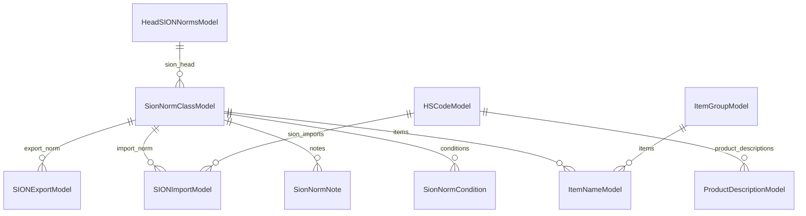

# Masters (Reference Data)

## Purpose

The masters module provides all reference / lookup data required for DGFT
(Directorate General of Foreign Trade) compliance. Every license, allotment,
bill of entry, and trade record references one or more master records. The
module owns 23 models, all read from the legacy database (`managed=False`), and
exposes them through a uniform REST API under `/api/v1/masters/`.

---

## Entry Points

| Layer   | File                                             | Role                                    |
|---------|--------------------------------------------------|-----------------------------------------|
| Models  | `backend/apps/core/models/masters.py`            | 23 ORM model definitions                |
| Serializers | `backend/apps/core/serializers/masters.py`   | DRF serializers for all models          |
| Views   | `backend/apps/core/views/masters.py`             | ViewSet classes; `MasterViewSetMixin`   |
| Filters | `backend/apps/core/filters.py`                   | django-filter FilterSet classes         |
| URLs    | `backend/apps/core/urls.py`                      | Router registrations                    |

---

## Files

```
backend/apps/core/
  models/masters.py        — all 23 models + 2 abstract bases
  serializers/masters.py   — serializers (AuditSerializerMixin, 23 serializers)
  views/masters.py         — MasterViewSetMixin, MasterWritePermission, 24 viewsets
  filters.py               — 11 FilterSet classes
  urls.py                  — DefaultRouter with 26 registered viewsets
```

---

## Abstract Base Models

### AuditModel

`backend/apps/core/models/masters.py:32`

Used by all editable masters. Fields:

| Field         | Type          | Notes                                              |
|---------------|---------------|----------------------------------------------------|
| `created_on`  | DateTimeField | `auto_now_add=True`                                |
| `created_by`  | FK → User     | `SET_NULL`; `null=True`                            |
| `modified_on` | DateTimeField | `auto_now=True`                                    |
| `modified_by` | FK → User     | `SET_NULL`; `null=True`                            |

Note: the shared app has a separate `shared.models.AuditModel`
(`backend/shared/models.py`) with different field names (`created_at`,
`updated_at`, `deleted_at`) used by managed models. The two are distinct — the
core `AuditModel` mirrors the legacy schema exactly.

### SyncTimestampModel

`backend/apps/core/models/masters.py:59`

Used by bulk-imported SION models that participate in delta sync. Fields:
`created_on` (default=`timezone.now`, editable=False), `modified_on` (auto_now).

---

## All 23 Master Models

### Priority Masters (FK targets for other modules)

#### CompanyModel

`backend/apps/core/models/masters.py:76` — Table: `core_companymodel`

IEC holder (company). The primary entity in the license management workflow.

| Field               | Type          | Notes                                          |
|---------------------|---------------|------------------------------------------------|
| `iec`               | CharField(10) | Unique; Importer Exporter Code                 |
| `pan`               | CharField(50) | Regex-validated PAN format                     |
| `gst_number`        | CharField(50) | Regex-validated GST format                     |
| `name`              | CharField(255)|                                                |
| `contact_person`    | CharField(255)| Nullable                                       |
| `phone_number`      | CharField(255)| Nullable                                       |
| `email`             | EmailField    | Nullable                                       |
| `address_line_1/2`  | TextField     |                                                |
| `logo/signature/stamp` | ImageField | Upload to `companies/`                         |
| `bill_colour`       | CharField(20) | Default `#333`                                 |
| `bank_account_number` | CharField(30)| Nullable                                      |
| `bank_name`         | CharField(255)| Nullable                                       |
| `ifsc_code`         | CharField(11) | Regex-validated IFSC format                    |
| `account_type`      | CharField(20) | Choices: SAVINGS, CURRENT, OD                  |

#### PortModel

`backend/apps/core/models/masters.py:149` — Table: `core_portmodel`

Port master. Referenced on license, bill-of-entry, and trade records.

| Field  | Type           | Notes                    |
|--------|----------------|--------------------------|
| `code` | CharField(10)  | Unique                   |
| `name` | CharField(255) |                          |

Ordering: `(code, name)`. Unique together: `(name, code)`.

Note: this table can have 500+ rows. Use `?all=true` only for small dropdown
payloads. For large lists, apply `?code=` or `?search=` filters first.

#### HSCodeModel

`backend/apps/core/models/masters.py:168` — Table: `core_hscodemodel`

Harmonised System Code. Referenced by SION import norms and trade records.

| Field                 | Type           | Notes                          |
|-----------------------|----------------|--------------------------------|
| `hs_code`             | CharField(8)   | Unique                         |
| `product_description` | TextField      | Nullable                       |
| `unit_price`          | DecimalField   | ≥ 0                            |
| `basic_duty`          | CharField(225) | Nullable                       |
| `unit`                | CharField(255) | Nullable                       |
| `policy`              | CharField(255) | Nullable                       |
| `note`                | TextField      | Nullable                       |

Note: thousands of rows exist. Always filter or search before requesting
`?all=true`.

#### ItemGroupModel

`backend/apps/core/models/masters.py:237` — Table: `core_itemgroupmodel`

Item group / category master. Parent for `ItemNameModel`.

| Field  | Type           | Notes  |
|--------|----------------|--------|
| `name` | CharField(255) | Unique |

#### ItemNameModel

`backend/apps/core/models/masters.py:254` — Table: `core_itemnamemodel`

Item name. Belongs to an `ItemGroupModel`; optionally linked to a
`SionNormClassModel` for restriction calculations.

| Field                  | Type          | Notes                                          |
|------------------------|---------------|------------------------------------------------|
| `name`                 | CharField(255)| Unique                                         |
| `group`                | FK → ItemGroupModel | Nullable; CASCADE                        |
| `is_active`            | BooleanField  | Default True                                   |
| `sion_norm_class`      | FK → SionNormClassModel | Nullable; SET_NULL                 |
| `restriction_percentage`| DecimalField | ≥ 0; e.g. `2.00` = 2%                         |
| `display_order`        | IntegerField  | ≥ 1; controls report ordering                  |

Ordering: `[display_order, group__name, name]`.

#### SionNormClassModel

`backend/apps/core/models/masters.py:213` — Table: `core_sionnormclassmodel`

SION norm class. Groups export/import norms under a heading. Used as FK by
`ItemNameModel` and `SIONExportModel`/`SIONImportModel`.

| Field         | Type           | Notes                          |
|---------------|----------------|--------------------------------|
| `head_norm`   | FK → HeadSIONNormsModel | CASCADE; `related_name="sion_head"` |
| `description` | CharField(255) | Nullable                       |
| `norm_class`  | CharField(10)  | Unique; e.g. `E132`            |
| `is_active`   | BooleanField   | Default False                  |

#### ExchangeRateModel

`backend/apps/core/models/masters.py:300` — Table: `core_exchangeratemodel`

Currency exchange rates for INR conversion. Ordering: `[-date]` so the latest
row is first.

| Field           | Type          | Notes                         |
|-----------------|---------------|-------------------------------|
| `date`          | DateField     | Unique                        |
| `usd`           | DecimalField  | USD to INR rate               |
| `euro`          | DecimalField  | Euro to INR rate              |
| `pound_sterling`| DecimalField  | GBP to INR rate               |
| `chinese_yuan`  | DecimalField  | CNY to INR rate               |

Class methods:
- `get_active_rate()` — returns the most recent row (`objects.first()`).
- `get_rate_for_date(date)` — returns the rate on or before the given date.

`ExchangeRateSerializer.get_is_active()` caches the active rate in serializer
context (`_active_exchange_rate`) to avoid N+1 queries when serializing lists.

### SION Sub-Models

#### HeadSIONNormsModel

`backend/apps/core/models/masters.py:196` — Table: `core_headsionnormsmodel`

Top-level SION norm heading. Groups `SionNormClassModel` records.

| Field  | Type           | Notes                 |
|--------|----------------|-----------------------|
| `uid`  | UUIDField      | Unique; nullable      |
| `name` | CharField(255) |                       |

Inherits `SyncTimestampModel`.

#### SIONExportModel

`backend/apps/core/models/masters.py:535` — Table: `core_sionexportmodel`

Export norm row for a SION norm class.

| Field         | Type           | Notes                          |
|---------------|----------------|--------------------------------|
| `uid`         | UUIDField      | Unique; nullable               |
| `norm_class`  | FK → SionNormClassModel | CASCADE; `related_name="export_norm"` |
| `description` | CharField(255) | Nullable                       |
| `quantity`    | DecimalField   | ≥ 0                            |
| `unit`        | CharField(255) | Nullable                       |

Inherits `SyncTimestampModel`.

#### SIONImportModel

`backend/apps/core/models/masters.py:566` — Table: `core_sionimportmodel`

Import norm row for a SION norm class. Optional link to an HS code.

| Field           | Type           | Notes                                         |
|-----------------|----------------|-----------------------------------------------|
| `uid`           | UUIDField      | Unique; nullable                              |
| `serial_number` | IntegerField   | Ordering within norm class                    |
| `norm_class`    | FK → SionNormClassModel | CASCADE                              |
| `hsn_code`      | FK → HSCodeModel | SET_NULL; nullable; `db_column="hsn_code_id"` |
| `description`   | CharField(255) | Nullable                                      |
| `quantity`      | DecimalField   | ≥ 0                                           |
| `unit`          | CharField(255) | Nullable                                      |
| `condition`     | CharField(255) | Nullable                                      |

Ordering: `[serial_number]`.

#### SionNormNote

`backend/apps/core/models/masters.py:609` — Table: `core_sionnormnote`

Supplementary notes attached to a SION norm class.

| Field           | Type         | Notes                        |
|-----------------|--------------|------------------------------|
| `uid`           | UUIDField    | Unique; nullable             |
| `sion_norm`     | FK → SionNormClassModel | CASCADE; `related_name="notes"` |
| `note_text`     | TextField    |                              |
| `display_order` | IntegerField | Default 0                    |

Ordering: `[display_order, id]`.

#### SionNormCondition

`backend/apps/core/models/masters.py:635` — Table: `core_sionnormcondition`

Conditions attached to a SION norm class (e.g. import conditions).

| Field             | Type         | Notes                        |
|-------------------|--------------|------------------------------|
| `uid`             | UUIDField    | Unique; nullable             |
| `sion_norm`       | FK → SionNormClassModel | CASCADE; `related_name="conditions"` |
| `condition_text`  | TextField    |                              |
| `display_order`   | IntegerField | Default 0                    |

Ordering: `[display_order, id]`.

### Secondary Masters

#### InvoiceEntity

`backend/apps/core/models/masters.py:358` — Table: `core_invoiceentity`

Invoice-issuing entity (billing company). Used for PDF invoice generation. Does
not inherit `AuditModel`.

Key fields: `name`, `address_line_1/2`, `pan_number` (validated), `gst_number`
(validated), `logo`, `bank_account_number`, `bank_name`, `ifsc_code`
(validated), `account_type` (current/saving), `bill_colour`, `signature`, `stamp`.

#### SchemeCode

`backend/apps/core/models/masters.py:410` — Table: `core_schemecode`

DGFT scheme codes (e.g. DFIA, MEIS). Used on license records.

| Field   | Type           | Notes  |
|---------|----------------|--------|
| `code`  | CharField(10)  | Unique |
| `label` | CharField(100) |        |

#### NotificationNumber

`backend/apps/core/models/masters.py:427` — Table: `core_notificationnumber`

DGFT notification numbers. Referenced on licenses.

| Field   | Type           | Notes  |
|---------|----------------|--------|
| `code`  | CharField(10)  | Unique |
| `label` | CharField(100) |        |

#### PurchaseStatus

`backend/apps/core/models/masters.py:444` — Table: `core_purchasestatus`

Purchase status codes for bill-of-entry line items.

| Field           | Type          | Notes                             |
|-----------------|---------------|-----------------------------------|
| `code`          | CharField(2)  | Unique                            |
| `label`         | CharField(100)|                                   |
| `is_active`     | BooleanField  | Default True                      |
| `display_order` | IntegerField  | Controls dropdown ordering        |

Ordering: `[display_order, label]`.

#### TransferLetterModel

`backend/apps/core/models/masters.py:471` — Table: `core_transferlettermodel`

Transfer letter document store. File upload to path `tl/`.

| Field  | Type           | Notes            |
|--------|----------------|------------------|
| `name` | CharField(255) |                  |
| `tl`   | FileField      | Upload to `tl/`  |

#### UnitPriceModel

`backend/apps/core/models/masters.py:489` — Table: `core_unitpricemodel`

Unit price master for goods. Used in license and trade calculations.

| Field        | Type           | Notes                 |
|--------------|----------------|-----------------------|
| `uid`        | UUIDField      | Unique; nullable      |
| `name`       | CharField(255) |                       |
| `unit_price` | DecimalField   | ≥ 0; max_digits=15    |
| `label`      | CharField(255) | Default empty string  |

#### ProductDescriptionModel

`backend/apps/core/models/masters.py:513` — Table: `core_productdescriptionmodel`

Additional product descriptions linked to HS codes.

| Field                 | Type       | Notes                          |
|-----------------------|------------|--------------------------------|
| `uid`                 | UUIDField  | Unique; nullable               |
| `hs_code`             | FK → HSCodeModel | PROTECT; `related_name="product_descriptions"` |
| `product_description` | TextField  |                                |

### System / Ops Models

#### CeleryTaskTracker

`backend/apps/core/models/masters.py:749` — Table: `core_celerytasktracker`

Tracks async Celery task execution. Used by the UI to poll job progress. Not an
`AuditModel` — uses its own `created_at`, `started_at`, `completed_at`.

| Field              | Type          | Notes                                          |
|--------------------|---------------|------------------------------------------------|
| `task_id`          | CharField(255)| Unique; Celery task UUID                       |
| `task_name`        | CharField(255)| Dotted import path of the Celery task          |
| `status`           | CharField(50) | PENDING / STARTED / SUCCESS / FAILURE / RETRY / REVOKED |
| `args/kwargs`      | JSONField     | Task arguments                                 |
| `result`           | JSONField     | Nullable; populated on SUCCESS                 |
| `traceback`        | TextField     | Nullable; populated on FAILURE                 |
| `created_at`       | DateTimeField | auto_now_add                                   |
| `started_at`       | DateTimeField | Nullable                                       |
| `completed_at`     | DateTimeField | Nullable                                       |
| `current/total`    | IntegerField  | Progress counters (0–100)                      |
| `progress_message` | TextField     |                                                |

Property: `duration` — returns `(completed_at - started_at).total_seconds()` or None.

Indexes: `(status, completed_at)`, `(task_name, status)`.

Ordering: `[-created_at]`.

#### ActivityLog

`backend/apps/core/models/masters.py:801` — Table: `core_activitylog`

Audit log. Records every significant user action. Read-only; populated by
application logic.

| Field          | Type           | Notes                                          |
|----------------|----------------|------------------------------------------------|
| `user`         | FK → User      | SET_NULL; nullable                             |
| `username`     | CharField(150) | Denormalized for log retention after user deletion |
| `action`       | CharField(20)  | LOGIN / LOGOUT / VIEW / CREATE / UPDATE / DELETE / DOWNLOAD / UPLOAD / EXPORT / SEARCH |
| `module`       | CharField(60)  | e.g. `license`, `boe`                         |
| `resource_id`  | CharField(60)  | PK of the affected record                      |
| `description`  | CharField(500) |                                                |
| `endpoint`     | CharField(500) |                                                |
| `method`       | CharField(10)  | HTTP method                                    |
| `ip_address`   | GenericIPAddressField | Nullable                               |
| `user_agent`   | CharField(400) |                                                |
| `status_code`  | PositiveSmallIntegerField | HTTP response code                |
| `extra`        | JSONField      | Arbitrary metadata                             |
| `timestamp`    | DateTimeField  | auto_now_add; indexed                          |

Indexes: `(user, timestamp)`, `(action, timestamp)`, `(module, timestamp)`,
`(username, timestamp)`. Ordering: `[-timestamp]`.

#### MasterChange

`backend/apps/core/models/masters.py:716` — Table: `core_masterchange`

Append-only change feed for master/reference data. Powers delta-sync and delete
propagation pipelines.

| Field         | Type           | Notes                                          |
|---------------|----------------|------------------------------------------------|
| `model_label` | CharField(100) | e.g. `core.CompanyModel`                       |
| `natural_key` | CharField(255) | Natural key of the affected record             |
| `op`          | CharField(10)  | create / update / delete                       |
| `at`          | DateTimeField  | Default `timezone.now`; indexed                |

Index: `(model_label, at)`. Ordering: `[at]`.

### Deprecated Model

#### ItemHeadModel

`backend/apps/core/models/masters.py:665` — Table: `core_itemheadmodel`

Deprecated. Superseded by `ItemGroupModel`. Retained with `managed=False` for
backward-compatibility only. Do not add new business logic referencing this model.

---

## API Endpoints

All endpoints are under `/api/v1/masters/`. Registered by
`backend/apps/core/urls.py` using DRF's `DefaultRouter`.

### Standard ViewSet Actions

Each registered master generates the following URL patterns:

| Method | URL                           | Action         |
|--------|-------------------------------|----------------|
| GET    | `/api/v1/masters/{slug}/`     | List (paginated)|
| POST   | `/api/v1/masters/{slug}/`     | Create         |
| GET    | `/api/v1/masters/{slug}/{id}/`| Retrieve       |
| PATCH  | `/api/v1/masters/{slug}/{id}/`| Partial update |
| PUT    | `/api/v1/masters/{slug}/{id}/`| Full update    |
| DELETE | `/api/v1/masters/{slug}/{id}/`| Destroy        |

### Registered Routes

| URL Prefix                         | Model                   | Writable |
|------------------------------------|-------------------------|----------|
| `masters/companies/`               | CompanyModel            | Yes      |
| `masters/ports/`                   | PortModel               | No (ReadOnly) |
| `masters/hs-codes/`                | HSCodeModel             | No (ReadOnly) |
| `masters/item-groups/`             | ItemGroupModel          | Yes      |
| `masters/item-names/`              | ItemNameModel           | Yes      |
| `masters/sion-norm-classes/`       | SionNormClassModel      | Yes      |
| `masters/exchange-rates/`          | ExchangeRateModel       | Yes      |
| `masters/head-norms/`              | HeadSIONNormsModel      | No (ReadOnly) |
| `masters/sion-exports/`            | SIONExportModel         | No (ReadOnly) |
| `masters/sion-imports/`            | SIONImportModel         | No (ReadOnly) |
| `masters/sion-norm-notes/`         | SionNormNote            | No (ReadOnly) |
| `masters/sion-norm-conditions/`    | SionNormCondition       | No (ReadOnly) |
| `masters/invoice-entities/`        | InvoiceEntity           | Yes      |
| `masters/scheme-codes/`            | SchemeCode              | Yes      |
| `masters/notification-numbers/`    | NotificationNumber      | Yes      |
| `masters/purchase-statuses/`       | PurchaseStatus          | Yes      |
| `masters/transfer-letters/`        | TransferLetterModel     | Yes      |
| `masters/unit-prices/`             | UnitPriceModel          | Yes      |
| `masters/product-descriptions/`    | ProductDescriptionModel | Yes      |
| `masters/item-heads/`              | ItemHeadModel           | No (deprecated, ReadOnly) |
| `masters/master-changes/`          | MasterChange            | No (staff only) |
| `masters/celery-tasks/`            | CeleryTaskTracker       | No (staff only) |
| `masters/activity-logs/`           | ActivityLog             | No (staff only) |

---

## MasterViewSetMixin

`backend/apps/core/views/masters.py:131`

All master viewsets compose `MasterViewSetMixin`. It provides:

1. `pagination_class = StandardPagination` — 25 items/page by default.
2. `filter_backends = [DjangoFilterBackend, SearchFilter, OrderingFilter]`.
3. `ordering_fields = "__all__"` — any field can be used for ordering.
4. `permission_classes = [IsAuthenticated]` — minimum bar; concrete viewsets
   override this with `MasterWritePermission`.
5. `list()` override — the `?all=true` bypass (see below).

---

## ?all=true Unbounded Queryset

`backend/apps/core/views/masters.py:155`

When `?all=true` is present in the query string, pagination is bypassed and all
matching rows are returned in a single response.

Behavior:
1. Count the filtered queryset.
2. If `count > MASTER_ALL_LIMIT` (default 2000, from Django settings), return
   HTTP 400 with `"Too many rows"`.
3. Otherwise, serialize all rows and return `{"success": true, "data": [...]}`.

When to use: dropdown data where the frontend needs all options. Avoid on large
tables (`PortModel`, `HSCodeModel`) without a `?search=` or `?code=` filter
pre-applied.

Performance concern: `?all=true` on `HSCodeModel` (potentially thousands of
rows) loads all records into memory, serializes them, and sends a large payload.
Always combine with search/filter parameters on large masters. The 2000-row hard
limit is a safety valve, not an invitation to load 2000 records.

---

## MasterWritePermission

`backend/apps/core/views/masters.py:98`

Governs write access to editable masters. Read-only viewsets (`PortViewSet`,
`HSCodeViewSet`, etc.) do not use this class.

Decision logic:
1. Unauthenticated or inactive → False.
2. Superuser → True.
3. `SAFE_METHODS` → True (all authenticated users can read masters).
4. `is_staff` → True.
5. `has_any_role(["LICENSE_MANAGER", "TRADE_MANAGER", "ALLOTMENT_MANAGER", "BOE_MANAGER", "USER_MANAGER"])` → True / False.

---

## Serializers

`backend/apps/core/serializers/masters.py`

`AuditSerializerMixin` makes `created_by`, `modified_by`, `created_on`,
`modified_on` read-only on all editable serializers.

Notable customizations:

| Serializer             | Extra fields                                           |
|------------------------|--------------------------------------------------------|
| `ItemNameSerializer`   | `group_name` (source=`group.name`), `sion_norm_class_label` |
| `SionNormClassSerializer` | `head_norm_name` (source=`head_norm.name`), `label` |
| `ExchangeRateSerializer` | `is_active` (True if this row is the latest date)  |
| `SIONImportSerializer` | `hsn_code_label` (`hs_code - product_description`)   |
| `ProductDescriptionSerializer` | `hs_code_label` (source=`hs_code.hs_code`)  |
| `ItemHeadSerializer`   | Deprecated; `restriction_norm` rendered as norm_class code in `to_representation` |

`CeleryTaskTrackerSerializer` exposes the `duration` property as a read-only field.

---

## Filters

`backend/apps/core/filters.py`

| FilterSet             | Filterable fields                                   |
|-----------------------|-----------------------------------------------------|
| `CompanyFilter`       | `name` (icontains), `iec` (icontains)               |
| `PortFilter`          | `code` (istartswith), `name` (icontains)            |
| `HSCodeFilter`        | `code` → `hs_code` (istartswith), `description` → `product_description` (icontains) |
| `SionNormClassFilter` | `norm_class` (icontains), `is_active` (boolean)     |
| `ItemGroupFilter`     | `name` (icontains)                                  |
| `ItemNameFilter`      | `name` (icontains), `is_active` (boolean), `group` (id) |
| `ExchangeRateFilter`  | `date`, `date_from` (gte), `date_to` (lte)          |
| `PurchaseStatusFilter`| `is_active` (boolean)                               |
| `SchemeCodeFilter`    | `code` (icontains)                                  |
| `TransferLetterFilter`| `name` (icontains)                                  |
| `UnitPriceFilter`     | `name` (icontains), `label` (icontains)             |
| `ActivityLogFilter`   | `action` (exact), `module` (icontains), `username` (icontains), `timestamp_from/to` |

All viewsets additionally support `?search=<text>` via DRF `SearchFilter` and
`?ordering=<field>` via `OrderingFilter`.

---

## Business Rules

1. All 23 master tables are `managed=False`. Django never creates, alters, or
   drops them. Schema changes must go through the legacy migration pipeline.
2. Any authenticated user can read any master record. Write requires staff or
   a manager role.
3. Read-only masters (`PortModel`, `HSCodeModel`, SION sub-models,
   `HeadSIONNormsModel`) have no write path from this API. Changes come from the
   legacy backend or ETL pipelines.
4. `ItemHeadModel` is deprecated. No new references should be added.
5. `ExchangeRateModel.get_active_rate()` returns the row with the latest `date`.
   If no rate exists, it returns `None` — callers must handle this.
6. `CeleryTaskTracker` is read-only from the API. The Celery worker updates it
   directly via model saves inside task code.
7. `MasterChange` is append-only. The API has no write endpoints for it.
8. `ActivityLog` is written by application middleware/signals, not by the API.

---

## Model Relationship Diagram



---

## Edge Cases

1. `ExchangeRateSerializer` caches the active rate in `context["_active_exchange_rate"]`
   to avoid one SQL query per serialized row when listing exchange rates.
2. `?all=true` on `HSCodeModel` returns an HTTP 400 if the unfiltered count
   exceeds 2000. Add `?code=<prefix>` or `?search=<text>` first.
3. SION `SIONImportModel.hsn_code` uses `db_column="hsn_code_id"` which differs
   from the Django default. This matches the legacy column name.
4. `CompanyModel` allows nullable `email` and `pan`, but `gst_number` and
   `ifsc_code` use regex validators that fire on any non-blank value.
5. `ActivityLog.user` is nullable. The `username` field is denormalized to
   preserve audit records if the user account is later deleted.
6. `CeleryTaskTracker.duration` is `None` if `started_at` or `completed_at` is
   null (task not yet started or not completed).

---

## Acceptance Criteria

- All authenticated users can GET any master list or detail.
- Unauthenticated requests receive HTTP 401.
- Write requests (POST/PATCH/PUT/DELETE) on editable masters require staff
  membership or a manager role; otherwise HTTP 403.
- `?all=true` returns all rows without pagination envelopes up to 2000 rows.
- `?all=true` with more than 2000 rows returns HTTP 400.
- `?search=<text>` filters using the declared `search_fields` for that viewset.
- `?ordering=<field>` sorts results by any declared field.
- `master-changes/`, `celery-tasks/`, and `activity-logs/` require `is_staff`.
- `ExchangeRateSerializer` marks exactly one row as `is_active: true` (the
  latest by date).
