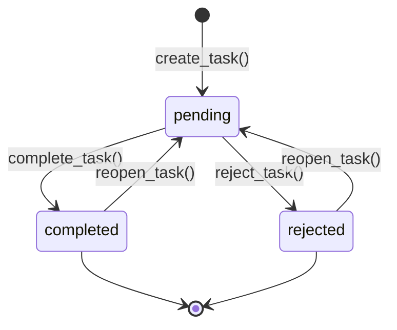
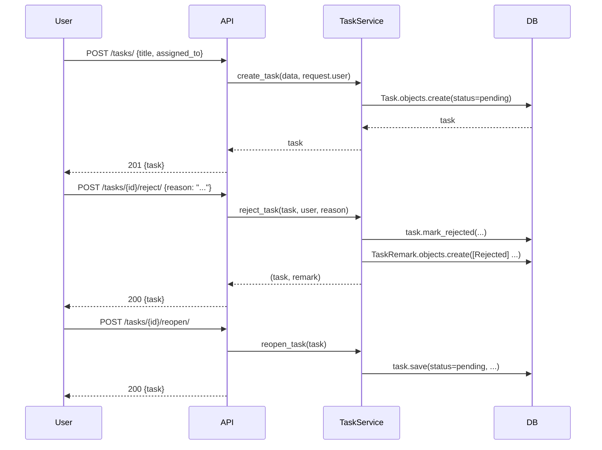

# Tasks Module

## Purpose

The Tasks module provides a lightweight internal workflow tracker. It lets any authenticated user create work items, assign them to colleagues, and drive them through a state machine: creation, completion, rejection, and reopening. Tasks also carry an append-only remark thread for audit commentary. The module does not handle external notifications or integrations — it is an internal coordination tool only.

---

## Entry Points

| Layer | File |
|---|---|
| Models | `backend/apps/tasks/models.py` |
| Service | `backend/apps/tasks/services/task_service.py` |
| Views | `backend/apps/tasks/views.py` |
| Serializers | `backend/apps/tasks/serializers.py` |
| URLs | `backend/apps/tasks/urls.py` |
| Filters | `backend/apps/tasks/filters.py` |
| Tests | `backend/tests/tasks/test_tasks.py` |

---

## Models

Both models use `managed = False`. The database tables (`tasks_task`, `tasks_taskremark`) are owned by the legacy backend.

### Task (`tasks_task`)

Extends `AuditModel` which provides `created_by`, `modified_by`, `created_on`, `modified_on`.

| Field | Type | Notes |
|---|---|---|
| `title` | `CharField(255)` | Required; short summary |
| `description` | `TextField` | Optional; blank by default |
| `status` | `CharField(20)` | One of `pending`, `in_progress`, `completed`, `rejected` |
| `priority` | `CharField(10)` | One of `low`, `normal` (default), `high` |
| `assigned_to` | FK → `AUTH_USER_MODEL` | Null if unassigned; defaults to the creator |
| `assigned_on` | `DateTimeField` | Stamped when `assigned_to` is first set or changed |
| `due_date` | `DateField` | Optional deadline |
| `completed_on` | `DateTimeField` | Stamped by `mark_completed()` |
| `rejected_by` | FK → `AUTH_USER_MODEL` | Stamped by `mark_rejected()` |
| `rejection_reason` | `TextField` | Optional; empty string unless provided |

Indexes:
- `(status, -created_on)` — for status-filtered list views.
- `(assigned_to, status)` — for assignee dashboards.
- `(created_by, status)` — for creator dashboards.

Methods:
- `mark_completed()` — sets `status = completed`, stamps `completed_on = now()`, saves only the changed fields.
- `mark_rejected(by_user, reason)` — sets `status = rejected`, sets `rejected_by` and `rejection_reason`, saves only the changed fields.

### TaskRemark (`tasks_taskremark`)

Append-only comment on a task. No update or delete is exposed by the API.

| Field | Type | Notes |
|---|---|---|
| `task` | FK → `Task` | Cascade delete |
| `text` | `TextField` | Required; empty-string validation in `add_remark()` |
| `created_by` | FK → `AUTH_USER_MODEL` | Nullable; set by the service |
| `created_on` | `DateTimeField` | Auto-set on creation |

---

## State Machine

Valid transitions:
- `pending` → `completed` via `POST /{id}/complete/`
- `pending` → `rejected` via `POST /{id}/reject/`
- `completed` → `pending` via `POST /{id}/reopen/`
- `rejected` → `pending` via `POST /{id}/reopen/`

Invalid transitions (enforced by the view):
- `completed` → `completed`: returns HTTP 409.
- `rejected` → `completed`: returns HTTP 409 with message "Cannot complete a rejected task; reopen it first."
- Any state other than `completed` or `rejected` → `reopen`: raises `ValueError` in `reopen_task()`.

Note: `in_progress` is defined as a status constant but no service function transitions a task into it. It exists for direct ORM updates or future extension.

---

## Service Functions (`backend/apps/tasks/services/task_service.py`)

All functions accept model instances and plain Python values. No HTTP layer dependencies.

### `create_task(data, user)`

Creates a `Task` with `status = pending` and `assigned_on = now()`. If `data["assigned_to"]` is absent or `None`, the creator (`user`) is used as assignee.

Parameters in `data`:
- `title` (required)
- `description` (optional, defaults to empty string)
- `priority` (optional, defaults to `normal`)
- `assigned_to` (optional, defaults to `user`)
- `due_date` (optional)

### `complete_task(task)`

Delegates to `task.mark_completed()`. Returns the updated `Task` instance.

### `reject_task(task, by_user, reason="")`

1. Strips whitespace from `reason`.
2. Calls `task.mark_rejected(by_user, reason)`.
3. If `reason` is non-empty, creates a `TaskRemark` with text `[Rejected] {reason}` and `created_by = by_user`.
4. Returns `(task, remark | None)`.

### `reopen_task(task)`

Guards against invalid transitions: only `completed` and `rejected` tasks may be reopened. Raises `ValueError` otherwise. Resets `status = pending`, clears `completed_on`, `rejected_by`, and `rejection_reason`, saves only the changed fields.

### `add_remark(task_id, text, user)`

Strips whitespace from `text`. Raises `ValueError("Remark text is required.")` if empty. Creates and returns a `TaskRemark`. Fetches the task by PK — raises `Task.DoesNotExist` if not found.

---

## Views (`backend/apps/tasks/views.py`)

A single `TaskViewSet` (DRF `ModelViewSet`) with custom actions.

### Visibility Rules

| User type | Visible tasks |
|---|---|
| Superuser | All tasks |
| Regular user | Tasks where `created_by = user` OR `assigned_to = user` |

This is enforced in `get_queryset()` using `Q(created_by=user) | Q(assigned_to=user)`.

### Mutation Rules (`_can_modify()`)

A user may update a task or add a remark if they are:
- The task creator (`created_by_id == user.id`), or
- The assignee (`assigned_to_id == user.id`), or
- A superuser.

### Deletion Rule (`destroy()`)

Only the task creator or a superuser may delete a task. Assignees who are not the creator cannot delete. Returns HTTP 403 otherwise.

### Custom Actions

| Action | Method | URL | Description |
|---|---|---|---|
| `complete` | `POST` | `/{id}/complete/` | Transitions `pending` → `completed` |
| `reject` | `POST` | `/{id}/reject/` | Transitions `pending` → `rejected`; accepts `{"reason": "..."}` in body |
| `reopen` | `POST` | `/{id}/reopen/` | Transitions `completed|rejected` → `pending` |
| `remarks` | `GET` | `/{id}/remarks/` | Lists all remarks on the task |
| `remarks` | `POST` | `/{id}/remarks/` | Adds a remark; requires `{"text": "..."}` |
| `assignable_users` | `GET` | `/assignable-users/` | Returns `[{id, username, first_name, last_name}]` for all active users |

### Assignment Timestamp Update

`perform_update()` detects when `assigned_to` changes and stamps `assigned_on = now()` automatically. This happens transparently on any `PUT` or `PATCH` that changes the assignee.

---

## Serializers (`backend/apps/tasks/serializers.py`)

### `TaskSerializer`

Includes all Task fields plus denormalized labels:
- `created_by_username` — username of creator (read-only).
- `assigned_to_username` — username of assignee (read-only).
- `rejected_by_username` — username of rejector (read-only).
- `remarks` — nested `TaskRemarkSerializer` list (read-only; populated by the DB).

Read-only fields (never accepted on input): `id`, `completed_on`, `assigned_on`, `rejected_by`, `rejection_reason`, `created_by`, all `_username` fields, `created_on`, `modified_on`, `remarks`.

### `TaskRemarkSerializer`

Fields: `id`, `task`, `text`, `created_by`, `created_by_username`, `created_on`. All except `text` and `task` are read-only.

---

## API Endpoints

Base prefix: `/api/v1/tasks/`

| Method | Path | Description |
|---|---|---|
| `GET` | `/` | Paginated, filtered task list (scoped by visibility rules) |
| `POST` | `/` | Create task |
| `GET` | `/{id}/` | Retrieve single task |
| `PUT` | `/{id}/` | Full update (modifier check) |
| `PATCH` | `/{id}/` | Partial update (modifier check) |
| `DELETE` | `/{id}/` | Delete task (creator or superuser only) |
| `POST` | `/{id}/complete/` | Complete the task |
| `POST` | `/{id}/reject/` | Reject the task (optional reason in body) |
| `POST` | `/{id}/reopen/` | Reopen a completed or rejected task |
| `GET` | `/{id}/remarks/` | List remarks |
| `POST` | `/{id}/remarks/` | Add a remark |
| `GET` | `/assignable-users/` | List active users for assignment dropdown |

Permission: `IsAuthenticated` on all endpoints. No special role is required — any logged-in user may create tasks and see their own.

Filtering: `TaskFilter` (on `status`, `priority`, `assigned_to`). Search fields: `title`, `description`. Ordering fields: `created_on`, `due_date`, `priority`, `status`.

---

## Permissions Summary

| Action | Who can perform it |
|---|---|
| Create task | Any authenticated user |
| View task | Creator, assignee, or superuser |
| Update task | Creator, assignee, or superuser |
| Delete task | Creator or superuser |
| Complete task | Creator, assignee, or superuser |
| Reject task | Creator, assignee, or superuser |
| Reopen task | Creator, assignee, or superuser |
| Add remark | Creator, assignee, or superuser |
| List assignable users | Any authenticated user |

---

## User Flow

---

## Edge Cases

- Rejecting without a reason is allowed. The view does not enforce a non-empty reason; `reason` defaults to empty string and no `TaskRemark` is created.
- Completing an already-completed task returns HTTP 409, not 200.
- Attempting to reopen a task in `pending` or `in_progress` status raises `ValueError` in `reopen_task()` and will surface as an unhandled 500 unless the view catches it. The current view does not explicitly catch `ValueError` from `reopen_task()`; adding a try/except is a known gap.
- Superusers see all tasks in the list view, including tasks they did not create and are not assigned to.
- The `in_progress` status constant is defined but no service function transitions into it.

---

## Acceptance Criteria (from `backend/tests/tasks/test_tasks.py`)

| Test | Expected result |
|---|---|
| `POST /tasks/` with title and priority | HTTP 201; status = `pending` |
| `POST /{id}/complete/` by creator | HTTP 200; task status = `completed` |
| `POST /{id}/reject/` with reason | HTTP 200; status = `rejected`; `rejection_reason` stored |
| `POST /{id}/reopen/` on completed task | HTTP 200; status = `pending` |
| `POST /{id}/remarks/` with text | HTTP 201; remark text stored |
| Task created by another user and not assigned to me | Does not appear in `GET /tasks/` |
| Task assigned to me by another user | Appears in `GET /tasks/` |
