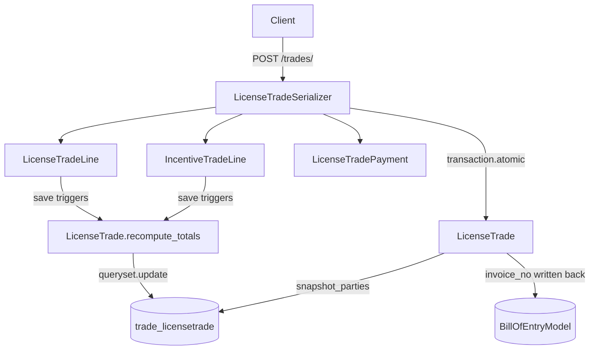

# Trade Module

## Purpose

The Trade module records purchase invoices and bills of supply for two license categories: DFIA (Duty-Free Import Authorization) and Incentive (RODTEP/ROSTL/MEIS). A trade is the financial transaction that pairs a buyer company with a seller company, attaches a Bill of Entry, and produces a printable legal document. Every trade flows through three layers: the header (`LicenseTrade`), one or more detail lines (`LicenseTradeLine` or `IncentiveTradeLine`), and optional payment settlements (`LicenseTradePayment`).

## Business Terminology

| Term | Meaning |
|---|---|
| Direction | `PURCHASE` — buyer perspective; `SALE` — seller perspective; `COMMISSION_PURCHASE` / `COMMISSION_SALE` — commission variants |
| License type | `DFIA` — Duty-Free Import Authorization; `INCENTIVE` — RODTEP/ROSTL/MEIS scrips |
| Mode | Line-level billing method: `QTY` (quantity x rate), `CIF_INR` (CIF value x percentage), `FOB_INR` (FOB value x percentage) |
| Invoice number | Alphanumeric identifier unique per direction and supplier/buyer; auto-generated per Indian financial year |
| BOE | Bill of Entry — the customs clearance document linked to a PURCHASE trade |
| Roundoff | The difference between the sub-total and its nearest whole rupee; stored and displayed separately |
| pct / rate\_pct | Three-decimal-place percentage fields; MUST NOT be rounded to two decimal places before division |

---

## Models

All models use `managed = False`; the database tables are owned by the legacy Django backend and are never migrated by this codebase.

### LicenseTrade (`trade_licensetrade`)

Header record for one invoice.

| Field | Type | Notes |
|---|---|---|
| `direction` | `CharField(20)` | `PURCHASE` / `SALE` / `COMMISSION_PURCHASE` / `COMMISSION_SALE`; indexed |
| `license_type` | `CharField(20)` | `DFIA` (default) or `INCENTIVE`; indexed |
| `incentive_license` | FK → `license.IncentiveLicense` | Null unless `license_type = INCENTIVE` |
| `boe` | FK → `bill_of_entry.BillOfEntryModel` | Nullable; links the trade to its customs entry |
| `from_company` | FK → `core.CompanyModel` | Seller on PURCHASE, buyer on SALE |
| `to_company` | FK → `core.CompanyModel` | Buyer on PURCHASE, seller on SALE |
| `from_pan`, `from_gst`, `from_addr_line_1/2` | Snapshot fields | Frozen at create/edit time from `from_company`; survives company updates |
| `to_pan`, `to_gst`, `to_addr_line_1/2` | Snapshot fields | Same for `to_company` |
| `invoice_number` | `CharField(128)` | Auto-generated; blank until written; indexed |
| `invoice_date` | `DateField` | Defaults to today on first save |
| `remarks` | `TextField` | Free-form notes |
| `subtotal_amount` | `Decimal(20,2)` | Sum of all line `amount_inr` values |
| `roundoff` | `Decimal(20,2)` | Nearest-rupee adjustment |
| `total_amount` | `Decimal(20,2)` | `subtotal_amount + roundoff` |
| `purchase_invoice_copy` | `FileField` | Optional scanned upload |
| `linked_trade` | FK → self | Bidirectional link to the paired counterpart trade |

Constraints:
- `chk_from_to_companies_different` — `from_company` and `to_company` must differ.
- `uniq_purchase_supplier_invoice` — unique per `(from_company, invoice_number)` for PURCHASE.
- `uniq_sale_buyer_invoice_nonblank` — unique per `(to_company, invoice_number)` for SALE.

Computed properties (no DB column):
- `paid_or_received` — aggregate of all linked `LicenseTradePayment.amount`.
- `due_amount` — `total_amount - paid_or_received`.

Key methods:
- `recompute_totals()` — re-sums lines, calculates roundoff, persists via `queryset.update()` to avoid recursive `save()` signals.
- `snapshot_parties()` — copies PAN, GST, and addresses from company FKs into snapshot fields; persists via `update()`.

### LicenseTradeLine (`trade_licensetradeline`)

One billable line for a DFIA trade. References a `LicenseImportItemsModel` serial number.

| Field | Type | Notes |
|---|---|---|
| `trade` | FK → `LicenseTrade` | Cascade delete |
| `sr_number` | FK → `license.LicenseImportItemsModel` | Protected; the import item being billed |
| `description` | `TextField` | |
| `hsn_code` | `CharField(10)` | Default `49070000` |
| `mode` | `CharField(10)` | `QTY`, `CIF_INR`, or `FOB_INR` |
| `qty_kg` | `Decimal(20,4)` | QTY mode only |
| `rate_inr_per_kg` | `Decimal(20,2)` | QTY mode only |
| `cif_fc` | `Decimal(20,2)` | CIF in foreign currency (informational) |
| `exc_rate` | `Decimal(12,4)` | Exchange rate used |
| `cif_inr` | `Decimal(20,2)` | CIF in INR |
| `fob_inr` | `Decimal(20,2)` | FOB in INR |
| `pct` | **`Decimal(9,3)`** | Billing percentage — three decimal places are mandatory |
| `amount_inr` | `Decimal(20,2)` | Computed and stored by `compute_amount()` on every save |

### IncentiveTradeLine (`trade_incentivetradeline`)

One billable line for an Incentive license trade. Simpler than `LicenseTradeLine` — just a license, a value, and a rate.

| Field | Type | Notes |
|---|---|---|
| `trade` | FK → `LicenseTrade` | Cascade delete |
| `incentive_license` | FK → `license.IncentiveLicense` | Protected |
| `license_value` | `Decimal(20,2)` | Face value of the scrip in INR |
| `rate_pct` | **`Decimal(9,3)`** | Billing percentage — three decimal places mandatory |
| `amount_inr` | `Decimal(20,2)` | Computed by `compute_amount()` on every save |

### LicenseTradePayment (`trade_licensetradepayment`)

Records a single cash settlement against a trade.

| Field | Type | Notes |
|---|---|---|
| `trade` | FK → `LicenseTrade` | Cascade delete |
| `date` | `DateField` | Defaults to today |
| `amount` | `Decimal(20,2)` | Always positive |
| `note` | `CharField(255)` | Optional description |

---

## The 3dp Precision Rule

Both `pct` (on `LicenseTradeLine`) and `rate_pct` (on `IncentiveTradeLine`) are stored as three decimal places (`Decimal(9,3)`). This is intentional and critical.

**The problem with two decimal places:** If `pct = 7.925` and you first round it to two places you get `7.93`. Then `100000 * 7.93 / 100 = 7930.00`. The correct result is `100000 * 7.925 / 100 = 7925.00`. That is a five-rupee error on a one-lakh INR base — real money on a real invoice.

**The correct approach (from `backend/apps/trade/models.py:396-401`):**

```python
# CORRECT — preserves 3dp through the division
pct_val = Decimal(str(self.pct if self.pct is not None else 0))
return q2(q2(self.cif_inr) * (pct_val / Decimal("100")))
```

`Decimal(str(self.pct))` reconstructs the value from its string representation, preserving three decimal places. Passing `self.pct` through `q2()` first would truncate it to two places and cause the error shown above.

---

## `compute_amount()` Formulas

### LicenseTradeLine

| Mode | Formula | Code location |
|---|---|---|
| `QTY` | `q2(q4(qty_kg) * q2(rate_inr_per_kg))` | `models.py:394` |
| `CIF_INR` | `q2(q2(cif_inr) * (Decimal(str(pct)) / Decimal("100")))` | `models.py:396-398` |
| `FOB_INR` | `q2(q2(fob_inr) * (Decimal(str(pct)) / Decimal("100")))` | `models.py:399-401` |

`q4()` quantizes to four decimal places; `q2()` quantizes to two (ROUND\_HALF\_UP).

### IncentiveTradeLine

| Formula | Code location |
|---|---|
| `q2(q2(license_value) * (Decimal(str(rate_pct)) / Decimal("100")))` | `models.py:474-475` |

---

## Invoice Number Generation

Function: `get_next_invoice_number(direction, company_name, invoice_date)` in `backend/apps/trade/models.py:66`.

### Format

| Direction | Format | Example |
|---|---|---|
| `PURCHASE` | `P-{PREFIX}/{FY}/{NNNN}` | `P-LM/2025-26/0024` |
| `SALE` | `{PREFIX}/{FY}/{NNNN}` | `LM/2025-26/0001` |
| `COMMISSION_PURCHASE` | `COM-P-{PREFIX}/{FY}/{NNNN}` | `COM-P-LM/2025-26/0003` |
| `COMMISSION_SALE` | `COM-{PREFIX}/{FY}/{NNNN}` | `COM-LM/2025-26/0005` |

The `PREFIX` is derived from the company name by `company_prefix()`:
- One word → first three letters uppercased (e.g. `Purvaj` → `PUR`).
- Two words → initials (e.g. `Labdhi Mercantile` → `LM`).
- Three or more words → all initials (e.g. `Labdhi Mercantile LLP` → `LML`).

The `FY` is the Indian financial year label from `indian_fy_label()`: April–March, formatted as `YYYY-YY` (e.g. `2025-26`).

### TOCTOU Race Fix

Two concurrent requests could both read the same maximum sequence number and produce duplicate invoice numbers. The fix uses a database lock:

```python
with transaction.atomic():
    existing_invoices = (
        LicenseTrade.objects
        .select_for_update()          # row-level lock
        .filter(direction=direction, invoice_number__startswith=pattern_prefix)
        .values_list("invoice_number", flat=True)
    )
    # ... parse max, increment, return
```

`select_for_update()` acquires a `SELECT ... FOR UPDATE` lock on all matching rows. Any concurrent transaction blocks until the current one commits, guaranteeing each call receives a distinct number.

---

## Trade Service (`backend/apps/trade/services/trade_service.py`)

A pure-Python domain layer. Accepts model instances and primitives; returns model instances or plain Python. Never touches HTTP.

### `parse_date_strict(date_str)`

Parses ISO `YYYY-MM-DD` only. Returns `None` for falsy input. Raises `ValueError` for any other format.

### `get_prefilled_invoice_number(direction, company_id, invoice_date)`

Validates direction against `_VALID_DIRECTIONS = frozenset(["PURCHASE", "SALE", "COMMISSION_PURCHASE", "COMMISSION_SALE"])`, fetches the `CompanyModel` by PK, then delegates to `get_next_invoice_number()`. Raises `ValueError` for unknown directions; raises `CompanyModel.DoesNotExist` for bad company PKs.

### `build_trade_summary(trade)`

Returns a plain dict with: `id`, `direction`, `invoice_number`, `invoice_date`, `subtotal_amount`, `roundoff`, `total_amount`, `paid_or_received`, `due_amount`, `lines_count`, `payments_count`. All monetary values are returned as strings to preserve decimal precision across JSON serialization.

### `link_trades(trade_pk, partner_pk)`

Bidirectionally links or unlinks two trades inside `transaction.atomic`.

Rules:
- `partner_pk = None` → clears `linked_trade` on the primary trade and on its current partner (if any).
- `partner_pk == trade_pk` → raises `ValueError("Cannot link a trade to itself")`.
- Valid `partner_pk` → clears any stale links on both sides, then sets `linked_trade` on both records to point at each other.

Uses `queryset.update()` throughout (no `save()`) to prevent signal loops.

### `PartnerTradeNotFound(LookupError)`

Raised by `link_trades()` when `partner_pk` is provided but does not match any `LicenseTrade`. The view maps this to HTTP 404.

---

## Serializers (`backend/apps/trade/serializers.py`)

### `LicenseTradeSerializer`

Nested serializer that handles `lines`, `incentive_lines`, and `payments` as nested writable lists.

**`to_internal_value()`**: Handles two incoming formats:
1. JSON body with `lines` as a JSON array.
2. Multipart `FormData` with flattened keys like `lines[0].qty_kg`.

**`validate()`**: Requires at least one line (`lines` or `incentive_lines`) to be non-empty. Skipped on `PATCH` when neither field is present in the request.

**`create()`** (wrapped in `transaction.atomic`):
1. Pops `lines`, `incentive_lines`, `payments`, and `auto_create_paired` from validated data.
2. Creates `LicenseTrade`, calls `snapshot_parties()`.
3. Creates each line and payment.
4. Recomputes totals.
5. Writes `invoice_number` back to the linked `BillOfEntryModel.invoice_no`.
6. If `auto_create_paired = True`, auto-creates the mirror trade (PURCHASE ↔ SALE) with a new invoice number and copies all lines.

**`update()`** (wrapped in `transaction.atomic`):
1. Saves header fields.
2. Calls `_sync_nested()` for lines and payments.
3. Recomputes totals.
4. Handles BOE invoice\_no cleanup when the linked BOE changes.

### `_sync_nested(instance, model, incoming_list, fk_field)`

Upsert helper:
- Items with an existing `id` → update in place.
- Items without an `id` → create.
- DB items whose `id` is absent from the incoming list → delete (unless `incoming_list` is empty and `treat_empty_list_as_delete` is `False`).

---

## Signals

| Signal | Trigger | Effect |
|---|---|---|
| `pre_delete` on `LicenseTrade` | Trade is deleted | Clears `BillOfEntryModel.invoice_no` and `invoice_date` if they matched the deleted trade's invoice number |
| `post_save` on `IncentiveTradeLine` | Line saved for a SALE trade | Calls `incentive_license.update_sold_status()` |
| `pre_delete` on `IncentiveTradeLine` | Line deleted from a SALE trade | Calls `incentive_license.update_sold_status()` |

---

## PDF Generation

PDF generation is synchronous — it runs in the request/response cycle and blocks the worker thread until the document is built. This is noted as a known limitation in `backend/apps/trade/views.py:8`.

### Purchase Invoice PDF

Endpoint: `GET /api/v1/trades/trades/{id}/generate-purchase-invoice/`
Generator: `backend/apps/trade/purchase_invoice_pdf.py` — `generate_purchase_invoice_pdf(trade, include_signature)`
Applies to: `direction = PURCHASE` only. Returns HTTP 400 for any other direction.
File name pattern: `Purchase_Invoice_{invoice_number}_{YYYYMMDD}_{_with_sign|_without_sign}.pdf`

### Bill of Supply PDF

Endpoint: `GET /api/v1/trades/trades/{id}/generate-bill-of-supply/`
Generator: `backend/apps/trade/bill_of_supply_pdf.py` — `generate_bill_of_supply_pdf(trade, include_signature)`
Applies to: `direction = SALE` only. Returns HTTP 400 for any other direction.
File name pattern: `Bill_of_Supply_{invoice_number}_{YYYYMMDD}_{_with_sign|_without_sign}.pdf`

Both actions accept a `?include_signature=true|false` query parameter (default `true`). The response is `Content-Type: application/pdf` with `Content-Disposition: inline`.

There is also a stub Celery task `generate_trade_pdf_task` in `backend/apps/trade/tasks.py` (`acks_late=True`, `max_retries=2`) that currently only updates the tracker status to `PENDING`. Async PDF generation is not yet wired to the endpoints.

---

## API Endpoints

Base prefix: `/api/v1/trades/`

| Method | Path | Description |
|---|---|---|
| `GET` | `trades/` | Paginated, filterable list of trades |
| `POST` | `trades/` | Create trade with nested lines and payments |
| `GET` | `trades/{id}/` | Retrieve single trade |
| `PUT` | `trades/{id}/` | Full update |
| `PATCH` | `trades/{id}/` | Partial update |
| `DELETE` | `trades/{id}/` | Delete trade (also clears BOE invoice\_no via signal) |
| `GET` | `trades/{id}/generate-purchase-invoice/` | Download PDF (PURCHASE only) |
| `GET` | `trades/{id}/generate-bill-of-supply/` | Download PDF (SALE only) |
| `GET` | `trades/prefill-invoice-number/` | Returns next invoice number; params: `direction`, `company_id`, `invoice_date` |
| `GET` | `trades/{id}/summary/` | Computed summary dict |
| `POST` | `trades/{id}/link-trade/` | Link or unlink partner trade; body: `{"partner_id": int\|null}` |
| `GET` | `lines/` | Read-only list of all trade lines |
| `GET` | `lines/{id}/` | Read-only single trade line |
| `GET` | `payments/` | Paginated list of payments |
| `POST` | `payments/` | Create payment |
| `GET` | `payments/{id}/` | Retrieve payment |
| `PUT/PATCH` | `payments/{id}/` | Update payment |
| `DELETE` | `payments/{id}/` | Delete payment |

### Filtering and Search

`GET /trades/` supports:
- `DjangoFilterBackend` via `TradeFilter` (direction, license\_type, company, date range, BOE).
- `SearchFilter` on `invoice_number`, `from_company__name`, `to_company__name`, `remarks`, `lines__sr_number__license__license_number`, `incentive_license__license_number`, `incentive_lines__incentive_license__license_number`.
- `OrderingFilter` on `invoice_date`, `invoice_number`, `created_on`, `total_amount`.

### Permission

All endpoints use `TradePermission` (defined in `backend/apps/accounts/permissions.py:89`). All responses use the envelope pattern: `{"success": true, "data": ..., "message": ...}`.

---

## Data Flow



---

## Validation Rules

1. At least one `lines` or `incentive_lines` entry must be present on create and on PUT/PATCH when either field is included.
2. `direction` must be one of `PURCHASE`, `SALE`, `COMMISSION_PURCHASE`, `COMMISSION_SALE`.
3. `from_company` and `to_company` must differ (`chk_from_to_companies_different`).
4. Invoice number is unique per `(from_company, direction)` for PURCHASE and per `(to_company, direction)` for SALE.
5. `pct` and `rate_pct` must be supplied with three decimal places (e.g. `7.925` not `7.93`).

---

## Edge Cases and Known Issues

- **Synchronous PDF generation blocks the worker thread.** For large or complex invoices this may cause request timeouts. The stub Celery task exists but is not yet connected to the endpoints.
- **`auto_create_paired`**: When the original trade has no `from_company` or `to_company`, the paired trade's company fields will be null and `snapshot_parties()` will produce empty snapshots.
- **BOE invoice_no cleanup on update**: The code captures `old_invoice_number` before mutation so the old BOE entry is correctly cleared even when the invoice number itself changes in the same request.
- **`_sync_nested` with empty incoming list**: An empty list does NOT delete existing records unless `treat_empty_list_as_delete=True`. This prevents accidental bulk-delete on PATCH requests that omit a nested field.
- **`managed = False`**: Test suites must patch `_meta.managed = True` and run inside a transaction to create tables on SQLite.

---

## Acceptance Criteria (from `backend/tests/trade/test_trade.py`)

| Test | Expected result |
|---|---|
| `pct=7.925`, `cif_inr=100000`, mode `CIF_INR` | `amount_inr = 7925.00` (not 7930.00) |
| `pct=7.925`, `fob_inr=100000`, mode `FOB_INR` | `amount_inr = 7925.00` |
| `qty_kg=100.5`, `rate_inr_per_kg=250.00`, mode `QTY` | `amount_inr = 25125.00` |
| `pct=None`, mode `CIF_INR` | `amount_inr = 0.00` |
| `rate_pct=2.125`, `license_value=500000` (incentive) | `amount_inr = 10625.00` |
| `rate_pct=None` (incentive) | `amount_inr = 0.00` |
