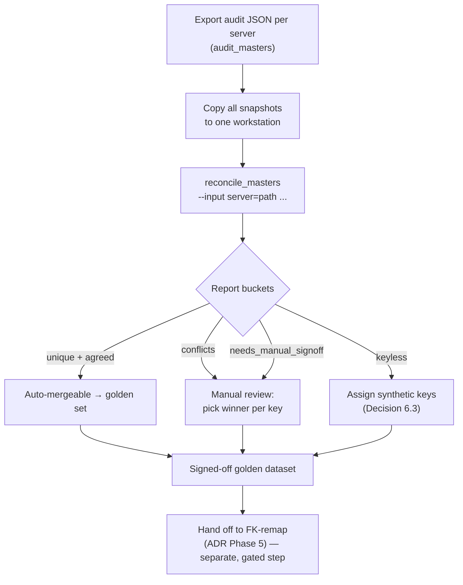

# Master-Data Consolidation Runbook (ADR-001 Phase 0)

**Owner:** `data-engineer`
**Status:** Phase-0 tooling — analysis only, no production writes.
**Reference:** [`ADR-001-master-data-service.md`](../architecture/ADR-001-master-data-service.md), Decision 6.

> Phase 0 produces **one authoritative ("golden") master dataset** plus the
> inputs the later FK-remap step (ADR Phase 5) needs. It **does not** cut over,
> write to any master table, or touch production data. It reads exported audit
> snapshots and emits a reconciliation report. Everything downstream depends on
> getting this right, so the process is deliberately manual and reviewable.

## Why this step exists

The three servers (license-manager @ `143.110.252.201`, labdhi @
`139.59.92.226`, tractor @ `165.232.185.220`) diverged under the additive,
one-way `scripts/maintenance/sync-masters.sh`. The same real-world entity now has **different
integer PKs** on each server, and followers hold rows the source never pulled
back. Before any central Master-Data Service can be loaded, we must decide, per
master row, **which version is canonical**.

## Tooling

Two read-only Django management commands in `backend/apps/core/management/commands/`:

| Command | Role | Writes? |
|---|---|---|
| `audit_masters` | Snapshots every master with business keys + content hashes | No (reads DB, emits JSON) |
| `reconcile_masters` | Consumes N audit snapshots, buckets rows, proposes golden winners | No (reads JSON, emits JSON) |

Neither command mutates any database. `reconcile_masters` never opens a DB
connection at all.

Operational wrappers:

| Script | Role | Writes? |
|---|---|---|
| `scripts/maintenance/audit-and-diff-masters.sh` | Runs remote audits and creates a local `merge-plan.csv` | No database writes |
| `scripts/maintenance/apply-master-merge.sh` | Applies a reviewed merge plan after a dry-run and confirmation | Yes, only after operator confirmation |
| `scripts/maintenance/audit-and-merge-masters.sh` | Runs remote audits and dry-runs/optionally applies `auto_import_masters` | Yes, only after operator confirmation |
| `scripts/maintenance/sync-masters.sh` | Existing one-way additive source-to-follower sync | Yes, requires `SYNC_PASSWORD` and writes followers |
| `scripts/mds/*.sh` | ADR-001 export/load/migration/onboarding workflow | Dry-run by default; writes only behind explicit `--confirm` gates |

The legacy maintenance scripts share `scripts/maintenance/_master_sync_lib.sh`.
Set `MASTER_SYNC_PASSWORD` or `SYNC_PASSWORD` to override the legacy fallback
password, and prefer SSH keys wherever possible.

## Buckets produced

For each master model, `reconcile_masters` classifies rows by **natural key**:

- **`unique`** — key present on exactly one server (absent on the others).
- **`agreed`** — same key on 2+ servers with an **identical** content hash
  (`_hash_record`). Safe to auto-merge; no review needed.
- **`conflicts`** — same key on 2+ servers with **different** content hashes.
  The manual-review set.
- **`keyless`** — rows from models with no natural key (`HeadSIONNormsModel`,
  `SIONExportModel`, `SIONImportModel`, `SionNormNote`, `SionNormCondition`,
  `ProductDescriptionModel`, `UnitPriceModel`, `TransferLetterModel`). Flagged
  for synthetic-key assignment (ADR Decision 6.3).

For every natural key, a **proposed golden winner** is computed:

- Newest `modified_on` wins (`basis: newest_modified_on`).
- If content is identical and there is no timestamp, the value is unambiguous
  (`basis: content_identical_no_timestamp`, no sign-off needed).
- If content conflicts and **no** server has a usable `modified_on` (the
  timestamp-less masters), it is flagged `needs_manual_signoff: true` — a human
  must choose. The tool never guesses here.

## Process



### Step 1 — Export an audit per server

Run on **each** server (SSH in; these are read-only):

```bash
# license-manager @ 143.110.252.201
python manage.py audit_masters --out audit-201.json --server-name license-manager

# labdhi @ 139.59.92.226
python manage.py audit_masters --out audit-labdhi.json --server-name labdhi

# tractor @ 165.232.185.220
python manage.py audit_masters --out audit-tractor.json --server-name tractor
```

Copy all three JSON files to one workstation (e.g. via `scp`). Note the
`generated_at` timestamps — run all three close together so a mid-run edit on
one server doesn't skew the diff. If masters are actively changing, take the
snapshots during a quiet window.

### Step 2 — Reconcile

```bash
cd backend
python manage.py reconcile_masters \
    --input license-manager=audit-201.json \
    --input labdhi=audit-labdhi.json \
    --input tractor=audit-tractor.json \
    --out reconciliation-report.json
```

Stdout prints a per-model summary table (unique / agreed / conflict / keyless
counts) and loud warnings for anything needing human attention. The full detail
— every key, every variant, every proposed golden winner — is written to
`--out`.

`reconcile_masters` fails loudly (never silently) on: missing `--input`,
malformed `SERVER=PATH`, duplicate server labels, missing files, unparseable
JSON, and files that are not `audit_masters` snapshots. A dropped server would
corrupt the reconciliation, so it refuses rather than skip.

### Step 3 — Review conflicts

Open `reconciliation-report.json` and work the `conflicts` list of each model.
Each conflict shows every server's variant (`server`, `id`, `data_hash`,
`modified_on`) and the tool's proposed `golden` winner.

- Where `golden.needs_manual_signoff` is `false` (newest `modified_on` picked),
  spot-check the proposal and accept.
- Where `needs_manual_signoff` is `true` (content conflict, no timestamp —
  typically the keyless/timestamp-less models), a domain owner **must** choose
  the correct value and record the decision. Per ADR Open Question 3, this
  sign-off owner is a human decision, not the tool's.

Record the accepted winner for every conflicting key in a sign-off sheet.

### Step 4 — Assign synthetic keys for keyless models

The `keyless` bucket enumerates every row of the timestamp-/key-less models.
Per ADR Decision 6.3, give each a **deterministic stable key** — a content hash
plus parent business key, or a UUID assigned at consolidation — so they can
participate in a keyed sync and get stable object-storage keys later
(Decision 5). This is a data-modelling decision; capture the chosen scheme
alongside the sign-off sheet.

### Step 5 — Produce the golden dataset

Combine:
- all `unique` rows (they carry into the golden set as-is),
- all `agreed` rows (one canonical copy each),
- the human-chosen winner for each `conflict`,
- keyless rows with their newly-assigned synthetic keys.

The result is the **signed-off golden master dataset** — the single
authoritative version of every master row. This is the gate artifact for
Phase 0.

### Step 6 — Hand off to FK-remap (ADR Phase 5)

The golden set + the natural-key → canonical-id mapping feed the FK-remap step,
which rewrites each consumer's 11 cross-DB FK columns and the
`license_import_item` M2M through-table to canonical ids. **That step is the
riskiest data operation in the whole migration and is out of scope here** — it
runs in Phase 5 with full backups, a staging dry-run, per-table row-count and
FK-integrity reconciliation, one server at a time, and explicit human
authorization. Nothing in Phase 0 performs it.

## Guardrails

- **No production writes.** Phase 0 only reads audit exports and emits a report.
- **Reproducible.** Re-running `reconcile_masters` on the same snapshots yields
  byte-identical buckets (output is deterministically sorted).
- **Loud, not silent.** Bad input aborts with a clear error; a missing server is
  never silently ignored.
- **Human sign-off for genuine conflicts.** The tool proposes; a person decides
  wherever content diverges without a timestamp to arbitrate.

## Related files

- `backend/apps/core/management/commands/audit_masters.py`
- `backend/apps/core/management/commands/reconcile_masters.py`
- `backend/apps/core/tests/test_reconcile_masters.py`
- `docs/architecture/ADR-001-master-data-service.md` (Decision 6)
