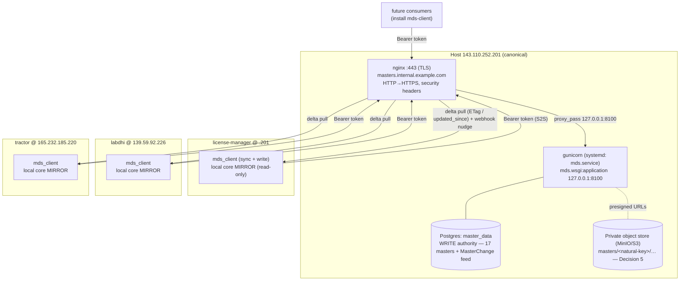

# Master-Data Service — Deployment & Migration Runbook (ADR-001)

**Owner:** `devops-sre`
**Status:** Phase 2 (MDS stood up) → Phase 4 (onboard consumers, hydrate mirrors).
**Reference:** [`ADR-001-master-data-service.md`](../architecture/ADR-001-master-data-service.md),
[`master-consolidation.md`](./master-consolidation.md) (Phase-0 reconciliation).

> This runbook covers **running MDS as the central master DB** for the three
> existing servers (and future ones) and **migrating existing data into it
> without disturbing any source database**. Every step below is **read-only on
> source servers** and **backs up the MDS DB before any write**. The scripts
> default to **dry-run**; a state change requires `--confirm`.

---

## 0. Safety contract (read first)

| Rule | How it is enforced |
|------|--------------------|
| Source DBs are strictly READ-ONLY | Exports use `export_masters_mds` / `audit_masters`, both SELECT-only. The scripts issue no writes to any consumer/source DB. |
| MDS DB is backed up before any load | `load-master-data.sh` always runs `pg_dump` (gzipped, timestamped) and aborts if the dump is empty/fails. |
| Nothing changes without `--confirm` | All four scripts default to dry-run; loads/onboarding apply only with `--confirm`. |
| Secrets only via env | `SYNC_PASSWORD`, `MDS_DB_PASS`, per-server `MDS_TOKEN` are read from env, never hardcoded, never logged (token is masked). |
| Conflicts block a load | `migrate-all-servers.sh` refuses to load if `reconcile_masters` reports unresolved conflicts / manual-sign-off, unless `--accept-conflicts` is given explicitly. |
| Reversible | Writes still go to local tables until the Phase-6 write cutover; `sync-masters.sh` remains re-enable-able. See [Rollback](#8-rollback). |

**Deploy artifacts** live in `master-data-service/deploy/` (+ two files at the
service root). These stand the service up on its host:

| File | Purpose |
|------|---------|
| `deploy/gunicorn.conf.py` | gunicorn prod config: workers, timeouts, bind `127.0.0.1:8100`, access/error logs (`GUNICORN_*` env-overridable) |
| `deploy/mds.service` | systemd unit: gunicorn under the `mds` user, `EnvironmentFile=/etc/mds/mds.env`, `Restart=on-failure`, hardening |
| `deploy/nginx-mds.conf` | nginx site: HTTP→HTTPS + ACME, TLS placeholders, security headers, `/healthz` passthrough, `/static/` admin static, proxy to gunicorn |
| `deploy/deploy-mds.sh` | idempotent deploy (dry-run default / `--confirm`): pip → migrate → collectstatic → restart → `curl /healthz`, with rollback note |
| `.env.production.example` | prod env template (SECRET_KEY, `DEBUG=False`, real `ALLOWED_HOSTS`, `MDS_DB_*`, one scoped token per consumer) |
| `requirements-prod.txt` | `-r requirements.txt` + gunicorn + whitenoise |

**Data-migration scripts** live in `scripts/mds/`:

| Script | Purpose | Default |
|--------|---------|---------|
| `export-master-data.sh` | READ-ONLY export of all 17 masters from a host, pull JSON back | read-only always |
| `load-master-data.sh` | Back up MDS → `load_masters` → verify per-master counts | dry-run |
| `migrate-all-servers.sh` | Export all servers → reconcile → (gated) load golden set | dry-run |
| `onboard-server.sh` | Point a consumer at MDS (env + `migrate mds_client` + initial `mds_sync`) | dry-run |

---

## 1. Deployment topology



**Placement:** MDS runs on `143.110.252.201` (already the canonical source). It
gets **its own Postgres database** (`master_data`) and **its own DB role** with
least privilege — MDS is the only writer; consumers never connect to this DB.

---

## 2. Deploy MDS

### 2.1 Postgres (own DB + least-privilege role)

```bash
# On 143.110.252.201, as the postgres superuser. Password from env, never inline.
sudo -u postgres psql <<SQL
CREATE ROLE master_data LOGIN PASSWORD '${MDS_DB_PASS:?set MDS_DB_PASS in env}';
CREATE DATABASE master_data OWNER master_data;
REVOKE ALL   ON DATABASE master_data FROM PUBLIC;
GRANT CONNECT ON DATABASE master_data TO master_data;
SQL
```

The `master_data` role owns only its own DB. It has no rights on the license /
labdhi / tractor application databases — MDS is physically isolated from every
consumer DB.

### 2.2 App env (`/etc/mds/mds.env`)

Secrets via env only. **Template:**
[`master-data-service/.env.production.example`](../../master-data-service/.env.production.example) —
copy it to the host (never into git) and fill every `REPLACE_*`:

```bash
sudo mkdir -p /etc/mds
sudo install -o root -g mds -m 640 \
    master-data-service/.env.production.example /etc/mds/mds.env
sudo -e /etc/mds/mds.env          # fill SECRET_KEY, DB pass, tokens, ALLOWED_HOSTS
```

Key rules: `DEBUG=False`, `ALLOWED_HOSTS` = **real hosts, never `*`**, and
**one scoped token per consumer** (`token:scope`, comma-separated —
`master-data-service/mds/settings.py::_parse_tokens`; a `write` token also
reads). Generate a secret: `python -c 'import secrets; print(secrets.token_urlsafe(64))'`;
a token: `python -c 'import secrets; print(secrets.token_urlsafe(48))'`.

### 2.3 Install deps + migrate + collectstatic

Prefer the deploy script (§2.6) which does this idempotently. Manually:

```bash
cd /home/mds/master-data-service
.venv/bin/pip install -r requirements-prod.txt   # base + gunicorn + whitenoise
.venv/bin/python manage.py migrate --no-input
.venv/bin/python manage.py collectstatic --no-input   # writes STATIC_ROOT (staticfiles/)
.venv/bin/python manage.py check --deploy             # verify prod hardening flags
```

`requirements-prod.txt` is
[`master-data-service/requirements-prod.txt`](../../master-data-service/requirements-prod.txt)
(`-r requirements.txt` + `gunicorn` + `whitenoise`). WhiteNoise serves the admin
static bundle from the app process; it is wired into `MIDDLEWARE` only when
`DEBUG=False` and importable, so a dev checkout without it still boots.

### 2.4 gunicorn + systemd

The gunicorn config is
[`master-data-service/deploy/gunicorn.conf.py`](../../master-data-service/deploy/gunicorn.conf.py)
(workers, timeouts, bind `127.0.0.1:8100`, access/error logs; every value is
`GUNICORN_*`-env-overridable). The systemd unit is
[`master-data-service/deploy/mds.service`](../../master-data-service/deploy/mds.service)
— runs gunicorn as the `mds` service user with
`EnvironmentFile=/etc/mds/mds.env`, `Restart=on-failure`, and least-privilege
hardening (`NoNewPrivileges`, `ProtectSystem=strict`, `ReadWritePaths` limited
to `logs/` and `media/`).

```bash
sudo cp master-data-service/deploy/mds.service /etc/systemd/system/mds.service
# review User/Group/WorkingDirectory/venv path for this host before enabling
sudo systemctl daemon-reload
sudo systemctl enable --now mds.service
sudo systemctl status mds.service
```

### 2.5 nginx + TLS

The site is
[`master-data-service/deploy/nginx-mds.conf`](../../master-data-service/deploy/nginx-mds.conf):
port-80 ACME + HTTP→HTTPS redirect, a 443 TLS block with placeholder cert paths,
security headers (HSTS, nosniff, `X-Frame-Options: DENY`, `Referrer-Policy`), a
`/static/` alias for admin static, a `/healthz` passthrough (access-log off),
and `proxy_pass` to gunicorn.

```bash
sudo cp master-data-service/deploy/nginx-mds.conf /etc/nginx/sites-available/mds
sudo ln -sf /etc/nginx/sites-available/mds /etc/nginx/sites-enabled/mds
# TLS issuance: reuse the repo pattern (setup-ssl-labdhi.sh / setup-ssl-tractor.sh)
#   certbot --nginx -d masters.internal.example.com   # fills the ssl_certificate lines
sudo nginx -t && sudo systemctl reload nginx     # ALWAYS test before reload — never blind-reload
```

### 2.6 Deploy (idempotent script) + verification

The deploy script is
[`master-data-service/deploy/deploy-mds.sh`](../../master-data-service/deploy/deploy-mds.sh)
— **dry-run by default**, `--confirm` to act. It runs, in order:
`pip install -r requirements-prod.txt` → `migrate` → `collectstatic` →
`systemctl restart mds` → retrying `curl /healthz`, and prints a rollback note.
It never ssh-es and touches only this service's DB.

```bash
cd /home/mds/master-data-service
bash deploy/deploy-mds.sh            # dry-run: prints every command it would run
bash deploy/deploy-mds.sh --confirm  # apply + health-check
```

```bash
curl -fsS https://masters.internal.example.com/healthz    # {"status":"ok",...}
# authenticated smoke test (read token):
curl -fsS -H "Authorization: Bearer <tok_probe>" \
    https://masters.internal.example.com/api/v1/companies/_meta/
```

---

## 3. Per-server token table

Fill in after minting tokens (§2.2). **Do not commit real token values** — store
them in each server's `.env` (perms `600`) and a secrets manager.

| Consumer server | Host / IP | Scope | Token env var | Notes |
|-----------------|-----------|-------|---------------|-------|
| license-manager | 143.110.252.201 | write | `LICMGR_MDS_TOKEN` | canonical source; last to cut over (Phase 6) |
| labdhi | 139.59.92.226 | write | `LABDHI_MDS_TOKEN` | first to onboard/cut over |
| tractor | 165.232.185.220 | write | `TRACTOR_MDS_TOKEN` | |
| (probe/monitoring) | — | read | `MDS_PROBE_TOKEN` | health checks / dashboards only |
| (future project) | — | read or write | `<PROJ>_MDS_TOKEN` | scope per ADR open-question 6 |

Rotation: mint the new token, add it to `MDS_TOKENS` (both old and new valid),
roll each consumer's `MDS_TOKEN`, then drop the old token from `MDS_TOKENS`.

---

## 4. Migrate existing data into MDS (read-only sources, backed-up MDS)

This is the consolidation load. Sources are only ever read; MDS is dumped first;
counts are verified after.

### 4.1 Prerequisites

- SSH access to all three servers as `django@<host>` (key auth preferred; if
  using a password, `export SYNC_PASSWORD=…` and have `sshpass` installed —
  same convention as `sync-masters.sh`).
- MDS DB env exported locally: `MDS_DB_NAME/USER/PASS/HOST/PORT`, and `MDS_DIR`
  pointing at the `master-data-service` checkout.
- Phase-0 reconciliation already understood — see `master-consolidation.md`.

### 4.2 Dry-run the full migration (safe; export + reconcile only)

```bash
cd /path/to/license-manager
export MDS_DB_NAME=master_data MDS_DB_USER=master_data MDS_DB_HOST=127.0.0.1
export MDS_DB_PASS=…                    # secret, from your secrets store
export MDS_DIR=./master-data-service

# READ-ONLY on all three servers; runs reconcile; NO load (no --confirm):
bash scripts/mds/migrate-all-servers.sh
```

This produces, under `work/mds-migrate-<ts>/`:
`audit-<label>.json`, `export-<label>.json`, `reconciliation-report.json`,
`migrate.log`. **Review the reconciliation summary and report.** If it reports
conflicts or manual-sign-off items, resolve them per `master-consolidation.md`
and produce a curated golden export before loading.

### 4.3 Load the golden set into MDS (backs up MDS, then verifies)

```bash
# Loads the .201 source export by default; backs up MDS first, loads, verifies.
bash scripts/mds/migrate-all-servers.sh --confirm

# Or load a human-curated golden export produced after conflict resolution:
bash scripts/mds/migrate-all-servers.sh --confirm --golden work/golden-curated.json

# Only if you have explicitly accepted the reported conflicts:
bash scripts/mds/migrate-all-servers.sh --confirm --accept-conflicts
```

The load step (`load-master-data.sh`, called internally) will:
1. `pg_dump` the MDS DB to `backups/mds/mds-master_data-<ts>.sql.gz` (aborts if empty).
2. Run `load_masters --in <golden.json>` (topological, idempotent upsert).
3. Verify per-master counts (export vs MDS) and **exit non-zero** if any master
   has fewer rows in MDS than the export (rows that failed to land).

You can also run a single-host export or load directly:

```bash
# Read-only export from one host:
bash scripts/mds/export-master-data.sh --host labdhi --out work/labdhi.json

# Dry-run a load (still takes an MDS backup):
bash scripts/mds/load-master-data.sh --in work/labdhi.json
# Apply it:
bash scripts/mds/load-master-data.sh --in work/labdhi.json --confirm
```

### 4.4 Verification checklist after load

- Load script printed **"Count verification passed"** and exited `0`.
- `load_masters` output shows `skipped=0` (or only expected dangling-FK skips
  you understand — investigate any surprise skips before proceeding).
- `GET /api/v1/<master>/_meta/` counts match the golden export per master.
- MDS backup file exists and is non-empty (`ls -lh backups/mds/`).

---

## 5. Onboard each server (point a consumer at MDS)

Onboarding turns on the client + hydrates the local mirror. It does **not** cut
over writes (that is a later flag-gated step). Dry-run first.

```bash
# Dry-run (prints exactly what it would change):
bash scripts/mds/onboard-server.sh --host labdhi \
    --mds-url https://masters.internal.example.com/api/v1/ \
    --token "$LABDHI_MDS_TOKEN"

# Apply (writes MDS_* env, migrate mds_client, initial mds_sync):
bash scripts/mds/onboard-server.sh --host labdhi \
    --mds-url https://masters.internal.example.com/api/v1/ \
    --token "$LABDHI_MDS_TOKEN" --confirm
```

Recommended order (lowest blast radius first, per ADR Phase 5/6):
**labdhi → tractor → license-manager (.201)**. The token is written to the
server's `.env` with `600` perms and is never printed to logs (only masked).

---

## 6. Enable periodic sync

The mirror is kept fresh by the `mds_client` sync worker. Two options:

**Celery beat (preferred where Celery already runs):** schedule the
`mds_client` periodic sync task (see `mds-client/mds_client/tasks.py`) every
5 minutes; webhook nudges make most refreshes immediate, polling is the
backstop.

**Cron (simple fallback):** on each consumer,

```cron
# every 5 minutes — refresh the local master mirror from MDS
*/5 * * * * cd /home/django/license-manager/backend && \
    source ../venv/bin/activate && \
    MDS_ENABLED=true python manage.py mds_sync --quiet >> /var/log/mds-sync.log 2>&1
```

Staleness bound = the polling interval (default 5 min) worst case; seconds with
webhooks. Reads never depend on MDS being up (they hit the local mirror).

---

## 7. Health checks & observability

| Check | Command / signal |
|-------|------------------|
| MDS liveness | `curl -fsS https://masters.internal.example.com/healthz` → `200 {"status":"ok"}` |
| MDS + DB reachable | authenticated `GET /api/v1/companies/_meta/` returns counts |
| gunicorn up | `systemctl is-active mds.service` |
| nginx config valid | `sudo nginx -t` before every reload |
| Sync freshness | compare consumer mirror `max(modified_on)` vs MDS `_meta.max_modified`; alert if lag > 2× poll interval |
| MDS backups present | `backups/mds/` has a recent, non-empty dump; add a daily scheduled `pg_dump` |
| Logs | MDS: `logs/access.log`, `logs/error.log`; sync: `/var/log/mds-sync.log` |

Alert on: `/healthz` non-200, `mds.service` inactive, sync lag over threshold,
and any `load_masters`/`mds_sync` non-zero exit.

---

## 8. Rollback

Because the migration only **reads** sources and only **writes** to MDS + each
consumer's own mirror/client tables, rollback is straightforward and staged.

| Situation | Rollback |
|-----------|----------|
| Bad MDS app deploy (new code/deps won't boot; `/healthz` fails) | The unit stays `failed` rather than serving old code. Revert: `git checkout <previous-good-sha>` then `bash deploy/deploy-mds.sh --confirm`. If a migration is at fault, `pg_dump` the MDS DB, roll it back (`manage.py migrate masters <prev_number>` if reversible), then restart. Consumers are unaffected — reads hit their local mirror (ADR Decision 3). Full note printed by `deploy-mds.sh`. |
| Bad MDS load | Restore the pre-load dump: `gunzip -c backups/mds/mds-master_data-<ts>.sql.gz \| PGPASSWORD=… psql -h $MDS_DB_HOST -U $MDS_DB_USER $MDS_DB_NAME`. Then re-run the load with a corrected golden export (idempotent). |
| Onboarding caused a consumer problem | On the affected server, set `MDS_ENABLED=false` in its `.env` and restart the app. Reads fall back to the existing local tables; the client/sync worker goes dormant. `migrate mds_client` is additive and safe to leave in place. |
| Sync misbehaving | Set `MDS_ENABLED=false` on the consumer (stops the sync worker). The local mirror keeps serving the last-known-good data. |
| Need the old master flow back | Re-enable the additive `sync-masters.sh` (repo root) — it is unchanged and still operates one-way from .201 to followers. |
| Write cutover (Phase 6) regressed | Flip the write feature flag back to local; writes return to local tables + `sync-masters.sh`. The mirror serving reads is safe to keep. |

MDS is **not** on the read hot path, so an MDS outage never breaks consumer
reads — only writes (which fail loudly / queue). This is the SPOF mitigation in
ADR Decision 3.

---

## 9. Risks

| Risk | Mitigation |
|------|------------|
| Source DB accidentally written during migration | Migration uses SELECT-only commands (`export_masters_mds`, `audit_masters`); scripts issue no source writes. Verified read-only by design. |
| MDS load corrupts MDS | `pg_dump` backup before every load; per-master count verification with non-zero exit; idempotent re-runnable load. |
| Silent conflict merge | `reconcile_masters` gate blocks the load on conflicts / manual-sign-off unless `--accept-conflicts` is explicit. |
| Token leakage | Tokens via env only, `600` env perms, masked in logs, TLS-only transport, never in query strings. Rotate on schedule. |
| Sync drift after onboarding | Shadow-mode diff (ADR Phase 4), `_meta` high-water-mark reconciliation each sync, scheduled full `audit_masters` reconciliation as backstop. |
| Mirror serves stale reads | Bounded by poll interval (5 min default); acceptable for reference data; webhook nudges reduce to seconds. |
```
