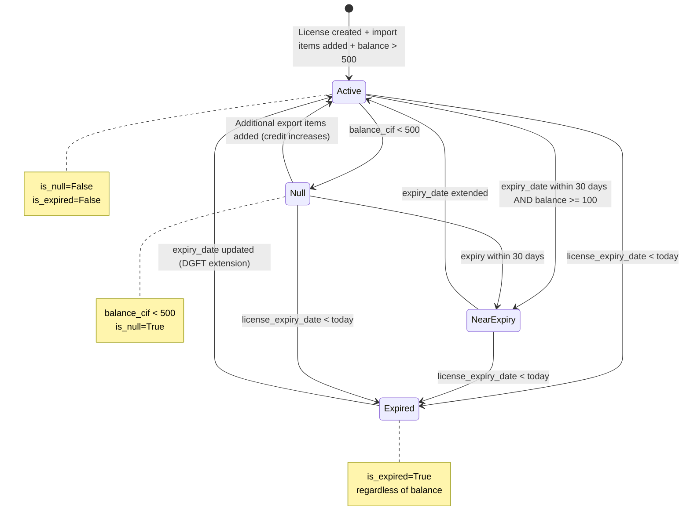
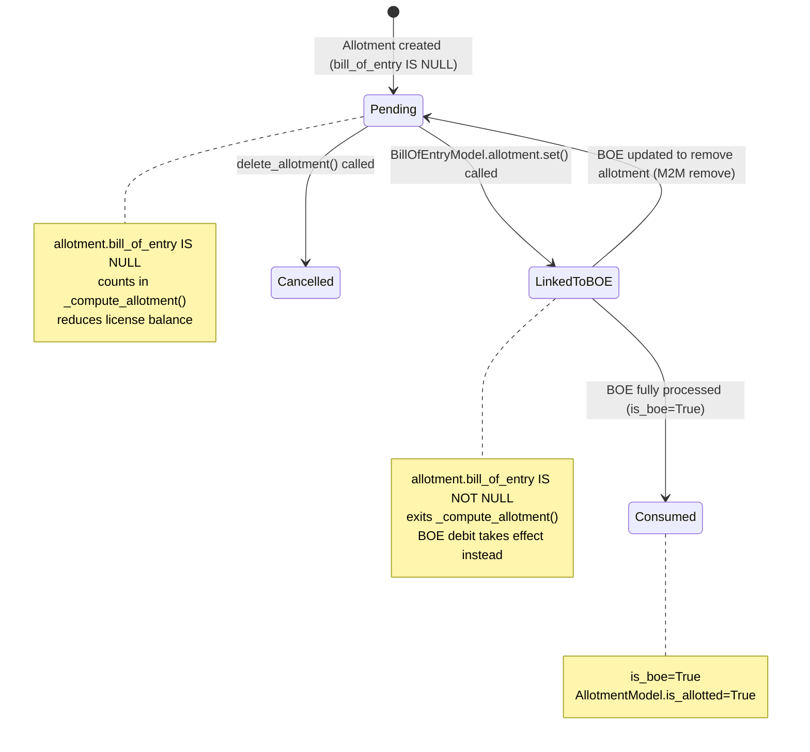
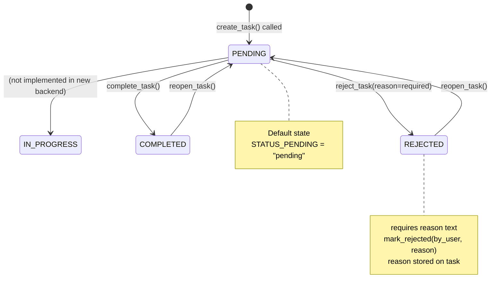
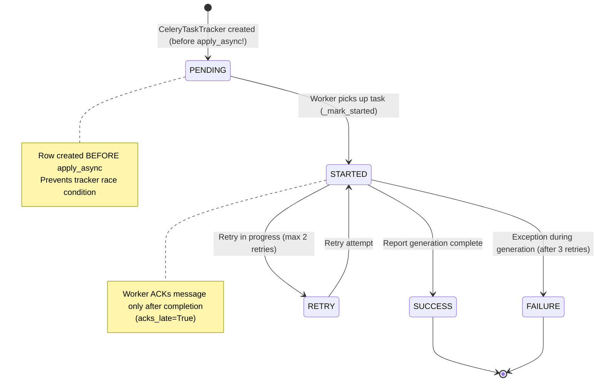
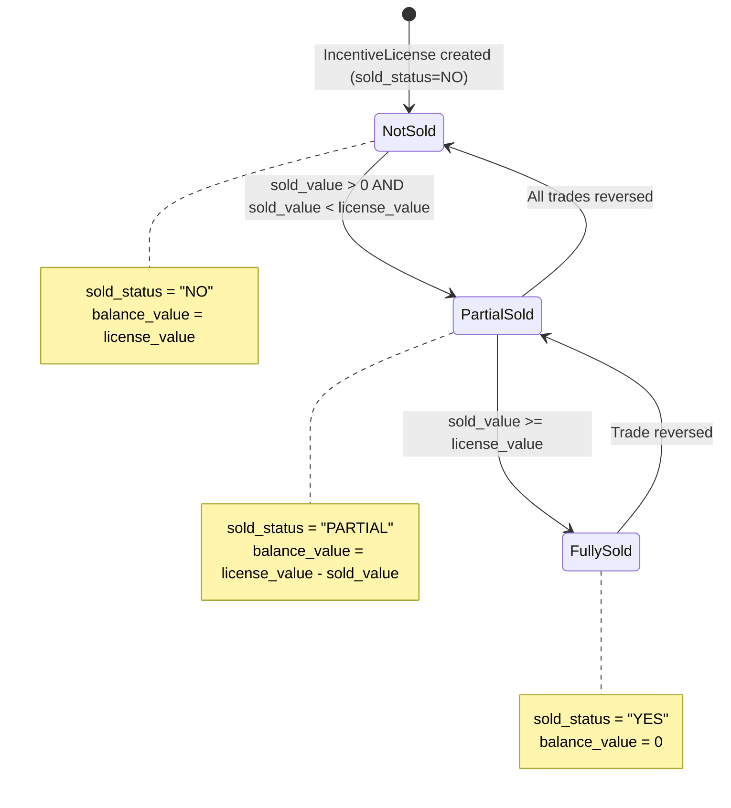

# Entity State Machines

> **All entity state transitions with Mermaid diagrams.**

---

## 1. License State

Licenses don't have an explicit `status` field. Their "state" is derived from flag fields computed by `recompute_license_balance()`.



**Derived state logic** (from `balance_service.py`):
```python
is_null = balance_cif < Decimal("500")
is_expired = license_expiry_date is not None and license_expiry_date < today
```

**Dashboard display**:
- Active: `is_active=True AND is_expired=False AND is_null=False`
- Expired: `is_expired=True`
- Null (near zero): `is_null=True`
- Expiring: `is_active=True AND expiry within 30 days AND balance >= 100`

---

## 2. Allotment State

AllotmentModel has `is_boe` and `is_allotted` boolean flags, but the key state is determined by its relationship to a BOE.



**Balance impact by state**:
- `Pending`: AllotmentItems.cif_fc counted in allotment balance component
- `LinkedToBOE`: allotment exits formula; RowDetails debit enters formula
- `Cancelled`: allotment removed; LicenseItemPlan restored; balance recomputed

---

## 3. BOE RowDetails State

```mermaid
stateDiagram-v2
    [*] --> Active : RowDetails created (is_frozen=False, is_dispute=False)

    Active --> Frozen : Ledger upload marks row as frozen
    Active --> Disputed : Ledger upload flags row as missing
    Active --> Deleted : delete_row_detail() called

    Frozen --> Frozen : Cannot be edited (save() returns early)
    
    Disputed --> Resolved : resolve_dispute_row() OR resolve_dispute()
    Resolved --> Active : is_dispute cleared; sr_number linked
    
    Deleted --> [*]
    
    note right of Active
        Regular editable row
        Counts in _compute_debit()
    end note
    
    note right of Frozen
        is_frozen=True
        Set during ledger upload
        Cannot be modified via API
        Still counts in balance
    end note
    
    note right of Disputed
        is_dispute=True
        Highlighted in UI (red)
        Needs manual review
    end note
```



**When rows become frozen**: During ledger upload (`LedgerUploadView`), rows created from ICEGATE data are marked `is_frozen=True`. These represent authoritative external data.

**When rows become disputed**: If a row existed in the previous ledger but is missing from the current ledger upload, it gets `is_dispute=True`.

---

## 4. Task State Machine



**Service functions** (`task_service.py`):
```python
create_task(data, user)        → Task(status=PENDING)
complete_task(task)            → task.mark_completed() → status=COMPLETED
reject_task(task, by_user, reason) → task.mark_rejected() → status=REJECTED
reopen_task(task)              → task.status=PENDING → save()
add_remark(task_id, text, user) → TaskRemark.create()
```

---

## 5. Celery Report Task State



**CeleryTaskTracker DB status values** (`core_celerytasktracker.status`):
- `"PENDING"` — queued, not started
- `"STARTED"` — worker processing
- `"SUCCESS"` — completed, file available
- `"FAILURE"` — failed after retries
- `"RETRY"` — retry in progress

**API poll**: `GET /api/v1/reports/status/{task_id}/`

---

## 6. Incentive License State (RODTEP/ROSTL/MEIS)

Simpler than advance licenses — tracked by `sold_status`:


