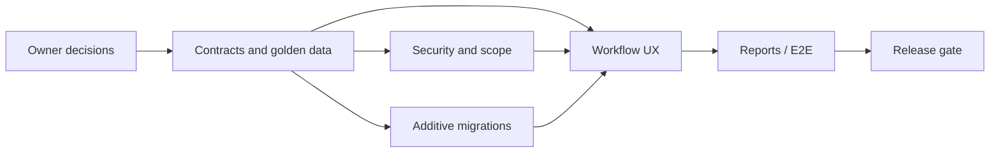

# Dependency map

```mermaid
flowchart LR
 D[Owner decisions] --> C[Contracts and golden data]
 C --> S[Security and scope]
 C --> M[Additive migrations]
 C --> U[Workflow UX]
 S --> U
 M --> U
 U --> R[Reports / E2E]
 R --> G[Release gate]
```
