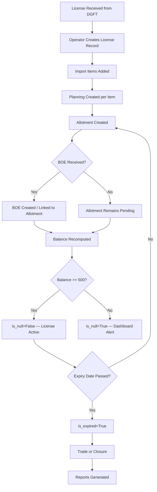
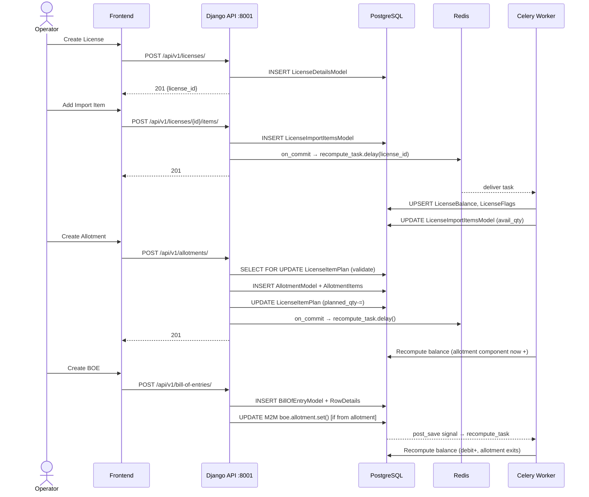

# License Lifecycle — Complete End-to-End Workflow

> **For business users, QA, and developers.**  
> Covers every state transition, actor, API call, and side effect.

---

## Business Context

An Advance Authorisation (AA) / DFIA license is issued by DGFT and grants a company the right to import specified materials duty-free. The company must track consumption to ensure they don't exceed the authorised amount.

---

## Complete Lifecycle



---

## Workflow 1: License Creation

### Preconditions
- User has `LICENSE_MANAGER` role
- Company exists in masters (`core_companymodel`)
- Port exists in masters (`core_portmodel`)
- Scheme code exists (`core_schemecode`)

### User Actions
1. Navigate to `/licenses`
2. Click "+ New License"
3. Fill license form: license_number, license_date, expiry_date, exporter (company), port, scheme_code
4. Click "Create"

### Backend Flow
```
POST /api/v1/licenses/
  → LicensePermission.has_permission() — requires LICENSE_MANAGER
  → LicenseCreateSerializer.is_valid()
    → validate_license_number(): checks unique constraint
  → license_service.create_license(data, user)
    → LicenseDetailsModel(**data, created_by=user).save()
  → LicenseDetailSerializer(new_obj)
  → Response 201 {success:true, data:{...}}
```

### Database Updates
| Table | Operation | Fields |
|---|---|---|
| `license_licensedetailsmodel` | INSERT | all fields |
| `license_licensebalance` | none yet | created on first recompute |
| `license_licenseflags` | none yet | created on first recompute |

### Side Effects
- None immediately (balance recompute only fires after import items added)

### Frontend Refresh
- `queryClient.invalidateQueries(['licenses'])` → list refetches
- `queryClient.invalidateQueries(['licenses', id])` → detail refetches

### Failure Scenarios
| Failure | HTTP | Message |
|---|---|---|
| Duplicate license_number | 400 | "A license with number 'X' already exists." |
| Missing required fields | 400 | Field-level errors |
| Insufficient permission | 403 | "You do not have permission" |

---

## Workflow 2: Import Items Creation

### Preconditions
- License record exists
- User has `LICENSE_MANAGER` role
- HS code exists in masters

### User Actions
1. Open license detail
2. Navigate to Import Items tab
3. Click "Add Item"
4. Fill: serial_number, description, quantity, cif_fc, hs_code, unit
5. Click "Save"

### Backend Flow
```
POST /api/v1/licenses/{license_pk}/items/
  → LicensePermission.has_permission()
  → ImportItemSerializer.is_valid()
  → license_service.create_import_item(license_id, data, user)
    → transaction.atomic()
      → LicenseImportItemsModel(**data).save()
      → recompute_license_balance_task.delay(license_id)  [via on_commit]
  → Response 201
```

### Database Updates
| Table | Operation |
|---|---|
| `license_licenseimportitemsmodel` | INSERT |
| `license_licensebalance` | UPSERT (via Celery) |
| `license_licenseflags` | UPSERT (via Celery) |

### Side Effects
1. `recompute_license_balance_task` enqueued after commit
2. Celery worker: `recompute_license_balance(license_id)`
   - Writes `LicenseBalance.balance_cif` (likely just the credit sum minus 0 debit)
   - Writes `LicenseFlags.is_null`, `is_expired`
   - Writes `LicenseImportItemsModel.available_quantity`, `debited_quantity`, `allotted_quantity`

---

## Workflow 3: Planning Creation

### Preconditions
- License and import items exist
- User has `LICENSE_MANAGER` role

### User Actions
1. Navigate to license detail → Import Items tab
2. Click "Manage Plan" for an import item (or via API)
3. Set planned_quantity and planned_cif_fc
4. Save

### Backend Flow
```
POST /api/v1/licenses/{license_pk}/item-plans/
  → LicensePermission.has_permission()
  → LicenseItemPlanSerializer.is_valid()
  → LicenseItemPlanViewSet.perform_create()
    → LicenseItemPlan.save()
  → Response 201
```

### Database Updates
| Table | Operation |
|---|---|
| `license_licenseitemplan` | INSERT |

### Side Effects
- None immediately
- Future allotments for this import item will be validated against `planned_quantity`

---

## Workflow 4: Allotment Creation (Planning Consumed)

### Preconditions
- License exists with import items
- If planning enabled: LicenseItemPlan rows exist
- User has `ALLOTMENT_MANAGER` role
- Company exists in masters

### User Actions
1. Navigate to `/allotments`
2. Click "New Allotment"
3. Fill allotment header: company, type (AT/TR), required_quantity, exchange_rate, item_name, port
4. Add line items: select import item, set qty and cif_fc
5. Click "Create"

### Backend Flow
```
POST /api/v1/allotments/
  → AllotmentPermission.has_permission()
  → AllotmentSerializer.is_valid()
  → allotment_service.create_allotment(data, user)
    → transaction.atomic()
      → for each item: _validate_plan_availability()  [select_for_update on LicenseItemPlan]
      → AllotmentModel(**data, created_by=user).save()
      → for each item:
          → AllotmentItems(allotment, item_id, qty, cif_fc).save()
          → _adjust_plan(import_item_id, qty_delta=-qty, cif_fc_delta=-cif_fc)
      → on_commit: _dispatch(item_ids) → resolves license_ids → recompute_license_balance_task.delay()
  → Response 201
```

### Database Updates
| Table | Operation | Notes |
|---|---|---|
| `allotment_allotmentmodel` | INSERT | Header record |
| `allotment_allotmentitems` | INSERT per item | Line items |
| `license_licenseitemplan` | UPDATE (F expression) | planned_quantity -= qty |
| `license_licensebalance` | UPSERT (via Celery) | balance_cif decreases (allotment component +) |
| `license_licenseimportitemsmodel` | UPDATE (via Celery) | allotted_quantity += qty |

### Side Effects
1. LicenseItemPlan decremented atomically (same transaction)
2. Celery task dispatched after commit
3. `LicenseBalance.balance_cif` decreases (allotment now counted)
4. `LicenseImportItemsModel.allotted_quantity` increases
5. Dashboard "expiring_soon" may be recalculated next cache miss

### Failure Scenarios
| Failure | HTTP | Message |
|---|---|---|
| qty > plan.planned_quantity | 400 | "Requested quantity X exceeds available plan Y" |
| cif_fc > plan.planned_cif_fc | 400 | "Requested CIF X exceeds available planned CIF Y" |
| Company not found | 400 | FK validation error |

---

## Workflow 5: BOE Creation (Balance Debited)

### Preconditions
- Allotment exists (Scenario B) OR license import items exist (Scenario A)
- User has `BOE_MANAGER` role
- Company and port exist in masters

### User Actions
1. Navigate to `/boe`
2. Click "New Bill of Entry"
3. Fill header: bill_of_entry_number, date, company, port
4. Optionally link allotment(s)
5. Add rows: select import item (sr_number), set qty, cif_fc, cif_inr, transaction_type
6. Click "Create"

### Backend Flow
```
POST /api/v1/bill-of-entries/
  → BillOfEntryPermission.has_permission()
  → BillOfEntrySerializer.is_valid()
  → BillOfEntrySerializer.create()
    → BillOfEntryModel(**data).save()
    → if allotment_data: boe.allotment.set(allotment_data)  ← CRITICAL for Scenario B
    → for each row: RowDetails(bill_of_entry=boe, sr_number, qty, cif_fc).save()
      → post_save signal fires → update_stock()
        → on_commit: recompute_license_balance_task.delay(license_id)
  → Response 201

POST /api/v1/bill-of-entries/{pk}/rows/
  → RowDetails.save()
  → post_save signal → update_stock()
  → on_commit: recompute_license_balance_task.delay(license_id)
```

### Database Updates
| Table | Operation | Notes |
|---|---|---|
| `bill_of_entry_billofentrymodel` | INSERT | BOE header |
| `bill_of_entry_billofentrymodel_allotment` (M2M) | INSERT (if allotment linked) | Links BOE to allotment |
| `bill_of_entry_rowdetails` | INSERT per row | BOE line items |
| `license_licensebalance` | UPSERT (via Celery) | balance_cif decreases (debit +) |
| `license_licenseimportitemsmodel` | UPDATE (via Celery) | debited_quantity += qty |

### Balance Change Details

**Scenario A (no allotment)**:
- `_compute_debit` increases by RowDetails.cif_fc
- `_compute_allotment` unchanged (no allotment linked)
- Net: balance decreases by RowDetails.cif_fc

**Scenario B (allotment linked)**:
- `_compute_allotment` decreases (allotment now has bill_of_entry → exits filter)
- `_compute_debit` increases by RowDetails.cif_fc
- Net: balance decreases only by the difference (BOE amount vs allotment amount)

### Side Effects
- `BillOfEntryModel.exchange_rate` recalculated via `recalc_exchange_rate_on_row_save` signal
- If allotment linked: allotment exits `_compute_allotment` filter immediately

---

## Workflow 6: Trade Generation (License Sold)

### Preconditions
- License exists with import items that have been debited
- User has `TRADE_MANAGER` role
- Companies exist in masters

### User Actions
1. Navigate to `/trades/new`
2. Select direction (PURCHASE/SALE) and license type (DFIA/INCENTIVE)
3. Fill trade header: invoice_number, from_company, to_company, date
4. Add trade lines (auto-prefilled from license items)
5. Add payments if applicable
6. Save

### Backend Flow
```
POST /api/v1/trades/
  → TradePermission.has_permission()
  → LicenseTradeSerializer.is_valid()
  → _sync_nested() for trade lines and payments
  → LicenseTrade.save()
    → recompute_totals() → calculates total_amount_inr
    → snapshot_parties() → stores company names/addresses
  → Response 201
```

### Side Effects
- `LicenseTrade.total_amount_inr` computed on save
- `snapshot_parties()` stores from/to company details in trade record (preserves history if company later changes)
- Balance impact: `_compute_trade` adds SALE direction trade lines to formula

---

## Workflow 7: Report Generation

### Preconditions
- User has any reporting role (`REPORT_VIEWER` or any MANAGER role)
- Celery worker running
- License data exists

### User Actions
1. Navigate to `/reports/balance` (or other report type)
2. Select licenses (for balance report) or set filters
3. Select format (JSON/PDF/Excel)
4. Click "Generate Report"
5. Poll status until "done"
6. Download result

### Backend Flow
```
POST /api/v1/reports/balance/generate/
  → ReportDispatchPermission.has_permission()
  → BalanceReportRequestSerializer.is_valid()
  → task_id = uuid.uuid4()  ← pre-generated BEFORE dispatch
  → CeleryTaskTracker.objects.create(task_id=task_id, status="PENDING")
  → generate_balance_report_task.apply_async(kwargs={...}, task_id=task_id)
  → Response 202 {task_id: "..."}

GET /api/v1/reports/status/{task_id}/
  → CeleryTaskTracker.objects.get(task_id=task_id)
  → Response: {status: "pending"|"running"|"done"|"error", file_url: "..."}
```

---

## Workflow 8: Balance Reconciliation

### When to Run
- After data migration
- After manual corrections
- If balance appears incorrect
- Monthly reconciliation

### User Actions
1. Navigate to license detail
2. Click "Recompute Balance"

### Backend Flow
```
POST /api/v1/licenses/{id}/recompute_balance/
  → LicensePermission.has_permission()
  → recompute_license_balance_task.delay(int(pk))
  → Response 202 {task_id: "..."}
```

### What Recompute Does
1. Locks license row (`select_for_update`)
2. Queries all 4 components (credit/debit/allotment/trade)
3. Computes `max(0, credit - debit - allotment - trade)`
4. Writes to `LicenseBalance`
5. Updates flags (`is_null`, `is_expired`)
6. Updates all import item balance fields (`available_quantity`, etc.)

---

## Complete System Sequence


